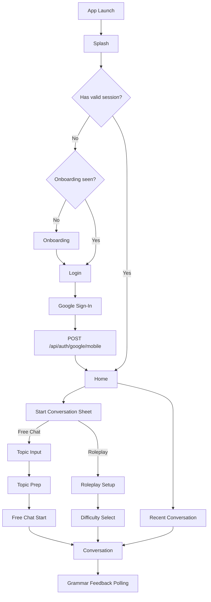

# 모바일 화면별 UX Flow / Wireframe

> 기준일: 2026-06-11  
> 대상: Flutter v1 모바일 앱  
> 범위: 화면 구조, 사용자 흐름, API 연결 지점, low-fi wireframe

## 1. v1 제품 방향

모바일 v1은 사용자가 원하는 주제나 상황으로 영어 대화를 시작하고, 대화 중 문법 피드백을 부담 없이 확인하는 경험에 집중해요.

확정된 방향:

- 로그인은 Google 로그인만 제공해요.
- v1에도 온보딩 2~3장을 포함해요.
- Home에는 최근 대화 목록과 `대화 시작` 단일 CTA를 보여줘요.
- `대화 시작`을 누르면 자유 대화와 롤플레이 중 선택해요.
- 자유 대화는 `주제 입력 → 주제 준비 카드 → 방향 선택 → 첫 질문 선택 → 사용자 답변 → 대화 시작` 흐름을 사용해요.
- 롤플레이는 `상황 카드 선택 → 난이도 선택 → 대화 시작`을 기본으로 하고, 원하는 상황이 없으면 custom 입력을 제공해요.
- 문법 피드백은 메시지 바로 아래에 표시해요.

## 2. 전체 화면 목록

| 화면 | 역할 | 주요 API |
|------|------|----------|
| Splash | 토큰 복구, 로그인 여부 확인 | `POST /api/auth/refresh`, `GET /api/auth/me` |
| Onboarding | 서비스 가치 소개 | 없음 |
| Login | Google 로그인 | `POST /api/auth/google/mobile` |
| Home | 시작 진입점, 최근 대화 | `GET /api/conversations/` |
| Conversation Start Sheet | 자유 대화/롤플레이 선택 | 없음 |
| Topic Input | 자유 대화 주제 입력 | 없음 |
| Topic Prep | 주제 준비 카드 확인 | `POST /api/search/topic-prep/` |
| Free Chat Start | 첫 질문 선택 후 답변 | `POST /api/conversations/start/free-chat/` |
| Roleplay Setup | 롤플레이 상황/난이도 선택 | 없음 |
| Conversation | 채팅, 문법 피드백 polling | `POST /api/conversations/{id}/message/`, `GET /api/grammar/message/{message_id}/` |
| Settings | 계정, 로그아웃 | `GET /api/auth/me`, `POST /api/auth/logout` |

## 3. 글로벌 UX Flow



## 4. 공통 네비게이션 원칙

- Splash 이후 인증 상태에 따라 Login 또는 Home으로 이동해요.
- 첫 방문자는 Login 전에 Onboarding을 볼 수 있어요.
- Home은 앱의 기준 화면이에요.
- Home의 `대화 시작` CTA는 자유 대화/롤플레이 선택 sheet를 열어요.
- 자유 대화와 롤플레이는 모두 Conversation 화면으로 합류해요.
- Conversation에서 뒤로 가면 Home으로 돌아가요.
- Settings는 Home에서 접근해요.

## 5. 화면별 Wireframe

### 5.1 Splash

**목적**

- 저장된 token을 복구해 로그인 상태를 판단해요.
- access token이 만료되었으면 refresh를 시도해요.

**상태**

- `checking`
- `authenticated`
- `unauthenticated`
- `refreshFailed`

**Wireframe**

```text
┌─────────────────────────┐
│                         │
│        Curitalk         │
│   Speak about anything  │
│                         │
│        Loading...       │
│                         │
└─────────────────────────┘
```

**동작**

- secure storage에서 `access_token`, `refresh_token`, `device_id`를 읽어요.
- access token이 있으면 `GET /api/auth/me`로 확인해요.
- 실패하면 `POST /api/auth/refresh`를 1회 시도해요.
- refresh도 실패하면 Login으로 이동해요.

### 5.2 Onboarding

**목적**

- 사용자가 앱의 핵심 가치를 빠르게 이해하게 해요.
- 영어 공부 앱처럼 딱딱하게 느껴지기보다 “관심사로 대화하는 앱”이라는 첫 인상을 줘요.

**페이지 구성**

- 2~3장을 사용해요.
- 마지막 페이지 전까지 CTA는 `다음`, 마지막 페이지 CTA는 `시작`이에요.

**Wireframe**

```text
┌─────────────────────────┐
│              Skip       │
│                         │
│   [Illustration area]   │
│                         │
│ Talk about what you     │
│ actually care about.    │
│                         │
│ Practice English with   │
│ news, hobbies, sports,  │
│ travel, or anything.    │
│                         │
│        ● ○ ○            │
│        [ Next ]         │
└─────────────────────────┘
```

**추천 메시지**

1. 관심사 기반 대화: “Talk about what you actually care about.”
2. 주제 준비 카드: “Get context and questions before you speak.”
3. 부담 없는 피드백: “See gentle grammar feedback under your messages.”

**동작**

- `Skip` 또는 마지막 `시작`을 누르면 Login으로 이동해요.
- onboarding 완료 여부는 local storage에 저장해요.

### 5.3 Login

**목적**

- Google SDK 로그인으로 사용자를 인증해요.

**Wireframe**

```text
┌─────────────────────────┐
│                         │
│  Talk about what you    │
│  actually care about.   │
│                         │
│  Practice English with  │
│  your own topics.       │
│                         │
│ [ Continue with Google ]│
│                         │
└─────────────────────────┘
```

**동작**

- Flutter Google Sign-In SDK로 `id_token`을 받아요.
- 앱 설치 단위 `device_id`를 함께 보내요.
- `POST /api/auth/google/mobile` 성공 시 token pair를 secure storage에 저장해요.

**오류 처리**

- Google 취소: Login 화면 유지
- 서버 `409`: 같은 이메일의 기존 계정 안내
- 서버 `400/401`: 다시 시도 안내

### 5.4 Home

**목적**

- 앱의 시작 허브예요.
- 최근 대화 재진입과 새 대화 시작을 제공해요.

**Wireframe**

```text
┌─────────────────────────┐
│ Hi, User          ⚙     │
│ Pick up where you left  │
│ off, or start fresh.    │
│                         │
│ [ + Start Conversation ]│
│                         │
│ Recent Conversations    │
│ - Lotte Giants game  >  │
│ - Osaka restaurants  >  │
│ - Coffee order       >  │
└─────────────────────────┘
```

**상태**

- `loadingRecent`
- `recentLoaded`
- `recentEmpty`
- `recentError`

**동작**

- 진입 시 `GET /api/conversations/?limit=5&offset=0`을 호출해요.
- `대화 시작` 선택 시 Conversation Start Sheet를 열어요.
- 최근 대화 선택 시 Conversation으로 이동하고 메시지 목록을 불러와요.

### 5.5 Conversation Start Sheet

**목적**

- 새 대화 시작 시 자유 대화와 롤플레이를 명확히 분리해요.

**Wireframe**

```text
┌─────────────────────────┐
│                         │
│ Start a conversation    │
│                         │
│ ┌─────────────────────┐ │
│ │ Free Chat           │ │
│ │ Bring your own topic│ │
│ └─────────────────────┘ │
│ ┌─────────────────────┐ │
│ │ Roleplay            │ │
│ │ Practice a situation│ │
│ └─────────────────────┘ │
│                         │
│          Cancel         │
└─────────────────────────┘
```

**동작**

- Free Chat 선택 시 Topic Input으로 이동해요.
- Roleplay 선택 시 Roleplay Setup으로 이동해요.

### 5.6 Topic Input

**목적**

- 사용자가 자유 대화의 관심 주제를 입력해요.

**Wireframe**

```text
┌─────────────────────────┐
│ ← Free Chat             │
│                         │
│ What topic do you want  │
│ to talk about?          │
│                         │
│ ┌─────────────────────┐ │
│ │ 최근 롯데 경기       │ │
│ └─────────────────────┘ │
│                         │
│ Examples                │
│ [Apple WWDC] [Osaka]    │
│ [Baseball] [AI news]    │
│                         │
│        [ Prepare ]      │
└─────────────────────────┘
```

**입력 규칙**

- 최소 2자 이상 입력해요.
- 사용자가 너무 넓은 주제를 입력해도 서버 quality gate가 retry guidance를 제공할 수 있어요.

**동작**

- Prepare 선택 시 Topic Prep으로 이동하고 `POST /api/search/topic-prep/`를 호출해요.

### 5.7 Topic Prep

**목적**

- 검색 컨텍스트를 바탕으로 대화 시작을 쉽게 만들어요.
- 사용자가 대화 방향과 첫 질문을 고르게 해요.

**Wireframe**

```text
┌─────────────────────────┐
│ ← Topic Prep            │
│                         │
│ Recent Lotte Giants game│
│ ┌─────────────────────┐ │
│ │ Summary             │ │
│ │ Lotte won/lost...   │ │
│ └─────────────────────┘ │
│ Sources                 │
│ [1] Sports News         │
│ [2] KBO                 │
│                         │
│ Choose direction        │
│ [Casual] [Debate]       │
│ [Interview] [Explain]   │
│                         │
│ Pick a first question   │
│ ○ What surprised you?   │
│ ○ Which player stood out│
│ ○ Do you follow KBO?    │
│                         │
│ [Start answering]       │
└─────────────────────────┘
```

**상태**

- `loading`
- `ready`
- `lowQuality`
- `error`

**동작**

- `ready=true`이면 요약, 출처, 방향 4개, 선택 방향의 질문 3개를 보여줘요.
- 사용자는 방향 1개와 질문 1개를 선택해요.
- `ready=false`이면 `retry_guidance`와 `example_topics`를 보여주고 Topic Input으로 돌아가게 해요.

### 5.8 Free Chat Start

**목적**

- 사용자가 선택한 첫 질문에 답하며 자연스럽게 대화를 시작해요.

**Wireframe**

```text
┌─────────────────────────┐
│ ← First Answer          │
│                         │
│ AI will ask:            │
│ “What surprised you     │
│  about the game?”       │
│                         │
│ Your answer             │
│ ┌─────────────────────┐ │
│ │ I was surprised by… │ │
│ │                     │ │
│ └─────────────────────┘ │
│                         │
│ [ Start Conversation ]  │
└─────────────────────────┘
```

**동작**

- `POST /api/conversations/start/free-chat/`로 대화를 생성해요.
- 요청에는 `first_message`, `search_context`, `topic`, `conversation_direction`, `selected_question`을 포함해요.
- 성공하면 Conversation 화면으로 이동해요.

### 5.9 Roleplay Setup

**목적**

- 사용자가 상황과 난이도를 고른 뒤 롤플레이 대화를 시작해요.

**Wireframe**

```text
┌─────────────────────────┐
│ ← Roleplay              │
│                         │
│ Choose a situation      │
│ ┌─────────────────────┐ │
│ │ Cafe order          │ │
│ └─────────────────────┘ │
│ ┌─────────────────────┐ │
│ │ Travel check-in     │ │
│ └─────────────────────┘ │
│ ┌─────────────────────┐ │
│ │ Job interview       │ │
│ └─────────────────────┘ │
│                         │
│ Choose difficulty       │
│ [ Easy ][ Normal ][ Hard]│
│                         │
│ 원하는 상황이 없나요?    │
│ [ 직접 입력하기 ]        │
│                         │
│ [ Start Roleplay ]      │
└─────────────────────────┘
```

**Custom 입력 Wireframe**

```text
┌─────────────────────────┐
│ ← Custom Roleplay       │
│                         │
│ Describe your situation │
│ ┌─────────────────────┐ │
│ │ 오사카 식당에서      │ │
│ │ 예약 확인하기        │ │
│ └─────────────────────┘ │
│                         │
│ Choose difficulty       │
│ [ Easy ][ Normal ][ Hard]│
│                         │
│ [ Start Roleplay ]      │
└─────────────────────────┘
```

**Preset 후보**

- Cafe order
- Hotel check-in
- Airport immigration
- Job interview
- Meeting small talk
- Friend conversation
- Meeting opinion

**난이도**

- Easy: 짧고 쉬운 질문, 천천히 진행
- Normal: 자연스러운 일반 대화
- Challenge: 예상 밖 질문, 긴 문장 유도

**동작**

- preset 상황과 난이도를 조합해 `role_character`로 보내요.
- custom 입력도 난이도를 선택한 뒤 `role_character`로 보내요.
- `POST /api/conversations/start/roleplay/` 성공 시 Conversation 화면으로 이동해요.

### 5.10 Conversation

**목적**

- 영어 대화를 진행하고, 사용자 메시지 아래에서 문법 피드백을 확인해요.

**Wireframe**

```text
┌─────────────────────────┐
│ ← Conversation      ⋯   │
│                         │
│        AI message       │
│ ┌─────────────────────┐ │
│ │ What surprised you? │ │
│ └─────────────────────┘ │
│                         │
│ User message            │
│ ┌─────────────────────┐ │
│ │ I was surprise...   │ │
│ └─────────────────────┘ │
│   Grammar: checking...  │
│                         │
│        AI message       │
│ ┌─────────────────────┐ │
│ │ That makes sense... │ │
│ └─────────────────────┘ │
│                         │
│ ┌───────────────────┐ + │
│ │ Type in English   │   │
│ └───────────────────┘   │
└─────────────────────────┘
```

**문법 피드백 표시**

```text
No errors:
  ✅ Looks natural

Has errors:
  ✍️ Try: “I was surprised by the ending.”
  - surprise → surprised: use past participle

Pending:
  Grammar: checking...

Timeout:
  Grammar feedback is taking longer than usual.
```

**상태**

- `sendingMessage`
- `aiResponding`
- `grammarPending`
- `grammarCompleted`
- `grammarTimeout`
- `messageSendFailed`

**동작**

- 메시지 전송 시 `POST /api/conversations/{conversation_id}/message/`를 호출해요.
- 응답의 `message_id`는 사용자의 메시지 ID예요.
- 앱은 해당 `message_id`로 `GET /api/grammar/message/{message_id}/`를 polling해요.
- `200`이면 피드백을 메시지 아래에 표시해요.
- `404`이면 pending으로 처리하고 일정 시간 후 timeout으로 전환해요.

### 5.11 Settings

**목적**

- 최소 계정 관리와 로그아웃을 제공해요.

**Wireframe**

```text
┌─────────────────────────┐
│ ← Settings              │
│                         │
│ Account                 │
│ user@example.com        │
│                         │
│ App                     │
│ Version 0.1             │
│                         │
│ [ Log out ]             │
└─────────────────────────┘
```

**동작**

- `GET /api/auth/me`로 사용자 정보를 보여줘요.
- 로그아웃 시 `POST /api/auth/logout` 호출 후 secure storage를 비우고 Login으로 이동해요.

## 6. 핵심 상태 모델

| 상태 | 설명 |
|------|------|
| AuthState | splash checking, authenticated, unauthenticated |
| SessionState | access token, refresh token, device id |
| HomeState | recent conversations loading/loaded/empty/error |
| StartConversationState | idle, choosingType |
| TopicPrepState | input, loading, ready, lowQuality, error |
| RoleplaySetupState | presetSelected, customInput, difficultySelected |
| ConversationState | messages, sending, receiving, failed |
| GrammarFeedbackState | pending, completed, timeout, error |

## 7. API 연결 요약

| 사용자 행동 | API | 성공 후 |
|------------|-----|---------|
| Google 로그인 | `POST /api/auth/google/mobile` | Home 이동 |
| 앱 재실행 | `GET /api/auth/me`, `POST /api/auth/refresh` | Home 또는 Login 이동 |
| 최근 대화 보기 | `GET /api/conversations/` | Home 최근 목록 표시 |
| 대화 시작 선택 | 없음 | 자유 대화 또는 롤플레이로 분기 |
| 주제 준비 | `POST /api/search/topic-prep/` | Topic Prep 표시 |
| 자유 대화 시작 | `POST /api/conversations/start/free-chat/` | Conversation 이동 |
| 롤플레이 시작 | `POST /api/conversations/start/roleplay/` | Conversation 이동 |
| 메시지 전송 | `POST /api/conversations/{conversation_id}/message/` | 메시지 추가, grammar polling 시작 |
| 문법 피드백 확인 | `GET /api/grammar/message/{message_id}/` | 메시지 아래 피드백 표시 |
| 로그아웃 | `POST /api/auth/logout` | Login 이동 |

## 8. v1에서 의도적으로 제외

- 학습 통계 전용 화면
- 친구/커뮤니티 기능
- push notification
- WebSocket/SSE 기반 실시간 피드백
- 결제/구독

## 9. 구현 순서

1. `Splash → Onboarding → Google Login → Home` 시작 흐름을 연결해요.
2. Home의 Free Chat 시작을 Topic Input과 Topic Prep API에 연결해요.
3. Roleplay Setup을 연결해요.
4. Free Chat Start와 Conversation 생성 흐름을 연결해요.
5. Conversation 메시지와 grammar feedback polling을 연결해요.
