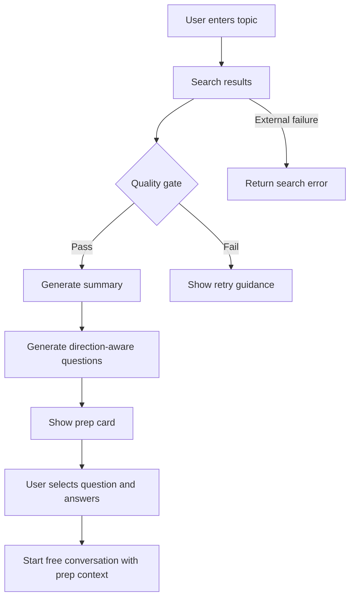

# feat: Add topic prep card

## Summary

이 계획은 사용자가 관심 주제를 입력하면 검색 기반 준비 카드를 생성하고, 대화 방향을 고른 뒤 AI 첫 질문 3개 중 하나에 답하면서 자유 대화를 시작할 수 있는 백엔드 API 흐름을 추가한다. v1은 카드 저장, 웹 UI, 학습 자료화 없이 향후 Flutter 모바일 앱이 사용할 API 계약과 대화 handoff에 집중한다.

---

## Problem Frame

Convia의 전략은 정해진 커리큘럼이 아니라 사용자가 원하는 최신 관심사에서 영어 회화를 출발시키는 것이다. 현재 코드는 검색 요약을 대화 컨텍스트로 넣을 수 있지만, 사용자가 주제 입력 후 어떤 방향으로 말할지 고르고 첫 발화를 시작하게 돕는 중간 단계가 약하다.

주제 준비 카드는 검색 결과를 “읽는 정보”가 아니라 “말을 시작하는 재료”로 바꾸는 역할을 한다. 검색 품질이 낮은 경우에는 빈약한 카드로 대화를 시작하지 않고, 더 구체적인 주제를 다시 입력하게 한다.

---

## Requirements

**Prep card generation**

- R1. 인증된 사용자는 관심 주제로 대화 준비 카드를 생성할 수 있어야 한다. Origin R1, R2.
- R2. 준비 카드는 짧은 검색 기반 요약과 4개 대화 방향을 포함해야 한다. Origin R3, R4, R5.
- R3. 선택된 대화 방향에 맞는 AI 첫 질문 3개를 생성해야 한다. Origin R6, R7, R9.

**Quality gate**

- R4. 카드 생성 전 검색 결과를 출처 수, 관련성, 최신성, 구체성 기준으로 평가해야 한다. Origin R10, R11.
- R5. 검색 품질이 낮으면 카드를 생성하지 않고 더 구체적인 주제 재입력을 유도해야 한다. Origin R12, R13.

**Conversation handoff**

- R6. 사용자가 첫 질문 하나를 선택하고 답변하면, 선택한 방향과 검색 요약을 반영해 새 자유 대화를 시작할 수 있어야 한다. Origin R8.
- R7. v1에서는 준비 카드 자체를 DB에 저장하지 않아야 한다. Origin Scope Boundaries.

**Documentation and mobile contract**

- R8. 새 API 계약은 `README.md`와 `docs/DSL.md`에 동기화해야 한다.
- R9. `docs/UX_FEEDBACK.md`는 향후 Flutter 모바일 앱이 사용할 “주제 입력 → 준비 카드 → 대화 시작” 흐름을 설명해야 한다.

---

## Key Technical Decisions

- **카드는 독립 생성 단계로 둔다:** 실제 conversation은 사용자가 질문을 선택하고 답변한 뒤 생성한다. 이렇게 해야 준비 중 이탈한 사용자의 빈 대화가 저장되지 않는다.
- **Search 도메인을 확장한다:** 주제 준비 카드는 검색 결과 수집, 요약, 품질 판정, 질문 생성을 함께 다루므로 기존 검색 서비스의 책임을 확장하는 것이 새 도메인보다 단순하다.
- **카드 저장은 v1에서 제외한다:** 저장 없이도 대화 시작 경험은 검증 가능하며, 분석/재사용 저장은 후속 관심사 저장이나 계측 작업에서 다룬다.
- **질문 생성은 LLM 요약 흐름을 재사용한다:** 기존 LLM provider 추상화와 검색 요약 패턴을 따라 구현해 provider별 분기를 늘리지 않는다.
- **검색 실패와 품질 실패를 구분한다:** 외부 검색 장애는 API 오류로, 검색은 됐지만 대화 준비에 부족한 경우는 재입력 가능한 품질 실패로 다룬다.

---

## High-Level Technical Design

준비 카드 API는 conversation을 만들지 않는다. 카드 응답은 클라이언트가 짧게 보관하고, 사용자의 첫 답변과 함께 기존 자유 대화 시작 흐름으로 넘긴다.

---

## Implementation Units

### U1. Prep card schemas and service

- **Goal:** 검색 결과를 바탕으로 준비 카드 생성, 품질 판정, 질문 생성을 담당하는 서버 도메인 로직을 추가한다.
- **Requirements:** R1, R2, R3, R4, R5
- **Dependencies:** 없음
- **Files:**
  - `backend/domains/search/schemas.py`
  - `backend/domains/search/service.py`
  - `backend/tests/domains/search/test_topic_prep_service.py`
- **Approach:** 기존 `SearchService.search()`의 DuckDuckGo 수집과 LLM 요약 패턴을 재사용하되, topic prep 전용 응답 모델을 추가한다. 품질 판정은 출처 수를 먼저 확인하고, LLM이 검색 결과의 관련성·최신성·구체성을 평가해 카드 생성 가능 여부와 재입력 안내를 결정하게 한다.
- **Patterns to follow:** `SearchResult`, `SearchResultItem`, `_summarize_results()`의 LLM provider 사용 방식
- **Test scenarios:**
  - 검색 결과가 충분할 때 짧은 요약, 4개 방향, 방향별 첫 질문 3개를 포함한 카드가 생성된다.
  - 출처 수가 기준보다 부족할 때 카드가 생성되지 않고 재입력 안내가 반환된다.
  - LLM 품질 판정이 낮은 점수를 반환할 때 카드가 생성되지 않는다.
  - Covers AE2. 생성된 첫 질문이 검색 요약의 구체 정보와 연결된다.
- **Verification:** 서비스 단위 테스트에서 성공 카드와 품질 실패 결과가 모두 검증된다.

### U2. Topic prep API contract

- **Goal:** 인증된 클라이언트가 준비 카드를 생성할 수 있는 API를 추가하고 문서 계약을 동기화한다.
- **Requirements:** R1, R2, R4, R5, R8
- **Dependencies:** U1
- **Files:**
  - `backend/domains/search/router.py`
  - `README.md`
  - `docs/DSL.md`
  - `backend/tests/domains/search/test_topic_prep_router.py`
- **Approach:** 기존 `/api/search/` 라우터 아래에 topic prep용 엔드포인트를 추가한다. 성공 응답은 준비 카드 데이터를 반환하고, 품질 실패는 재입력 가능한 응답으로 구분한다. API 추가는 `README.md`, `docs/DSL.md`, router를 같은 작업 단위로 갱신한다.
- **Patterns to follow:** `SearchRequest`, `SuccessResponse[SearchResult]`, `get_current_user` 인증 의존성
- **Test scenarios:**
  - 인증된 요청이 성공하면 준비 카드 응답을 반환한다.
  - 인증이 없으면 기존 Search API와 동일하게 차단된다.
  - Covers AE3. 품질 실패 시 카드 대신 재입력 안내와 예시가 응답된다.
  - 외부 검색 장애는 품질 실패가 아니라 외부 API 오류로 처리된다.
- **Verification:** 라우터 테스트와 문서 계약이 동일한 요청/응답 개념을 설명한다.

### U3. Conversation handoff behavior

- **Goal:** 준비 카드에서 선택한 대화 방향과 첫 질문 맥락이 자유 대화 시작 프롬프트에 반영되게 한다.
- **Requirements:** R3, R6, R7
- **Dependencies:** U1, U2
- **Files:**
  - `backend/domains/conversation/router.py`
  - `backend/domains/conversation/service.py`
  - `backend/tests/domains/conversation/test_topic_prep_handoff.py`
- **Approach:** 기존 free-chat 시작 요청을 확장해 준비 카드에서 선택한 방향과 선택 질문을 전달할 수 있게 한다. conversation 생성은 사용자의 답변이 들어온 뒤 기존 `start_free_chat_conversation()` 경로에서 일어나게 유지한다. 시스템 프롬프트는 검색 컨텍스트와 대화 방향을 함께 반영하되, roleplay와 혼동되지 않게 free-chat 범위 안에 둔다.
- **Patterns to follow:** `StartFreeChatRequest`, `build_free_chat_prompt()`, `search_context` 전달 방식
- **Test scenarios:**
  - Covers AE1. 찬반토론 방향으로 시작하면 첫 AI 응답이 토론형 대화 흐름을 따른다.
  - 준비 카드 흐름으로 시작해도 conversation은 사용자의 첫 답변 후에만 생성된다.
  - 선택 질문과 사용자 답변이 메시지 흐름에서 자연스럽게 연결된다.
  - 기존 search_context 없는 자유 대화 시작은 그대로 동작한다.
- **Verification:** 기존 자유 대화 회귀가 깨지지 않고, 준비 카드 handoff가 프롬프트에 반영된다.

### U4. Mobile contract documentation

- **Goal:** 향후 Flutter 모바일 앱이 구현할 주제 준비 카드 흐름을 API 계약과 UX 메모에 명확히 정리한다.
- **Requirements:** R1, R2, R3, R5, R6, R9
- **Dependencies:** U2, U3
- **Files:**
  - `README.md`
  - `docs/DSL.md`
  - `docs/UX_FEEDBACK.md`
- **Approach:** 백엔드 API 응답이 모바일 앱에서 바로 화면화될 수 있도록 준비 카드 데이터, 품질 실패 안내, 자유 대화 시작 handoff를 문서에 같은 용어로 정리한다. 웹 예제 UI는 현재 범위에서 변경하지 않는다.
- **Patterns to follow:** `README.md` API 섹션, `docs/DSL.md` 모듈 계약, `docs/UX_FEEDBACK.md` 대화 흐름
- **Test scenarios:**
  - Test expectation: none -- 문서 정리 단위이며 사용자-facing 동작은 U1-U3의 API 테스트에서 검증한다.
- **Verification:** 모바일 앱 구현자가 문서만 보고 준비 카드 생성, 품질 실패 처리, 대화 시작 handoff를 이해할 수 있다.

### U5. Regression and documentation finish

- **Goal:** 새 흐름의 회귀 위험을 줄이고, 문서/계약/검증 상태를 정리한다.
- **Requirements:** R8, R9
- **Dependencies:** U1, U2, U3, U4
- **Files:**
  - `README.md`
  - `docs/DSL.md`
  - `docs/UX_FEEDBACK.md`
  - `backend/tests/domains/search/test_topic_prep_service.py`
  - `backend/tests/domains/search/test_topic_prep_router.py`
  - `backend/tests/domains/conversation/test_topic_prep_handoff.py`
- **Approach:** 테스트가 없는 영역은 새 테스트 디렉터리와 fixture를 최소로 만들고, LLM/검색 외부 호출은 mock으로 고정한다. 문서 변경은 U4에서 정리한 모바일 API 계약과 일치하는지 최종 점검한다.
- **Patterns to follow:** `README.md` API 섹션, `docs/DSL.md` 모듈 계약, `docs/UX_FEEDBACK.md` 대화 흐름
- **Test scenarios:**
  - 전체 topic prep 성공 path가 서비스/라우터/대화 handoff 테스트에서 연결된다.
  - low-quality path가 카드 생성 중단과 재입력 안내로 검증된다.
  - 기존 `/api/search/`와 `/api/conversations/start/free-chat/` 계약이 회귀하지 않는다.
- **Verification:** 문서와 테스트가 동일한 v1 범위와 제외 범위를 가리킨다.

---

## Acceptance Examples

- AE1. **Covers R2, R3, R6.** 사용자가 “최근 Dodgers 경기 결과”로 준비 카드를 만들고 `찬반토론`을 선택하면, 경기 내용과 연결된 찬반형 첫 질문 3개가 표시되고 사용자는 그중 하나에 답하며 자유 대화를 시작한다.
- AE2. **Covers R3.** 준비 카드가 “최근 야구 경기”를 요약했다면 첫 질문은 일반 야구 취향 질문만으로 구성되지 않고, 검색 요약의 사건·선수·결과·쟁점과 연결된다.
- AE3. **Covers R4, R5.** 사용자가 “요즘 이슈”처럼 넓은 주제를 입력해 검색 품질이 낮으면 카드는 생성되지 않고 더 구체적인 입력 예시가 표시된다.

---

## Scope Boundaries

### In scope

- 주제 준비 카드 생성 API
- 검색 품질 gate와 재입력 안내
- 4개 대화 방향과 첫 질문 3개 생성
- 준비 카드에서 자유 대화 시작으로 이어지는 handoff
- 모바일 앱 연동을 위한 API 문서와 UX 메모 동기화

### Deferred to Follow-Up Work

- 준비 카드 또는 관심사 저장/재사용
- 주제 기반 대화 시작률의 영속 계측 저장
- 대화 후 리캡
- 핵심 단어, 표현, 문법 포인트 제공
- 검색 없는 fallback 카드 생성

### Outside Current Scope

- 웹 예제 UI 반영

---

## System-Wide Impact

- **API contract:** Search API 표면이 확장되므로 `README.md`, `docs/DSL.md`, router가 같은 작업 단위로 동기화되어야 한다.
- **Prompt behavior:** free-chat 프롬프트가 대화 방향을 반영하게 되므로 기존 자유 대화가 과도하게 토론/인터뷰 톤으로 변하지 않는 회귀 확인이 필요하다.
- **Mobile readiness:** Flutter 앱이 준비 카드 API를 주요 클라이언트 표면으로 사용할 예정이므로 `docs/UX_FEEDBACK.md`의 대화 시작 흐름도 함께 갱신한다.

---

## Risks & Dependencies

- **검색 품질 판정의 애매함:** LLM 관련성 판정은 불안정할 수 있다. v1은 출처 수 같은 규칙 기반 gate를 먼저 두고, LLM 판정은 카드 생성 가능 여부를 보조하게 한다.
- **응답 지연:** 검색과 LLM 카드 생성이 한 요청에 묶이면 느릴 수 있다. API 응답 계약은 모바일 앱이 준비 중 상태와 재시도 가능성을 명확히 보여줄 수 있게 설계되어야 한다.
- **질문 품질 저하:** 질문이 일반론으로 흐르면 기능 가치가 약해진다. 테스트와 프롬프트에서 검색 요약의 구체 요소를 반드시 쓰도록 검증한다.
- **테스트 기반 부족:** 현재 명시적인 테스트 디렉터리가 없다. 이 작업에서 최소 pytest 구조를 만들되, 대규모 테스트 인프라 도입은 피한다.

---

## Sources & Research

- `docs/brainstorms/2026-05-27-topic-prep-card-requirements.md` — origin requirements
- `STRATEGY.md` — 관심사 기반 대화 경험, 검색 컨텍스트 품질, 학습 피드백/통계 tracks
- `backend/domains/search/service.py` — DuckDuckGo 검색과 LLM 요약 흐름
- `backend/domains/search/router.py` — 인증된 Search API 패턴
- `backend/domains/conversation/service.py` — free-chat 시작, search_context 프롬프트 반영
- `backend/domains/conversation/router.py` — free-chat 요청 모델과 응답 패턴
- `README.md`, `docs/DSL.md`, `docs/UX_FEEDBACK.md` — API/모바일 계약 표면
