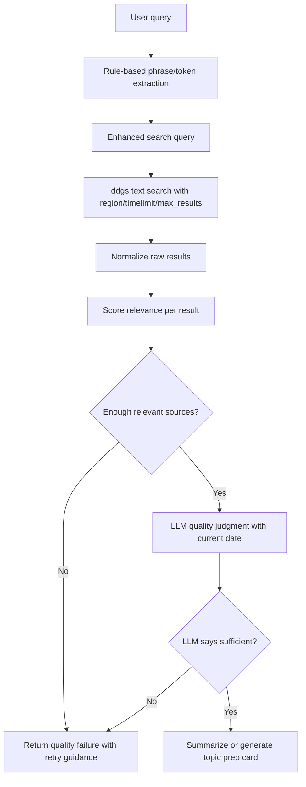

# feat: Harden search quality pipeline

## Summary

이 계획은 Convia의 검색 컨텍스트가 사용자의 관심 주제와 실제로 맞는지 보장하기 위해 `ddgs` 기반 검색 수집, 검색 쿼리 보강, 범용 relevance score, LLM 품질 판단을 하나의 공유 검색 품질 파이프라인으로 묶는다. `/api/search/`와 `/api/search/topic-prep/`는 같은 품질 레이어를 사용하되, 주제 준비 카드의 대화 방향/첫 질문 생성 흐름은 현재 범위 밖으로 둔다.

---

## Problem Frame

Convia의 핵심 가치는 사용자가 원하는 최신 관심사를 영어 회화의 출발점으로 삼게 하는 것이다. 하지만 현재 `/api/search/`는 `DDGS().text(query, max_results=5)` 결과를 검증 없이 요약하기 때문에, “최근 롯데 자이언츠 경기”처럼 구체적인 스포츠 주제에도 `연합뉴스 최신뉴스`, `NAVER`, `Google 뉴스` 같은 범용 홈/뉴스 목록이 그대로 통과할 수 있다.

이 문제는 LLM 요약 품질 문제가 아니라 검색 수집과 결과 검증 단계의 부재에서 시작된다. 검색엔진 옵션으로 지역/최신성/결과 수를 보강하고, 서버가 직접 관련성 점수를 계산한 뒤, LLM은 이미 정제된 후보를 대상으로 최종 품질 판단과 요약 생성에 집중해야 한다.

---

## Requirements

**Search provider and options**

- R1. 검색 수집은 `duckduckgo-search`에서 `ddgs` 패키지로 전환하되, 기존 `SearchService` 호출부가 검색 결과 shape 변화에 직접 노출되지 않아야 한다.
- R2. 검색 호출은 지역, safe search, 최신성 범위, 결과 수, backend를 설정할 수 있어야 한다.
- R3. 최신성 표현이 있는 쿼리는 `timelimit`를 적용할 수 있어야 하며, 한국어 주제는 한국 지역 검색 옵션을 우선 적용해야 한다.

**Query enhancement**

- R4. 사용자의 원문 쿼리는 응답에 보존하고, 검색용 쿼리는 별도로 보강해야 한다.
- R5. 쿼리 보강은 스포츠/뉴스/일반 주제에 적용 가능한 범용 intent 기반 규칙이어야 하며, `롯데 자이언츠` 전용 하드코딩에 머물면 안 된다.
- R6. 핵심 phrase와 token 추출은 LLM 추론이 아니라 정규화, stopword 제거, phrase 보존, intent token 분류 같은 deterministic rule로 수행해야 한다.
- R7. 쿼리 보강은 사용자의 의도를 과도하게 바꾸지 않아야 한다.

**Relevance filtering**

- R8. 검색 결과는 title, snippet, url, domain을 기반으로 relevance score를 계산해야 한다.
- R9. 범용 포털 홈, 뉴스 목록, snippet이 비어 있거나 주제 핵심어가 없는 결과는 제외하거나 강하게 감점해야 한다.
- R10. 필터링 후 충분한 관련 출처가 없으면 LLM 요약이나 topic prep 카드 생성을 진행하지 않고 품질 실패로 응답해야 한다.

**LLM quality judgment**

- R11. LLM은 원시 검색 결과가 아니라 relevance filter를 통과한 sources를 대상으로 관련성·최신성·구체성을 판단해야 한다.
- R12. LLM 품질 판단에는 항상 현재 날짜와 timezone을 제공해야 한다.
- R13. 검색어에는 최신성 의도가 감지될 때만 날짜 또는 기간 표현을 보강해야 한다.
- R14. LLM 품질 판단은 deterministic score를 대체하지 않고, 통과 후보의 최종 대화 적합성을 보조해야 한다.

**API contract and observability**

- R15. `/api/search/` 응답은 향후 모바일 클라이언트가 검색 성공, 검색 품질 부족, 외부 검색 장애를 구분할 수 있게 새 계약으로 정리해야 한다.
- R16. `/api/search/topic-prep/`는 기존 준비 카드 응답 의미를 유지하되, 새 검색 품질 파이프라인의 실패 사유와 재입력 가이드를 재사용해야 한다.
- R17. 검색 품질 실패는 외부 검색 장애와 구분되어야 한다.

**Documentation and tests**

- R18. API 계약 변경은 `README.md`, `docs/DSL.md`, `.env.example`, `backend/config.py`와 동기화해야 한다.
- R19. “최근 롯데 자이언츠 경기” 재현 케이스를 포함해 query enhancement, relevance filter, API 품질 실패, topic prep 회귀를 테스트해야 한다.

---

## Key Technical Decisions

- **`ddgs`로 전환한다:** 현재 패키지는 동작하지만 `duckduckgo-search`가 `ddgs`로 rename된 상태라 검색 provider 의존성을 최신 패키지로 맞춘다. 전환은 검색 adapter 내부에 가두고, 도메인 서비스는 normalized result만 다루게 한다.
- **검색 수집 옵션을 설정화한다:** `region`, `safesearch`, `timelimit`, `backend`, `max_results`는 패키지가 제공하는 품질 레버이므로 코드 상수에 묻지 않고 환경 설정으로 둔다. 기본값은 한국어 서비스에 맞춰 `kr-kr`, `moderate`, 최신 쿼리 한정 `m`, `auto`, `10~15` 범위로 계획한다.
- **검색용 쿼리와 사용자 원문을 분리한다:** `query`는 사용자가 입력한 원문으로 유지하고, 내부 검색에는 `enhanced_query`를 사용한다. 그래야 응답/분석/대화 handoff에서 사용자가 실제 입력한 주제를 잃지 않는다.
- **핵심어 추출은 deterministic rule로 처리한다:** 핵심 phrase/token 판단을 LLM에 맡기면 relevance score 자체가 비결정적이 된다. v1은 정규화, 시간/의도 stopword 분리, 공백 기반 phrase 보존, intent token 분류를 사용하고, LLM은 필터 이후 품질 판단에만 사용한다.
- **deterministic relevance score를 LLM 앞에 둔다:** LLM에게 “이 결과가 맞는지”를 처음부터 맡기면 엉뚱한 sources가 요약까지 진행된다. title/snippet/url 기반 점수를 먼저 계산하고, LLM은 필터링된 결과의 최종 품질과 요약만 담당한다.
- **현재 날짜는 LLM에 항상 주입하고 검색어에는 조건부로만 넣는다:** LLM freshness 판단에는 현재 날짜와 timezone이 항상 필요하다. 반면 검색어에 날짜를 항상 붙이면 evergreen 주제 품질이 떨어질 수 있으므로, `오늘`, `어제`, `최근`, `최신`, `이번 주` 같은 recency intent가 있을 때만 날짜/기간 표현을 보강한다.
- **검색 품질 결과를 공통 모델로 표현한다:** `/api/search/`와 `/api/search/topic-prep/`가 서로 다른 방식으로 품질 실패를 해석하면 회귀가 반복된다. source count, relevant count, score threshold, dropped result count, retry guidance를 공유 모델로 둔다.
- **현재 프론트 클라이언트 호환성은 제약으로 보지 않는다:** 아직 운영 중인 웹/모바일 프론트 클라이언트가 없으므로 기존 `/api/search/` response shape 보존보다 향후 Flutter 모바일 앱이 쓰기 좋은 명확한 계약을 우선한다. 단, 문서와 테스트는 새 계약을 정확히 고정한다.
- **패키지 전환은 fallback보다 명시 실패를 우선한다:** `ddgs` import 실패를 조용히 기존 패키지로 fallback하면 운영/개발 환경의 검색 품질 차이를 발견하기 어렵다. 의존성 설치와 import 실패는 테스트/부팅 단계에서 드러나게 한다.

---

## High-Level Technical Design

검색 품질 파이프라인은 `SearchService.search()`와 `SearchService.prepare_topic()` 앞단에서 공유된다. 두 엔드포인트는 같은 정제 sources와 quality metadata를 받지만, 성공 시 생성하는 산출물은 각각 검색 요약과 topic prep card로 유지한다.

---

## Implementation Units

### U1. Search settings and `ddgs` provider adapter

- **Goal:** `duckduckgo-search` 의존성을 `ddgs`로 전환하고, 검색 provider 옵션을 설정 가능한 adapter로 캡슐화한다.
- **Requirements:** R1, R2, R3, R18
- **Dependencies:** 없음
- **Files:**
  - `backend/pyproject.toml`
  - `backend/config.py`
  - `.env.example`
  - `backend/domains/search/service.py`
  - `backend/tests/domains/search/test_search_provider.py`
- **Approach:** 검색 호출을 `SearchService` 내부의 직접 `DDGS().text()` 호출에서 작은 provider adapter로 분리한다. adapter는 `ddgs.DDGS.text()`의 `region`, `safesearch`, `timelimit`, `backend`, `max_results`를 설정에서 받아 호출하고, 결과를 기존 `title`, `href`, `body` shape로 normalize한다.
- **Patterns to follow:** `backend/config.py`의 `Settings`, 기존 `SearchService._search_duckduckgo()`의 async wrapper, `backend/tests/conftest.py`의 환경변수 기본값 패턴
- **Test scenarios:**
  - `ENV` 기본 테스트 설정에서 검색 provider가 필수 설정 누락 없이 생성된다.
  - 한국어 최신 쿼리 호출 시 provider adapter가 `region`, `safesearch`, `timelimit`, `max_results`, `backend` 옵션을 `ddgs` 호출에 전달한다.
  - `ddgs`가 반환한 `href`/`body` 결과가 기존 `SearchResultItem` 생성에 필요한 normalized dict로 변환된다.
  - provider 예외는 검색 품질 실패가 아니라 외부 검색 장애로 전파된다.
- **Verification:** 기존 검색 서비스가 provider 패키지 세부 구현을 몰라도 같은 normalized result list를 받는다.

### U2. Query intent and enhancement

- **Goal:** 사용자 원문을 보존하면서 검색 정확도를 높이는 enhanced query를 생성한다.
- **Requirements:** R3, R4, R5, R6, R7, R13
- **Dependencies:** U1
- **Files:**
  - `backend/domains/search/schemas.py`
  - `backend/domains/search/service.py`
  - `backend/domains/search/query.py`
  - `backend/tests/domains/search/test_query_enhancement.py`
- **Approach:** 원문 쿼리에서 핵심 phrase, 핵심 token, 최신성 신호, 한국어 여부, 스포츠/뉴스 intent를 deterministic rule로 추출한다. phrase는 stopword와 intent token을 제외한 인접 명사구 후보를 보존하고, token은 entity token과 intent token으로 분리한다. 스포츠 intent는 팀명 사전 하나에 의존하지 않고 `경기`, `결과`, `일정`, `하이라이트`, `KBO`, `축구`, `야구` 같은 범용 스포츠 신호를 사용한다. “최근 롯데 자이언츠 경기”는 검색용으로 `최근 롯데 자이언츠 경기 KBO 경기 결과`처럼 보강하되, 응답의 `query`는 원문을 유지한다. 날짜/기간 표현은 recency intent가 있는 경우에만 검색어에 추가한다.
- **Patterns to follow:** `SearchRequest`/`TopicPrepRequest`는 사용자 입력 모델로 유지하고, service 내부에서 파생 metadata를 만든다.
- **Test scenarios:**
  - `"최근 롯데 자이언츠 경기"`는 원문을 보존하면서 검색용 쿼리에 `KBO`, `경기 결과` 계열 보강어를 포함한다.
  - `"최근 롯데 자이언츠 경기"`에서 핵심 phrase는 `롯데 자이언츠`, entity token은 `롯데`, `자이언츠`, intent token은 `최근`, `경기`로 분리된다.
  - `"오사카 여행 맛집"`은 스포츠 보강어를 추가하지 않는다.
  - `"최근 애플 발표"`는 최신성 신호를 인식하되 KBO 같은 스포츠 보강어를 추가하지 않는다.
  - 이미 `KBO`와 `경기 결과`를 포함한 쿼리는 같은 보강어를 중복 추가하지 않는다.
- **Verification:** 검색 provider에는 enhanced query가 전달되고, API 응답과 conversation handoff에는 사용자의 원문 주제가 유지된다.

### U3. Relevance scoring and result filtering

- **Goal:** 검색 결과가 사용자 주제와 충분히 관련 있는지 deterministic score로 판정한다.
- **Requirements:** R8, R9, R10, R17, R19
- **Dependencies:** U2
- **Files:**
  - `backend/domains/search/schemas.py`
  - `backend/domains/search/service.py`
  - `backend/domains/search/relevance.py`
  - `backend/tests/domains/search/test_relevance_filter.py`
- **Approach:** 각 검색 결과의 `title + snippet + url`에서 핵심 토큰 매칭 점수를 계산한다. title 매칭은 snippet보다 높은 가중치를 주고, URL의 `kbo`, `giants`, `lotte` 같은 slug 매칭은 보조 점수로 사용한다. `naver.com/`, `news.google.com/`, `yna.co.kr/news`, 언론사 홈/목록 URL처럼 주제 페이지가 아닌 범용 진입점은 감점하거나 제외한다.
- **Technical design:** Directional scoring sketch, not implementation specification:
  - positive signals: title keyword hit, snippet keyword hit, entity phrase hit, sports/news intent alignment, topical URL slug
  - negative signals: generic homepage, news index page, empty snippet, no core token hit, unrelated snippet entities
  - pass condition: enough results above threshold and at least one result with strong title/entity match
- **Patterns to follow:** `TopicPrepQuality`의 `source_count`, `relevance`, `specificity` 개념을 확장하되, LLM 결과가 아닌 rule score도 보존한다.
- **Test scenarios:**
  - `"최근 롯데 자이언츠 경기"`에 대해 `최신뉴스 | 연합뉴스`, `NAVER`, `Google 뉴스` 홈 결과는 필터링된다.
  - title 또는 snippet에 `롯데 자이언츠`와 `경기 결과`가 포함된 결과는 통과한다.
  - 관련 결과가 2개 미만이면 low-quality result로 판정된다.
  - snippet이 비어 있거나 범용 설명뿐인 결과는 핵심 토큰이 URL에 일부 있어도 통과하지 않는다.
  - 영어/한국어 혼합 쿼리에서 영문 slug 매칭은 보조 점수로만 사용되고 title/snippet 무관 결과를 단독 통과시키지 않는다.
- **Verification:** 엉뚱한 sources가 LLM 요약 단계에 도달하지 않는다.

### U4. Shared search quality pipeline

- **Goal:** query enhancement, provider search, relevance filtering, LLM 품질 판단을 `/api/search/`와 topic prep이 함께 쓰는 pipeline으로 묶는다.
- **Requirements:** R10, R11, R12, R13, R14, R15, R16, R17
- **Dependencies:** U1, U2, U3
- **Files:**
  - `backend/domains/search/schemas.py`
  - `backend/domains/search/service.py`
  - `backend/tests/domains/search/test_search_quality_pipeline.py`
  - `backend/tests/domains/search/test_topic_prep_service.py`
- **Approach:** `SearchService`에 원시 검색 함수 대신 “준비된 검색 결과”를 반환하는 내부 pipeline을 둔다. pipeline 결과는 original query, enhanced query, accepted sources, dropped count, deterministic quality, retry guidance를 포함한다. `/api/search/`는 quality가 낮으면 요약을 만들지 않고 품질 실패 응답을 반환하고, topic prep은 기존 `ready=false` 흐름으로 연결한다.
- **Patterns to follow:** `prepare_topic()`의 low-quality result, `_build_retry_guidance()`, `SuccessResponse` wrapper
- **Test scenarios:**
  - `/api/search/` 성공 path는 filtered sources만 요약에 전달한다.
  - `/api/search/` low-quality path는 LLM 요약 provider를 호출하지 않는다.
  - `/api/search/topic-prep/` low-quality path는 카드 생성 LLM을 호출하지 않고 기존 `ready=false` semantics를 유지한다.
  - 외부 검색 예외는 quality failure가 아니라 `ExternalAPIException`으로 유지된다.
  - deterministic filter는 통과했지만 LLM이 최신성/구체성 부족을 반환하면 topic prep은 `ready=false`로 응답한다.
  - LLM 품질 판단 prompt에는 현재 날짜와 timezone이 항상 포함된다.
- **Verification:** 두 검색 엔드포인트가 같은 품질 기준을 공유하고, LLM 호출은 정제된 sources 뒤에서만 발생한다.

### U5. API schemas and documentation contract

- **Goal:** 검색 품질 상태와 low-quality response를 클라이언트가 안정적으로 처리할 수 있게 API 계약을 문서화한다.
- **Requirements:** R15, R16, R18
- **Dependencies:** U4
- **Files:**
  - `backend/domains/search/router.py`
  - `backend/domains/search/schemas.py`
  - `README.md`
  - `docs/DSL.md`
  - `docs/UX_FEEDBACK.md`
  - `backend/tests/domains/search/test_search_router.py`
- **Approach:** 현재 운영 중인 프론트 클라이언트가 없으므로 기존 `/api/search/` shape와의 하위 호환성보다 향후 Flutter 모바일 앱이 명확히 처리할 수 있는 새 response contract를 우선한다. 기존 `success=true` wrapper는 유지하되, “검색은 성공했지만 대화/요약에 쓸 품질이 부족한 상태”를 HTTP 오류가 아닌 데이터 상태로 표현한다.
- **Patterns to follow:** `TopicPrepResult`, `TopicPrepQuality`, `README.md` Search API 섹션, `docs/DSL.md` Search 모듈
- **Test scenarios:**
  - 인증된 `/api/search/` 요청이 sufficient quality면 summary와 filtered sources를 반환한다.
  - low-quality `/api/search/` 요청은 `success=true` 안에서 quality failure와 retry guidance를 반환한다.
  - 인증이 없으면 기존 인증 정책대로 차단된다.
  - topic prep 문서의 low-quality 예시와 search 문서의 low-quality 예시가 같은 용어를 사용한다.
- **Verification:** Flutter 클라이언트가 검색 실패, 검색 품질 부족, 검색 성공을 구분할 수 있다.

### U6. Regression coverage and representative fixtures

- **Goal:** 검색 품질 개선이 특정 케이스만 고치는 임시 패치가 아니라 범용 동작으로 유지되게 한다.
- **Requirements:** R5, R6, R7, R9, R19
- **Dependencies:** U1, U2, U3, U4, U5
- **Files:**
  - `backend/tests/domains/search/test_query_enhancement.py`
  - `backend/tests/domains/search/test_relevance_filter.py`
  - `backend/tests/domains/search/test_search_quality_pipeline.py`
  - `backend/tests/domains/search/test_search_router.py`
  - `backend/tests/domains/search/test_topic_prep_service.py`
- **Approach:** 외부 검색과 LLM은 모두 fixture/mock으로 고정하고, 대표 raw results 세트를 만든다. 롯데 자이언츠 실패 사례, 일반 뉴스 주제, 여행 주제, 너무 넓은 주제를 fixture로 나누어 query enhancement와 relevance filter를 독립적으로 검증한다.
- **Test scenarios:**
  - “최근 롯데 자이언츠 경기” fixture에서 범용 뉴스/포털 홈은 제거되고, KBO/롯데 경기 결과 sources만 남는다.
  - “최근 애플 발표” fixture는 최신 뉴스 intent를 통과하지만 스포츠 보강어를 받지 않는다.
  - “오사카 여행 맛집” fixture는 지역/여행 관련 결과를 통과시키고 스포츠/뉴스 특화 기준으로 과도하게 탈락하지 않는다.
  - “요즘 이슈” fixture는 관련성/구체성 부족으로 retry guidance를 반환한다.
  - 기존 topic prep 성공 path와 conversation handoff 테스트는 새 quality pipeline 이후에도 통과한다.
- **Verification:** 검색 품질 개선이 대표 주제군에서 회귀 없이 작동한다.

---

## Acceptance Examples

- AE1. **Covers R4, R5, R6, R8, R9, R10.** 사용자가 `/api/search/`에 “최근 롯데 자이언츠 경기”를 입력하면 rule 기반 추출로 `롯데 자이언츠` phrase가 보존되고, 검색용 쿼리는 KBO/경기 결과 맥락으로 보강되며, `연합뉴스 최신뉴스`, `NAVER`, `Google 뉴스` 같은 범용 홈/목록 sources는 요약 입력에서 제외된다.
- AE2. **Covers R10, R15, R16.** 관련 sources가 충분하지 않으면 `/api/search/`는 엉뚱한 요약을 만들지 않고 품질 부족 상태와 재입력 가이드를 반환한다.
- AE3. **Covers R11, R12, R14, R16.** `/api/search/topic-prep/`는 deterministic relevance filter를 통과한 sources와 현재 날짜/timezone을 포함한 prompt에 대해서만 LLM 품질 판단과 카드 생성을 진행한다.
- AE4. **Covers R5, R7, R13.** “오사카 여행 맛집” 같은 비스포츠·evergreen 주제에는 KBO 보강어와 날짜 표현이 붙지 않고, 여행 주제에 맞는 검색 결과가 relevance score로 평가된다.

---

## Scope Boundaries

### In Scope

- `ddgs` 패키지 전환
- 검색 provider 옵션 설정화
- 사용자 원문과 검색용 쿼리 분리
- 범용 query enhancement
- deterministic relevance scoring/filtering
- `/api/search/`와 `/api/search/topic-prep/`의 공유 검색 품질 pipeline
- API 계약/문서/테스트 동기화

### Deferred to Follow-Up Work

- 검색 결과 클릭/대화 전환율 계측 저장
- 사용자별 관심사 저장/재사용
- source별 신뢰도 학습이나 랭킹 모델
- 다중 검색 provider 유료 API 비교 또는 fallback
- 실제 기사 본문 크롤링 기반 요약

### Outside Current Scope

- Flutter 모바일 UI 구현
- conversation handoff 프롬프트 변경
- grammar feedback 또는 학습 통계 변경

---

## System-Wide Impact

- **API contract:** `/api/search/`가 단순 summary-only 응답에서 품질 상태를 표현하는 응답으로 확장된다. `README.md`, `docs/DSL.md`, router/schema/test가 같은 작업 단위로 동기화되어야 한다.
- **Environment contract:** 검색 provider 설정이 `.env.example`, `backend/config.py`, `README.md`에 추가된다.
- **Search behavior:** topic prep과 일반 search가 같은 필터를 쓰므로 검색 품질 개선은 두 사용자 흐름에 동시에 영향을 준다.
- **Dependency posture:** `duckduckgo-search`에서 `ddgs`로 전환하므로 lockfile 또는 dependency metadata 변경이 필요할 수 있다.

---

## Risks & Dependencies

- **과도한 필터링:** deterministic score가 너무 엄격하면 실제로 쓸 만한 sources까지 버릴 수 있다. 스포츠/뉴스/여행/일반 주제 fixture를 나눠 threshold를 검증한다.
- **쿼리 보강 오판:** intent 추정이 틀리면 검색어가 사용자 의도에서 멀어진다. 보강어는 additive하게만 붙이고, 원문 핵심어 삭제나 치환은 하지 않는다.
- **API 계약 설계:** 현재 운영 중인 프론트 클라이언트는 없지만, 향후 Flutter 앱이 바로 사용할 계약을 이 계획에서 고정하게 된다. 문서와 테스트가 검색 성공/품질 부족/외부 장애의 의미를 명확히 구분해야 한다.
- **외부 검색 변동성:** DDGS 결과는 시점과 backend에 따라 달라질 수 있다. 테스트는 외부 호출이 아니라 고정 fixture를 사용한다.
- **패키지 rename 전환:** `ddgs` 전환 시 import path와 exception type이 달라질 수 있다. provider adapter에서 차이를 흡수하고 service 테스트는 adapter mock으로 고정한다.

---

## Documentation / Operational Notes

- `README.md`의 Search API 예시에 sufficient quality와 low-quality response를 모두 추가한다.
- `docs/DSL.md`의 Search 모듈에 quality metadata와 retry guidance 타입을 반영한다.
- `.env.example`에 검색 region, safesearch, recent timelimit, max results, backend 기본값을 추가한다.
- LLM 품질 판단 prompt 문서나 테스트에는 현재 날짜/timezone 주입이 freshness 판단의 전제임을 명시한다.
- 운영 로그에는 원문 query, enhanced query, accepted/dropped count, quality reason 정도만 남기고 access token이나 사용자 개인정보는 남기지 않는다.

---

## Sources & Research

- `docs/brainstorms/2026-05-27-topic-prep-card-requirements.md` — 검색 품질 gate 요구사항 R10-R13
- `docs/plans/2026-05-27-001-feat-topic-prep-card-plan.md` — 기존 topic prep 구현 계획과 완료된 품질 gate 범위
- `STRATEGY.md` — 검색 컨텍스트 품질 track
- `backend/domains/search/service.py` — 현재 `duckduckgo_search.DDGS().text(query, max_results=5)` 호출과 LLM 요약 흐름
- `backend/domains/search/schemas.py` — 기존 `SearchResult`, `TopicPrepQuality`, `TopicPrepResult` 타입
- `backend/pyproject.toml` — 현재 `duckduckgo-search>=8.1.1` 의존성
- [ddgs PyPI](https://pypi.org/project/ddgs/) — `DDGS.text()`가 `region`, `safesearch`, `timelimit`, `max_results`, `page`, `backend` 옵션을 제공하고 `duckduckgo-search` rename 이후 패키지임을 확인
