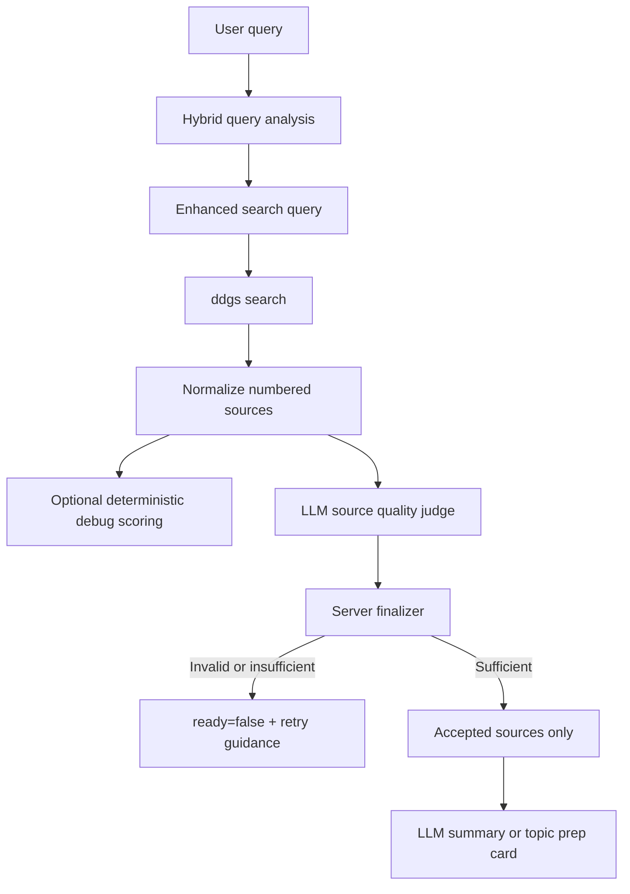

# refactor: Make LLM the primary search source judge

## Summary

이 계획은 현재 검색 품질 파이프라인의 deterministic relevance score 중심 필터를 LLM source judge 중심 구조로 전환한다. 서버는 더 이상 범용적이지 않은 phrase/token 가중치로 source 채택을 결정하지 않고, LLM이 source별 채택/탈락과 최종 충분성 판단을 맡는다. 서버는 JSON 형식, source id 유효성, 최소 안전 조건, 모순 정규화만 담당한다.

---

## Problem Frame

Convia의 검색 주제는 “최근 롯데 자이언츠 경기”, “오사카 여행 맛집 추천”, “최근 애플 WWDC 발표 내용”처럼 스포츠, 여행, 뉴스, 제품 발표, 사용자의 개인 관심사를 넓게 오간다. 현재 `backend/domains/search/relevance.py`는 title/snippet/url의 phrase/token match에 고정 가중치를 주는 방식이라 특정 주제군에서는 잘 작동하지만, 범용 서비스의 의미 판단 기준으로 확장하기 어렵다.

최근 테스트에서도 이 한계가 드러났다. 오사카 맛집 케이스는 검색과 요약이 좋아졌지만 `quality.is_sufficient=true`와 `relevance=false`, `freshness=false`, `specificity=false`가 동시에 반환되는 모순이 발생했다. 이는 LLM judge의 의미 판단과 서버의 deterministic quality merge가 서로 다른 기준으로 최종 응답을 만들고 있기 때문이다.

이번 리팩터링은 LLM을 검색 source 품질의 중심 판단자로 승격하고, 서버는 모바일 클라이언트가 신뢰할 수 있는 일관된 `quality` 계약을 보장하는 guard/finalizer 역할로 축소한다.

---

## Requirements

**LLM source judging**

- R1. LLM quality judge는 검색 결과 전체를 입력받아 source별 `accepted`/`rejected` 판단을 반환해야 한다.
- R2. LLM quality judge는 최종 `is_sufficient`, `relevance`, `freshness`, `specificity`, `reason`, `retry_suggestion`을 JSON schema로 반환해야 한다.
- R3. LLM judge 입력에는 현재 날짜, timezone, 원문 query, enhanced query, recency intent, numbered sources가 포함되어야 한다.
- R4. LLM judge는 source id를 기준으로 accepted source를 지정해야 하며, 서버는 id가 실제 검색 결과 범위 안에 있는지만 검증해야 한다.
- R5. `is_sufficient=true`인 경우 accepted source는 summary와 topic prep card에 전달할 만큼 구체적인 sources만 포함해야 한다.

**Server-side guardrails**

- R6. 서버는 LLM의 의미 판단을 우선하되, JSON parse 실패, 빈 accepted source, source id 불일치, 품질 플래그 모순은 `ready=false`로 정규화해야 한다.
- R7. 서버는 source별 semantic 판단을 deterministic score로 대체하지 않아야 한다.
- R8. deterministic scoring은 삭제하거나, 구현 리스크를 줄이기 위해 telemetry/debug field로만 남겨야 하며 최종 source 채택 기준이 되면 안 된다.
- R9. evergreen 주제에서 `freshness`는 실패 신호가 아니라 “최신성 요구 없음”을 표현할 수 있게 정규화해야 한다.
- R10. LLM judge 실패 시에는 잘못된 요약을 만들지 않고 `ready=false`와 재입력 안내를 반환해야 한다.

**API and compatibility**

- R11. `/api/search/`는 기존 wrapper와 `ready`, `summary`, `sources`, `quality`, `retry_guidance`, `example_queries` 의미를 유지해야 한다.
- R12. `/api/search/topic-prep/`도 같은 LLM source judge 결과를 사용해 카드 생성 여부를 결정해야 한다.
- R13. `relevance_score`는 모바일 계약에서 제거하거나 선택적 debug-only 필드로 내려야 한다.
- R14. 문서와 계약은 deterministic threshold보다 LLM source judge 중심 용어로 업데이트해야 한다.

**Observability and tests**

- R15. LLM judge start/success/fallback 로그는 유지하되, accepted/rejected count와 finalizer 결과를 추가해야 한다.
- R16. 테스트는 외부 검색/LLM을 mock으로 고정하고, source id 채택/탈락과 final quality 정규화를 검증해야 한다.

---

## Key Technical Decisions

- **KTD1. LLM을 primary source judge로 둔다:** 사용자의 관심사는 도메인 범위가 넓기 때문에 phrase/token 가중치보다 LLM의 의미 판단이 제품 방향에 맞다. deterministic 점수는 범용 판별자가 아니라 구현 보조 신호로만 적합하다.
- **KTD2. 서버는 judge가 아니라 finalizer다:** LLM이 `is_sufficient=true`와 `relevance=false` 같은 모순을 반환할 수 있으므로, 서버는 의미 판단을 다시 하지 않고 형식/일관성/최소 조건만 검증한다.
- **KTD3. source id 기반 계약을 쓴다:** LLM에게 source 텍스트를 재작성하게 하지 않고, numbered source id 목록만 고르게 해야 원본 URL/title/snippet의 무결성을 유지할 수 있다.
- **KTD4. LLM 실패는 low-quality로 처리한다:** 검색 provider 장애는 외부 API 오류지만, LLM judge 실패는 잘못된 summary를 만드는 것보다 `ready=false`로 안내하는 편이 안전하다.
- **KTD5. freshness는 recency intent와 분리한다:** `오사카 여행 맛집 추천`처럼 evergreen 주제는 freshness가 본질 품질 조건이 아니다. `recency_intent=false`이면 최종 `freshness=true` 또는 별도 `freshness_required=false`로 정규화한다.
- **KTD6. API 응답은 모바일-first로 정리한다:** 현재 프론트 클라이언트가 없으므로, `relevance_score` 같은 내부 디버그 값보다 모바일이 처리할 `ready`, `quality`, `retry_guidance`의 일관성을 우선한다.

---

## High-Level Technical Design



### Target LLM judge JSON shape

```json
{
  "is_sufficient": true,
  "accepted_source_ids": [1, 3, 5],
  "rejected_sources": [
    {
      "id": 2,
      "reason": "Too generic or not directly useful for the user's topic."
    }
  ],
  "relevance": true,
  "freshness": true,
  "specificity": true,
  "reason": null,
  "retry_suggestion": null
}
```

이 schema는 방향성 계약이다. 구현 시에는 `pydantic` 모델 또는 내부 validator로 실제 parse/정규화 규칙을 고정한다.

---

## Implementation Units

### U1. LLM judge schema and parser

- **Goal:** LLM source judge 응답을 구조화된 내부 모델로 파싱하고 검증한다.
- **Requirements:** R1, R2, R4, R6
- **Dependencies:** 없음
- **Files:**
  - `backend/domains/search/schemas.py`
  - `backend/domains/search/service.py`
  - `backend/tests/domains/search/test_search_quality_pipeline.py`
- **Approach:** `accepted_source_ids`, `rejected_sources`, `is_sufficient`, `relevance`, `freshness`, `specificity`, `reason`, `retry_suggestion`을 담는 내부 모델을 추가한다. source id는 1-based로 prompt에 제공하고, 서버에서 실제 source index로 변환한다.
- **Patterns to follow:** 기존 `_parse_json_response()`, `TopicPrepQuality`, `SearchQuality` 모델의 nullable reason/retry_suggestion 패턴
- **Test scenarios:**
  - 유효한 LLM JSON이 accepted source id 목록으로 파싱된다.
  - malformed JSON은 judge failure로 처리된다.
  - 범위 밖 source id는 제거되거나 invalid judge result로 처리된다.
  - `is_sufficient=true`인데 accepted source id가 비어 있으면 final quality는 insufficient가 된다.

### U2. Replace deterministic filtering with LLM source selection

- **Goal:** `filter_relevant_sources()`를 최종 채택 기준에서 제거하고, LLM이 선택한 accepted sources만 summary/topic prep에 전달한다.
- **Requirements:** R3, R5, R7, R8, R10, R12
- **Dependencies:** U1
- **Files:**
  - `backend/domains/search/service.py`
  - `backend/domains/search/relevance.py`
  - `backend/tests/domains/search/test_search_quality_pipeline.py`
  - `backend/tests/domains/search/test_topic_prep_service.py`
- **Approach:** `_prepare_search_results()`는 raw normalized sources를 LLM judge에 넘긴다. deterministic score는 삭제하거나, `logger.debug`/테스트 전용 보조 정보로만 남긴다. LLM judge 실패 시 fallback으로 deterministic accepted sources를 쓰지 않고 `ready=false`를 반환한다.
- **Patterns to follow:** 현재 `_judge_search_quality()`의 LLM call/log 구조, `_build_low_quality_result()`의 `ready=false` 반환 흐름
- **Test scenarios:**
  - LLM이 `[2, 4]`를 accepted로 반환하면 summary에는 2번과 4번 source만 전달된다.
  - LLM이 충분하지 않다고 판단하면 summary LLM은 호출되지 않는다.
  - LLM judge가 실패하면 deterministic score가 높은 source가 있어도 `ready=false`가 된다.
  - topic prep도 search와 같은 accepted sources만 카드 생성에 전달한다.

### U3. Server finalizer for consistent quality flags

- **Goal:** `quality.is_sufficient`, `relevance`, `freshness`, `specificity`의 모순을 제거한다.
- **Requirements:** R6, R9, R11
- **Dependencies:** U1, U2
- **Files:**
  - `backend/domains/search/service.py`
  - `backend/domains/search/schemas.py`
  - `backend/tests/domains/search/test_search_quality_pipeline.py`
- **Approach:** LLM judge 결과를 받은 뒤 finalizer가 최종 `SearchQuality`를 만든다. `recency_intent=false`이면 freshness는 통과로 정규화한다. `is_sufficient=true`는 `relevance=true`, `specificity=true`, `accepted_source_count >= min_relevant_results`, 그리고 freshness 조건을 만족할 때만 유지한다.
- **Patterns to follow:** 현재 `SearchQuality`의 `source_count`, `relevant_source_count`, `dropped_source_count` 필드
- **Test scenarios:**
  - LLM이 `is_sufficient=true`, `relevance=false`를 반환하면 최종 `is_sufficient=false`가 된다.
  - evergreen query에서 LLM이 `freshness=false`를 반환해도 `recency_intent=false`이면 최종 freshness는 통과로 정규화된다.
  - recency query에서 `freshness=false`이면 최종 `is_sufficient=false`가 된다.
  - accepted source 수가 최소 기준보다 적으면 최종 `is_sufficient=false`가 된다.

### U4. Prompt update and source numbering

- **Goal:** LLM judge prompt를 source selection 중심으로 재작성한다.
- **Requirements:** R1, R2, R3, R5, R15
- **Dependencies:** U1
- **Files:**
  - `backend/domains/search/service.py`
  - `backend/tests/domains/search/test_search_quality_pipeline.py`
- **Approach:** prompt에 numbered sources, current date/timezone, original query, enhanced query, recency intent를 명시한다. `is_sufficient`는 accepted sources가 대화/요약에 충분할 때만 true라고 명시하고, freshness는 recency intent가 있을 때만 엄격히 판단하도록 지시한다.
- **Patterns to follow:** 현재 `Search LLM stage=quality_judge` 로그와 `LLMRequest` 구성
- **Test scenarios:**
  - quality judge prompt에 `Source 1`, `Source 2`처럼 id가 포함된다.
  - prompt에 `recency_intent`와 current date/timezone이 포함된다.
  - prompt가 accepted source ids와 rejected source reasons를 요구한다.
  - success 로그에 accepted/rejected count가 포함된다.

### U5. API contract and documentation sync

- **Goal:** 모바일 클라이언트가 LLM source judge 중심 응답을 이해하도록 문서와 schema를 정리한다.
- **Requirements:** R11, R13, R14
- **Dependencies:** U2, U3
- **Files:**
  - `backend/domains/search/schemas.py`
  - `README.md`
  - `docs/DSL.md`
  - `.agent/_contracts/SEARCH_QUALITY.md`
  - `backend/tests/domains/search/test_search_router.py`
- **Approach:** `relevance_score`를 제거하거나 선택적 debug-only 필드로 문서에서 내린다. `relevant_source_count`는 LLM accepted source count를 의미하도록 설명한다. threshold/strong_match가 더 이상 최종 기준이 아니면 deprecate하거나 내부 필드로 전환한다.
- **Patterns to follow:** 기존 Search API 문서의 `ready=false` 예시, `SuccessResponse` wrapper
- **Test scenarios:**
  - `/api/search/` 성공 응답 sources에는 accepted sources만 포함된다.
  - `/api/search/` low-quality 응답은 `summary=null`, `ready=false`, retry guidance를 유지한다.
  - API 문서 예시와 schema 필드 이름이 일치한다.

### U6. Representative regression fixtures

- **Goal:** 다양한 주제에서 LLM judge 중심 구조가 의도대로 동작하는지 fixture로 고정한다.
- **Requirements:** R15, R16
- **Dependencies:** U1-U5
- **Files:**
  - `backend/tests/domains/search/test_search_quality_pipeline.py`
  - `backend/tests/domains/search/test_query_analysis.py`
  - `backend/tests/domains/search/test_topic_prep_service.py`
- **Approach:** 외부 ddgs와 LLM은 모두 mock한다. 같은 raw sources에 대해 LLM accepted ids가 달라질 때 결과가 어떻게 변하는지 검증한다.
- **Test scenarios:**
  - `"오사카 여행 맛집 추천"`에서 LLM이 TikTok/Tabelog 메인만 reject하면 accepted sources만 summary에 전달된다.
  - `"최근 롯데 자이언츠 경기"`에서 오래된 시즌 페이지를 reject하고 최근 경기 결과 기사만 accepted로 전달한다.
  - `"최근 애플 WWDC 발표 내용"`에서 오래된 2012년 WWDC source만 있으면 insufficient가 된다.
  - `"요즘 이슈"`처럼 넓은 주제는 accepted source가 적거나 reason이 구체적으로 반환된다.

---

## Scope Boundaries

### In Scope

- LLM quality judge를 source selection 중심으로 리팩터링
- deterministic relevance score의 최종 결정권 제거
- quality finalizer로 모순 응답 정규화
- `/api/search/`와 `/api/search/topic-prep/`의 shared pipeline 유지
- API 문서와 테스트 갱신

### Out of Scope

- 검색 provider 자체 교체
- 모바일 앱 UI 구현
- summary prompt 품질 튜닝 전반
- 개인화된 사용자 관심사 저장/랭킹
- 운영 모니터링 대시보드 구축

---

## Risks & Dependencies

| Risk | Impact | Mitigation |
|------|--------|------------|
| LLM 비용/latency 증가 | 모든 검색이 LLM judge를 거쳐 응답 시간이 늘 수 있음 | source 수를 `SEARCH_MAX_RESULTS`로 제한하고 judge max tokens를 유지 |
| LLM JSON 불안정 | parse 실패 시 ready=false 증가 | schema prompt 강화, parser/finalizer 테스트 고정 |
| LLM source id hallucination | 없는 source를 accepted로 반환 가능 | 서버에서 id 범위 검증 |
| 과도한 LLM 신뢰 | 낮은 품질 source가 통과할 수 있음 | 최소 accepted source 수와 quality flag 모순 검증 |
| API 필드 의미 변경 | 향후 모바일 구현자가 혼동 가능 | `README.md`, `docs/DSL.md`, `.agent/_contracts/SEARCH_QUALITY.md` 동기화 |

---

## Acceptance Examples

- AE1. **Covers R1, R4, R5, R7.** 사용자가 “오사카 여행 맛집 추천”을 검색하면 LLM judge가 Pinterest/TikTok/Tabelog 메인 같은 보조성이 낮은 source를 reject하고, accepted sources만 영어 summary에 전달한다.
- AE2. **Covers R6, R9.** LLM이 evergreen 주제에서 `freshness=false`를 반환해도 서버 finalizer는 recency intent가 없음을 근거로 freshness를 실패로 취급하지 않는다.
- AE3. **Covers R6, R10.** LLM judge가 malformed JSON을 반환하면 summary를 만들지 않고 `ready=false`와 retry guidance를 반환한다.
- AE4. **Covers R11, R12.** `/api/search/`와 `/api/search/topic-prep/`는 같은 accepted source selection을 공유하며, 두 endpoint 모두 low-quality semantics를 유지한다.

---

## Sources / Research

- Existing plan: `docs/plans/2026-06-03-001-feat-search-quality-pipeline-plan.md`
- Current pipeline entry: `backend/domains/search/service.py`
- Current deterministic scoring: `backend/domains/search/relevance.py`
- Current API schemas: `backend/domains/search/schemas.py`
- Search API contract: `.agent/_contracts/SEARCH_QUALITY.md`
