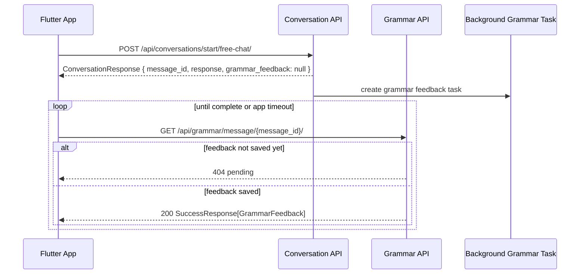

# feat: Formalize grammar feedback polling

## Summary

이 계획은 모바일 v1에서 문법 피드백 수신을 SSE 중심에서 polling 중심 계약으로 전환한다. 서버는 기존 `GET /api/grammar/message/{message_id}/`를 모바일 polling API로 공식화하고, `404`를 pending 또는 접근 불가 상태로 문서화한다. SSE 엔드포인트는 제거하지 않고 선택적 실시간 경로로 유지한다.

---

## Problem Frame

현재 대화 API는 사용자 메시지를 저장한 뒤 AI 응답을 즉시 반환하고, 문법 피드백은 `asyncio.create_task()`로 백그라운드에서 생성한다. 응답의 `message_id`는 사용자가 보낸 메시지의 ID이며, 이 ID를 통해 나중에 문법 피드백을 조회할 수 있다.

기존 문서와 라우터는 `GET /api/conversations/messages/{message_id}/grammar-feedback/stream` SSE 경로를 주요 수신 방식처럼 설명한다. 하지만 모바일 v1에서는 네트워크 전환, 백그라운드 상태, 쿼리 파라미터 토큰 노출, Flutter 구현 난도를 고려해 polling이 더 적합하다.

사용자 결정에 따라 모바일 앱은 `GET /api/grammar/message/{message_id}/`를 반복 호출하고, `404`를 “아직 피드백 생성 중”으로 해석한다. 이 계획은 그 결정을 API 계약, 문서, 테스트로 고정한다.

---

## Requirements

**Polling contract**

- R1. 모바일 앱은 `ConversationResponse.message_id` 또는 `MessageResponse.message_id`로 `GET /api/grammar/message/{message_id}/`를 polling해야 한다.
- R2. `GET /api/grammar/message/{message_id}/`가 `200`을 반환하면 `SuccessResponse[GrammarFeedback]`를 완료 상태로 처리해야 한다.
- R3. `GET /api/grammar/message/{message_id}/`가 `404`를 반환하면 모바일 앱은 오류가 아니라 pending 상태로 처리해야 한다.
- R4. 인증 실패 `401`, 인증 헤더 없음 `403`, 잘못된 요청, 외부 오류는 pending이 아니라 실제 실패 상태로 처리해야 한다.

**Server behavior**

- R5. 기존 `GET /api/grammar/message/{message_id}/` 경로를 polling용 primary endpoint로 유지한다.
- R6. 서버는 피드백이 아직 저장되지 않았을 때 기존처럼 `404`를 반환하되, 응답 의미를 pending으로 문서화해야 한다.
- R7. SSE 엔드포인트는 제거하지 않고 선택적 실시간 경로로 유지해야 한다.
- R8. 모바일 polling 계약은 `Authorization: Bearer <access_token>` 헤더를 사용해야 하며, SSE의 query token 방식과 구분해야 한다.
- R9. 서버는 `message_id`가 현재 인증 사용자 소유 대화의 메시지인지 검증해야 한다.
- R10. 피드백 미생성, 존재하지 않는 message, 타 사용자 message는 모두 `404`로 반환해 ID 존재 여부를 노출하지 않아야 한다.

**Documentation and tests**

- R11. `README.md`, `docs/DSL.md`, `docs/UX_FEEDBACK.md`, `.agent/architecture.md`는 polling 우선 결정을 같은 의미로 설명해야 한다.
- R12. 테스트는 “피드백 없음 → 404 pending”, “피드백 있음 → 200 완료”, “인증 필요”, “타 사용자 message → 404”를 고정해야 한다.

---

## Key Technical Decisions

- KTD1. 기존 endpoint를 재사용한다: `GET /api/grammar/message/{message_id}/`가 이미 메시지 ID 기반 조회를 제공하므로, 모바일 v1은 새 status endpoint를 만들지 않고 `404=pending` 계약을 공식화한다.
- KTD2. `404`를 pending 신호로 유지한다: 별도 `{ status: "pending" }` 응답을 추가하면 구현은 더 명시적이지만 현재 라우터와 repository의 `NotFoundException` 흐름을 바꿔야 한다. 모바일 v1에서는 HTTP 상태를 클라이언트 상태로 매핑하는 편이 작고 충분하다.
- KTD3. SSE는 optional path로 둔다: SSE를 제거하면 기존 Swagger/웹 확인 경로가 깨질 수 있다. 모바일 앱은 polling을 기본으로 쓰고, 실시간성이 제품 요구가 될 때 SSE를 재검토한다.
- KTD4. Polling은 header auth를 사용한다: 모바일 앱은 일반 인증 API처럼 `Authorization` 헤더를 사용한다. query parameter token은 SSE 제약 때문에 남겨진 예외로 취급한다.
- KTD5. Ownership 실패도 `404`로 통일한다: 타 사용자 message에 `403`을 반환하면 message 존재 여부를 노출할 수 있다. 모바일 polling 계약에서는 피드백 미생성, 없는 message, 타 사용자 message를 모두 `404`로 처리하고 앱 timeout UX로 흡수한다.

---

## High-Level Technical Design

모바일 앱의 권장 polling cadence는 구현 문서에 예시로만 둔다. 서버 계약은 polling 간격을 강제하지 않는다. 앱은 짧은 간격으로 시작해 최대 대기 시간 이후 timeout 상태를 보여준다.

---

## Implementation Units

### U1. Document polling as the primary mobile grammar feedback contract

- **Goal:** 문서상 주요 모바일 피드백 수신 방식을 SSE에서 polling으로 정리한다.
- **Requirements:** R1, R2, R3, R4, R7, R8, R11
- **Files:**
  - `README.md`
  - `docs/DSL.md`
  - `docs/UX_FEEDBACK.md`
  - `.agent/architecture.md`
- **Approach:** `GET /api/grammar/message/{message_id}/`를 모바일 v1 primary path로 설명한다. `404`는 pending 또는 접근 불가, `200`은 completed, `401/403/400/429/5xx`는 failure로 분리한다. SSE는 optional realtime path로 남긴다.
- **Patterns to follow:** 최근 문서의 모바일 v1 결정 섹션과 API 계약 표현, `README.md`의 Auth/Search API 응답 예시 구조
- **Test scenarios:** 문서 검증은 `rg`로 SSE-only 표현이 남지 않았는지 확인한다. unrelated 운영 결정이 이 plan 범위에 들어오지 않았는지 확인한다.

### U2. Add router tests for grammar feedback polling states

- **Goal:** polling 계약의 핵심 상태를 FastAPI router 테스트로 고정한다.
- **Requirements:** R2, R3, R4, R9, R10, R12
- **Files:**
  - `backend/tests/domains/grammar/test_grammar_router.py`
  - `backend/domains/grammar/router.py`
- **Approach:** `get_current_user`와 `get_grammar_service` dependency override를 사용해 외부 DB/LLM 없이 라우터 응답만 검증한다. 피드백 있음은 `200`, 피드백 없음은 `404`, 인증 미제공은 `403` 또는 현재 `HTTPBearer` 기본 상태를 명시적으로 고정한다.
- **Patterns to follow:** `backend/tests/domains/search/test_search_router.py`의 dependency override 패턴, 기존 `SuccessResponse` wrapper 검증 방식
- **Test scenarios:**
  - 인증된 요청에서 피드백이 있으면 `success=true`와 `data.message_id`를 반환한다.
  - 인증된 요청에서 repository/service가 `NotFoundException`을 내면 `404`를 반환한다.
  - 인증 없이 요청하면 현재 인증 dependency가 반환하는 인증 실패 상태를 반환한다.
  - 인증된 요청에서 타 사용자 message에 접근하면 `404`를 반환한다.

### U3. Clarify API behavior without changing runtime semantics

- **Goal:** 서버 런타임 변경을 최소화하면서 docstring, route description, error meaning을 구현자가 읽기 쉽게 정리한다.
- **Requirements:** R5, R6, R7, R8, R9, R10
- **Files:**
  - `backend/domains/grammar/router.py`
  - `backend/domains/conversation/router.py`
  - `backend/domains/conversation/schemas.py`
- **Approach:** `get_feedback_by_message()` docstring에 모바일 polling 계약과 `404=pending` 의미를 추가한다. `current_user.id`를 service에 전달하고, service 계층에서 message ownership 검증과 feedback 조회를 조합한다. SSE route docstring은 “optional realtime path”로 낮춘다. 응답 schema는 기존 `GrammarFeedback`와 `grammar_feedback=None` 의미를 유지한다.
- **Patterns to follow:** 현재 router의 짧은 한국어 docstring 스타일, `ConversationResponse.grammar_feedback=None`의 백그라운드 처리 표현
- **Test scenarios:**
  - OpenAPI schema에서 기존 endpoint path가 유지된다.
  - `/api/conversations/.../grammar-feedback/stream` path가 제거되지 않는다.
  - 기존 conversation response schema의 `message_id`와 `grammar_feedback` 필드가 유지된다.

---

## Scope Boundaries

- **In scope:** 모바일 v1 polling 계약 문서화, 기존 grammar feedback 조회 endpoint의 polling 의미 고정, router-level 회귀 테스트, docstring 정리
- **In scope:** 모바일 v1 polling 계약 문서화, 기존 grammar feedback 조회 endpoint의 polling 의미 고정, message ownership 검증, router-level 회귀 테스트, docstring 정리
- **Out of scope:** Flutter 앱 구현, Google OAuth 모바일 API 구현, SSE 제거, background task queue 도입, grammar feedback 저장 모델 변경
- **Deferred:** polling 전용 status endpoint, cursor 기반 message sync, push notification, WebSocket/SSE 재연결 전략

---

## Acceptance Examples

- AE1. 피드백 생성 전 polling
  - **Given:** 대화 시작 응답이 `message_id`를 반환했고 백그라운드 문법 체크가 아직 저장되지 않았다.
  - **When:** 앱이 `GET /api/grammar/message/{message_id}/`를 호출한다.
  - **Then:** 서버는 `404`를 반환하고 앱은 이를 pending으로 처리한다.
  - **Covers:** R1, R3, R6

- AE2. 피드백 생성 후 polling
  - **Given:** 해당 `message_id`에 대한 `GrammarFeedback`이 저장되어 있다.
  - **When:** 앱이 같은 endpoint를 다시 호출한다.
  - **Then:** 서버는 `200`과 `SuccessResponse[GrammarFeedback]`를 반환하고 앱은 completed로 처리한다.
  - **Covers:** R1, R2, R5

- AE3. 인증 실패
  - **Given:** 앱이 access token 없이 polling endpoint를 호출한다.
  - **When:** 서버 인증 dependency가 요청을 거부한다.
  - **Then:** 앱은 pending이 아니라 auth failure로 처리한다.
  - **Covers:** R4, R8

---

## Risks & Dependencies

- **404 의미 과부하:** 같은 `404`가 “아직 생성 중”, “존재하지 않는 message id”, “타 사용자 message”를 모두 표현한다. 모바일 v1은 이를 pending/timeout UX로 흡수하지만, 장기적으로는 status endpoint가 더 명확할 수 있다.
- **백그라운드 task 손실:** 현재 `asyncio.create_task()`는 서버 프로세스 재시작 시 작업을 보장하지 않는다. 이 plan은 수신 방식만 다루며, 작업 큐 도입은 별도 계획으로 미룬다.
- **소유권 검증:** `GET /api/grammar/message/{message_id}/`는 현재 사용자 소유 message만 조회해야 한다. 구현은 타 사용자 message를 `404`로 숨겨 ID 존재 여부를 노출하지 않는다.
- **클라이언트 timeout 정책:** 서버가 polling 간격이나 최대 대기 시간을 강제하지 않으므로 Flutter 앱 구현 시 UX 기준을 별도로 정해야 한다.

---

## Verification

- `backend/.venv/bin/pytest backend/tests/domains/grammar/test_grammar_router.py -q`
- `backend/.venv/bin/pytest backend/tests -q`
- `git diff --check`
- 문서 검색으로 `docs/UX_FEEDBACK.md`, `README.md`, `docs/DSL.md`, `.agent/architecture.md`가 polling 우선 결정을 일관되게 설명하는지 확인

---

## Sources

- `backend/domains/grammar/router.py` — 현재 `GET /api/grammar/message/{message_id}/` 조회 endpoint와 `NotFoundException → 404` 흐름
- `backend/domains/conversation/service.py` — 사용자 메시지 저장 후 `asyncio.create_task()`로 문법 피드백을 저장하는 백그라운드 처리
- `backend/domains/conversation/router.py` — 기존 SSE endpoint와 query token 기반 실시간 경로
- `backend/tests/domains/search/test_search_router.py` — FastAPI router dependency override 테스트 패턴
- `docs/UX_FEEDBACK.md` — 모바일 v1에서 polling 우선으로 정리된 UX 결정
