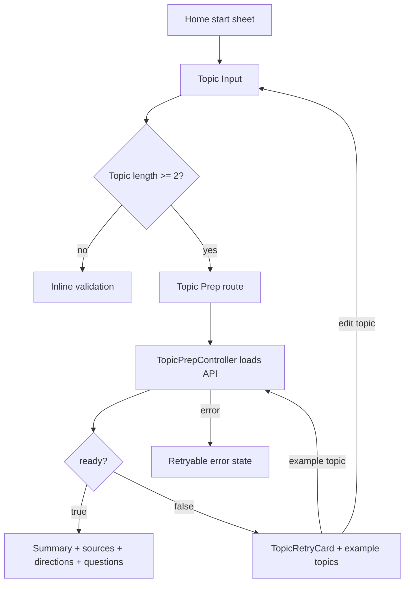

# Mobile Topic Prep Flow - Plan

## Goal Capsule

| Field | Value |
|---|---|
| Objective | Flutter 앱에서 Home의 자유 대화 시작을 Topic Input과 Topic Prep 화면까지 연결한다. |
| Scope | 주제 입력, 검색 준비 카드 호출, ready/low-quality/error UI, 방향과 첫 질문 선택까지 구현한다. |
| Authority | `docs/mobile-flow-spec.md`, 백엔드 `POST /api/search/topic-prep/` 계약, 기존 Flutter feature-first 구조를 따른다. |
| Stop conditions | Topic Prep 응답을 받은 뒤 첫 답변 입력과 conversation 생성은 후속 계획으로 남긴다. |
| Execution profile | 모바일 feature 구현이며 API, 상태, 화면, 라우팅, 테스트가 함께 변경된다. |

---

## Product Contract

### Summary

사용자는 Home에서 Free Chat을 선택한 뒤 관심 주제를 입력하고, 앱은 `POST /api/search/topic-prep/`로 검색 기반 준비 카드를 생성한다.
카드가 준비되면 요약, 출처, 대화 방향 4개, 선택 방향의 첫 질문 3개를 보여준다.
검색 품질이 낮으면 카드 대신 재입력 안내와 예시 topic을 제공한다.

### Problem Frame

Curitalk의 핵심 경험은 사용자가 직접 고른 관심사로 영어 대화를 시작하는 것이다.
현재 모바일 앱은 Home에서 대화 시작 sheet까지만 연결되어 있어 자유 대화의 실제 진입 경험이 끊겨 있다.
Topic Prep 화면은 검색 컨텍스트를 “읽을 정보”가 아니라 “말을 시작하는 질문”으로 바꾸는 첫 제품 가치 화면이다.

### Requirements

**Topic entry**

- R1. Home의 Free Chat 선택은 Topic Input 화면으로 이동해야 한다.
- R2. Topic Input은 사용자가 관심 주제를 입력하고 `Prepare`로 준비 카드 생성을 시작할 수 있어야 한다.
- R3. Topic Input은 2자 미만 topic에 대해 클라이언트 validation을 적용해야 한다.
- R4. Topic Input은 예시 topic chip을 제공하고, chip 선택 시 입력값을 빠르게 채울 수 있어야 한다.

**Topic prep result**

- R5. Topic Prep 화면은 진입 시 전달받은 topic으로 `POST /api/search/topic-prep/`를 호출해야 한다.
- R6. `ready=true` 응답은 summary, sources, directions, first questions를 표시해야 한다.
- R7. ready 화면은 `CASUAL_CHAT` 방향과 해당 방향의 첫 번째 질문을 기본 선택해야 한다.
- R8. 사용자는 방향 1개와 질문 1개를 선택할 수 있어야 한다.

**Recovery states**

- R9. `ready=false` 응답은 `TopicRetryCard`로 retry guidance를 표시해야 한다.
- R10. `example_topics`가 있으면 chip으로 보여주고, 선택 시 즉시 같은 화면에서 재검색해야 한다.
- R11. `Edit topic`은 기존 입력값을 보존해 Topic Input으로 돌아가야 한다.
- R12. API 오류는 retry 가능한 error state로 표시해야 한다.

**Scope**

- R13. 출처 링크는 이번 단계에서 화면에 표시하고 tap callback 구조만 연결하며 외부 브라우저 실행은 defer한다.
- R14. 첫 답변 입력, 자유 대화 생성, Conversation 화면 진입은 후속 작업으로 남긴다.

### Key Flows

- F1. **Free Chat topic preparation**
  - **Trigger:** 사용자가 Home start sheet에서 Free Chat을 선택한다.
  - **Steps:** Topic Input으로 이동한다 → topic을 입력한다 → `Prepare`를 누른다 → Topic Prep 화면에서 loading을 보여준다 → API 응답을 표시한다.
  - **Outcome:** 사용자는 대화 방향과 첫 질문을 선택할 수 있다.
  - **Covers:** R1, R2, R5, R6, R7, R8
- F2. **Low-quality recovery**
  - **Trigger:** Topic Prep API가 `ready=false`를 반환한다.
  - **Steps:** retry guidance를 표시한다 → 사용자가 `Edit topic` 또는 example topic을 선택한다.
  - **Outcome:** 사용자는 더 구체적인 topic으로 다시 준비 카드를 요청할 수 있다.
  - **Covers:** R9, R10, R11

### Acceptance Examples

- AE1. 사용자가 Home에서 Free Chat을 누르고 “최근 롯데 자이언츠 경기”를 입력하면 Topic Prep 화면에서 로딩 후 요약, 출처, 방향, 첫 질문이 표시된다.
- AE2. 사용자가 방향을 Debate로 바꾸면 Debate 방향의 첫 질문 3개가 표시되고 첫 번째 질문이 기본 선택된다.
- AE3. 사용자가 “A”처럼 2자 미만 topic을 입력하면 서버 요청 없이 Topic Input에서 validation 메시지를 본다.
- AE4. 검색 품질이 낮으면 Topic Retry 카드가 표시되고 example topic chip을 누르면 해당 topic으로 재검색한다.

---

## Planning Contract

### Key Technical Decisions

- KTD1. **API 호출은 Topic Prep 화면에서 실행한다:** `Prepare` 버튼은 topic을 query/path state로 넘기고, loading 상태는 Topic Prep 화면이 책임진다.
- KTD2. **Topic Input validation은 클라이언트에 둔다:** 백엔드도 최소 길이를 검증하지만, 2자 미만 입력은 UX상 즉시 안내하는 것이 낫다.
- KTD3. **Source link opening은 defer한다:** 이번 구현은 출처 표시와 tap callback 구조까지만 만들고, `url_launcher` 의존성은 외부 브라우저 실행이 필요한 시점에 추가한다.
- KTD4. **Direction 기본값은 Casual Chat이다:** 사용자가 별도 선택 없이도 가장 부담 없는 대화 방향으로 시작할 수 있게 한다.
- KTD5. **First question 기본값은 선택 방향의 첫 번째 질문이다:** 화면 진입 직후 CTA 활성화 조건을 단순하게 유지한다.
- KTD6. **Free Chat Start는 후속 단계로 분리한다:** 선택 결과를 모델로 보존하되 실제 첫 답변과 conversation 생성은 다음 구현에서 연결한다.

### High-Level Technical Design

### Scope Boundaries

**In scope**

- Topic Input 화면
- Topic Prep 화면
- Topic Prep API 모델, repository, controller
- Home Free Chat route 연결
- ready, low-quality, error, loading 상태
- 방향과 첫 질문 선택 상태
- 관련 widget/unit tests

**Deferred**

- `url_launcher`로 외부 출처 링크 열기
- Free Chat Start 화면
- `POST /api/conversations/start/free-chat/` 연동
- Conversation 화면과 메시지 목록 진입
- Topic Prep 결과 저장 또는 analytics

### Dependencies

- 백엔드 `POST /api/search/topic-prep/` 계약은 이미 존재한다.
- Flutter API 기반은 `ApiClient`, `ApiResponse`, `ApiException`, 인증 interceptor를 사용한다.
- 기존 위젯은 `AppTextField`, `AppPrimaryButton`, `AppSelectionChip`, `SourceLinkTile`, `TopicRetryCard`, `AppAsyncStateView`를 우선 재사용한다.

---

## Implementation Units

### U1. Topic Prep domain models

- **Goal:** 백엔드 topic prep 응답을 안전하게 파싱하는 Dart domain 모델을 추가한다.
- **Requirements:** R5, R6, R9, R10
- **Files:**
  - `mobile/lib/features/topic_prep/domain/topic_prep_result.dart`
  - `mobile/lib/features/topic_prep/domain/topic_prep_repository.dart`
  - `mobile/test/features/topic_prep/domain/topic_prep_result_test.dart`
- **Approach:** `ready`, `card`, `quality`, `retry_guidance`, `example_topics`를 모델링하고, nested `TopicPrepCard`, `TopicPrepDirection`, `TopicPrepQuality`, `SearchSource`를 파싱한다.
- **Patterns:** `mobile/lib/features/home/domain/conversation_summary.dart`
- **Test scenarios:**
  - ready 응답이 summary, sources, 4개 direction, 질문 3개를 파싱한다.
  - low-quality 응답이 `card=null`, retry guidance, example topics를 파싱한다.
  - 알 수 없는 direction 값은 명시적 파싱 오류로 처리한다.
  - 필수 card 필드가 누락된 ready 응답은 실패한다.

### U2. Topic Prep API repository and state

- **Goal:** `POST /api/search/topic-prep/` 호출과 Riverpod 상태를 추가한다.
- **Requirements:** R5, R6, R9, R10, R12
- **Files:**
  - `mobile/lib/features/topic_prep/data/api_topic_prep_repository.dart`
  - `mobile/lib/features/topic_prep/application/topic_prep_controller.dart`
  - `mobile/lib/features/topic_prep/topic_prep.dart`
  - `mobile/test/features/topic_prep/data/api_topic_prep_repository_test.dart`
  - `mobile/test/features/topic_prep/application/topic_prep_controller_test.dart`
- **Approach:** repository는 `ApiClient.post`로 `{ "topic": topic }`을 전송하고, controller는 topic별 loading/data/error 및 example topic 재검색을 관리한다.
- **Patterns:** `mobile/lib/features/home/data/api_home_repository.dart`, `mobile/lib/features/home/application/recent_conversations_controller.dart`
- **Test scenarios:**
  - repository가 올바른 endpoint와 body로 요청한다.
  - success envelope의 data를 `TopicPrepResult`로 변환한다.
  - controller가 초기 loading 후 ready data를 방출한다.
  - example topic 재검색 시 새 topic으로 다시 repository를 호출한다.
  - API 오류는 `AsyncError`로 노출된다.

### U3. Topic Input route and screen

- **Goal:** Home의 Free Chat 선택을 Topic Input 화면으로 연결하고 입력 UX를 구현한다.
- **Requirements:** R1, R2, R3, R4
- **Files:**
  - `mobile/lib/app/router/app_router.dart`
  - `mobile/lib/features/home/presentation/home_screen.dart`
  - `mobile/lib/features/topic_prep/presentation/topic_input_screen.dart`
  - `mobile/test/features/topic_prep/presentation/topic_input_screen_test.dart`
  - `mobile/test/app/app_test.dart`
- **Approach:** `/topic-input` route를 추가하고 `HomeScreen.onStartTypeSelected`에서 Free Chat 선택 시 이동한다. `AppTextField`와 예시 chip을 사용하며 2자 미만 입력은 inline validation으로 막는다.
- **Patterns:** `mobile/lib/features/home/presentation/home_screen.dart`, `mobile/lib/core/widgets/app_text_field.dart`
- **Test scenarios:**
  - Home에서 Free Chat 선택 시 Topic Input으로 이동한다.
  - topic이 비어 있거나 2자 미만이면 validation 메시지가 표시되고 API route로 이동하지 않는다.
  - example chip을 누르면 입력값이 채워진다.
  - 유효한 topic에서 `Prepare`를 누르면 Topic Prep route로 이동한다.

### U4. Topic Prep result screen

- **Goal:** Topic Prep 화면에서 ready, low-quality, loading, error 상태를 표시한다.
- **Requirements:** R6, R7, R8, R9, R10, R11, R12, R13, R14
- **Files:**
  - `mobile/lib/app/router/app_router.dart`
  - `mobile/lib/features/topic_prep/presentation/topic_prep_screen.dart`
  - `mobile/test/features/topic_prep/presentation/topic_prep_screen_test.dart`
- **Approach:** `/topic-prep` route는 topic을 받고 controller를 watch한다. ready 상태는 summary color block, `SourceLinkTile`, direction chips, question selection cards를 표시한다. low-quality는 `TopicRetryCard`와 example topic chips를 표시한다.
- **Patterns:** `mobile/lib/features/topic_prep/presentation/widgets/topic_retry_card.dart`, `mobile/lib/features/topic_prep/presentation/widgets/source_link_tile.dart`, `mobile/lib/core/widgets/app_selection_chip.dart`
- **Test scenarios:**
  - loading 상태에서 준비 중 메시지가 표시된다.
  - ready 상태에서 summary, source host, direction, 질문이 표시된다.
  - 초기 선택은 `CASUAL_CHAT`과 첫 번째 질문이다.
  - direction 선택 시 질문 목록이 해당 direction의 질문으로 바뀐다.
  - source tap은 현재 단계에서 외부 브라우저를 열지 않고 콜백만 처리한다.
  - low-quality 상태에서 retry guidance와 example topic chip이 표시된다.
  - `Edit topic`은 Topic Input으로 돌아간다.
  - error 상태에서 retry 버튼으로 같은 topic을 다시 호출한다.

### U5. Documentation and regression finish

- **Goal:** 모바일 문서와 테스트가 새 흐름의 범위와 후속 경계를 설명하게 한다.
- **Requirements:** R13, R14
- **Files:**
  - `mobile/README.md`
  - `.agent/architecture.md`
  - `docs/mobile-flow-spec.md`
  - `.agent/_coordination/CHANGELOG.md`
- **Approach:** 모바일 구조와 앱 시작 이후 흐름에 Topic Input/Topic Prep 상태를 추가하고, 외부 링크 열기와 Free Chat Start가 후속 작업임을 명시한다.
- **Patterns:** 최근 모바일 auth flow 문서화 방식
- **Test scenarios:**
  - 문서 변경 단위라 별도 테스트는 없다.
  - `flutter analyze --no-pub`와 관련 widget/model/controller 테스트가 문서화한 범위를 검증한다.

---

## Verification Contract

| Gate | Command | Proves |
|---|---|---|
| Formatting | `dart format lib test` from `mobile/` | Flutter 코드 스타일이 유지된다. |
| Static analysis | `flutter analyze --no-pub` from `mobile/` | 라우팅, Riverpod, 모델 코드가 analyzer 기준을 통과한다. |
| Domain tests | `flutter test --no-pub test/features/topic_prep/domain test/features/topic_prep/data test/features/topic_prep/application` from `mobile/` | 모델, repository, controller 동작이 검증된다. |
| Widget tests | `flutter test --no-pub test/features/topic_prep/presentation test/app/app_test.dart` from `mobile/` | Topic Input/Prep 화면과 Home route 연결이 검증된다. |
| Diff hygiene | `git diff --check` | whitespace 오류가 없다. |

---

## Definition of Done

- D1. Home의 Free Chat 선택이 Topic Input으로 이동한다.
- D2. Topic Input은 2자 미만 validation과 예시 chip을 제공한다.
- D3. Topic Prep 화면은 `POST /api/search/topic-prep/` 결과의 loading, ready, low-quality, error 상태를 표현한다.
- D4. Ready 상태는 summary, sources, 4개 directions, 선택 direction의 질문 3개를 보여준다.
- D5. 기본 선택은 `CASUAL_CHAT`과 첫 번째 질문이다.
- D6. Low-quality 상태는 retry guidance, example topic 재검색, edit topic 복귀를 제공한다.
- D7. 출처 링크는 표시되지만 외부 브라우저 실행은 구현하지 않는다.
- D8. Free Chat Start와 conversation 생성은 구현하지 않는다.
- D9. 관련 테스트와 `flutter analyze --no-pub`, `git diff --check`가 통과한다.
- D10. 실험 중 남은 임시 코드, dead code, 불필요한 debug 출력이 없다.
