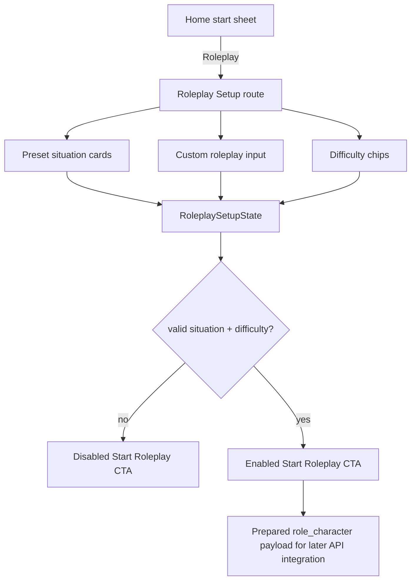

# Mobile Roleplay Setup Flow - Plan

## Goal Capsule

| Field | Value |
|---|---|
| Objective | Flutter 앱에서 Home의 Roleplay 선택을 Roleplay Setup 화면으로 연결하고, 상황과 난이도 선택 UX를 구현한다. |
| Scope | preset 상황 선택, custom 상황 입력, 난이도 선택, Start Roleplay CTA 활성 조건, 라우팅 연결, 테스트 계획까지 포함한다. |
| Authority | `docs/mobile-flow-spec.md`, `README.md`의 `POST /api/conversations/start/roleplay/` 계약, 기존 Flutter feature-first 구조를 따른다. |
| Stop conditions | 실제 `POST /api/conversations/start/roleplay/` 호출과 Conversation 화면 이동은 Conversation 화면 구현 단계로 남긴다. |
| Execution profile | 모바일 화면 구현이며 route, presentation state, reusable widget 조합, widget test가 함께 변경된다. |

---

## Product Contract

### Summary

사용자는 Home의 Start Conversation sheet에서 Roleplay를 선택한 뒤 상황과 난이도를 고른다.
앱은 preset 상황을 빠르게 선택할 수 있게 제공하고, 원하는 상황이 없으면 custom 입력으로 직접 롤플레이 상황을 만들 수 있게 한다.
사용자가 상황과 난이도를 모두 선택하면 Start Roleplay CTA가 활성화되고, 선택 결과는 후속 Conversation 시작 연동에 사용할 수 있는 형태로 보존한다.

### Problem Frame

Curitalk의 Roleplay는 정해진 교재식 상황을 강요하기보다 사용자가 실제로 필요하거나 흥미 있는 상황을 빠르게 고르게 해야 한다.
현재 Home에는 Roleplay 선택지가 있지만 route가 연결되어 있지 않아 사용자가 롤플레이 흐름에 진입할 수 없다.
Roleplay Setup은 “무슨 상황을 연습할지”와 “얼마나 어렵게 대화할지”를 부담 없이 결정하게 만드는 대화 시작 전 단계다.

### Requirements

**Roleplay entry**

- R1. Home start sheet에서 Roleplay를 선택하면 Roleplay Setup 화면으로 이동해야 한다.
- R2. Roleplay Setup은 뒤로가기와 title을 제공해 사용자가 Home으로 자연스럽게 돌아갈 수 있어야 한다.

**Preset situation selection**

- R3. 화면은 preset 상황 카드 목록을 제공해야 한다.
- R4. preset 후보는 `Cafe order`, `Hotel check-in`, `Airport immigration`, `Job interview`, `Meeting small talk`, `Friend conversation`, `Meeting opinion`을 기본으로 한다.
- R5. 사용자가 preset 상황을 선택하면 다른 preset과 custom 입력 선택은 해제되어야 한다.

**Custom situation input**

- R6. 사용자는 원하는 상황이 없을 때 custom 입력 모드로 전환할 수 있어야 한다.
- R7. custom 입력은 2자 이상일 때만 유효해야 한다.
- R8. custom 입력이 유효해지면 preset 선택 없이도 Start Roleplay CTA 활성 조건을 만족할 수 있어야 한다.

**Difficulty selection**

- R9. 화면은 `Easy`, `Normal`, `Challenge` 난이도 chip을 제공해야 한다.
- R10. 각 난이도는 짧은 설명을 함께 제공해 사용자가 차이를 이해할 수 있어야 한다.
- R11. 기본 난이도는 `Normal`로 둔다.

**Start readiness**

- R12. Start Roleplay CTA는 유효한 상황과 난이도가 모두 있을 때만 활성화되어야 한다.
- R13. 이번 단계의 Start Roleplay는 실제 API 호출을 하지 않고 후속 Conversation 연결을 위한 선택 payload 생성 지점까지만 구현한다.
- R14. 선택 payload는 현재 백엔드 계약에 맞게 `role_character` 문자열로 합성 가능해야 한다.

### Key Flows

- F1. **Preset roleplay setup**
  - **Trigger:** 사용자가 Home start sheet에서 Roleplay를 선택한다.
  - **Steps:** Roleplay Setup으로 이동한다 → preset 상황을 선택한다 → 난이도를 확인하거나 변경한다 → Start Roleplay CTA가 활성화된다.
  - **Outcome:** 앱은 후속 API 호출에 사용할 `role_character` 후보를 만들 수 있다.
  - **Covers:** R1, R3, R4, R5, R9, R11, R12, R14
- F2. **Custom roleplay setup**
  - **Trigger:** 사용자가 원하는 상황이 preset에 없다고 판단한다.
  - **Steps:** custom 입력 모드를 연다 → 상황을 2자 이상 입력한다 → 난이도를 선택한다 → Start Roleplay CTA가 활성화된다.
  - **Outcome:** 사용자는 직접 정의한 상황으로 롤플레이 시작 준비를 마친다.
  - **Covers:** R6, R7, R8, R9, R12, R14

### Acceptance Examples

- AE1. 사용자가 Home에서 Roleplay를 누르면 Roleplay Setup 화면으로 이동하고 preset 카드가 표시된다.
- AE2. 사용자가 `Cafe order`를 선택하면 카드가 selected 상태가 되고 Start Roleplay CTA가 활성화된다.
- AE3. 사용자가 난이도를 `Challenge`로 바꾸면 `Challenge` chip이 selected 상태가 된다.
- AE4. 사용자가 custom 입력 모드를 열고 “오사카 식당에서 예약 확인하기”를 입력하면 Start Roleplay CTA가 활성화된다.
- AE5. custom 입력이 2자 미만이면 validation 메시지가 표시되고 Start Roleplay CTA는 비활성 상태를 유지한다.

---

## Planning Contract

### Key Technical Decisions

- KTD1. **이번 구현은 setup 화면까지만 연결한다:** Conversation 화면과 message list가 아직 없으므로 실제 roleplay API 호출은 후속 Conversation 구현에서 연결한다.
- KTD2. **난이도는 클라이언트 선택 상태로 관리한다:** 현재 백엔드 `StartRoleplayRequest`는 `role_character`와 `search_context`만 받으므로 별도 API 필드를 추가하지 않는다.
- KTD3. **난이도는 `role_character` 합성에 반영 가능하게 둔다:** 후속 API 연동 시 “a cafe barista who uses easy, short questions”처럼 prompt-friendly 문자열로 만들 수 있게 모델을 설계한다.
- KTD4. **기본 난이도는 Normal이다:** 사용자가 별도 선택 없이도 자연스러운 일반 대화로 시작할 수 있게 한다.
- KTD5. **custom 입력 validation은 2자 이상이다:** Topic Input과 같은 최소 입력 기준을 적용해 지나치게 빈약한 상황 설명을 막는다.
- KTD6. **preset과 custom은 상호 배타적이다:** 하나의 `role_character`만 생성되도록 상태를 단순하게 유지한다.

### High-Level Technical Design

### Scope Boundaries

**In scope**

- `/roleplay-setup` route
- Home Roleplay 선택 연결
- Roleplay Setup 화면
- preset 상황 카드 선택
- custom 입력 모드와 2자 validation
- `Easy`, `Normal`, `Challenge` 난이도 선택
- 선택 상태와 `role_character` 합성 helper
- 관련 widget/unit tests
- 모바일 문서 동기화

**Deferred**

- `POST /api/conversations/start/roleplay/` 실제 호출
- Conversation 화면 이동
- AI 첫 인사 표시
- roleplay difficulty를 백엔드 schema에 별도 필드로 추가
- roleplay 상황별 검색 컨텍스트 생성
- roleplay setup analytics

### Dependencies

- 백엔드 `POST /api/conversations/start/roleplay/`는 `role_character`, `search_context`를 받는다.
- Flutter route 관리는 `mobile/lib/app/router/app_router.dart`의 `go_router` 구조를 따른다.
- 화면 구조는 `AppScaffold`, `AppSelectionCard`, `AppSelectionChip`, `AppTextField`, `AppPrimaryButton`을 재사용한다.
- 디자인 기준은 `docs/design/DESIGN_SYSTEM.md`와 `docs/design/stitch_design/roleplay_setup/`, `docs/design/stitch_design/roleplay_custom/` 산출물을 따른다.

---

## Implementation Units

### U1. Roleplay setup domain model

- **Goal:** 화면 선택 상태와 후속 API 연동에 필요한 roleplay setup 모델을 정의한다.
- **Requirements:** R4, R9, R10, R11, R14
- **Files:**
  - `mobile/lib/features/roleplay_setup/domain/roleplay_scenario.dart`
  - `mobile/lib/features/roleplay_setup/domain/roleplay_difficulty.dart`
  - `mobile/lib/features/roleplay_setup/domain/roleplay_setup_payload.dart`
  - `mobile/test/features/roleplay_setup/domain/roleplay_setup_payload_test.dart`
- **Approach:** preset scenario, custom scenario, difficulty를 분리 모델링하고 `role_character` 합성 helper를 제공한다.
- **Patterns:** `mobile/lib/features/topic_prep/domain/topic_prep_result.dart`, `mobile/lib/features/home/domain/conversation_summary.dart`
- **Test scenarios:**
  - preset scenario와 `Normal` 난이도가 backend-ready `role_character` 문자열로 합성된다.
  - `Easy` 난이도는 짧고 쉬운 질문 의도를 포함하는 문자열로 합성된다.
  - `Challenge` 난이도는 예상 밖 질문과 긴 답변 유도 의도를 포함하는 문자열로 합성된다.
  - custom scenario는 trim된 입력값으로 합성된다.
  - 2자 미만 custom 입력은 invalid로 판단된다.

### U2. Roleplay setup presentation state

- **Goal:** preset/custom/difficulty 선택 상태와 CTA 활성 조건을 관리한다.
- **Requirements:** R5, R6, R7, R8, R11, R12
- **Files:**
  - `mobile/lib/features/roleplay_setup/application/roleplay_setup_controller.dart`
  - `mobile/lib/features/roleplay_setup/roleplay_setup.dart`
  - `mobile/test/features/roleplay_setup/application/roleplay_setup_controller_test.dart`
- **Approach:** Riverpod controller 또는 local state controller로 선택 상태를 관리한다. 상태 전환이 화면과 테스트에서 명확해야 하므로 business rule은 controller에 둔다.
- **Patterns:** `mobile/lib/features/topic_prep/application/topic_prep_controller.dart`, `mobile/lib/features/onboarding/application/onboarding_controller.dart`
- **Test scenarios:**
  - 초기 상태는 preset 미선택, custom 비활성, difficulty `Normal`이다.
  - preset을 선택하면 custom 입력 상태가 해제된다.
  - custom 모드를 열면 preset 선택이 해제된다.
  - custom 입력이 2자 이상이면 valid 상태가 된다.
  - difficulty 변경이 state에 반영된다.
  - 상황이 없으면 CTA readiness가 false다.

### U3. Roleplay setup route and Home connection

- **Goal:** Home Roleplay 선택을 Roleplay Setup 화면으로 연결한다.
- **Requirements:** R1, R2
- **Files:**
  - `mobile/lib/app/router/app_router.dart`
  - `mobile/lib/features/home/presentation/home_screen.dart`
  - `mobile/test/app/app_test.dart`
  - `mobile/test/features/home/presentation/home_screen_test.dart`
- **Approach:** `AppRoute.roleplaySetup`을 추가하고 Home의 `ConversationStartType.roleplay` 선택 시 해당 route로 이동한다.
- **Patterns:** `AppRoute.topicInput`, `HomeScreen.onStartTypeSelected`
- **Test scenarios:**
  - Home start sheet에서 Roleplay를 선택하면 `/roleplay-setup`으로 이동한다.
  - 인증 redirect가 완료된 사용자만 Roleplay Setup에 접근할 수 있다.
  - Roleplay Setup의 back action은 Home으로 돌아간다.

### U4. Roleplay setup screen

- **Goal:** Stitch 산출물과 모바일 디자인 시스템을 반영한 Roleplay Setup 화면을 구현한다.
- **Requirements:** R2, R3, R4, R6, R7, R8, R9, R10, R12, R13
- **Files:**
  - `mobile/lib/features/roleplay_setup/presentation/roleplay_setup_screen.dart`
  - `mobile/lib/features/roleplay_setup/presentation/widgets/roleplay_scenario_card.dart`
  - `mobile/lib/features/roleplay_setup/presentation/widgets/roleplay_difficulty_chip.dart`
  - `mobile/test/features/roleplay_setup/presentation/roleplay_setup_screen_test.dart`
- **Approach:** `AppScaffold` 위에 headline, helper copy, preset card list, custom toggle/input, difficulty chips, bottom CTA를 구성한다. Start Roleplay CTA는 이번 단계에서 준비 상태만 검증하고 실제 API 호출은 하지 않는다.
- **Patterns:** `mobile/lib/features/topic_prep/presentation/topic_input_screen.dart`, `mobile/lib/core/widgets/app_selection_card.dart`, `mobile/lib/core/widgets/app_text_field.dart`
- **Test scenarios:**
  - preset 7개가 화면에 표시된다.
  - preset card 선택 시 selected state가 표시된다.
  - custom 입력 모드에서 2자 미만 입력 시 validation 메시지가 표시된다.
  - custom 입력이 유효하면 preset 없이 CTA가 활성화된다.
  - difficulty chip 선택 상태가 화면에 반영된다.
  - Start Roleplay CTA는 상황이 없으면 disabled, 상황이 있으면 enabled다.

### U5. Documentation sync

- **Goal:** 구현된 Roleplay Setup 범위와 defer된 API 연결 범위를 문서에 반영한다.
- **Requirements:** R13, R14
- **Files:**
  - `mobile/README.md`
  - `.agent/architecture.md`
- **Approach:** 모바일 현재 흐름에 `Home → Roleplay Setup` 연결을 추가하고, 실제 roleplay conversation start는 후속 단계로 남긴다고 명시한다.
- **Patterns:** Topic Prep 구현 후 문서 반영 방식
- **Test scenarios:**
  - 문서가 현재 구현 범위를 과장하지 않는다.
  - API 호출이 아직 연결되지 않았다는 defer boundary가 명확하다.

---

## Verification Contract

### Required Checks

- `dart format lib test`
- `flutter test`
- `flutter analyze --no-pub`

### Feature Test Matrix

| Scenario | Expected result | Coverage |
|---|---|---|
| Home에서 Roleplay 선택 | Roleplay Setup route로 이동 | U3 |
| 초기 Roleplay Setup | preset 7개, difficulty `Normal`, disabled CTA | U2, U4 |
| preset 선택 | 선택 카드 표시, CTA enabled | U2, U4 |
| difficulty 변경 | 선택 chip이 변경됨 | U2, U4 |
| custom 입력 1자 | validation 표시, CTA disabled | U2, U4 |
| custom 입력 2자 이상 | CTA enabled, preset 해제 | U2, U4 |
| payload 합성 | backend-ready `role_character` 생성 | U1 |

### Manual QA

- Stitch `roleplay_setup`과 `roleplay_custom` 화면의 정보 구조가 Flutter 화면에 반영됐는지 확인한다.
- 작은 화면에서 preset 목록과 bottom CTA가 겹치지 않는지 확인한다.
- keyboard가 custom 입력창을 가릴 때 scroll로 회피 가능한지 확인한다.

---

## Definition of Done

- Home의 Roleplay 선택이 Roleplay Setup 화면으로 이동한다.
- Roleplay Setup에서 preset 상황과 custom 상황 중 하나를 선택할 수 있다.
- custom 입력은 2자 이상 validation을 적용한다.
- 난이도는 `Easy`, `Normal`, `Challenge` 중 하나를 선택할 수 있고 기본값은 `Normal`이다.
- Start Roleplay CTA는 유효한 상황이 있을 때만 활성화된다.
- 후속 API 연동에 사용할 `role_character` 합성 helper가 테스트로 검증된다.
- `mobile/README.md`와 `.agent/architecture.md`가 현재 구현 범위와 defer boundary를 설명한다.
- Required Checks가 통과한다.
