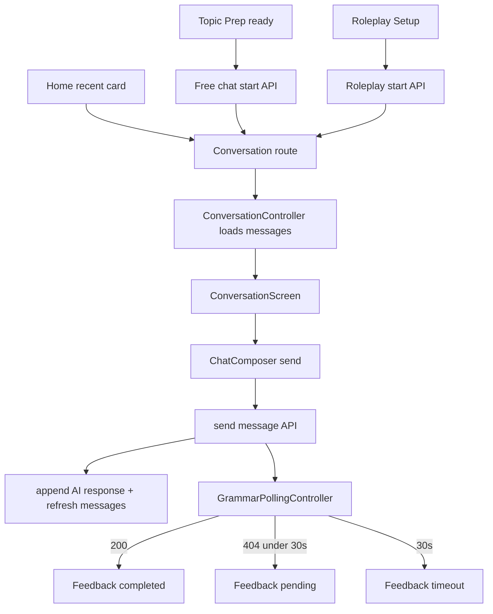

# Mobile Conversation Flow - Plan

## Goal Capsule

| Field | Value |
|---|---|
| Objective | Flutter 앱에서 자유 대화와 롤플레이가 실제 Conversation 화면으로 합류하고, 메시지 전송과 문법 피드백 polling을 동작하게 한다. |
| Scope | Free Chat 시작 입력, Roleplay 시작 API, 최근 대화 진입, 메시지 목록, 메시지 전송, grammar feedback polling, 상태별 UI와 테스트를 포함한다. |
| Authority | `docs/mobile-flow-spec.md`, `docs/DSL.md`, `README.md`의 Conversation·Grammar API 계약, 기존 Flutter feature-first 구조를 따른다. |
| Stop conditions | 학습 통계 화면, SSE 기반 피드백, 음성 입력, 대화 제목 수정·삭제 UI, analytics는 후속 작업으로 남긴다. |
| Execution profile | 모바일 핵심 flow 구현이며 API 모델, repository, Riverpod state, routing, 화면, polling, 테스트가 함께 변경된다. |

---

## Product Contract

### Summary

사용자는 Topic Prep에서 선택한 첫 질문에 답하거나 Roleplay Setup에서 상황을 고른 뒤 실제 대화를 시작한다.
Conversation 화면은 기존 메시지를 시간순으로 보여주고, 사용자가 영어 메시지를 보내면 AI 응답을 표시한다.
사용자 메시지 아래에는 문법 피드백 polling 상태를 `checking`, `Looks natural`, 교정 카드, timeout으로 보여준다.

### Problem Frame

현재 모바일 앱은 Topic Prep과 Roleplay Setup까지 준비 경험은 있지만, 실제 대화 화면으로 이어지지 않는다.
Curitalk의 핵심 가치는 관심사와 상황을 바탕으로 영어를 말하고, 부담 없는 피드백을 바로 확인하는 데 있다.
Conversation 흐름은 준비 카드·롤플레이 선택을 “실제 말하기 연습”으로 전환하는 첫 end-to-end 제품 경험이다.

### Requirements

**Conversation entry**

- R1. Topic Prep ready 화면은 선택한 첫 질문에 답변하는 입력 영역을 제공해야 한다.
- R2. Free Chat 시작은 `POST /api/conversations/start/free-chat/`에 `first_message`, `search_context`, `topic`, `conversation_direction`, `selected_question`을 보내야 한다.
- R3. Roleplay Setup의 Start Roleplay는 `POST /api/conversations/start/roleplay/`에 합성된 `role_character`와 `search_context=null`을 보내야 한다.
- R4. Free Chat 또는 Roleplay 시작 성공 시 `/conversation/:conversationId`로 이동해야 한다.
- R5. Home 최근 대화 카드를 누르면 `/conversation/:conversationId`로 이동해야 한다.

**Conversation screen**

- R6. Conversation 화면은 `GET /api/conversations/{id}/messages/`로 메시지를 시간순으로 불러와야 한다.
- R7. user·assistant 메시지는 기존 `ChatBubble`을 사용해 좌우 정렬과 semantic color를 유지해야 한다.
- R8. 메시지 목록 loading, empty, error 상태를 표시해야 한다.
- R9. 메시지 전송 중에는 composer를 잠그고 `TypingIndicator`를 표시해야 한다.
- R10. 메시지 전송 실패 시 사용자가 같은 메시지를 다시 보낼 수 있어야 한다.

**Message sending**

- R11. 사용자가 메시지를 보내면 `POST /api/conversations/{conversation_id}/message/`를 호출해야 한다.
- R12. 빈 메시지는 `ChatComposer`에서 차단해야 한다.
- R13. 전송 성공 시 사용자 메시지와 AI 응답을 화면에 반영해야 한다.
- R14. 서버 canonical 메시지 목록과 동기화하기 위해 전송 성공 후 메시지 목록을 다시 불러와야 한다.

**Grammar feedback polling**

- R15. Free Chat 시작 응답의 `message_id`와 메시지 전송 응답의 `message_id`는 사용자 메시지 ID로 보고 grammar polling을 시작해야 한다.
- R16. Roleplay 시작 응답의 `message_id`는 AI 첫 인사 ID이므로 grammar polling을 시작하지 않아야 한다.
- R17. grammar polling은 `GET /api/grammar/message/{message_id}/`를 2초 간격으로 최대 30초 동안 호출해야 한다.
- R18. polling 중 `404`는 pending으로 처리하고, 30초가 지나면 timeout 상태로 전환해야 한다.
- R19. `200` 응답의 `has_errors=false`는 사용자 메시지 아래 `NaturalFeedbackBadge`로 표시해야 한다.
- R20. `200` 응답의 `has_errors=true`는 `GrammarFeedbackCard`로 corrected text와 error explanation을 표시해야 한다.
- R21. 이미 `GET /messages/` 응답에 `grammar_feedback`이 포함된 메시지는 polling 없이 completed 상태로 표시해야 한다.

**Scope**

- R22. SSE endpoint는 이번 구현에서 사용하지 않는다.
- R23. voice input 버튼은 기존 컴포넌트 구조만 유지하고 실제 녹음 기능은 연결하지 않는다.
- R24. pagination은 v1에서 최근 50개 메시지 로드로 시작하고 infinite scroll은 후속 작업으로 둔다.

### Key Flows

- F1. **Free Chat start**
  - **Trigger:** 사용자가 Topic Prep ready 화면에서 첫 질문에 대한 답변을 제출한다.
  - **Steps:** start API 호출 → Conversation route 이동 → 메시지 목록 또는 bootstrap 메시지 표시 → 사용자 첫 메시지 grammar polling 시작.
  - **Outcome:** 사용자는 관심사 기반 자유 대화를 이어갈 수 있다.
  - **Covers:** R1, R2, R4, R15, R17
- F2. **Roleplay start**
  - **Trigger:** 사용자가 Roleplay Setup에서 상황과 난이도를 선택하고 Start Roleplay를 누른다.
  - **Steps:** roleplay start API 호출 → Conversation route 이동 → AI 첫 인사 표시 → 사용자가 답변을 입력한다.
  - **Outcome:** 사용자는 선택한 상황의 롤플레이 대화를 시작한다.
  - **Covers:** R3, R4, R16
- F3. **Continue conversation**
  - **Trigger:** 사용자가 Conversation 화면에서 메시지를 보낸다.
  - **Steps:** local pending user message 표시 → send API 호출 → AI 응답 표시 → canonical 메시지 refresh → grammar polling 시작.
  - **Outcome:** 사용자는 AI와 턴 단위 대화를 이어가고 피드백을 받는다.
  - **Covers:** R9, R10, R11, R13, R14, R17
- F4. **Open recent conversation**
  - **Trigger:** 사용자가 Home의 최근 대화 카드를 누른다.
  - **Steps:** Conversation route 이동 → 기존 메시지 목록 로드 → 포함된 grammar feedback 표시.
  - **Outcome:** 사용자는 이전 대화를 다시 이어갈 수 있다.
  - **Covers:** R5, R6, R21

### Acceptance Examples

- AE1. 사용자가 Topic Prep에서 “I think the pitcher was amazing.”을 제출하면 free-chat conversation이 생성되고 Conversation 화면으로 이동한다.
- AE2. 사용자가 Roleplay Setup에서 `Cafe order`와 `Challenge`를 선택하고 시작하면 AI의 첫 인사가 assistant bubble로 표시된다.
- AE3. 사용자가 Conversation에서 “I was surprise by the ending.”을 보내면 AI 응답 후 해당 user bubble 아래에 grammar checking 상태가 표시된다.
- AE4. grammar polling이 `has_errors=true`를 반환하면 “I was surprised by the ending.” 교정 카드가 표시된다.
- AE5. grammar polling이 30초 동안 계속 `404`이면 timeout 안내가 사용자 메시지 아래에 표시된다.
- AE6. Home 최근 대화를 누르면 기존 메시지가 시간순으로 표시되고 대화를 이어갈 수 있다.

---

## Planning Contract

### Key Technical Decisions

- KTD1. **Conversation route는 `/conversation/:conversationId`로 둔다:** start flow와 recent conversation 모두 같은 화면으로 합류하게 한다.
- KTD2. **Free Chat 첫 답변 입력은 Topic Prep ready 화면 하단에 둔다:** 사용자가 선택한 첫 질문에 바로 답하며 대화를 시작할 수 있다.
- KTD3. **Roleplay Start는 현재 Setup 화면에서 실제 API 호출까지 연결한다:** Roleplay는 별도 첫 사용자 답변 없이 AI가 먼저 인사하는 서버 계약을 따른다.
- KTD4. **전송 성공 후 canonical messages를 refresh한다:** start/send 응답에는 assistant message id가 없으므로 서버 목록을 다시 불러와 local 상태와 동기화한다.
- KTD5. **응답 대기 중에는 optimistic user bubble과 TypingIndicator를 보여준다:** 대기 시간이 길어도 사용자가 앱이 반응했다고 느끼게 한다.
- KTD6. **Grammar polling은 사용자 메시지 단위 controller로 분리한다:** Conversation 전체 상태와 피드백 polling 상태가 서로 과도하게 결합되지 않게 한다.
- KTD7. **Polling 정책은 2초 간격, 최대 30초다:** 서버 백그라운드 문법 검사 지연을 흡수하되 사용자가 무한 대기하지 않게 한다.
- KTD8. **Recent conversation은 메시지 목록만 로드한다:** 추가 대화 메타 조회는 title이나 status가 화면에 필요해질 때 도입한다.

### High-Level Technical Design

### Scope Boundaries

**In scope**

- Conversation API models and repository
- Grammar feedback models and polling repository
- Topic Prep first-answer composer and free-chat start
- Roleplay start API from Roleplay Setup
- Home recent conversation route connection
- Conversation screen with messages, composer, typing state, send error retry
- User-message grammar feedback pending/completed/timeout UI
- Focused unit/widget/flow tests
- `mobile/README.md` and `.agent/architecture.md` sync

**Deferred**

- SSE grammar feedback
- Voice recording
- Message pagination beyond initial 50
- Conversation title update, delete, end conversation UI
- Offline queueing
- Push notifications or background polling
- Learning statistics screen

### Dependencies

- Existing API client, token refresh, envelope parsing, and secure storage are reused.
- Existing `ChatBubble`, `ChatComposer`, `TypingIndicator`, `GrammarFeedbackCard`, `NaturalFeedbackBadge` are reused.
- `TopicPrepResult` directions provide `search_context`, `topic`, `conversation_direction`, and `selected_question` inputs for free-chat start.
- `RoleplaySetupPayload.roleCharacter` provides the backend `role_character` input.
- Backend returns `PaginatedMessages` in `created_at asc` order and may include `grammar_feedback`.

### Risks and Mitigations

- **R1. 404 ambiguity in grammar polling:** 404 can mean pending, missing message, or ownership failure. Mitigate by timing out after 30 seconds and showing non-technical timeout copy.
- **R2. Duplicate messages after optimistic update:** start/send flows may show local bubbles before canonical refresh. Mitigate by replacing local state with server messages after refresh.
- **R3. Full suite pre-existing auth timeout:** current `flutter test` may fail on unrelated auth restore timeout. Mitigate by running focused Conversation tests and `flutter analyze --no-pub`, and recording full-suite status separately.

---

## Implementation Units

### U1. Conversation and grammar domain models

- **Goal:** Conversation, message, response, pagination, grammar feedback payload를 Dart 모델로 파싱한다.
- **Requirements:** R6, R13, R19, R20, R21
- **Files:**
  - `mobile/lib/features/conversation/domain/conversation_models.dart`
  - `mobile/lib/features/conversation/domain/grammar_feedback.dart`
  - `mobile/test/features/conversation/domain/conversation_models_test.dart`
- **Approach:** `ConversationMessage`, `ConversationResponse`, `MessageResponse`, `PaginatedMessages`, `GrammarFeedback`, `GrammarError`를 추가한다. 서버 enum 값 `user`, `assistant`, `system`은 existing `ChatSpeaker`와 별도 domain enum으로 둔다.
- **Patterns:** `mobile/lib/features/home/domain/conversation_summary.dart`, `mobile/lib/features/topic_prep/domain/topic_prep_result.dart`
- **Test scenarios:**
  - start response가 `conversation_id`, user `message_id`, AI `response`를 파싱한다.
  - message list가 `created_at`, role, content, nested grammar feedback을 파싱한다.
  - `has_errors=false` feedback과 빈 errors 목록을 파싱한다.
  - 알 수 없는 message role은 format exception으로 처리한다.

### U2. Conversation and grammar repositories

- **Goal:** Conversation 시작, 메시지 목록, 메시지 전송, grammar feedback polling API 접근을 추가한다.
- **Requirements:** R2, R3, R6, R11, R17, R18
- **Files:**
  - `mobile/lib/features/conversation/domain/conversation_repository.dart`
  - `mobile/lib/features/conversation/data/api_conversation_repository.dart`
  - `mobile/lib/features/conversation/domain/grammar_feedback_repository.dart`
  - `mobile/lib/features/conversation/data/api_grammar_feedback_repository.dart`
  - `mobile/test/features/conversation/data/api_conversation_repository_test.dart`
  - `mobile/test/features/conversation/data/api_grammar_feedback_repository_test.dart`
- **Approach:** `ApiClient`를 통해 `conversations/start/free-chat/`, `conversations/start/roleplay/`, `conversations/{id}/messages/`, `conversations/{id}/message/`, `grammar/message/{id}/`를 호출한다. Grammar 404는 repository에서 pending exception 또는 typed result로 구분해 controller가 timeout 정책을 적용하게 한다.
- **Patterns:** `mobile/lib/features/topic_prep/data/api_topic_prep_repository.dart`, `mobile/lib/features/home/data/api_home_repository.dart`
- **Test scenarios:**
  - free-chat start가 선택 topic metadata를 body로 보낸다.
  - roleplay start가 `role_character`와 `search_context=null`을 body로 보낸다.
  - send message가 conversation id path와 message body를 사용한다.
  - grammar feedback 200은 completed feedback을 반환한다.
  - grammar feedback 404는 pending 상태로 변환된다.

### U3. Free Chat start from Topic Prep

- **Goal:** Topic Prep ready 화면에서 사용자의 첫 답변을 받아 free-chat conversation을 생성한다.
- **Requirements:** R1, R2, R4, R15
- **Files:**
  - `mobile/lib/features/topic_prep/presentation/topic_prep_screen.dart`
  - `mobile/lib/features/conversation/application/start_conversation_controller.dart`
  - `mobile/test/features/topic_prep/presentation/topic_prep_screen_test.dart`
  - `mobile/test/features/conversation/application/start_conversation_controller_test.dart`
- **Approach:** ready view 하단의 disabled `START ANSWERING`을 `ChatComposer` 또는 `AppTextField + AppPrimaryButton` 기반 답변 입력으로 교체한다. 제출 시 선택 direction/question/card metadata로 start controller를 호출하고 성공하면 Conversation route로 이동한다.
- **Patterns:** `mobile/lib/features/topic_prep/presentation/topic_prep_screen.dart`, `mobile/lib/features/conversation/presentation/widgets/chat_composer.dart`
- **Test scenarios:**
  - 답변이 비어 있으면 start API를 호출하지 않는다.
  - 선택 direction과 selected question이 request body에 포함된다.
  - start 성공 시 `/conversation/:conversationId`로 이동한다.
  - start 실패 시 retry 가능한 error copy를 표시한다.

### U4. Roleplay start from setup

- **Goal:** Roleplay Setup의 Start Roleplay CTA를 실제 roleplay start API로 연결한다.
- **Requirements:** R3, R4, R16
- **Files:**
  - `mobile/lib/features/roleplay_setup/presentation/roleplay_setup_screen.dart`
  - `mobile/lib/features/roleplay_setup/application/roleplay_setup_controller.dart`
  - `mobile/test/features/roleplay_setup/presentation/roleplay_setup_screen_test.dart`
  - `mobile/test/features/roleplay_setup/application/roleplay_setup_controller_test.dart`
- **Approach:** 현재 snackbar placeholder를 제거하고 start controller를 호출한다. 성공 시 Conversation route로 이동하고, roleplay 시작 응답은 AI greeting bootstrap으로만 취급하며 grammar polling을 시작하지 않는다.
- **Patterns:** `mobile/lib/features/roleplay_setup/presentation/roleplay_setup_screen.dart`
- **Test scenarios:**
  - preset payload로 roleplay start API가 호출된다.
  - custom payload로 roleplay start API가 호출된다.
  - 시작 중 CTA는 loading/disabled 상태가 된다.
  - 성공 시 Conversation route로 이동한다.
  - 실패 시 같은 선택으로 재시도할 수 있다.

### U5. Conversation controller and grammar polling

- **Goal:** 메시지 목록, 전송 상태, AI 응답 상태, grammar feedback polling 상태를 관리한다.
- **Requirements:** R6, R8, R9, R10, R11, R13, R14, R15, R17, R18, R21
- **Files:**
  - `mobile/lib/features/conversation/application/conversation_controller.dart`
  - `mobile/lib/features/conversation/application/grammar_feedback_polling_controller.dart`
  - `mobile/test/features/conversation/application/conversation_controller_test.dart`
  - `mobile/test/features/conversation/application/grammar_feedback_polling_controller_test.dart`
- **Approach:** Conversation controller는 초기 메시지 로드와 send를 담당한다. Send 시 local pending user message와 typing state를 표시하고, 성공 후 AI response를 반영한 뒤 canonical messages를 refresh한다. Grammar polling controller는 message id별로 2초 간격 최대 30초 정책을 적용한다.
- **Patterns:** `mobile/lib/features/topic_prep/application/topic_prep_controller.dart`, `mobile/lib/features/home/application/recent_conversations_controller.dart`
- **Test scenarios:**
  - 초기 build가 메시지 목록을 로드한다.
  - send 중 composer가 잠기고 typing state가 true가 된다.
  - send 성공 후 repository refresh가 호출된다.
  - send 실패 후 failed state와 retry target이 남는다.
  - grammar 404가 timeout 전에는 pending을 유지한다.
  - grammar 200이 completed feedback으로 전환된다.
  - 30초 초과 시 timeout으로 전환된다.

### U6. Conversation screen and routing

- **Goal:** Conversation 화면을 route에 연결하고 메시지·피드백·composer UI를 제공한다.
- **Requirements:** R4, R5, R6, R7, R8, R9, R10, R12, R19, R20
- **Files:**
  - `mobile/lib/app/router/app_router.dart`
  - `mobile/lib/features/home/presentation/home_screen.dart`
  - `mobile/lib/features/conversation/presentation/conversation_screen.dart`
  - `mobile/lib/features/conversation/presentation/widgets/conversation_message_tile.dart`
  - `mobile/test/app/app_test.dart`
  - `mobile/test/features/conversation/presentation/conversation_screen_test.dart`
- **Approach:** `AppRoute.conversation = /conversation/:conversationId`를 추가한다. Screen은 `ChatBubble`, feedback widgets, `TypingIndicator`, `ChatComposer`, `AppAsyncStateView`를 조합한다. User message tile 아래에 grammar 상태를 배치한다.
- **Patterns:** `mobile/lib/features/topic_prep/presentation/topic_prep_screen.dart`, `mobile/lib/features/conversation/presentation/widgets/*`
- **Test scenarios:**
  - route id로 메시지 목록을 로드하고 user/assistant bubble을 표시한다.
  - Home recent card tap이 Conversation route로 이동한다.
  - grammar pending이면 “Grammar: checking...” copy가 보인다.
  - no-error feedback이면 `Looks natural` badge가 보인다.
  - error feedback이면 corrected sentence와 explanation이 보인다.
  - timeout feedback이면 지연 안내 copy가 보인다.
  - send failure이면 retry action이 보인다.

### U7. Documentation sync

- **Goal:** 모바일 Conversation 구현 범위와 SSE defer boundary를 문서에 반영한다.
- **Requirements:** R22, R23, R24
- **Files:**
  - `mobile/README.md`
  - `.agent/architecture.md`
  - `.agent/_coordination/CHANGELOG.md`
- **Approach:** 현재 앱 흐름을 `Topic Prep/Roleplay Setup → Conversation`, 최근 대화 진입, grammar polling 정책으로 갱신한다.
- **Patterns:** Roleplay Setup 구현 후 문서 반영 방식
- **Test scenarios:**
  - 문서에 polling 간격과 timeout이 명시된다.
  - SSE, voice input, pagination defer가 과장 없이 설명된다.

---

## Verification Contract

### Required Checks

- `dart format lib test`
- `flutter test test/features/conversation test/features/topic_prep test/features/roleplay_setup test/app/app_test.dart`
- `flutter analyze --no-pub`
- `flutter test` 전체 실행은 시도하되, 기존 `test/features/auth/application/auth_controller_test.dart` timeout이 재현되면 변경 범위 검증 결과와 분리해 기록한다.

### Feature Test Matrix

| Scenario | Expected result | Coverage |
|---|---|---|
| Topic Prep 답변 제출 | free-chat start API 호출 후 Conversation 이동 | U3 |
| Roleplay start | roleplay start API 호출 후 Conversation 이동 | U4 |
| Recent card tap | 기존 conversation messages 로드 | U6 |
| Message send success | user bubble, AI response, canonical refresh | U5, U6 |
| Message send failure | failed state와 retry 표시 | U5, U6 |
| Grammar 404 under timeout | pending/checking 표시 | U5, U6 |
| Grammar 200 no errors | Looks natural 표시 | U5, U6 |
| Grammar 200 has errors | correction card 표시 | U5, U6 |
| Grammar timeout | timeout 안내 표시 | U5, U6 |

### Manual QA

- Topic Prep에서 첫 답변을 입력해 Conversation 화면까지 이동한다.
- Roleplay Setup에서 preset과 custom 각각으로 시작해 Conversation 화면까지 이동한다.
- Conversation 화면에서 키보드가 composer를 가리지 않고 메시지 목록이 스크롤 가능한지 확인한다.
- 서버 문법 피드백이 늦을 때 pending에서 timeout으로 바뀌는지 확인한다.

---

## Definition of Done

- Topic Prep ready 화면에서 첫 답변을 입력해 free-chat conversation을 생성할 수 있다.
- Roleplay Setup에서 Start Roleplay가 실제 roleplay conversation을 생성한다.
- Home 최근 대화 카드가 Conversation 화면으로 이동한다.
- Conversation 화면은 기존 메시지 목록을 시간순으로 표시한다.
- 사용자는 메시지를 보내고 AI 응답을 받을 수 있다.
- 사용자 메시지 아래에 grammar pending, completed, timeout 상태가 표시된다.
- Grammar polling은 2초 간격, 최대 30초 정책을 따른다.
- SSE, voice input, pagination 확장은 명확히 defer되어 있다.
- Required Checks의 변경 범위 테스트와 analyze가 통과한다.
