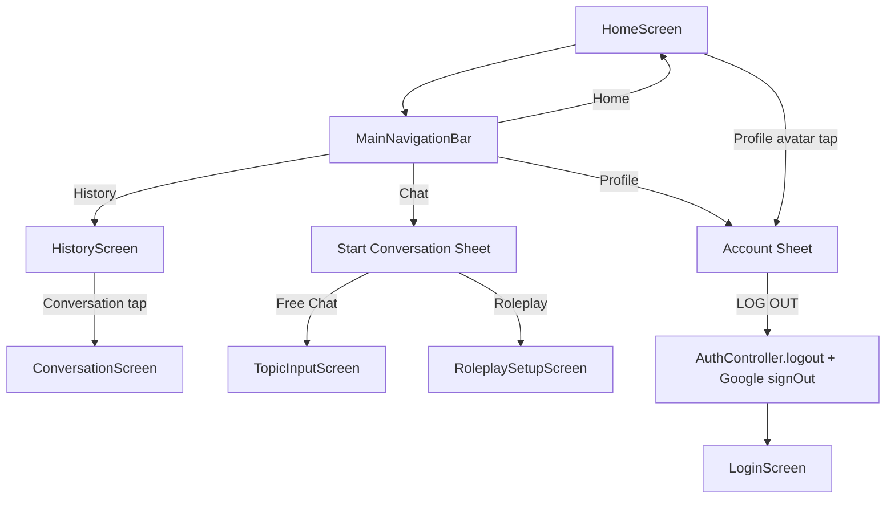

# feat: Complete mobile main navigation

## Summary

이 계획은 Flutter 모바일 앱의 Home 하단 네비게이션과 상단 프로필 영역을 실제 동작에 연결한다. 햄버거 메뉴는 v1 범위에서 제거하고, `Profile`은 별도 화면 대신 account sheet로 연결한다. `History`는 전체 대화 목록 화면으로 이동하고, `Chat`은 새 대화 시작 sheet를 열어 사용자가 Free Chat 또는 Roleplay를 바로 시작할 수 있게 한다.

현재 Home 화면은 하단 `Home`, `Chat`, `History`, `Profile` 탭과 상단 햄버거/프로필 아바타를 보여주지만 일부는 no-op 또는 정적 UI다. 이 상태는 앱 오류라기보다 미구현 UI이지만, 사용자 입장에서는 버튼이 눌리지 않는 버그처럼 느껴진다. 따라서 “보이는 것은 동작한다”는 기준으로 v1 네비게이션을 완성한다.

---

## Problem Frame

현재 `HomeScreen`은 `MainNavigationBar`를 렌더링하지만 `onDestinationSelected: (_) {}`로 연결되어 있어 하단 탭을 눌러도 화면 변화가 없다. `MainNavigationBar` 자체는 typed destination callback을 제공하므로 공통 컴포넌트 문제는 아니다. Home에서 목적지별 동작을 연결하지 않은 상태다.

상단 좌측 햄버거는 `Icon(Icons.menu_rounded)`로 렌더링되며 버튼이 아니다. 사용자는 메뉴 아이콘처럼 인식하지만 실제 drawer나 menu sheet가 없다. 사용자 결정에 따라 v1에서는 햄버거 메뉴를 제거한다.

상단 우측 프로필 아바타도 `CircleAvatar`로만 렌더링되고 탭 동작이 없다. 로그아웃 로직은 `AuthController.logout()`에 이미 존재하지만 앱 UI에서 호출되지 않는다. Google 계정 상태까지 자연스럽게 정리하려면 앱 로그아웃 시 `googleIdentityServiceProvider.signOut()`도 함께 호출해야 한다.

---

## Requirements

**Navigation behavior**

- R1. Home 상단 햄버거 아이콘을 제거해야 한다.
- R2. Home 상단 프로필 아바타는 탭 가능한 account entry로 동작해야 한다.
- R3. 하단 `Home` 탭은 현재 Home 상태를 유지해야 하며 불필요한 route push를 만들지 않아야 한다.
- R4. 하단 `Chat` 탭은 새 대화 시작 sheet를 열어야 한다.
- R5. 하단 `History` 탭은 전체 대화 목록 화면으로 이동해야 한다.
- R6. 하단 `Profile` 탭은 account sheet를 열어야 한다.
- R7. 어떤 하단 탭도 눌렀을 때 무반응이면 안 된다.

**Account and logout**

- R8. Account sheet는 사용자 이름과 이메일을 보여줘야 한다.
- R9. Account sheet는 `LOG OUT` 버튼을 제공해야 한다.
- R10. 로그아웃은 `AuthController.logout()`을 호출해 로컬 token 삭제와 서버 revoke를 수행해야 한다.
- R11. 로그아웃은 Google SDK의 `signOut()`도 best-effort로 호출해야 한다.
- R12. 로그아웃 성공 후 auth redirect에 의해 Login 화면으로 이동해야 한다.
- R13. 서버 revoke 또는 Google sign out 실패가 사용자 세션 삭제를 막으면 안 된다.

**History**

- R14. History 화면은 대화 목록을 카드 형태로 표시해야 한다.
- R15. History 화면에서 대화를 누르면 기존 `ConversationScreen`으로 이동해야 한다.
- R16. 목록 로딩, empty, error/retry 상태를 표시해야 한다.
- R17. v1에서는 기존 recent conversations API/repository를 재사용할 수 있으나, 화면 이름과 코드 구조는 향후 전체 history pagination으로 확장 가능해야 한다.

**Documentation and tests**

- R18. `mobile/README.md`는 하단 네비와 account/logout 동작을 설명해야 한다.
- R19. Home widget/router 테스트는 `Chat`, `History`, `Profile` 탭 동작을 고정해야 한다.
- R20. Account sheet 테스트는 로그아웃 호출과 Google sign out 호출을 검증해야 한다.
- R21. History 화면 테스트는 loading, empty/list, retry, conversation tap을 검증해야 한다.

---

## Key Technical Decisions

- KTD1. 햄버거 메뉴는 제거한다. v1 기능 수가 적고 drawer를 열 만큼 정보 구조가 크지 않으므로, 정적 햄버거를 남기기보다 제거해 기대 불일치를 없앤다.
- KTD2. Profile은 별도 route보다 account sheet로 시작한다. 이름, 이메일, 로그아웃만 필요한 현재 범위에서는 sheet가 더 가볍고 빠르다. 설정, 학습 통계, 계정 관리가 늘어나면 Profile route로 승격한다.
- KTD3. Chat 탭은 “새 대화 시작” 진입점으로 정의한다. 별도의 Chat 홈을 만들기보다 기존 Home의 start conversation sheet를 재사용해 Free Chat/Roleplay 선택으로 연결한다.
- KTD4. History는 route로 분리한다. Home의 최근 대화 목록과 달리 하단 탭 목적지는 독립 화면이어야 하므로 `/history`를 추가한다.
- KTD5. 로그아웃은 앱 세션 삭제를 우선한다. 서버 revoke와 Google sign out은 시도하되 실패해도 로컬 token 삭제와 unauthenticated 상태 전환을 막지 않는다.

---

## High-Level Technical Design

Home은 `MainNavigationBar`의 destination callback을 목적지별 action으로 매핑한다. `Chat`과 `Profile`은 route 이동보다 sheet를 열고, `History`는 route 이동을 사용한다. `Home`은 선택 상태만 유지한다.

---

## Implementation Units

### U1. Remove hamburger and make profile entry actionable

- **Goal:** Home header에서 무반응 햄버거를 제거하고 프로필 아바타를 account sheet entry로 만든다.
- **Requirements:** R1, R2, R6, R7, R8, R9
- **Files:**
  - `mobile/lib/features/home/presentation/home_screen.dart`
  - `mobile/test/features/home/presentation/home_screen_test.dart` 또는 기존 Home 관련 테스트
- **Approach:** `_HomeHeader`에 `VoidCallback onProfileTap`을 주입한다. 좌측 햄버거는 제거하고, 중앙 로고 정렬은 `Spacer`/고정 폭 placeholder 없이 자연스럽게 맞춘다. 프로필 아바타는 `InkWell` 또는 `IconButton` 성격의 탭 가능한 위젯으로 감싼다.
- **Patterns to follow:** 기존 `showAppModalSheet`, `AppSelectionCard`, `AppPrimaryButton` 사용 방식
- **Test scenarios:**
  - 햄버거 아이콘이 렌더링되지 않는다.
  - 프로필 아바타를 탭하면 account sheet가 열린다.
  - account sheet에 사용자 이름/email과 `LOG OUT`이 표시된다.

### U2. Implement account sheet and logout flow

- **Goal:** UI에서 실제 로그아웃을 수행할 수 있게 한다.
- **Requirements:** R8, R9, R10, R11, R12, R13, R20
- **Files:**
  - `mobile/lib/features/home/presentation/home_screen.dart`
  - `mobile/lib/features/auth/application/auth_controller.dart`
  - `mobile/lib/features/auth/data/google_identity_service.dart`
  - `mobile/test/features/home/presentation/home_screen_test.dart`
  - `mobile/test/features/auth/application/auth_controller_test.dart`
- **Approach:** account sheet의 `LOG OUT` 버튼에서 Google sign out을 best-effort로 호출한 뒤 `AuthController.logout()`을 호출한다. 또는 순서를 반대로 하되 로컬 token 삭제가 반드시 실행되게 한다. `AuthController.logout()`은 이미 서버 revoke 실패를 삼키므로 UI는 최종 unauthenticated 상태를 신뢰한다.
- **Patterns to follow:** `LoginScreen._signOutGoogleSafely()`의 best-effort Google sign out 패턴
- **Test scenarios:**
  - `LOG OUT` 탭 시 `AuthController.logout()`이 호출된다.
  - Google sign out 예외가 발생해도 앱 로그아웃이 완료된다.
  - 로그아웃 이후 router redirect가 Login으로 이동한다.

### U3. Connect bottom navigation actions on Home

- **Goal:** 하단 네비 탭이 각각 명확한 동작을 수행하게 한다.
- **Requirements:** R3, R4, R5, R6, R7, R19
- **Files:**
  - `mobile/lib/features/home/presentation/home_screen.dart`
  - `mobile/lib/app/router/app_router.dart`
  - `mobile/test/features/home/presentation/home_screen_test.dart`
  - `mobile/test/app/app_test.dart`
- **Approach:** Home에서 `MainNavigationDestination`을 switch로 처리한다. `home`은 no-op, `chat`은 기존 `_showStartSheet`, `history`는 `context.push(AppRoute.history)`, `profile`은 account sheet를 연다. `HomeScreen`은 테스트 가능하도록 기존 callback 주입 방식을 유지하거나 route action callback을 추가한다.
- **Patterns to follow:** Home의 `onConversationSelected`, `onStartTypeSelected` callback 주입 방식
- **Test scenarios:**
  - `Chat` 탭을 누르면 start conversation sheet가 열린다.
  - `Profile` 탭을 누르면 account sheet가 열린다.
  - `History` 탭을 누르면 `/history` route로 이동한다.
  - `Home` 탭은 중복 push를 만들지 않는다.

### U4. Add History route and screen

- **Goal:** 전체 대화 목록 진입점을 제공한다.
- **Requirements:** R5, R14, R15, R16, R17, R21
- **Files:**
  - `mobile/lib/app/router/app_router.dart`
  - `mobile/lib/features/history/history.dart`
  - `mobile/lib/features/history/presentation/history_screen.dart`
  - `mobile/test/features/history/presentation/history_screen_test.dart`
- **Approach:** 새 `history` feature 폴더를 추가한다. v1에서는 `recentConversationsControllerProvider` 또는 동일 repository를 재사용해 목록을 렌더링한다. 화면 제목은 `History`로 두고, 목록 item tap은 `ConversationScreen` route로 push한다. 향후 pagination을 위해 화면 내부 이름은 `HistoryScreen`, data는 임시로 recent provider를 쓴다는 주석 대신 README에 defer로 남긴다.
- **Patterns to follow:** `HomeScreen`의 recent conversations loading/error/empty/list 렌더링, `RecentConversationCard`
- **Test scenarios:**
  - loading 상태를 보여준다.
  - empty 상태를 보여준다.
  - list 상태에서 conversation card를 렌더링한다.
  - error 상태에서 retry 버튼이 reload를 호출한다.
  - card tap이 conversation route callback을 호출한다.

### U5. Update docs and navigation tests

- **Goal:** 구현된 v1 navigation 계약을 문서와 테스트로 고정한다.
- **Requirements:** R18, R19, R20, R21
- **Files:**
  - `mobile/README.md`
  - `.agent/_coordination/CHANGELOG.md`
  - `mobile/test/core/widgets/state_and_navigation_test.dart`
  - `mobile/test/app/app_test.dart`
- **Approach:** `mobile/README.md`의 앱 흐름에 Home 하단 네비, History, account sheet/logout을 추가한다. `MainNavigationBar` 공통 컴포넌트 테스트는 유지하고, 실제 Home 연결 테스트를 별도로 둔다.
- **Patterns to follow:** 기존 Flutter 흐름 문서 섹션, widget test의 fake repository/provider override 패턴
- **Test scenarios:**
  - 공통 `MainNavigationBar` callback 테스트는 계속 통과한다.
  - app-level flow에서 로그인 후 Home에서 profile/logout 흐름이 확인된다.

---

## Scope Boundaries

- **In scope:** 햄버거 제거, Home 프로필 아바타 탭, account sheet, 로그아웃 UI, 하단 Chat/Profile/History 탭 동작, History route/screen, 관련 테스트와 모바일 문서
- **Out of scope:** 사용자 설정 화면, 학습 통계 화면, 프로필 편집, 계정 삭제, push notification, 대화 검색/필터, History pagination API 신규 개발
- **Deferred:** Profile 전용 route, History cursor pagination, bottom nav selected state를 여러 tab shell로 유지하는 구조, drawer/menu 정보 구조

---

## Acceptance Examples

- AE1. Chat 탭으로 새 대화 시작
  - **Given:** 사용자가 Home에 있다.
  - **When:** 하단 `Chat` 탭을 누른다.
  - **Then:** `Start a conversation` sheet가 열리고 `Free Chat`, `Roleplay`을 선택할 수 있다.
  - **Covers:** R4, R7

- AE2. Profile 탭으로 로그아웃
  - **Given:** 사용자가 로그인된 상태로 Home에 있다.
  - **When:** 하단 `Profile` 탭 또는 우상단 프로필 아바타를 누른다.
  - **Then:** account sheet가 열리고 이름, 이메일, `LOG OUT` 버튼이 표시된다.
  - **Covers:** R2, R6, R8, R9

- AE3. 로그아웃 완료
  - **Given:** account sheet가 열려 있다.
  - **When:** 사용자가 `LOG OUT`을 누른다.
  - **Then:** 로컬 token이 삭제되고 Google sign out이 best-effort로 실행되며 Login 화면으로 이동한다.
  - **Covers:** R10, R11, R12, R13

- AE4. History 탭으로 대화 목록 보기
  - **Given:** 사용자가 Home에 있다.
  - **When:** 하단 `History` 탭을 누른다.
  - **Then:** History 화면으로 이동하고 대화 목록, empty, loading, error 상태 중 하나가 표시된다.
  - **Covers:** R5, R14, R16

- AE5. History에서 대화 열기
  - **Given:** History 화면에 대화 카드가 표시되어 있다.
  - **When:** 사용자가 대화 카드를 누른다.
  - **Then:** 해당 conversation id로 `ConversationScreen`이 열린다.
  - **Covers:** R15

---

## Risks & Dependencies

- **History API 범위:** 현재 모바일에는 최근 대화 provider가 있으나 전체 history pagination API가 별도로 준비되지 않았다. v1에서는 기존 목록을 재사용하고, pagination은 후속 API/화면 작업으로 미룬다.
- **로그아웃 순서:** Google sign out과 앱 token 삭제 중 하나가 실패해도 사용자를 로그인 상태에 가두면 안 된다. 로컬 token 삭제와 `AuthSession.unauthenticated()` 전환을 최우선으로 둔다.
- **Bottom nav architecture:** 지금은 Home 중심 route 구조다. 탭별 독립 navigation stack이 필요해지면 `StatefulShellRoute` 같은 구조를 검토해야 하지만, v1에서는 과한 복잡도다.
- **Profile sheet 확장성:** account sheet가 커지면 UX가 답답해질 수 있다. 학습 통계/설정이 추가되는 시점에 Profile route로 승격한다.

---

## Verification

- `dart format lib test`
- `flutter test test/features/home test/features/history test/app/app_test.dart`
- `flutter analyze --no-pub`
- Android emulator 수동 QA:
  - Home 좌측 햄버거가 보이지 않는다.
  - `Chat` 탭이 start conversation sheet를 연다.
  - `History` 탭이 목록 화면으로 이동한다.
  - `Profile` 탭과 우상단 아바타가 account sheet를 연다.
  - `LOG OUT` 후 Login 화면으로 이동한다.

---

## Sources

- `mobile/lib/features/home/presentation/home_screen.dart` — 현재 Home header, bottom navigation, start conversation sheet
- `mobile/lib/core/widgets/main_navigation_bar.dart` — 하단 네비 공통 컴포넌트와 destination enum
- `mobile/lib/app/router/app_router.dart` — 현재 route 목록과 auth redirect
- `mobile/lib/features/auth/application/auth_controller.dart` — 기존 logout token clear/server revoke 로직
- `mobile/lib/features/auth/presentation/login_screen.dart` — Google sign out best-effort 패턴
- `mobile/lib/features/home/application/recent_conversations_controller.dart` — History v1에서 재사용 가능한 대화 목록 provider
