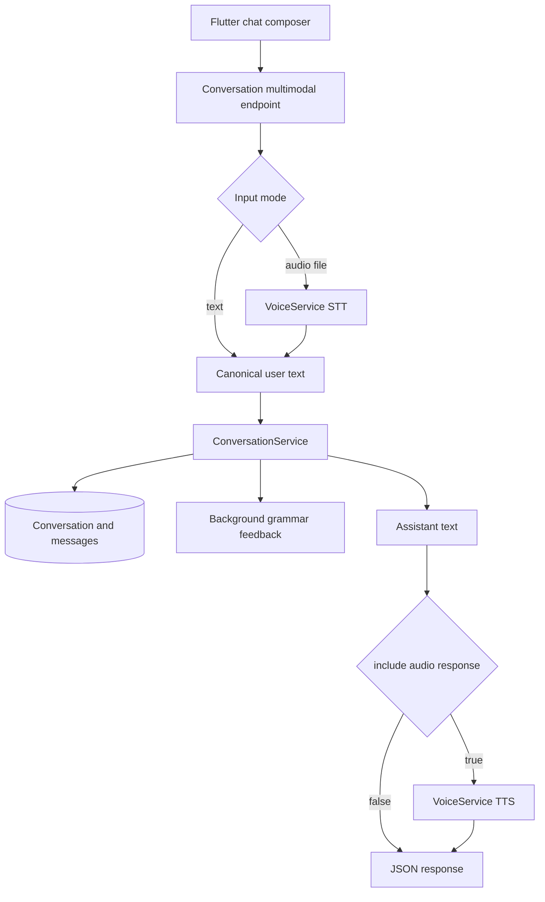
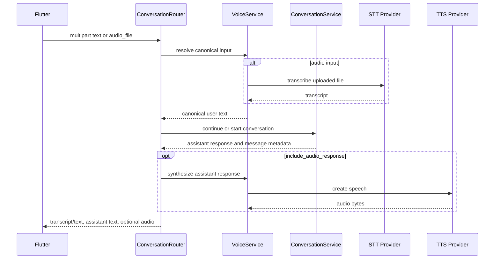

# feat: Add multimodal conversation turn API

## Goal Capsule

| Field | Value |
|---|---|
| Objective | Extend the backend conversation flow so Flutter can submit either typed text or a recorded audio file through one conversation-facing API, with optional spoken AI responses. |
| Authority | User request and current backend architecture are primary; current OpenAI Audio API constraints shape the provider implementation. |
| Execution profile | Standard backend feature with external API, API contract, environment variable, and mobile integration impact. |
| Stop conditions | Stop if the selected STT/TTS provider cannot be configured safely server-side, or if implementation discovers the existing conversation persistence contract cannot be reused without changing product behavior. |
| Tail ownership | Implementation should leave the plan's follow-up realtime/WebRTC work explicitly deferred, not partially introduced. |

---

## Product Contract

### Summary

The plan adds a conversation-facing multimodal input path: text input continues to work, audio input is transcribed server-side, and both modes feed the same conversation, LLM response, persistence, and grammar-feedback pipeline.
AI response audio is optional per request so the same API can serve text-only, voice-in/text-out, and voice-in/voice-out chat screen states.

### Problem Frame

The current backend accepts text-only conversation messages.
The mobile chat screen is expected to support a microphone button, but splitting text messages into `/api/conversations/*` and recordings into `/api/voice/*` would make the client own routing, response reconciliation, and duplicated UI state.
The backend already has a strong `ConversationService` flow for saving user messages, generating assistant replies, updating turn counts, and scheduling grammar feedback.
The voice feature should wrap that flow rather than create a parallel voice conversation API.

### Requirements

- R1. The backend accepts text or recorded audio as the user input for continuing an existing conversation.
- R2. The backend accepts text or recorded audio as the first user message for starting a free-chat conversation.
- R3. Audio input is transcribed by the backend before the conversation service receives it.
- R4. Text input and transcribed audio input both reuse the existing conversation persistence, LLM response, message count, and background grammar-feedback behavior.
- R5. The client can request TTS output for the assistant response without requiring a separate TTS endpoint call.
- R6. The API response returns the user-facing input text used for the turn, whether it came from typed text or STT.
- R7. Provider secrets stay on the backend; Flutter never receives OpenAI or other STT/TTS provider keys.
- R8. Invalid input combinations are rejected deterministically: missing input, both text and audio when not allowed, unsupported content type, oversized uploads, empty transcript, and unavailable provider configuration.
- R9. Existing text-only endpoints remain compatible during rollout; the new endpoint is additive unless implementation chooses a backwards-compatible extension path.
- R10. Realtime streaming, WebRTC voice sessions, custom voice cloning, and mobile recorder UI implementation are deferred.
- R11. TTS failure after a conversation turn has been persisted is reported as an audio-generation failure on the response, not as a failed conversation turn that encourages duplicate retries.

### Acceptance Examples

- AE1. Given an authenticated user in an active conversation, when Flutter sends `text=I want to practice travel English` to the multimodal turn endpoint, then the backend returns the normal assistant text response with `input_mode=text` and no STT call.
- AE2. Given an authenticated user in an active conversation, when Flutter sends a supported audio file and asks for audio response, then the backend transcribes the file, stores the transcript as the user message, returns assistant text, and includes TTS audio metadata.
- AE3. Given a free-chat start request with an audio file, when STT returns non-empty English text, then the backend starts the conversation using that text as `first_message` and preserves topic-prep handoff fields when supplied.
- AE4. Given a request with neither text nor audio, when the endpoint is called, then the backend returns a validation error before any STT, LLM, or TTS provider call.
- AE5. Given STT succeeds and the conversation response is saved but TTS fails, when the request asked for audio response, then the backend returns the assistant text with a clear `audio_error` and no fake audio payload.

### API Shape

The backend should expose the multimodal chat contract with these conversation-facing request shapes:

```text
Text start:
  POST /api/conversations/start/free-chat/
  first_message=...

Audio start:
  POST /api/conversations/start/free-chat/
  audio_file=...

Text continue:
  POST /api/conversations/{id}/turn/
  text=...

Audio continue:
  POST /api/conversations/{id}/turn/
  audio_file=...
```

`/api/conversations/start/free-chat/` remains the free-chat start route and accepts either the existing text `first_message` or a recorded `audio_file`.
`/api/conversations/{id}/turn/` is the new unified continuation route for the chat screen and accepts either `text` or `audio_file`.
Requests that provide neither input or both inputs are rejected before STT, LLM, or TTS work begins.

### Scope Boundaries

- In scope: backend API contract, server-side STT/TTS provider abstraction, OpenAI provider implementation, conversation service reuse, tests, and documentation.
- In scope: a simple V1 response shape that can return base64-encoded audio for mobile playback convenience.
- Out of scope: direct mobile recorder/player implementation, realtime streaming voice sessions, voice cloning, custom character voices, object-storage audio URLs, and production observability dashboards.

#### Deferred to Follow-Up Work

- Add a Realtime/WebRTC voice conversation path after the file-upload MVP proves useful.
- Move generated audio from inline base64 to short-lived object storage URLs if response size becomes a problem.
- Add provider alternatives such as ElevenLabs or self-hosted Whisper/Piper behind the same interface after OpenAI V1 is stable.
- Add usage accounting and cost dashboards for STT/TTS minutes and generated characters.

---

## Planning Contract

### Key Technical Decisions

- KTD1. Keep the public API under Conversation, not a separate Voice API.
  The chat screen is conversation-centric; putting the endpoint under `/api/conversations` keeps routing and response handling aligned with existing message flows.
- KTD2. Add a new multimodal turn endpoint instead of replacing the existing text endpoint immediately.
  This preserves current clients and tests while giving Flutter one endpoint for the new chat composer path.
- KTD3. Use internal voice provider abstractions rather than mixing STT/TTS calls into `ConversationService`.
  ConversationService should remain responsible for conversation state and LLM turns; VoiceService should own audio validation, transcription, synthesis, and provider-specific errors.
- KTD4. Use OpenAI Audio API as the first provider.
  Current OpenAI docs show `/v1/audio/transcriptions` accepts file uploads with `gpt-4o-mini-transcribe`, and `/v1/audio/speech` can return audio bytes from `gpt-4o-mini-tts`.
- KTD5. Return the canonical user input text in every multimodal response.
  For text mode it mirrors the input; for audio mode it is the transcript. This keeps Flutter message bubbles, grammar polling, and retry UX deterministic.
- KTD6. Treat STT output as untrusted model output until server validation passes.
  The project already records that LLM-created ready states need server-side invariants; this feature should reject empty or whitespace-only transcripts before continuing the conversation.
- KTD7. Keep V1 audio response inline and bounded.
  Base64 audio is simple for Flutter to consume during MVP, but upload size, TTS response format, and response-size limits must be configurable so the design can later move to URLs without changing conversation semantics.
- KTD8. Treat TTS as a post-turn enrichment, not part of the conversation transaction.
  Once the user message and assistant response are persisted, a TTS failure should not make the whole turn look unsent; the API should return text plus an explicit audio error so Flutter can retry audio playback/generation without duplicating the message.

### High-Level Technical Design





### Assumptions

- Flutter can send multipart/form-data for the new chat composer path.
- The first implementation targets OpenAI-hosted STT/TTS, with self-hosted/open-source alternatives deferred behind the provider interface.
- For V1, audio uploads are complete files, not live streams.
- Existing grammar feedback should run on the canonical text submitted to `ConversationService`; no pronunciation scoring is included.

### Dependencies and Prerequisites

- `python-multipart` already exists in `backend/pyproject.toml`, so FastAPI can accept multipart uploads.
- `httpx` is already used for provider HTTP calls and should be reused for OpenAI Audio calls.
- `backend/config.py`, `.env.example`, and `README.md` are shared files under the project coordination rules; implementation should claim them in `.agent/_coordination/HANDOFF.md` before editing.

### Sources and Research

- OpenAI Audio API reference: transcriptions accept file uploads in `flac`, `mp3`, `mp4`, `mpeg`, `mpga`, `m4a`, `ogg`, `wav`, or `webm`; `gpt-4o-mini-transcribe` is listed as a transcription model.
- OpenAI Audio API reference: speech creation supports `gpt-4o-mini-tts`, built-in voices, and response formats such as `mp3`, `opus`, `aac`, `flac`, `wav`, and `pcm`.
- Local pattern: `backend/domains/conversation/service.py` already owns message persistence, LLM response generation, turn counts, and grammar feedback scheduling.
- Local pattern: `backend/domains/llm/openrouter.py` and `backend/domains/llm/ollama.py` show async `httpx` provider error handling with `ExternalAPIException` and `RateLimitException`.
- Local learning: `docs/solutions/design-patterns/server-side-llm-output-invariants.md` requires server invariants around model-generated output before exposing successful product state.

---

## System-Wide Impact

- API contract: adds conversation endpoints and response types that must be documented in `docs/DSL.md` and `README.md`.
- Configuration: adds backend-only provider keys and model settings that must be reflected in `.env.example`, `README.md`, and `backend/config.py`.
- Mobile integration: Flutter can move toward one chat composer send path for text and audio, but mobile implementation remains outside this backend plan.
- Cost and latency: each audio turn can add STT and TTS provider calls around the existing LLM call, so timeout and error handling must be explicit.
- Security: provider keys remain server-side; uploaded files need content-type and size validation before leaving the server.

---

## Risks and Mitigations

| Risk | Mitigation |
|---|---|
| Multipart endpoint breaks existing JSON text clients | Add new endpoints or overload only with backwards-compatible routes; keep existing JSON endpoints until mobile migration is complete. |
| Large base64 audio responses inflate payload size | Bound TTS text length and response format in config; defer URL-based audio delivery as follow-up if needed. |
| STT returns empty or low-confidence text | Reject empty transcript before conversation persistence; optionally include provider confidence/logprobs later. |
| Provider outage blocks voice turns | Fail before persistence when STT is unavailable; after persistence, return assistant text with `audio_error` when only TTS fails. Text-only endpoint remains available as fallback. |
| Audio files expose privacy-sensitive user speech | Keep API keys server-side, avoid logging raw audio or transcripts beyond existing message persistence, and document retention assumptions before production rollout. |

---

## Output Structure

```text
backend/domains/voice/
├── __init__.py
├── provider.py
├── openai_provider.py
├── schemas.py
└── service.py

backend/tests/domains/voice/
├── test_voice_service.py
└── test_multimodal_conversation_router.py
```

---

## Implementation Units

### U1. Add Voice Domain Provider Layer

- **Goal:** Create the internal voice domain that validates audio input and exposes provider-neutral STT/TTS methods.
- **Requirements:** R3, R5, R7, R8
- **Dependencies:** None
- **Files:** `backend/domains/voice/__init__.py`, `backend/domains/voice/provider.py`, `backend/domains/voice/schemas.py`, `backend/domains/voice/openai_provider.py`, `backend/domains/voice/service.py`, `backend/tests/domains/voice/test_voice_service.py`
- **Approach:** Define provider interfaces for transcription and speech synthesis, OpenAI-backed implementation with async `httpx`, and service-level validation for supported audio MIME types, upload size, configured models, response format, and empty transcript.
- **Patterns to follow:** `backend/domains/llm/provider.py`, `backend/domains/llm/openrouter.py`, `backend/shared/exceptions.py`
- **Test scenarios:**
  - Happy path: supported audio metadata and fake provider response produce a non-empty transcript.
  - Happy path: assistant text and configured voice produce audio payload metadata with expected content type.
  - Edge case: whitespace-only transcript is rejected before conversation service would be called.
  - Error path: unsupported content type returns validation failure.
  - Error path: upload size over configured maximum returns validation failure.
  - Error path: provider HTTP failure maps to `ExternalAPIException`.
  - Error path: provider rate limit maps to `RateLimitException` where the provider can distinguish it.
- **Verification:** Voice service tests prove provider success and failure behavior without making network calls.

### U2. Add Multimodal Conversation Schemas

- **Goal:** Add response and request-adjacent schemas for multimodal conversation turns while preserving existing text response schemas.
- **Requirements:** R1, R2, R5, R6, R8, R9, R11
- **Dependencies:** U1
- **Files:** `backend/domains/conversation/schemas.py`, `backend/tests/domains/voice/test_multimodal_conversation_router.py`
- **Approach:** Introduce response models that include `input_mode`, `transcript`, `response`, message metadata, grammar feedback placeholder, turn count where applicable, optional audio response metadata, and optional `audio_error`. Keep field names stable for Flutter and document whether `transcript` is null or equal to text for text mode.
- **Patterns to follow:** Existing `ConversationResponse`, `MessageResponse`, and `SuccessResponse` envelope conventions.
- **Test scenarios:**
  - Happy path: text turn response validates with `input_mode=text` and no audio object.
  - Happy path: audio turn response validates with `input_mode=audio`, transcript, and audio metadata when requested.
  - Edge case: response schema allows `grammar_feedback=null` to match existing background grammar behavior.
  - Edge case: response schema allows `audio_error` with no audio object when TTS fails after the text turn succeeds.
  - Error path: invalid `input_mode` value fails schema validation.
- **Verification:** Schema-level tests or router response assertions prove the envelope is compatible with current API response rules.

### U3. Add Multimodal Continue-Turn Endpoint

- **Goal:** Let Flutter continue an existing conversation by sending either typed text or an audio file to one endpoint.
- **Requirements:** R1, R3, R4, R5, R6, R8, R9, R11, AE1, AE2, AE4, AE5
- **Dependencies:** U1, U2
- **Files:** `backend/domains/conversation/router.py`, `backend/domains/conversation/service.py`, `backend/tests/domains/voice/test_multimodal_conversation_router.py`
- **Approach:** Add `POST /api/conversations/{id}/turn/` as the multipart-capable continuation endpoint for an existing conversation. The endpoint accepts either `text` or `audio_file`, resolves canonical user text through VoiceService only for audio input, then calls `ConversationService.continue_conversation`. If `include_audio_response` is true, synthesize the assistant response after the LLM result is available; if synthesis fails after the conversation turn succeeds, return the assistant text with `audio_error` rather than making the whole turn look unsent.
- **Execution note:** Start with router tests using dependency overrides so no real provider or LLM calls occur.
- **Patterns to follow:** Existing `send_message` endpoint error handling, `get_conversation_service` dependency override tests, and `SuccessResponse` wrapping.
- **Test scenarios:**
  - Covers AE1. Given authenticated text input, endpoint calls the fake conversation service with the original text and returns `input_mode=text`.
  - Covers AE2. Given authenticated audio input, endpoint calls fake STT, passes transcript to fake conversation service, calls fake TTS when audio response is requested, and returns audio metadata.
  - Covers AE4. Given neither text nor audio, endpoint returns validation error and does not call STT, LLM, or TTS fakes.
  - Edge case: both text and audio are submitted; endpoint follows the chosen contract and rejects the ambiguous request.
  - Error path: unknown conversation maps to existing 404 behavior.
  - Error path: STT failure returns provider error without saving a user message through the fake conversation service.
  - Covers AE5. Error path: TTS failure after conversation response returns assistant text with `audio_error`, no audio object, and no second conversation-service call.
- **Verification:** Router tests demonstrate text and audio modes share the same conversation continuation behavior and auth boundary.

### U4. Extend Free-Chat Start for Multimodal Input

- **Goal:** Allow free-chat conversations to start from either text or recorded audio while preserving topic-prep handoff fields.
- **Requirements:** R2, R3, R4, R5, R6, R8, R9, R11, AE3, AE4
- **Dependencies:** U1, U2
- **Files:** `backend/domains/conversation/router.py`, `backend/domains/conversation/schemas.py`, `backend/tests/domains/voice/test_multimodal_conversation_router.py`, `backend/tests/domains/conversation/test_topic_prep_handoff.py`
- **Approach:** Extend `POST /api/conversations/start/free-chat/` so the same start route accepts either the existing text `first_message` or an `audio_file`. For audio input, transcribe first and pass the transcript as `first_message` into `start_free_chat_conversation` with existing topic, direction, selected question, and search context values.
- **Patterns to follow:** Existing `start_free_chat_conversation` route and topic-prep handoff tests.
- **Test scenarios:**
  - Covers AE3. Given audio input plus topic-prep fields, endpoint transcribes audio and calls fake conversation service with transcript and unchanged topic-prep values.
  - Happy path: typed `first_message` still starts free chat without STT.
  - Edge case: audio transcript longer than title truncation path still relies on existing ConversationService behavior.
  - Error path: invalid conversation direction is rejected before service execution, preserving current enum validation.
  - Error path: missing first message and missing audio file returns validation error.
- **Verification:** Existing topic-prep handoff tests continue to pass; new multipart tests prove the same handoff contract for audio starts.

### U5. Add Configuration and Documentation Sync

- **Goal:** Make STT/TTS configuration explicit and keep external API surfaces documented.
- **Requirements:** R5, R7, R8, R9
- **Dependencies:** U1, U2, U3, U4
- **Files:** `backend/config.py`, `.env.example`, `README.md`, `docs/DSL.md`, `.agent/architecture.md`
- **Approach:** Add settings for OpenAI API key, STT provider/model, TTS provider/model/voice/format, upload size, and audio response size policy. Document the new endpoints, multipart fields, response shape, and backend-only secret boundary. Update architecture external dependencies to include OpenAI Audio or generic STT/TTS provider.
- **Patterns to follow:** Existing N-way sync rules for environment variables and API endpoints; existing README and DSL API contract style.
- **Test scenarios:**
  - Happy path: settings load with defaults suitable for local tests when test environment supplies placeholder values.
  - Edge case: missing provider key is accepted only if voice endpoints are not invoked, or produces a clear configuration error when invoked.
  - Documentation check: README and DSL describe the same endpoint names, request modes, and response fields.
- **Verification:** Config tests or existing import tests do not fail from new required environment variables; docs and `.env.example` remain synchronized.

### U6. Add Test Fixtures and Regression Coverage

- **Goal:** Keep voice tests deterministic and prevent accidental network calls or duplicated conversation behavior.
- **Requirements:** R3, R4, R8, R9
- **Dependencies:** U1, U2, U3, U4, U5
- **Files:** `backend/tests/conftest.py`, `backend/tests/domains/voice/test_voice_service.py`, `backend/tests/domains/voice/test_multimodal_conversation_router.py`
- **Approach:** Add fake voice provider and fake conversation service fixtures, test environment defaults for new settings, and regression tests that assert exactly one input mode is used per request.
- **Patterns to follow:** `backend/tests/domains/conversation/test_topic_prep_handoff.py` dependency override pattern.
- **Test scenarios:**
  - Integration scenario: fake voice provider records STT/TTS calls so tests prove text mode skips STT/TTS unless audio response is requested.
  - Integration scenario: fake conversation service receives the transcript, not raw audio metadata.
  - Error path: provider fakes raising `ExternalAPIException` are surfaced by the router as expected.
  - Regression: existing text-only conversation tests still pass with new config defaults.
- **Verification:** Backend tests for conversation and voice domains pass without external network access.

---

## Verification Contract

| Gate | Applies to | Done signal |
|---|---|---|
| Voice service tests | U1, U6 | STT/TTS provider abstraction validates input and maps provider success/failure deterministically. |
| Multimodal router tests | U2, U3, U4, U6 | Text and audio modes return the same envelope shape and call the expected fake services. |
| Existing conversation tests | U3, U4, U6 | Existing JSON/text conversation behavior and topic-prep handoff behavior are not regressed. |
| Config import check | U5, U6 | Backend app imports with test defaults and without requiring real provider keys during test collection. |
| Documentation sync review | U5 | `README.md`, `docs/DSL.md`, `.env.example`, and `.agent/architecture.md` describe the same provider settings and API contract. |

---

## Definition of Done

- The backend exposes a conversation-facing multimodal turn path for existing conversations.
- Free-chat start supports text and audio input without losing topic-prep handoff fields.
- Audio input is transcribed server-side and the transcript is the canonical user message.
- Optional assistant TTS audio is returned only when requested.
- TTS failures after a successful turn are surfaced as `audio_error` without encouraging duplicate message retries.
- Provider keys and model settings are backend-only environment variables.
- Invalid or ambiguous input is rejected before unnecessary provider calls.
- Tests cover text mode, audio mode, no-input, ambiguous-input, provider-failure, and documentation-sensitive configuration behavior.
- Existing text-only conversation endpoints remain usable.
- Documentation and environment examples are synchronized with the new API surface.
- Experimental or dead-end implementation code is removed before the work is considered complete.
