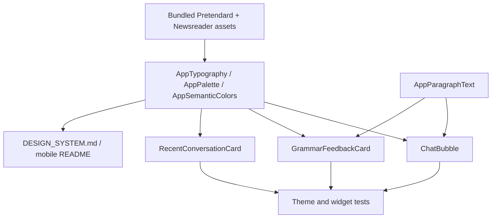

# feat: Improve mobile readability and feedback UI

## Goal Capsule

| Field | Value |
|---|---|
| Objective | 반영 확정된 UI 피드백을 Flutter 모바일 앱에 적용해 채팅/문법 피드백의 가독성과 시각적 구분을 높인다. |
| Authority | 2026-07-17 사용자 피드백과 현재 `mobile/` 디자인 시스템이 1차 기준이며, 기존 feature-first 구조와 디자인 토큰 체계를 유지한다. |
| Execution profile | Standard Flutter UI/design-system change with bundled fonts, shared text rendering, feature widgets, tests, and design docs. |
| Stop conditions | 폰트 라이선스/자산을 확인할 수 없거나, 문법 피드백 접기 판단이 테스트 가능하지 않은 방식으로만 구현될 경우 중단하고 대안을 정리한다. |
| Tail ownership | 채팅 말풍선의 양쪽 정렬은 이번 구현에서 보류하고 현재 정렬을 유지한다. |

---

## Product Contract

### Summary

이번 작업은 Curitalk 모바일 앱의 읽기 경험을 정리한다.
메인 폰트는 Inter에서 Pretendard로 바꾸고, 서브 디스플레이 폰트로 Newsreader를 도입하되 1차 적용 범위는 `displayLg`로 제한한다.
긴 채팅/피드백 텍스트는 문단 단위로 읽히게 하고, 문법 피드백은 일반 AI 채팅과 다른 색상/상호작용으로 분리한다.
최근 대화 카드에서 `roleplay`, `free chat` 같은 시각 뱃지는 제거해 중복 정보를 줄인다.

### Problem Frame

현재 앱은 `AppTypography`가 Inter와 JetBrains Mono를 기준으로 잡혀 있고, 긴 텍스트는 대부분 단일 `Text` 위젯으로 렌더링된다.
AI 응답과 문법 피드백은 `ConversationTextFormatter`로 일부 문장 공백/줄바꿈을 보정하지만, UI 레벨에서 문단 간격을 주는 공통 컴포넌트가 없다.
문법 피드백은 `blockCream` 계열을 사용해 부드럽지만, 일반 카드와 구분이 약하고 내용이 길어질 때 사용자 메시지 아래 공간을 크게 차지할 수 있다.
최근 대화 카드는 category chip을 보여주지만, 화면 제목과 맥락상 `roleplay`/`free chat` 정보가 중복될 수 있다.

### Requirements

**Typography and readability**

- R1. 앱의 메인 산세리프 폰트는 Pretendard로 변경해야 한다.
- R2. 서브 디스플레이 폰트는 Newsreader로 추가하고, 1차 적용 범위는 `displayLg` 토큰으로 제한해야 한다.
- R3. 기존 JetBrains Mono의 label/caption 역할은 유지해야 한다.
- R4. 폰트 자산과 라이선스는 `mobile/assets/fonts/`와 `mobile/assets/licenses/`에 번들 기준으로 관리해야 한다.
- R5. 긴 텍스트는 문단 단위 여백을 가질 수 있는 공통 렌더링 경로를 제공해야 한다.
- R6. 문단 구분은 서버 원문을 변경하지 않고 화면 표시 단계에서만 적용해야 한다.

**Conversation alignment**

- R7. 채팅 말풍선의 현재 역할별 정렬은 유지해야 한다.
- R8. 텍스트 양쪽 정렬은 이번 작업에서 적용하지 않고 후속 실험 후보로만 남겨야 한다.

**Grammar feedback**

- R9. 문법 피드백 카드는 일반 AI 채팅과 명확히 다른 semantic color를 사용해야 한다.
- R10. 문법 피드백의 설명 텍스트는 gray 계열 보조 텍스트를 유지해야 한다.
- R11. 문법 피드백 제안 또는 설명이 1줄을 넘는 경우 접기/펼치기 기능을 제공해야 한다.
- R12. 접힌 상태에서도 핵심 교정 제안은 1줄로 확인 가능해야 한다.
- R13. 문법 피드백 카드에서 `Try` 쪽 아이콘/이모지 성격의 시각 장식은 제거해야 한다.
- R14. 문법 피드백 구분 라벨은 `Why` 중심으로 단순화해야 한다.

**Conversation badges**

- R15. 최근 대화 카드에서 `FREE CHAT`, `ROLEPLAY`처럼 대화 타입을 반복 표시하는 visible badge를 제거해야 한다.
- R16. 뱃지 제거 후 카드의 제목, preview, tap semantics가 어색하지 않게 재정렬되어야 한다.
- R17. 접근성 label에는 필요한 경우 대화 타입 정보를 유지할 수 있다.

**Documentation and tests**

- R18. `docs/design/DESIGN_SYSTEM.md`와 `mobile/README.md`는 새 폰트 조합과 문법 피드백 표시 정책을 반영해야 한다.
- R19. 토큰/테마/위젯 테스트는 변경된 폰트명, semantic color, 카드 구조, 접기/펼치기 동작을 검증해야 한다.

### Acceptance Examples

- AE1. Given 앱이 실행될 때, when 일반 본문과 버튼이 렌더링되면, then Pretendard 기반 text style이 적용된다.
- AE2. Given Splash, Login hero, Home greeting처럼 `displayLg`가 렌더링될 때, when 화면에 표시되면, then Newsreader가 적용되고 다른 headline/body 텍스트에는 남용되지 않는다.
- AE3. Given AI 응답 또는 문법 피드백 텍스트에 빈 줄로 나뉜 문단이 있을 때, when 화면에 표시되면, then 문단 사이에 일관된 vertical gap이 생긴다.
- AE4. Given 사용자가 긴 문법 피드백을 받았을 때, when 카드가 처음 표시되면, then 1줄 초과 내용은 접힌 상태로 보이고 사용자는 펼칠 수 있다.
- AE5. Given 문법 피드백 카드가 렌더링될 때, when 일반 AI 말풍선과 비교하면, then 배경색과 라벨 구조가 구분된다.
- AE6. Given 최근 대화 목록이 표시될 때, when 카드가 렌더링되면, then 대화 타입 chip 없이 제목과 preview 중심으로 보인다.

### Scope Boundaries

- In scope: Flutter font asset registration, typography token update, paragraph-aware text widget, conversation text use sites, grammar feedback card color/expand behavior, recent conversation badge removal, docs/tests.
- Out of scope: 채팅 텍스트 양쪽 정렬 적용, backend API 변경, 문법 피드백 데이터 모델 변경, 전체 앱 리브랜딩, History pagination, 음성 대화 UI.
- Deferred: 말풍선 내부 `TextAlign.justify` 실험, Profile/History의 정보 구조 재설계, 폰트 다운로드 자동화 스크립트.

---

## Planning Contract

### Key Technical Decisions

- KTD1. Pretendard는 메인 폰트, Newsreader는 `displayLg` 전용 서브 디스플레이 폰트로 사용한다.
  Pretendard는 현재 Inter 기반 체계에서 자연스럽게 전환할 수 있고 한글/영문 모바일 본문 가독성에 유리하다.
  Newsreader는 영어 학습 앱의 에디토리얼 감성을 보강하되, 1차 적용은 Splash 로고성 문구, Login hero, Home greeting처럼 현재 `displayLg`를 쓰는 짧은 강조 문구에만 제한한다.
  `headlineLg`와 `headlineMd`는 실사용 화면 제목에 많이 쓰이므로 이번 작업에서는 Pretendard를 유지하고, 화면 검토 후 후속으로 확장 여부를 결정한다.
- KTD2. 문단 처리는 `RichText` 직접 사용보다 `AppParagraphText` 같은 공통 위젯을 우선한다.
  `RichText`는 한 문장 안에서 서로 다른 style span이 필요할 때 유용하지만, 이번 요구사항의 핵심은 문단 분리와 여백이므로 공통 paragraph-aware 위젯이 더 단순하고 테스트하기 쉽다.
- KTD3. 채팅 정렬은 유지한다.
  모바일 좁은 폭에서 양쪽 정렬은 영어 단어 간격을 불규칙하게 만들 수 있으므로 이번 반영 범위에서는 현재 `start` 정렬과 사용자/AI 말풍선 위치를 유지한다.
- KTD4. 문법 피드백 접기 여부는 실제 레이아웃 기준으로 판단한다.
  문자열 길이로 추정하지 않고 `TextPainter` 또는 동등한 측정 방식을 사용해 1줄 초과 여부를 판단해야 화면 폭별 동작이 안정적이다.
- KTD5. 문법 피드백 색상은 semantic token으로 변경한다.
  화면 코드에서 raw color를 고르지 않고 `AppSemanticColors.grammarSuggestionSurface` 등 의미 토큰을 갱신하거나 역할을 추가해 테스트 가능하게 한다.
- KTD6. Visible badge 제거와 접근성 정보는 분리한다.
  시각적으로는 category chip을 제거하되, screen reader label에서는 category를 유지할 수 있다.

### High-Level Technical Design

### Dependencies and Prerequisites

- Pretendard와 Newsreader font 파일을 앱에 번들해야 한다.
  구현자가 네트워크 접근으로 내려받을 수 있으면 공식 저장소 또는 Google Fonts 산출물을 사용하고, 네트워크가 제한되면 사용자 제공 파일을 받아 `mobile/assets/fonts/`에 추가한다.
- `mobile/pubspec.yaml`의 `fonts` 섹션은 새 font family를 등록해야 한다.
- 폰트 라이선스 파일은 `mobile/assets/licenses/`에 추가하거나 기존 라이선스 관리 방식에 맞춰 문서화해야 한다.

### Sources and Research

- Pretendard 공식 문서는 Pretendard가 SIL Open Font License로 배포되고 상업적 사용, 수정, 재배포가 허용된다고 설명한다.
- Adobe Fonts의 Pretendard 설명은 Pretendard가 Inter와 Source Han Sans 기반이며 추가 letter spacing 조정 없이 가독성을 제공하는 크로스 플랫폼용 폰트라고 설명한다.
- Newsreader 공식 저장소는 Newsreader가 content-rich on-screen reading을 목적으로 설계되었고 SIL Open Font License v1.1로 제공된다고 설명한다.
- Local pattern: `mobile/lib/app/theme/tokens/app_typography.dart`가 모든 font family와 text style의 단일 진입점이다.
- Local pattern: `mobile/lib/features/conversation/presentation/widgets/conversation_text_formatter.dart`가 서버 원문을 바꾸지 않고 표시 단계에서 문장 공백/줄바꿈을 보정한다.
- Local pattern: `mobile/lib/features/conversation/presentation/widgets/grammar_feedback_card.dart`와 `mobile/lib/features/conversation/presentation/widgets/chat_bubble.dart`는 문단-aware text 적용의 1차 대상이다.

---

## Implementation Units

### U1. Update Bundled Fonts and Typography Tokens

- **Goal:** 메인 폰트를 Pretendard로 바꾸고 Newsreader를 `displayLg` 전용 서브 디스플레이 폰트로 추가한다.
- **Requirements:** R1, R2, R3, R4, R18, R19
- **Dependencies:** None
- **Files:**
  - `mobile/assets/fonts/PretendardVariable.ttf`
  - `mobile/assets/fonts/NewsreaderVariable.ttf`
  - `mobile/assets/licenses/Pretendard-OFL.txt`
  - `mobile/assets/licenses/Newsreader-OFL.txt`
  - `mobile/pubspec.yaml`
  - `mobile/lib/app/theme/tokens/app_typography.dart`
  - `mobile/test/app/theme/tokens/app_tokens_test.dart`
  - `mobile/test/app/theme/app_theme_test.dart`
- **Approach:** Pretendard를 `sansFontFamily`, Newsreader를 새 `displayFontFamily`로 등록한다.
  `displayLg`만 Newsreader를 사용하고, `displayXl`, `headlineLg`, `headlineMd`, body, button은 Pretendard를 사용한다.
  현재 `displayXl`은 미사용 토큰이므로 1차 구현에서는 Pretendard로 유지해 예기치 않은 향후 화면 변화가 생기지 않게 한다.
  JetBrains Mono는 label/caption 용도로 유지한다.
- **Patterns to follow:** 기존 Inter/JetBrains Mono font asset 등록 방식과 `AppTypography` static token 구조
- **Test scenarios:**
  - `AppTypography.sansFontFamily`가 `Pretendard`를 반환한다.
  - `AppTypography.displayFontFamily` 또는 동등한 token이 `Newsreader`를 반환한다.
  - `AppTypography.displayLg`는 Newsreader를 사용한다.
  - `AppTypography.headlineLg`와 `AppTypography.headlineMd`는 Pretendard를 사용한다.
  - body/button style은 Pretendard를 사용한다.
  - label/caption mono style은 JetBrains Mono를 유지한다.
  - `AppTheme.light`가 새 기본 font family를 앱 루트에 적용한다.
- **Verification:** `dart format lib test`, `flutter test test/app/theme`, `flutter analyze --no-pub`

### U2. Add Paragraph-Aware Text Rendering

- **Goal:** 긴 채팅/피드백 텍스트가 문단 단위로 읽히도록 공통 렌더링 위젯을 추가한다.
- **Requirements:** R5, R6, R7, R8, R19
- **Dependencies:** U1
- **Files:**
  - `mobile/lib/core/widgets/app_paragraph_text.dart`
  - `mobile/lib/core/widgets/widgets.dart`
  - `mobile/lib/features/conversation/presentation/widgets/chat_bubble.dart`
  - `mobile/lib/features/conversation/presentation/widgets/grammar_feedback_card.dart`
  - `mobile/test/core/widgets/app_paragraph_text_test.dart`
  - `mobile/test/features/conversation/presentation/widgets/conversation_widgets_test.dart`
- **Approach:** `AppParagraphText`는 입력 문자열을 빈 줄 기준으로 paragraph list로 나누고, 각 paragraph는 기존 formatter 결과를 유지한 채 `Text` 또는 `Text.rich`로 렌더링한다.
  paragraph 사이에는 `AppSpacing.sm` 수준의 gap을 둔다.
  `textAlign` 기본값은 `TextAlign.start`로 유지하고, 이번 작업에서는 `TextAlign.justify`를 사용하지 않는다.
- **Patterns to follow:** `AppTextField`, `AppSectionLabel`처럼 core widget에 작고 명확한 API를 둔다.
- **Test scenarios:**
  - 단일 문단 문자열은 하나의 텍스트 블록으로 표시된다.
  - 빈 줄로 나뉜 문자열은 여러 문단과 gap으로 표시된다.
  - 앞뒤 공백과 연속 빈 줄은 빈 문단을 만들지 않는다.
  - `ChatBubble`의 사용자/AI alignment는 기존과 동일하다.
  - AI 응답 formatter가 적용된 텍스트도 paragraph rendering을 통과한다.
- **Verification:** `flutter test test/core/widgets/app_paragraph_text_test.dart test/features/conversation/presentation/widgets/conversation_widgets_test.dart`

### U3. Redesign Grammar Feedback Card

- **Goal:** 문법 피드백을 일반 채팅과 구분하고, 긴 내용은 접기/펼치기로 제어한다.
- **Requirements:** R9, R10, R11, R12, R13, R14, R19
- **Dependencies:** U1, U2
- **Files:**
  - `mobile/lib/app/theme/app_semantic_colors.dart`
  - `mobile/lib/app/theme/tokens/app_palette.dart`
  - `mobile/lib/features/conversation/presentation/widgets/grammar_feedback_card.dart`
  - `mobile/test/app/theme/app_theme_test.dart`
  - `mobile/test/features/conversation/presentation/widgets/conversation_widgets_test.dart`
- **Approach:** `grammarSuggestionSurface`를 일반 cream 카드보다 더 명확한 학습 피드백 색으로 조정하거나, 필요하면 `grammarFeedbackSurface` 같은 새 semantic role을 추가한다.
  `GrammarFeedbackCard`는 장식 아이콘을 제거하고, 교정 제안을 먼저 보여준 뒤 `WHY` 라벨과 gray 설명을 둔다.
  `LayoutBuilder`와 `TextPainter`를 사용해 제안/설명 영역이 1줄을 넘는지 판단하고, 넘을 때만 `Show more`/`Show less` 버튼을 표시한다.
  접힌 상태는 핵심 제안과 `WHY` 설명을 각각 1줄 또는 계획된 최소 행으로 제한한다.
- **Patterns to follow:** 기존 `AppSemanticColors` ThemeExtension, `AppMotion.standard`, `AppTypography.bodySm`, `AppTypography.captionMono`
- **Test scenarios:**
  - 카드가 새 semantic feedback surface를 사용한다.
  - 설명 텍스트는 `onSurfaceVariant` 또는 gray 계열 색상을 유지한다.
  - 짧은 피드백에는 접기/펼치기 버튼이 표시되지 않는다.
  - 긴 피드백에는 기본 접힘 상태와 펼치기 버튼이 표시된다.
  - 펼치기 후 전체 텍스트가 표시되고 다시 접을 수 있다.
  - `Try` 장식 아이콘이 렌더링되지 않는다.
  - `WHY` 라벨은 유지된다.
- **Verification:** `flutter test test/features/conversation/presentation/widgets/conversation_widgets_test.dart test/app/theme/app_theme_test.dart`

### U4. Remove Visible Conversation Type Badges

- **Goal:** 최근 대화 카드에서 중복되는 `roleplay`/`free chat` visible badge를 제거하고 제목 중심 카드로 정리한다.
- **Requirements:** R15, R16, R17, R19
- **Dependencies:** U1
- **Files:**
  - `mobile/lib/features/home/presentation/widgets/recent_conversation_card.dart`
  - `mobile/lib/features/history/presentation/history_screen.dart`
  - `mobile/test/features/home/presentation/widgets/recent_conversation_card_test.dart`
  - `mobile/test/features/history/presentation/history_screen_test.dart`
- **Approach:** `RecentConversationCard`에서 visible `Chip(label: Text(category.toUpperCase()))`를 제거한다.
  카드 상단 여백을 줄이고 제목/preview가 자연스럽게 올라오도록 spacing을 조정한다.
  `semanticLabel`에는 category를 유지해 screen reader 사용자가 대화 유형을 잃지 않게 한다.
- **Patterns to follow:** `RecentConversationCard`의 existing `AppColorBlockCard` wrapper와 Home/History 재사용 구조
- **Test scenarios:**
  - category chip text가 렌더링되지 않는다.
  - title과 preview는 계속 렌더링된다.
  - tap callback은 유지된다.
  - semantics label에는 category 정보가 유지된다.
  - History 화면의 카드 목록도 badge 제거 상태를 따른다.
- **Verification:** `flutter test test/features/home/presentation/widgets/recent_conversation_card_test.dart test/features/history/presentation/history_screen_test.dart`

### U5. Update Documentation and Regression Coverage

- **Goal:** 변경된 디자인 결정과 테스트 계약을 문서화한다.
- **Requirements:** R18, R19
- **Dependencies:** U1, U2, U3, U4
- **Files:**
  - `docs/design/DESIGN_SYSTEM.md`
  - `mobile/README.md`
  - `mobile/test/core/widgets/app_paragraph_text_test.dart`
  - `mobile/test/features/conversation/presentation/widgets/conversation_widgets_test.dart`
  - `mobile/test/features/home/presentation/widgets/recent_conversation_card_test.dart`
- **Approach:** 디자인 시스템의 typography 섹션을 Pretendard + Newsreader + JetBrains Mono 기준으로 업데이트하고, Newsreader의 1차 적용 범위가 `displayLg`에 한정된다는 점을 명시한다.
  Conversation 흐름 문서에는 문단-aware 렌더링과 문법 피드백 접기/펼치기 정책을 추가한다.
  테스트는 token 값만 고정하지 않고 실제 변경된 렌더링 동작을 포함해 회귀를 막는다.
- **Patterns to follow:** 기존 `docs/design/DESIGN_SYSTEM.md` token frontmatter와 `mobile/README.md` 디자인 토큰 설명
- **Test scenarios:**
  - 모든 신규/수정 widget test가 통과한다.
  - 문서의 font family 설명과 `AppTypography` token이 일치한다.
  - 문서의 grammar feedback 설명과 `GrammarFeedbackCard` 동작이 일치한다.
- **Verification:** `dart format lib test`, `flutter test`, `flutter analyze --no-pub`

---

## Verification Contract

| Command | Applies to | Done Signal |
|---|---|---|
| `dart format lib test` | All Flutter code and tests | Formatting completes without changes after final run. |
| `flutter test test/app/theme test/core/widgets test/features/conversation/presentation/widgets test/features/home/presentation/widgets test/features/history/presentation` | Token, shared widget, conversation, home/history card behavior | New and existing focused tests pass. |
| `flutter test` | Full Flutter test suite | No regression outside focused areas. |
| `flutter analyze --no-pub` | Static analysis | No analyzer errors or new warnings. |

Manual QA should inspect Login, Onboarding, Home with recent conversations, History, Topic Prep, Roleplay Setup, and Conversation with grammar feedback.
The most important visual checks are font rendering, paragraph spacing, grammar feedback contrast, collapsed/expanded feedback behavior, and recent card layout after badge removal.

---

## Definition of Done

- U1 is done when Pretendard, Newsreader, and JetBrains Mono roles are registered, tested, documented, bundled with license files, and Newsreader is limited to `displayLg` in the first implementation.
- U2 is done when chat/feedback text can render multiple paragraphs without changing stored/server text and without changing chat alignment.
- U3 is done when grammar feedback is visually distinct, uses gray explanatory text, removes `Try` decoration, keeps `WHY`, and only shows expand controls when content exceeds one line.
- U4 is done when visible conversation type badges are gone from recent/history cards while title, preview, tap, and accessibility information remain intact.
- U5 is done when design docs, mobile README, and focused regression tests describe and prove the new behavior.
- The overall change is done when focused tests, full `flutter test`, `dart format lib test`, and `flutter analyze --no-pub` pass.
