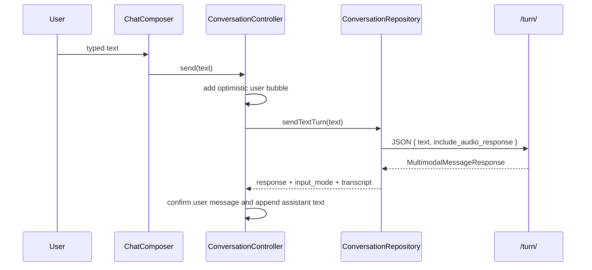
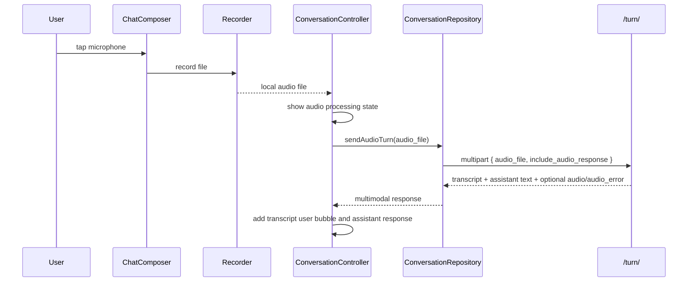

# feat: Integrate mobile multimodal conversation turn API

## Goal Capsule

| Field | Value |
|---|---|
| Objective | Update the Flutter conversation client to use the new conversation-facing multimodal turn contract, starting with safe text `/turn/` migration and preparing the path for audio upload and optional assistant audio playback. |
| Authority | Backend multimodal plan and documented API contract are primary; current Flutter conversation architecture and user's sequencing choice shape rollout. |
| Execution profile | Standard mobile integration touching domain models, repository contracts, network request handling, conversation state, composer UI, tests, and mobile docs. |
| Stop conditions | Stop if the backend response contract differs from `README.md`/`docs/DSL.md`, if mobile package additions require platform setup that cannot be verified locally, or if audio UX decisions would change product behavior beyond this plan. |
| Tail ownership | Implementation should leave existing text-only conversation behavior working first, then add audio upload/playback in separated units without removing backend compatibility endpoints. |

---

## Product Contract

### Summary

Flutter should align with the new conversation-facing multimodal API while preserving the current chat experience.
The first visible behavior change is small: typed messages in an existing conversation should be sent through `/api/conversations/{id}/turn/` instead of the legacy `/message/` endpoint.
After that foundation is stable, the existing microphone affordance can become real by recording an audio file, uploading it as `audio_file`, rendering the backend transcript as the canonical user message, and optionally playing assistant TTS audio when requested.

Product Contract preservation: the backend multimodal Product Contract remains unchanged; this plan narrows it to mobile client integration and stages recorder/player behavior after text migration.

### Problem Frame

The backend now accepts text and recorded audio through conversation routes, but the Flutter app still models conversation sending as text-only JSON.
`ConversationRepository.sendMessage` posts to the legacy `/message/` endpoint and parses only `MessageResponse`.
`ChatComposer` already has a microphone callback slot, but `ConversationScreen` does not wire it, and the app has no audio recording, upload, or playback state.

If Flutter jumps directly to full voice UX, text chat, pending-message reconciliation, grammar feedback polling, and audio errors all change at once.
This plan applies the contract incrementally: parse the new response shape, migrate typed turns, add multipart foundations, then wire audio UX as a separate layer.

### Requirements

- R1. Existing typed conversation messages use `POST /api/conversations/{id}/turn/` and continue to show the same optimistic send, assistant response, reload, retry, and grammar-feedback behavior.
- R2. The Flutter domain model parses multimodal response fields: `input_mode`, `transcript`, `audio`, and `audio_error`, without breaking existing `ConversationResponse` and `MessageResponse` parsing.
- R3. The repository supports both JSON text turns and multipart audio turns while keeping provider secrets entirely backend-side.
- R4. Audio-upload turns use the backend transcript as the canonical user-facing message text.
- R5. Ambiguous or invalid client-side send attempts are prevented where the UI has enough information, while backend validation remains authoritative for no-input, both-input, unsupported content type, and oversized upload cases.
- R6. TTS audio is treated as post-turn enrichment: a returned `audio_error` does not mark the conversation turn as failed or encourage duplicate message retry.
- R7. Free-chat text start keeps current topic-prep behavior, while the repository and controller structure can add audio start without losing topic-prep metadata.
- R8. Recorder/player work is separated from the text `/turn/` migration so implementation can land and test the contract in smaller steps.
- R9. Existing legacy `/message/` support is not deleted in this plan unless implementation proves all mobile callers have safely moved.

### Acceptance Examples

- AE1. Given an active conversation, when the user sends typed text, Flutter posts JSON to `/api/conversations/{id}/turn/` with `text` and renders the returned assistant response as before.
- AE2. Given the `/turn/` response includes `input_mode=text` and `transcript` equal to the submitted text, Flutter parses those fields without changing the visible typed-message flow.
- AE3. Given the user records an audio message, when upload succeeds, Flutter displays the backend transcript as the user bubble and the returned assistant text as the assistant bubble.
- AE4. Given audio upload succeeds but TTS returns `audio_error`, Flutter keeps the text conversation turn successful and surfaces only an audio-generation warning or playback fallback.
- AE5. Given the backend rejects an audio upload before persistence, Flutter shows a send failure that can be retried without adding a confirmed transcript or duplicate assistant response.
- AE6. Given a topic-prep answer starts free chat, the existing text start path still sends `first_message`, `search_context`, `topic`, `conversation_direction`, and `selected_question` unchanged.

### Scope Boundaries

In scope:

- Mobile parsing and use of the backend multimodal response contract.
- Migrating existing typed conversation continuation to `/turn/`.
- Multipart request support for audio turn upload.
- Conversation state changes needed for audio upload, transcript confirmation, and audio-specific failure handling.
- Wiring the existing composer microphone affordance to a recorder flow.
- Optional assistant audio playback and `audio_error` handling after text turn success.
- Mobile tests and mobile documentation updates.

Deferred to Follow-Up Work:

- Realtime/WebRTC voice sessions.
- Pronunciation scoring or waveform-level feedback.
- Voice cloning, custom voice selection, and provider selection UI.
- Moving generated assistant audio from inline base64 to object-storage URLs.
- Full free-chat audio start UX from topic prep; this plan prepares the repository/controller shape but keeps current text topic-prep start as the first preserved behavior.

Outside this plan:

- Backend STT/TTS provider implementation, environment variables, and API docs already covered by `docs/plans/2026-07-17-001-feat-multimodal-conversation-turn-plan.md`.
- Server-side grammar feedback behavior changes.

---

## Planning Contract

### Key Technical Decisions

- KTD1. Migrate typed conversation continuation to `/turn/` before adding recorder UI.
  This proves the new response contract through the lowest-risk path and keeps the current chat UX stable before audio state is introduced.
- KTD2. Add multimodal response models instead of overloading `MessageResponse` silently.
  The new fields carry behaviorally meaningful state; typed turns can ignore audio fields at the UI layer, but parsing should preserve them for later units.
- KTD3. Keep legacy `sendMessage` compatibility during rollout.
  Backend keeps `/message/` available, and test fakes still depend on the current repository surface; implementation can add `sendTextTurn` first and route `ConversationController.send` to it without deleting legacy support.
- KTD4. Let Dio own multipart content-type boundaries.
  The current API client defaults to JSON headers; multipart upload should use `FormData` and a request path that does not force `Content-Type: application/json`.
- KTD5. Treat audio transcript confirmation differently from typed optimistic text.
  For typed text, the submitted text is already canonical enough for optimistic UI.
  For audio, the user-facing text is unknown until STT returns, so the controller should show an uploading/processing state and append or confirm the transcript only after the backend response.
- KTD6. Keep assistant TTS playback optional and non-transactional.
  `audio_error` means the text turn succeeded; UI should not reuse the message retry path that would duplicate a persisted turn.
- KTD7. Preserve topic-prep metadata when adding any future free-chat audio start.
  The backend start route accepts multipart fields alongside `audio_file`, so the mobile API shape must not collapse topic-prep context into a text-only special case.

### High-Level Technical Design

```mermaid
flowchart TB
  Composer[ChatComposer] --> Controller[ConversationController]
  Controller --> Repo[ConversationRepository]
  Repo --> ApiClient[ApiClient / Dio]
  ApiClient --> Turn[/api/conversations/{id}/turn/]
  Turn --> Response[MultimodalMessageResponse]
  Response --> Controller
  Controller --> Messages[ConversationMessage list]
  Response --> AudioGate{audio present or audio_error?}
  AudioGate -->|audio| Player[Assistant audio playback]
  AudioGate -->|audio_error| Warning[Non-blocking audio warning]
```





### Assumptions

- The backend contract documented in `README.md` and `docs/DSL.md` is the source of truth for field names and endpoint paths.
- Mobile can defer `include_audio_response=true` until playback state exists; typed `/turn/` migration can use `include_audio_response=false`.
- Audio recorder/player dependencies may require exact package selection and platform permission details during implementation; the plan records the needed integration points without pinning package versions.
- Existing grammar feedback polling continues to use returned `message_id` and existing message reload behavior.

### Sources & Research

- `docs/plans/2026-07-17-001-feat-multimodal-conversation-turn-plan.md` defines the backend multimodal API goal and acceptance examples.
- `README.md` and `docs/DSL.md` document `/api/conversations/{id}/turn/`, `input_mode`, `transcript`, `audio`, and `audio_error`.
- `mobile/lib/features/conversation/data/api_conversation_repository.dart` currently posts text continuation to `/message/`.
- `mobile/lib/features/conversation/application/conversation_controller.dart` owns optimistic send, retry target, reload, and message-list reconciliation.
- `mobile/lib/features/conversation/presentation/widgets/chat_composer.dart` already exposes an optional `onVoiceInput` callback.
- `mobile/lib/core/network/api_client.dart` currently applies JSON defaults that need care for multipart requests.

---

## Implementation Units

### U1. Add Multimodal Conversation Models

- **Goal:** Represent the new backend response fields in Flutter without disrupting existing text-only parsing.
- **Requirements:** R2, R6
- **Dependencies:** None
- **Files:** `mobile/lib/features/conversation/domain/conversation_models.dart`, `mobile/test/features/conversation/domain/conversation_models_test.dart`
- **Approach:** Add input-mode and audio result value objects, then add multimodal response types that extend or compose the existing start/message response fields.
  Keep legacy `ConversationResponse` and `MessageResponse` valid so existing endpoints and fakes do not break while migration proceeds.
  Treat `audio_error` as data, not an exception, because the backend may return it after a successful persisted text turn.
- **Patterns to follow:** Existing enum parsing in `ConversationType` and `ConversationMessageRole`; existing strict `FormatException` handling for malformed response payloads.
- **Test scenarios:**
  - Happy path: parse a text multimodal message response with `input_mode=text`, `transcript`, no `audio`, no `audio_error`.
  - Happy path: parse an audio multimodal message response with `input_mode=audio`, transcript, and audio metadata.
  - Edge case: parse `grammar_feedback=null`, `audio=null`, and `audio_error=null`.
  - Error path: reject an unknown `input_mode` value.
  - Error path: reject malformed `audio` metadata where `content_type`, `base64`, or `format` is missing or not a string.
- **Verification:** Domain tests prove the new response shape is preserved while existing response tests still pass.

### U2. Move Typed Conversation Sends to `/turn/`

- **Goal:** Make current typed chat use the new continuation endpoint while preserving visible behavior.
- **Requirements:** R1, R2, R6, R9, AE1, AE2
- **Dependencies:** U1
- **Files:** `mobile/lib/features/conversation/domain/conversation_repository.dart`, `mobile/lib/features/conversation/data/api_conversation_repository.dart`, `mobile/lib/features/conversation/application/conversation_controller.dart`, `mobile/test/features/conversation/data/api_conversation_repository_test.dart`, `mobile/test/features/conversation/application/conversation_controller_test.dart`, `mobile/test/features/conversation/presentation/conversation_screen_test.dart`
- **Approach:** Add a text-turn repository method that posts JSON to `conversations/{conversationId}/turn/` with `text` and `include_audio_response=false`.
  Update `ConversationController.send` to use the text-turn method, keep the existing optimistic pending user bubble, and continue appending assistant text from the response.
  Keep the legacy text-message method available until all tests and callers are migrated or a later cleanup plan removes it.
- **Execution note:** Start with repository and controller tests that prove the endpoint path and payload changed while the UI behavior remains the same.
- **Patterns to follow:** Current `sendMessage` repository test structure and current controller optimistic-send/reload behavior.
- **Test scenarios:**
  - Covers AE1. Given typed text, repository posts to `/api/conversations/conversation-id/turn/` with JSON body containing `text` and `include_audio_response=false`.
  - Covers AE2. Given a text multimodal response, controller confirms the local user message with `message_id` and appends the assistant text.
  - Edge case: blank or whitespace-only text is ignored before any repository call.
  - Error path: repository failure preserves the retry target and shows the existing send failure state.
  - Regression: conversation screen still renders existing messages and the back button behavior remains unchanged.
- **Verification:** Typed chat tests pass with `/turn/` as the observed endpoint, and no visible text-chat regression is introduced.

### U3. Add Multipart Audio Turn Request Support

- **Goal:** Provide the data-layer foundation for sending recorded audio files through the multimodal turn endpoint.
- **Requirements:** R3, R4, R5, R7
- **Dependencies:** U1
- **Files:** `mobile/lib/core/network/api_client.dart`, `mobile/lib/features/conversation/domain/conversation_repository.dart`, `mobile/lib/features/conversation/data/api_conversation_repository.dart`, `mobile/test/core/network/api_client_test.dart`, `mobile/test/features/conversation/data/api_conversation_repository_test.dart`
- **Approach:** Add a request path that supports `FormData` without forcing a JSON content type.
  Add an audio-turn repository method that accepts a local audio file descriptor, sends it as `audio_file`, and includes `include_audio_response` as a form field.
  Preserve topic-prep metadata requirements in the API shape for future free-chat audio start, but do not wire that UI in this unit.
- **Patterns to follow:** Existing `ApiClient.post` envelope decoding and Dio adapter-based repository tests.
- **Test scenarios:**
  - Happy path: audio turn repository creates multipart data with `audio_file` and `include_audio_response=false`.
  - Happy path: audio turn repository parses transcript and assistant text from `MultimodalMessageResponse`.
  - Edge case: multipart request does not carry the static JSON content type header.
  - Error path: API validation errors still map through `ApiException.fromDio`.
  - Integration scenario: fake Dio adapter receives the expected `/turn/` path for both text and audio request modes.
- **Verification:** Repository tests prove both JSON and multipart turn paths decode the common response envelope.

### U4. Add Audio Send State and Transcript Reconciliation

- **Goal:** Let conversation state represent an audio upload turn without pretending the local file is already user-facing text.
- **Requirements:** R4, R5, R6, AE3, AE5
- **Dependencies:** U1, U3
- **Files:** `mobile/lib/features/conversation/application/conversation_controller.dart`, `mobile/lib/features/conversation/domain/conversation_models.dart`, `mobile/lib/features/conversation/presentation/conversation_screen.dart`, `mobile/test/features/conversation/application/conversation_controller_test.dart`, `mobile/test/features/conversation/presentation/conversation_screen_test.dart`
- **Approach:** Add controller state for audio send progress and audio-specific failure, separate from typed `failedMessage`.
  On audio send, show a processing state instead of a user text bubble until the backend returns a transcript.
  On success, append a user message containing the transcript and an assistant message containing response text.
  On pre-persistence failure, show retry affordance suitable for the audio turn without fabricating transcript text.
- **Patterns to follow:** Existing `ConversationState.copyWith`, typed send retry card, and `TypingIndicator` for in-flight work.
- **Test scenarios:**
  - Covers AE3. Given audio repository success with transcript, controller appends transcript as the user message and assistant response after it.
  - Covers AE5. Given audio repository failure, controller does not append a confirmed transcript or assistant response.
  - Edge case: audio send is ignored or disabled while another message is sending.
  - Error path: audio failure message does not overwrite a typed retry target unexpectedly.
  - Integration scenario: conversation screen shows an in-flight indicator while audio upload/transcription is pending.
- **Verification:** State tests prove typed and audio failure paths stay distinct and message ordering remains deterministic.

### U5. Wire Recorder UX to the Composer

- **Goal:** Make the existing microphone affordance produce an uploadable audio file and call the audio turn path.
- **Requirements:** R3, R4, R5, R8, AE3, AE5
- **Dependencies:** U3, U4
- **Files:** `mobile/pubspec.yaml`, `mobile/lib/features/conversation/presentation/widgets/chat_composer.dart`, `mobile/lib/features/conversation/presentation/conversation_screen.dart`, `mobile/lib/features/conversation/application/conversation_controller.dart`, `mobile/test/features/conversation/presentation/widgets/conversation_widgets_test.dart`, `mobile/test/features/conversation/presentation/conversation_screen_test.dart`
- **Approach:** Add or select a recorder dependency during implementation, wire permission-aware recording start/stop behavior to `ChatComposer.onVoiceInput`, and pass the resulting file to the controller.
  Keep the UI minimal for MVP: disabled state while sending, clear recording/processing affordance, and explicit failure recovery.
  Avoid adding pronunciation scoring or live streaming concepts.
- **Execution note:** Verify platform permission behavior with a device/simulator smoke pass after widget tests cover state rendering.
- **Patterns to follow:** Current composer enabled/sending lock behavior; existing button tooltip tests.
- **Test scenarios:**
  - Happy path: tapping the microphone invokes the recording flow when composer is enabled and not sending.
  - Edge case: microphone action is disabled while text or audio send is already in progress.
  - Error path: recorder permission denial surfaces a recoverable UI message without attempting upload.
  - Error path: recorder failure surfaces an audio-specific error.
  - Integration scenario: successful recording calls controller audio send with the produced local file descriptor.
- **Verification:** Widget tests cover composer state and manual smoke validation confirms permission prompt and recording lifecycle on target platform.

### U6. Add Optional Assistant Audio Playback Handling

- **Goal:** Consume optional TTS audio results without changing conversation persistence semantics.
- **Requirements:** R5, R6, AE4
- **Dependencies:** U1, U3, U4
- **Files:** `mobile/pubspec.yaml`, `mobile/lib/features/conversation/application/conversation_controller.dart`, `mobile/lib/features/conversation/presentation/conversation_screen.dart`, `mobile/lib/features/conversation/presentation/widgets/conversation_message_tile.dart`, `mobile/test/features/conversation/application/conversation_controller_test.dart`, `mobile/test/features/conversation/presentation/conversation_message_tile_test.dart`, `mobile/test/features/conversation/presentation/conversation_screen_test.dart`
- **Approach:** Keep `include_audio_response=false` until playback is implemented, then request audio only when the UI can play it.
  Decode base64 audio into a temporary playback source or local file according to the chosen player package.
  If `audio_error` is present, keep the assistant text visible and show a non-blocking audio warning or disabled playback affordance.
- **Patterns to follow:** Existing message tile composition with grammar feedback below user messages; existing non-blocking feedback surfaces such as `NaturalFeedbackBadge`.
- **Test scenarios:**
  - Happy path: response with `audio` stores or exposes playable metadata for the assistant message.
  - Covers AE4. Response with `audio_error` keeps the assistant text successful and does not set typed/audio send failure.
  - Edge case: text-only response with no audio keeps the current assistant message rendering unchanged.
  - Error path: playback initialization failure is shown as a playback issue, not as a failed conversation send.
  - Integration scenario: requesting audio response is gated behind playback support and does not affect text-only `/turn/` behavior.
- **Verification:** Tests prove audio enrichment is optional and cannot trigger duplicate message retry after a successful text turn.

### U7. Preserve Free-Chat Start and Prepare Audio Start Extension

- **Goal:** Keep topic-prep text start stable while leaving the repository/controller shape ready for backend-supported audio start.
- **Requirements:** R7, R8, R9, AE6
- **Dependencies:** U1, U3
- **Files:** `mobile/lib/features/conversation/domain/conversation_repository.dart`, `mobile/lib/features/conversation/data/api_conversation_repository.dart`, `mobile/lib/features/conversation/application/start_conversation_controller.dart`, `mobile/lib/features/topic_prep/presentation/topic_prep_screen.dart`, `mobile/test/features/conversation/application/start_conversation_controller_test.dart`, `mobile/test/features/topic_prep/presentation/topic_prep_screen_test.dart`, `mobile/test/features/conversation/data/api_conversation_repository_test.dart`
- **Approach:** Keep current text free-chat start behavior unchanged.
  If implementation introduces a shared input abstraction, ensure it can carry either text or audio plus topic-prep fields without dropping `search_context`, `topic`, `conversation_direction`, or `selected_question`.
  Do not add topic-prep audio UI in this plan unless the recorder UX from U5 is already stable and the scope is explicitly expanded.
- **Patterns to follow:** Current `TopicPrepScreen._startFreeChat` handoff and start conversation controller tests.
- **Test scenarios:**
  - Covers AE6. Topic-prep text start still sends first message and all topic metadata unchanged.
  - Happy path: repository can parse multimodal conversation start response fields if backend returns them for text start.
  - Edge case: optional multimodal fields are absent or null for text start and current parsing remains valid.
  - Regression: roleplay start remains JSON-only and unaffected.
- **Verification:** Topic-prep and start-controller tests pass unchanged or with only response model expectations updated.

### U8. Sync Mobile Documentation and Regression Coverage

- **Goal:** Record the new mobile contract and verification expectations for future work.
- **Requirements:** R1, R2, R3, R6, R8, R9
- **Dependencies:** U1, U2, U3, U4, U5, U6, U7
- **Files:** `mobile/README.md`, `docs/design/DESIGN_SYSTEM.md`, `.agent/_coordination/CHANGELOG.md`, `mobile/test/features/conversation/data/api_conversation_repository_test.dart`, `mobile/test/features/conversation/application/conversation_controller_test.dart`, `mobile/test/features/conversation/presentation/widgets/conversation_widgets_test.dart`
- **Approach:** Update mobile docs to distinguish legacy text `/message/`, current `/turn/` text path, and staged audio support.
  Document that TTS audio is optional enrichment and that `audio_error` is not a failed conversation turn.
  Keep design docs limited to UI behavior if recorder/player states introduce new visible components.
- **Patterns to follow:** Existing mobile README feature sections and changelog one-line completion entries.
- **Test scenarios:**
  - Regression suite: conversation data, controller, screen, and widget tests cover text send, audio upload state, and audio error handling as implemented.
  - Documentation check: mobile README endpoint names match `README.md` and `docs/DSL.md`.
- **Verification:** Documentation reflects the actual staged behavior, and all changed mobile tests pass.

---

## Verification Contract

| Gate | Applies to | Done signal |
|---|---|---|
| Domain model tests | U1, U7 | `conversation_models_test.dart` covers multimodal message/start response parsing and malformed payload rejection. |
| Repository contract tests | U2, U3, U7 | `api_conversation_repository_test.dart` proves `/turn/` JSON and multipart payloads match the backend contract. |
| Controller state tests | U2, U4, U6 | `conversation_controller_test.dart` proves typed send, audio transcript reconciliation, retry boundaries, and audio_error handling. |
| Widget/screen tests | U4, U5, U6 | Composer, conversation screen, and message tile tests cover microphone wiring, disabled states, processing state, and playback/error affordances. |
| Topic-prep regression tests | U7 | Topic-prep start keeps first-message and metadata handoff unchanged. |
| Static analysis and full mobile tests | All units | Flutter analyzer reports no issues and the mobile test suite passes. |

---

## Definition of Done

- Typed messages in existing conversations use `/api/conversations/{id}/turn/` and preserve the current text chat UX.
- Flutter models preserve `input_mode`, `transcript`, `audio`, and `audio_error` from multimodal responses.
- Multipart audio turn support exists in the repository and does not force JSON content type.
- Audio send state uses backend transcript as canonical user text and avoids fabricating user bubbles before STT succeeds.
- Recorder UI is wired only after data-layer audio upload support is tested.
- Assistant TTS audio playback, when enabled, is optional enrichment and `audio_error` does not trigger duplicate message retry.
- Topic-prep text start and roleplay start remain compatible.
- Mobile docs describe the staged multimodal behavior accurately.
- Tests cover the new contract and existing conversation regressions.
- Experimental recorder/player code paths that are not part of the final staged behavior are removed before completion.
