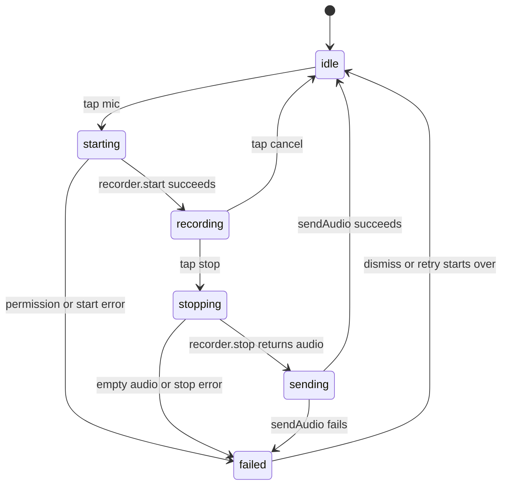
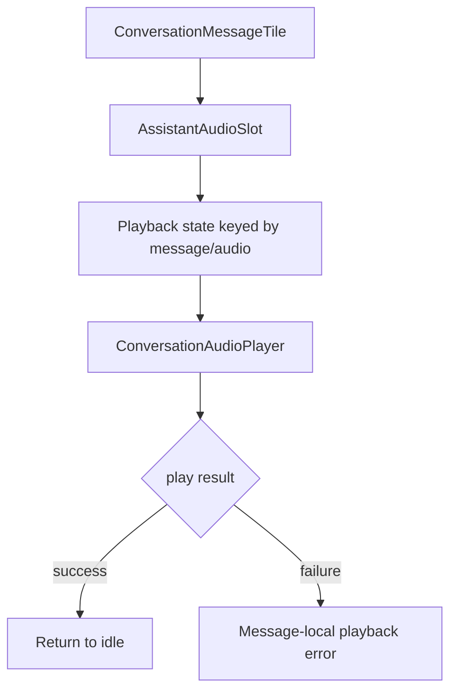

# feat: Polish mobile voice recording and playback

## Goal Capsule

| Field | Value |
|---|---|
| Objective | Turn the existing mobile voice recording and assistant audio playback foundation into a predictable, accessible, product-ready conversation experience. |
| Authority | Current Flutter conversation implementation is the source of truth; the prior multimodal turn plan defines the API contract; this plan scopes only client-side recording/playback UX hardening. |
| Execution profile | Medium mobile follow-up touching recorder/player services, composer state, conversation screen UI, message audio controls, tests, and mobile docs. |
| Stop conditions | Stop if plugin APIs require platform behavior that cannot be verified with unit/widget tests, if backend audio response contract changes, or if product scope expands into realtime voice sessions. |
| Tail ownership | Implementation should keep the committed `/turn/` text/audio flow intact and improve the user-facing audio lifecycle without changing backend behavior. |

---

## Product Contract

### Summary

Curitalk mobile already has a basic path for voice turns: the composer can start/stop recording, upload `.m4a` audio to `/turn/`, show the backend transcript, and play returned assistant audio.
The next step is to make that flow feel deliberate instead of mechanical.
Users should understand when recording is active, avoid accidental text/voice conflicts, recover cleanly from microphone or playback failures, and receive accessible status cues while the app records, uploads, and plays audio.

Product Contract preservation: `docs/plans/2026-07-17-003-feat-mobile-multimodal-turn-plan.md` remains the API integration source; this plan does not change `/turn/`, transcript reconciliation, or backend STT/TTS behavior.

### Problem Frame

The current implementation proves the integration but leaves several product-quality gaps.
`ConversationScreen` stores `_isRecording` and `_voiceErrorMessage` locally, so the UI only distinguishes "recording" from "not recording" and cannot express starting, stopping, upload-in-progress, or cancellation.
`ChatComposer` changes the mic icon to stop while recording, but text input remains active and there is no elapsed time, cancel affordance, or accessibility label that explains the current recording state.
`RecordConversationAudioRecorder.stop()` reads the temp file but does not clean it up after upload preparation.
`AudioplayersConversationAudioPlayer.play()` is stateless from the UI perspective, so repeated taps or playback failures are hard to communicate beyond a snackbar.

This plan strengthens the lifecycle around the already-working API path rather than adding new backend capabilities.

### Requirements

- R1. Voice recording state is explicit enough to represent idle, starting, recording, stopping, sending, failed, and permission-denied states without overloading text send state.
- R2. While recording, the composer prevents conflicting text send/edit actions and exposes clear stop and cancel affordances.
- R3. Recording UI shows an elapsed timer and accessible status text so users can tell that the microphone is actively recording.
- R4. Permission denial, empty recordings, recorder start/stop errors, and upload failures produce distinct, retry-safe UI states.
- R5. Temporary audio files created by recording are cleaned up after successful read, cancellation, or recorder disposal where possible.
- R6. Assistant audio playback exposes play/loading/playing/error states per message and prevents duplicate overlapping play attempts for the same audio response.
- R7. Playback errors remain non-blocking and do not reuse conversation send retry behavior.
- R8. Voice improvements keep the existing text `/turn/`, audio upload, transcript rendering, and grammar-feedback polling behavior intact.
- R9. The implementation remains testable through injectable recorder/player interfaces and widget tests without requiring physical microphone hardware.

### Acceptance Examples

- AE1. Given a conversation is idle, when the user taps the mic button, the composer enters a recording state with a stop button, cancel control, and elapsed timer.
- AE2. Given recording is active, when the user taps cancel, the recorder cancels, no `/turn/` audio upload occurs, and the composer returns to idle.
- AE3. Given recording is active, when the user taps stop, the app stops recording, uploads the resulting audio file, shows sending feedback, and renders the returned transcript and assistant response.
- AE4. Given microphone permission is denied, when the user taps the mic button, the app shows a permission-specific message and does not enter recording state.
- AE5. Given recorder stop returns an empty file, when the user stops recording, the app shows a recording-specific failure and does not call `sendAudioTurn`.
- AE6. Given an assistant message has playable audio, when the user taps play, the button shows playback progress/playing state and ignores duplicate taps until the current play attempt resolves or completes.
- AE7. Given assistant playback fails, the message shows a non-blocking playback error or snackbar, and the message does not show the conversation send retry card.

### Scope Boundaries

In scope:

- Recorder lifecycle state and UI around the existing `ConversationAudioRecorder`.
- Composer recording affordances: timer, stop, cancel, disabled text/send interaction, accessibility labels.
- Safer recorder temp-file cleanup.
- Assistant audio playback state and duplicate-tap prevention.
- Widget/unit tests for state transitions, failure handling, and unchanged text behavior.
- Mobile documentation updates for the polished voice UX.

Deferred to follow-up work:

- Waveform visualization and live input level metering.
- Push-to-talk gestures, lock-to-record, or swipe-to-cancel interactions.
- Playback speed controls.
- Background audio handling, interruption handling for calls, and audio focus policies beyond plugin defaults.
- Persisting assistant audio files for offline replay.
- Realtime/WebRTC voice conversation.

Outside this plan:

- Backend STT/TTS implementation or provider configuration.
- Changing `/api/conversations/{id}/turn/` request/response fields.
- Pronunciation scoring or grammar feedback changes.

---

## Planning Contract

### Key Technical Decisions

- KTD1. Model voice UI lifecycle separately from `ConversationState.isSending`.
  Text sending and audio sending share the final `/turn/` upload stage, but recording has extra local states before an API call exists.
  Keeping a small screen/controller-level voice state avoids stretching `isSending` into a recorder state machine.
- KTD2. Keep recorder/player interfaces injectable and plugin wrappers thin.
  Tests should validate Curitalk behavior without depending on platform microphone or audio output.
  The current `ConversationAudioRecorder` and `ConversationAudioPlayer` abstractions are the right seam to extend.
- KTD3. Disable text editing while recording.
  Voice and text are mutually exclusive inputs for one turn in the backend contract, so the composer should not encourage composing typed text during an active recording.
- KTD4. Add cancel as a first-class action, not as an error path.
  Users need a safe escape hatch after starting the microphone.
  Cancel should not create a failed send state or leave retry targets.
- KTD5. Treat playback as message-local UI state.
  Assistant audio belongs to an individual assistant message.
  Playback status should live near `ConversationMessageTile` or a small playback controller keyed by message/audio identity, not in the conversation send controller.
- KTD6. Clean temp files best-effort without making cleanup failure user-visible.
  Failure to delete a temp file should not block a successful turn, but the implementation should avoid accumulating audio files under normal operation.

### High-Level Technical Design

### Assumptions

- The current `record`, `path_provider`, and `audioplayers` dependencies remain acceptable for this phase.
- Widget tests can verify UI state and fake recorder/player behavior; manual device QA is still needed for actual microphone permission dialogs and audio output.
- The backend may continue returning `audio` only when `include_audio_response=true`; this plan improves playback handling when audio exists but does not require changing the request default.
- Current app copy can stay English because conversation UI labels are already English.

### Sources & Research

- `docs/plans/2026-07-17-003-feat-mobile-multimodal-turn-plan.md` defined the first mobile multimodal turn integration.
- `mobile/lib/features/conversation/application/conversation_audio_services.dart` contains the recorder/player plugin wrappers.
- `mobile/lib/features/conversation/presentation/conversation_screen.dart` currently owns `_isRecording` and `_voiceErrorMessage`.
- `mobile/lib/features/conversation/presentation/widgets/chat_composer.dart` currently provides mic/stop icon switching.
- `mobile/lib/features/conversation/presentation/widgets/conversation_message_tile.dart` currently renders `Play response` and `audio_error`.
- `mobile/test/features/conversation/presentation/conversation_screen_test.dart` and `mobile/test/features/conversation/presentation/conversation_message_tile_test.dart` already provide fake recorder/player patterns.

---

## Implementation Units

### U1. Introduce Voice Recording UI State

- **Goal:** Replace the boolean `_isRecording` screen flag with explicit voice lifecycle state.
- **Requirements:** R1, R4, R8, R9
- **Dependencies:** None
- **Files:** `mobile/lib/features/conversation/presentation/conversation_screen.dart`, `mobile/test/features/conversation/presentation/conversation_screen_test.dart`
- **Approach:** Add a small immutable state object or enum local to the conversation presentation layer for idle, starting, recording, stopping, sending, failed, and permission-denied.
  Keep the API send state in `ConversationController` and let the screen bridge recorder lifecycle into `sendAudio`.
  Store error copy and retry/cancel callbacks in presentation state rather than mixing them into `ConversationState` unless the error belongs to a persisted conversation send.
- **Test scenarios:**
  - Covers AE1. Tapping mic moves from idle to recording after fake recorder start succeeds.
  - Covers AE3. Tapping stop moves through stopping/sending and calls `sendAudio` with the fake audio file.
  - Covers AE4. Fake permission denial shows permission-specific text and leaves recorder state idle or failed without showing stop controls.
  - Covers AE5. Fake empty/stop failure shows a recording failure and does not call repository `sendAudioTurn`.
  - Regression: existing typed send still calls text turn and does not require voice state setup.
- **Verification:** `flutter test test/features/conversation/presentation/conversation_screen_test.dart --reporter=compact`

### U2. Upgrade Composer Recording Controls

- **Goal:** Make active recording visible, cancellable, and mutually exclusive with typed input.
- **Requirements:** R2, R3, R4, R8
- **Dependencies:** U1
- **Files:** `mobile/lib/features/conversation/presentation/widgets/chat_composer.dart`, `mobile/test/features/conversation/presentation/widgets/conversation_widgets_test.dart`
- **Approach:** Extend `ChatComposer` props to accept recording status, elapsed duration text, optional cancel callback, and recording-specific busy state.
  While recording, disable the text field and send button, keep stop available, and show a compact elapsed timer/status next to the mic controls.
  Use icon buttons for stop/cancel and tooltips/semantics labels for accessibility.
- **Test scenarios:**
  - Covers AE1. Recording composer shows stop control, cancel control, and elapsed timer text.
  - Covers AE2. Cancel control invokes the provided callback and does not invoke send.
  - Text input is disabled while recording.
  - Send button is disabled while recording even if the text controller contains text.
  - Starting/stopping busy states disable duplicate mic taps while preserving clear visual feedback.
- **Verification:** `flutter test test/features/conversation/presentation/widgets/conversation_widgets_test.dart --reporter=compact`

### U3. Add Recording Timer and Cancellation Cleanup

- **Goal:** Track elapsed recording time and clean local temp files on cancel, stop, and dispose.
- **Requirements:** R3, R5, R9
- **Dependencies:** U1
- **Files:** `mobile/lib/features/conversation/application/conversation_audio_services.dart`, `mobile/lib/features/conversation/presentation/conversation_screen.dart`, `mobile/test/features/conversation/application/conversation_audio_services_test.dart`, `mobile/test/features/conversation/presentation/conversation_screen_test.dart`
- **Approach:** Keep the timer in presentation state with a periodic ticker that starts only after recorder start succeeds and is cancelled on stop/cancel/dispose.
  Enhance the recorder wrapper so it deletes the current temp file after successful read and on cancel best-effort.
  Add testable collaborators where direct `File` deletion would otherwise be hard to verify.
- **Test scenarios:**
  - Timer displays `0:00` or equivalent initial state and advances after fake async ticks.
  - Timer stops advancing after stop or cancel.
  - Cancel calls recorder cancel and clears the current recording path.
  - Successful `stop()` returns bytes and attempts best-effort file deletion.
  - Dispose during active recording cancels the recorder and timer without throwing.
- **Verification:** `flutter test test/features/conversation/application/conversation_audio_services_test.dart test/features/conversation/presentation/conversation_screen_test.dart --reporter=compact`

### U4. Harden Assistant Audio Playback State

- **Goal:** Move assistant audio playback from a stateless button into a message-local play state with duplicate-tap prevention and clear failures.
- **Requirements:** R6, R7, R9
- **Dependencies:** None
- **Files:** `mobile/lib/features/conversation/application/conversation_audio_services.dart`, `mobile/lib/features/conversation/presentation/widgets/conversation_message_tile.dart`, `mobile/test/features/conversation/presentation/conversation_message_tile_test.dart`
- **Approach:** Add a lightweight playback state holder for idle, loading, playing, and error keyed by message/audio identity, or make `_AssistantAudioSlot` stateful if scope stays local.
  Disable the play button while loading/playing the same audio and show progress or a playing icon.
  Keep failures near the assistant audio slot or snackbar, but never show the conversation retry card.
- **Test scenarios:**
  - Covers AE6. First play tap calls the fake player once and enters loading/playing state.
  - Duplicate taps while playback is in progress do not call the fake player again.
  - Covers AE7. Fake playback failure shows non-blocking playback error and no `Retry` text.
  - Existing `audio_error` rendering still shows backend TTS failure text without play controls.
- **Verification:** `flutter test test/features/conversation/presentation/conversation_message_tile_test.dart --reporter=compact`

### U5. Align Conversation Failure and Retry Semantics

- **Goal:** Keep voice recording failures, upload failures, and playback failures visually distinct.
- **Requirements:** R4, R7, R8
- **Dependencies:** U1, U4
- **Files:** `mobile/lib/features/conversation/application/conversation_controller.dart`, `mobile/lib/features/conversation/presentation/conversation_screen.dart`, `mobile/test/features/conversation/application/conversation_controller_test.dart`, `mobile/test/features/conversation/presentation/conversation_screen_test.dart`
- **Approach:** Confirm that only failed `/turn/` uploads populate `failedAudioFile` and the send retry card.
  Recorder permission/start/stop errors should live in voice UI state and retry by starting a new recording, not by reusing an absent audio file.
  Playback failures should stay message-local.
- **Test scenarios:**
  - Upload failure keeps `failedAudioFile` and retry calls `sendAudio` with the same file.
  - Recorder start failure does not set `failedAudioFile`.
  - Recorder stop failure does not append transcript or assistant message.
  - Playback failure does not alter `ConversationState.failedMessage`, `failedAudioFile`, or `errorMessage`.
- **Verification:** `flutter test test/features/conversation/application/conversation_controller_test.dart test/features/conversation/presentation/conversation_screen_test.dart --reporter=compact`

### U6. Document and QA the Voice UX

- **Goal:** Keep mobile docs and test contract aligned with the polished recording/playback behavior.
- **Requirements:** R8, R9
- **Dependencies:** U1, U2, U3, U4, U5
- **Files:** `mobile/README.md`, `.agent/_coordination/CHANGELOG.md`
- **Approach:** Update the Conversation section with the finalized recording lifecycle, cancellation behavior, playback behavior, and the need for real-device microphone QA.
  Keep API docs unchanged unless implementation changes request fields, which this plan does not intend.
- **Test scenarios:**
  - Documentation accurately distinguishes recorder errors, upload retry, and playback errors.
  - Manual QA checklist includes microphone permission denied, cancel, stop/upload, assistant audio playback, and playback failure if a fake or debug path is available.
- **Verification:** `git diff --check`

---

## Verification Contract

| Gate | Command | Proves |
|---|---|---|
| Static analysis | `flutter analyze --no-pub` from `mobile/` | New state classes, timers, providers, and widget APIs are analyzer-clean. |
| Conversation screen tests | `flutter test test/features/conversation/presentation/conversation_screen_test.dart --reporter=compact` from `mobile/` | Recording lifecycle, cancel/stop/failure, and unchanged route behavior. |
| Composer widget tests | `flutter test test/features/conversation/presentation/widgets/conversation_widgets_test.dart --reporter=compact` from `mobile/` | Recording controls, disabled text/send states, timer/status UI. |
| Audio service tests | `flutter test test/features/conversation/application/conversation_audio_services_test.dart --reporter=compact` from `mobile/` | Recorder cleanup and player wrapper behavior where testable. |
| Message tile tests | `flutter test test/features/conversation/presentation/conversation_message_tile_test.dart --reporter=compact` from `mobile/` | Playback state, duplicate-tap prevention, non-blocking playback errors. |
| Controller tests | `flutter test test/features/conversation/application/conversation_controller_test.dart --reporter=compact` from `mobile/` | Upload retry semantics remain distinct from recorder/playback failures. |
| Full mobile tests | `flutter test --reporter=compact` from `mobile/` | Cross-feature regressions, especially text chat and topic-prep start. |
| Diff hygiene | `git diff --check` from repo root | No whitespace or markdown formatting regressions. |

Manual device QA remains required for platform permission dialogs and actual microphone/speaker behavior because widget tests cannot exercise OS-level audio permissions or output devices.

---

## Definition of Done

- U1 done when voice lifecycle state can express idle, starting, recording, stopping, sending, failed, and permission-denied cases, with tests for successful start/stop and start/stop failures.
- U2 done when the composer disables conflicting text actions during recording and exposes stop, cancel, elapsed time, and accessible labels.
- U3 done when timer lifecycle and recorder temp-file cleanup are implemented and covered by focused tests.
- U4 done when assistant audio playback has loading/playing/error UI and duplicate play taps are prevented.
- U5 done when recorder failures, upload failures, and playback failures have separate retry/error semantics.
- U6 done when mobile documentation names the final voice lifecycle and manual QA checklist.
- Existing text conversation behavior, topic-prep first answer flow, and grammar feedback polling remain green.
- All verification commands in the Verification Contract pass, except manual device QA may be recorded as pending if no simulator/device with microphone permission testing is available.
