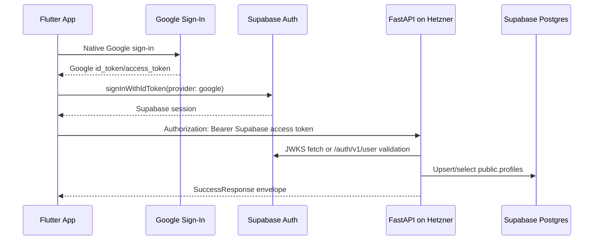
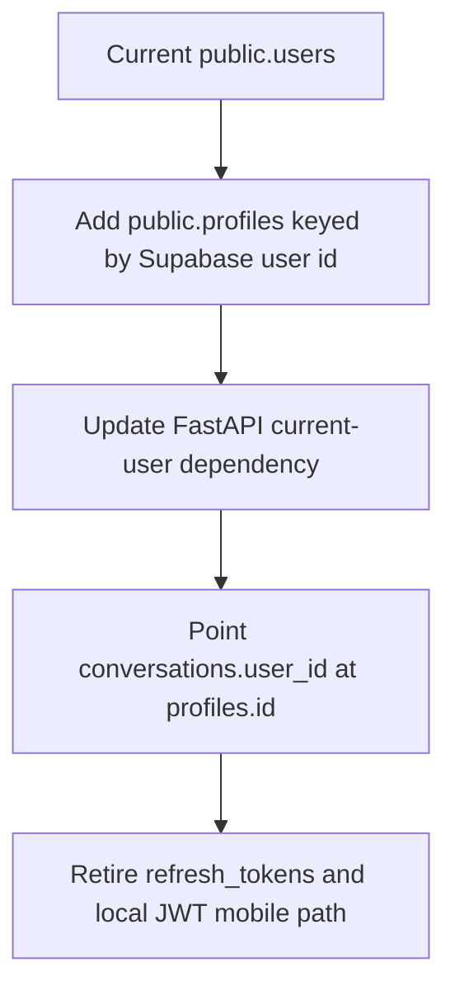

# Supabase Auth Transition - Plan

## Goal Capsule

| Field | Value |
|---|---|
| Objective | Move Curitalk authentication from FastAPI-issued JWT/refresh tokens to Supabase Auth while keeping FastAPI as the API and LLM orchestration server. |
| Authority | User decision: Supabase Postgres is already connected and the next step is Supabase Auth transition planning. |
| Execution profile | Deep, security-sensitive refactor touching mobile auth, backend auth dependencies, DB schema, API contracts, and deployment configuration. |
| Stop conditions | Stop if Supabase project auth settings are unavailable, if the DB already contains user data that needs preservation beyond internal testing, or if JWT verification cannot be proven against real Supabase access tokens. |
| Tail ownership | Implementation should finish with backend and mobile tests, Supabase Dashboard setup notes, and README/DSL/mobile docs synchronized. |

---

## Product Contract

### Summary

Curitalk should use Supabase Auth as the identity/session provider so future social login providers can be added without rebuilding the backend auth system each time.
Flutter remains the user-facing client, and Hetzner FastAPI remains the protected backend that handles conversation, search, grammar feedback, and voice/LLM operations.
Supabase Postgres remains the application database, but Supabase-managed `auth.users` becomes the identity source of truth.

### Problem Frame

The current backend owns Google id token verification, local JWT issuance, refresh-token rotation, and `public.users`.
That works for a single Google login path, but it becomes repetitive and fragile as soon as Curitalk adds Apple, Kakao, or other SNS login.
Moving auth to Supabase reduces custom security surface area and lets the app treat social login providers as Supabase sessions.

### Requirements

- R1. Flutter login must create and restore a Supabase session using Google native sign-in for v1.
- R2. FastAPI protected endpoints must accept Supabase access tokens in `Authorization: Bearer <token>`.
- R3. FastAPI must reject expired, malformed, wrong-project, or inactive-user Supabase tokens with `401`.
- R4. App-owned user profile data must move out of local `public.users` into a `public.profiles` table keyed by Supabase user id.
- R5. Conversations, messages, grammar feedback, search prep, and voice flows must continue to use the authenticated user boundary with no client-visible behavior change except token source.
- R6. FastAPI-issued access/refresh token APIs must be deprecated or removed from the mobile primary path.
- R7. Swagger/manual API testing must document how to obtain and paste a Supabase access token.
- R8. Environment variables and deployment docs must distinguish public mobile Supabase values from server-only secrets.

### Acceptance Examples

- AE1. Given a fresh install, when the learner taps Google login and completes Google auth, then Supabase creates or restores a session and the app lands on Home.
- AE2. Given a signed-in learner, when the app calls `GET /api/auth/me`, then FastAPI verifies the Supabase access token and returns the learner profile envelope expected by the mobile app.
- AE3. Given an expired Supabase access token, when the app calls any protected FastAPI endpoint, then the mobile Supabase session refresh path supplies a fresh token and retries once.
- AE4. Given a copied stale or wrong-project bearer token in Swagger, when a protected API is called, then FastAPI returns `401` and does not create or expose profile data.
- AE5. Given an existing conversation screen, when a signed-in learner sends a message after the transition, then ownership checks still use the Supabase user id and the message is persisted under the same authenticated user boundary.

### Scope Boundaries

- In scope: Supabase Auth setup support, Flutter Supabase session integration, FastAPI Supabase JWT verification, `profiles` schema migration, auth route cleanup, docs and tests.
- Deferred to Follow-Up Work: Apple/Kakao provider UI, Supabase RLS policies for direct client DB access, account deletion UX, migration of real production user data, and managed secrets automation on Hetzner.
- Outside this product's identity: replacing FastAPI with Supabase Edge Functions or moving LLM/search/grammar logic directly into the mobile app.

---

## Planning Contract

### Key Technical Decisions

- KTD1. Supabase Auth becomes the session authority, while FastAPI remains the business API. This keeps LLM/API keys server-only and avoids turning the mobile app into a direct database client.
- KTD2. Use Supabase native Google sign-in via `google_sign_in` plus `supabase.auth.signInWithIdToken` for v1. This preserves the current native Google UX and matches Supabase Flutter guidance for Android/iOS.
- KTD3. Verify FastAPI bearer tokens as Supabase JWTs. Prefer JWKS verification for projects using asymmetric signing keys; if the Supabase project uses legacy shared-secret signing, use Supabase Auth `/user` verification or explicitly switch the project to asymmetric keys before rollout.
- KTD4. Introduce `public.profiles` instead of continuing to use `public.users`. Supabase manages `auth.users`; app-owned columns like display name and active state belong in `public.profiles`.
- KTD5. Let Supabase SDK manage refresh behavior on mobile. Remove the custom `/api/auth/refresh` dependency from the primary mobile path and make Dio fetch the current Supabase access token before protected requests.
- KTD6. Keep API envelope compatibility for app-facing protected endpoints. `/api/auth/me` should still return `SuccessResponse[UserProfile]` so the rest of the app can migrate incrementally.
- KTD7. Treat the existing initial Alembic migration as a pre-auth baseline. Add a second migration for profile/user-id transition instead of editing the already-generated initial migration after it has been applied to Supabase.

### High-Level Technical Design

### Assumptions

- Supabase Postgres connection and the initial Alembic schema migration have already been applied.
- There is no production user data that must be preserved from `public.users`; if data exists, implementation must add a preservation/backfill branch before applying destructive changes.
- Mobile v1 still exposes only Google login, but the architecture should not block later Apple/Kakao providers.
- FastAPI uses a server-side Postgres connection and remains the only application writer for conversation data in this phase.
- Supabase Dashboard provider setup is performed manually and documented, not automated by repository code.

### Dependencies / Prerequisites

- Supabase project URL and publishable key for mobile.
- Supabase Google provider enabled with the correct Web OAuth client ID and client secret.
- Android/iOS Google OAuth client IDs configured for the released app bundle identifiers.
- Supabase Auth JWT signing mode known before backend verifier implementation.
- Alembic access to the Supabase DB from the developer machine or Hetzner deployment shell.

### Sources & Research

- Supabase Flutter initialization uses `supabase_flutter` with project URL and publishable key: https://supabase.com/docs/guides/getting-started/quickstarts/flutter
- Supabase Flutter supports native Google sign-in using `google_sign_in` and `signInWithIdToken`: https://pub.dev/documentation/supabase_flutter/latest/
- Supabase Google provider supports native applications and requires Google provider configuration: https://supabase.com/docs/guides/auth/social-login/auth-google
- Supabase user data guidance recommends `public.profiles` referencing `auth.users` and keeping app-owned profile data outside the Auth schema: https://supabase.com/docs/guides/auth/managing-user-data
- Supabase JWT guidance documents JWKS verification and the `/auth/v1/user` verification path for shared-secret projects: https://supabase.com/docs/guides/auth/jwts
- Supabase auth state changes require an `onError` handler because refresh/network errors can be emitted through the stream: https://supabase.com/docs/reference/dart/auth-onauthstatechange

---

## System-Wide Impact

- Backend auth boundary changes from local JWT decoding to Supabase JWT verification, affecting every route that uses `get_current_user` or token-param auth.
- Mobile session state changes from local `AuthTokens` storage and custom refresh interceptor to Supabase session state.
- DB ownership semantics change from `public.users.id` to Supabase user id / `public.profiles.id`.
- Existing tests that mock `AuthRepository`, token storage, and `/api/auth/google/mobile` need contract updates.
- Swagger/manual testing changes because old dev tokens will no longer authenticate against Supabase JWT verification.

---

## Risks & Dependencies

| Risk | Impact | Mitigation |
|---|---|---|
| Supabase JWT signing mode mismatch | FastAPI rejects valid users or accepts tokens incorrectly | Confirm asymmetric vs shared-secret signing before implementation; write verifier tests for both accepted and rejected token shapes. |
| Destructive migration after real data exists | Conversation ownership can break | Gate migration with a no-production-data check or add a backfill path before dropping `public.users`/`refresh_tokens`. |
| Mobile refresh behavior changes | Users can be unexpectedly signed out during offline/expired-token states | Use Supabase `onAuthStateChange` with `onError`, and keep network failures distinguishable from signed-out state. |
| Swagger testing loses dev token convenience | Manual API testing slows down | Document Supabase access-token copy flow and consider a later local-only dev auth bypass if needed. |
| Mixed old/new auth routes | Duplicate logic creates inconsistent sessions | Mark old FastAPI auth routes as deprecated in docs and remove mobile callers in the same implementation PR. |

---

## Implementation Units

### U1. Add Supabase configuration surfaces

- **Goal:** Add explicit backend and mobile configuration for Supabase Auth without exposing server-only secrets to Flutter.
- **Requirements:** R1, R2, R8
- **Dependencies:** None
- **Files:** `backend/config.py`, `.env.example`, `README.md`, `docs/DSL.md`, `mobile/lib/core/config/app_config.dart`, `mobile/pubspec.yaml`, `mobile/README.md`, `mobile/test/core/config/app_config_test.dart`
- **Approach:** Add backend settings such as `SUPABASE_URL`, `SUPABASE_PUBLISHABLE_KEY`, optional `SUPABASE_JWKS_URL`, and verifier cache settings. Add mobile dart-define values for `SUPABASE_URL` and `SUPABASE_PUBLISHABLE_KEY`. Keep `SUPABASE_SERVICE_ROLE_KEY` out of mobile and out of this phase unless a later server-side admin operation proves necessary.
- **Patterns to follow:** Existing `AppConfig` dart-define pattern in `mobile/lib/core/config/app_config.dart`; existing `.env.example` / `README.md` N-way sync rules.
- **Test scenarios:**
  - Backend settings load successfully when Supabase values are present.
  - Backend settings raise a clear configuration error when Supabase auth mode is enabled but `SUPABASE_URL` is missing.
  - Mobile `AppConfig` returns null/empty-safe optional values for missing Supabase defines and exact strings for provided values.
- **Verification:** Configuration docs and tests make it impossible to confuse publishable mobile keys with server-only secrets.

### U2. Migrate app user schema to profiles

- **Goal:** Replace app-owned `public.users` identity storage with `public.profiles` keyed by Supabase user id.
- **Requirements:** R4, R5
- **Dependencies:** U1
- **Files:** `backend/domains/auth/models.py`, `backend/domains/auth/repository.py`, `backend/domains/auth/schemas.py`, `backend/domains/conversation/models.py`, `backend/alembic/versions/*.py`, `backend/tests/domains/auth/test_profiles_repository.py`, `backend/tests/domains/conversation/test_conversation_repository.py`
- **Approach:** Add `ProfileModel` with profile fields needed by `UserProfile`. Change conversation ownership FK to the profile id. Because the current public user ids are string UUIDs, implementation must decide whether to use PostgreSQL UUID columns for profile/user_id or keep string UUIDs; prefer UUID columns if no existing data needs preservation. Retire `RefreshTokenModel` when the old refresh path is removed.
- **Patterns to follow:** Existing Alembic migration structure in `backend/alembic/versions/74f2791a314a_create_initial_schema.py`; current SQLAlchemy model/repository layering.
- **Test scenarios:**
  - Alembic autogenerate/manual migration creates `profiles` with the required columns and ownership keys.
  - Conversation repository queries still filter by authenticated user id after the FK target changes.
  - If no old user data exists, migration can run on a fresh Supabase DB and downgrade cleanly.
  - If old user rows exist during implementation testing, migration refuses destructive behavior or documents a backfill path.
- **Verification:** Supabase Table Editor shows `profiles`, conversation ownership references the new profile identity, and no mobile-facing profile field disappears.

### U3. Replace FastAPI JWT dependency with Supabase JWT verification

- **Goal:** Make `get_current_user` and token-param auth accept Supabase access tokens and return the local profile.
- **Requirements:** R2, R3, R4, R5
- **Dependencies:** U1, U2
- **Files:** `backend/domains/auth/dependencies.py`, `backend/domains/auth/service.py`, `backend/domains/auth/repository.py`, `backend/domains/auth/schemas.py`, `backend/domains/auth/supabase.py`, `backend/tests/domains/auth/test_supabase_jwt_auth.py`, `backend/tests/domains/auth/test_google_mobile_auth.py`, `backend/tests/domains/auth/test_dev_token.py`
- **Approach:** Introduce a small Supabase auth verifier module that validates issuer, audience/project, expiry, signature, and subject. On successful verification, upsert or fetch `ProfileModel` from JWT claims such as `sub`, `email`, and user metadata. Preserve `UserProfile` response shape. Remove old `AuthService.decode_access_token` from protected dependencies or keep it only for explicitly local-dev compatibility if the implementation chooses a documented dev bypass.
- **Technical design:** Directional verifier contract:
  - input: bearer token string
  - output: verified subject id plus email/name claims
  - failure: `AuthenticationException`
  - profile path: `verify token -> upsert profile if missing -> return profile`
- **Patterns to follow:** Existing `AuthenticationException` handling in `backend/domains/auth/dependencies.py`; existing repository exception behavior.
- **Test scenarios:**
  - Valid Supabase JWT returns a profile and creates one if missing.
  - Expired JWT returns `401`.
  - Wrong issuer/project JWT returns `401`.
  - Missing `sub` or email claim returns `401` or a profile-specific validation error without creating a partial profile.
  - Token-param SSE dependency uses the same verifier logic as bearer auth.
  - Existing protected conversation route tests continue to prove ownership isolation.
- **Verification:** All protected backend routes authenticate with Supabase access tokens and reject local FastAPI JWTs unless a documented dev-only compatibility path is intentionally retained.

### U4. Initialize Supabase in Flutter and make session state authoritative

- **Goal:** Initialize Supabase before `CuritalkApp` and expose a Riverpod-friendly Supabase session source.
- **Requirements:** R1, R5, R8
- **Dependencies:** U1
- **Files:** `mobile/lib/main.dart`, `mobile/lib/features/auth/data/supabase_auth_service.dart`, `mobile/lib/features/auth/auth.dart`, `mobile/lib/features/auth/application/auth_controller.dart`, `mobile/test/features/auth/application/auth_controller_test.dart`
- **Approach:** Add `supabase_flutter`, initialize it with `SUPABASE_URL` and `SUPABASE_PUBLISHABLE_KEY`, and listen to `supabase.auth.onAuthStateChange` with an `onError` handler. `AuthController` should restore from `supabase.auth.currentSession` instead of local `AuthTokens`.
- **Patterns to follow:** Current Riverpod `AuthController` session publication and `go_router` redirect model.
- **Test scenarios:**
  - App starts unauthenticated when Supabase current session is null.
  - App restores authenticated state when Supabase current session exists and `/auth/me` succeeds.
  - Supabase auth stream `signedOut` event publishes unauthenticated state.
  - Supabase auth stream error does not crash the app and preserves retryable state.
- **Verification:** Splash → Login → Home routing still depends on `AuthSession`, but the source of truth is Supabase session state.

### U5. Move mobile Google login to Supabase session creation

- **Goal:** Replace the backend `/auth/google/mobile` token exchange with Supabase `signInWithIdToken`.
- **Requirements:** R1, R5, R6
- **Dependencies:** U4
- **Files:** `mobile/lib/features/auth/data/google_identity_service.dart`, `mobile/lib/features/auth/data/api_auth_repository.dart`, `mobile/lib/features/auth/domain/auth_repository.dart`, `mobile/lib/features/auth/application/auth_controller.dart`, `mobile/lib/features/auth/presentation/login_screen.dart`, `mobile/test/features/auth/data/api_auth_repository_test.dart`, `mobile/test/features/auth/application/auth_controller_test.dart`
- **Approach:** Keep native `google_sign_in` to obtain Google id/access tokens, then call Supabase `signInWithIdToken(provider: google, ...)`. After Supabase session creation, call FastAPI `/auth/me` to ensure the backend profile exists and to hydrate the app's existing `UserProfile`. Logout should call Supabase sign-out and then clear app-level state.
- **Patterns to follow:** Existing Google identity error handling in `LoginScreen`; current repository boundary so UI does not know Dio details.
- **Test scenarios:**
  - Google cancel leaves the app on Login with no error.
  - Google token success calls Supabase sign-in and then `/auth/me`.
  - Supabase sign-in error surfaces a user-readable login error and does not call `/auth/me`.
  - Logout calls Supabase sign-out and publishes unauthenticated state even if backend profile fetch had failed earlier.
- **Verification:** `POST /api/auth/google/mobile`, `/auth/refresh`, and `/auth/logout` are no longer used by Flutter's primary auth path.

### U6. Replace Dio token refresh with Supabase access-token injection

- **Goal:** Ensure every protected FastAPI request receives the current Supabase access token and relies on Supabase SDK refresh behavior.
- **Requirements:** R2, R3, R5
- **Dependencies:** U4, U5
- **Files:** `mobile/lib/core/network/auth_token_interceptor.dart`, `mobile/lib/core/network/token_refresh_interceptor.dart`, `mobile/lib/core/network/api_client.dart`, `mobile/lib/core/network/network_providers.dart`, `mobile/test/core/network/auth_token_interceptor_test.dart`, `mobile/test/core/network/token_refresh_interceptor_test.dart`
- **Approach:** Replace `TokenStorage`-based bearer injection with a Supabase session token provider. Remove or disable the custom `TokenRefreshInterceptor`; if a request receives `401`, ask Supabase for the current session once and retry only if the access token changed. Avoid implementing a second refresh system.
- **Patterns to follow:** Current single-retry guard in `TokenRefreshInterceptor`; current `requiresAuth` extra flag contract.
- **Test scenarios:**
  - Protected request includes `Authorization: Bearer <supabase access token>`.
  - Public request with `requiresAuth=false` omits Authorization.
  - `401` with unchanged/missing session publishes unauthenticated state or surfaces unauthorized without infinite retry.
  - `401` after Supabase refresh retries once with the new token.
- **Verification:** No request path posts to `/api/auth/refresh`, and simultaneous unauthorized responses cannot start multiple custom refresh flows.

### U7. Retire local auth endpoints from the primary API contract

- **Goal:** Remove or explicitly demote FastAPI-issued auth APIs so app and docs do not advertise two session systems.
- **Requirements:** R6, R7, R8
- **Dependencies:** U3, U5, U6
- **Files:** `backend/domains/auth/router.py`, `backend/domains/auth/service.py`, `backend/domains/auth/schemas.py`, `backend/tests/domains/auth/test_google_mobile_auth.py`, `backend/tests/domains/auth/test_dev_token.py`, `README.md`, `docs/DSL.md`, `docs/UX_FEEDBACK.md`, `.agent/architecture.md`, `mobile/README.md`
- **Approach:** Remove mobile primary docs for `/api/auth/google/mobile`, `/api/auth/refresh`, and `/api/auth/logout`. Keep `/api/auth/me` as the backend profile endpoint. If Swagger convenience is still needed, document how to get a Supabase access token instead of issuing local dev JWTs. Retain old endpoints only if marked legacy and isolated from mobile docs.
- **Patterns to follow:** Existing N-way sync rule for API endpoints and environment variables.
- **Test scenarios:**
  - `/api/auth/me` returns the same envelope shape with a Supabase token.
  - Removed or legacy endpoints are not referenced by mobile code tests.
  - README and DSL list Supabase Auth variables and testing steps consistently.
- **Verification:** API docs describe one mobile auth path: Supabase Auth session → FastAPI bearer token verification.

### U8. Validate end-to-end auth and protected flows

- **Goal:** Prove Supabase Auth works through real user flows before Play internal testing.
- **Requirements:** R1, R2, R3, R5, R7
- **Dependencies:** U1, U2, U3, U4, U5, U6, U7
- **Files:** `backend/tests/domains/auth/test_supabase_jwt_auth.py`, `backend/tests/domains/conversation/test_conversation_router.py`, `mobile/test/app/app_test.dart`, `mobile/test/features/conversation/presentation/conversation_screen_test.dart`, `mobile/README.md`
- **Approach:** Add automated tests around mocked Supabase JWT/session surfaces, then document manual QA with a real Supabase project. Manual QA should cover Google login, Home restore, Topic Prep, conversation send, grammar polling, History, Profile logout, app restart, and wrong-token rejection in Swagger.
- **Patterns to follow:** Current app flow widget tests in `mobile/test/app/app_test.dart`; current backend auth router tests.
- **Test scenarios:**
  - Fresh login reaches Home and shows profile state.
  - App restart restores the Supabase session and fetches recent conversations.
  - Conversation send persists under the Supabase user id.
  - Logout signs out locally and Supabase session is gone.
  - Swagger request with a valid Supabase access token succeeds; wrong-project token fails.
- **Verification:** Internal testing candidate build can talk to Hetzner FastAPI over HTTPS and Supabase Auth without local JWT endpoints.

---

## Verification Contract

| Gate | Applies to | Expected result |
|---|---|---|
| Backend auth unit tests | U2, U3, U7, U8 | Supabase JWT/profile behavior is covered without relying on live Supabase for unit tests. |
| Backend protected route tests | U3, U8 | Conversation and grammar ownership tests still pass with Supabase-authenticated current user. |
| Alembic upgrade/downgrade smoke | U2 | Fresh Supabase/staging DB reaches `head`; downgrade works in disposable DB. |
| Flutter auth tests | U4, U5, U6 | AuthController, login screen, token injection, and logout tests reflect Supabase session behavior. |
| Flutter app flow tests | U4, U5, U8 | Splash/Login/Home routing still works with the new session source. |
| Manual Supabase QA | U8 | Real Google login on Android device reaches Home and protected API calls succeed through Hetzner HTTPS. |

---

## Documentation / Operational Notes

- Supabase Dashboard setup must be documented: Google provider client ID/secret, redirect URL expectations, mobile OAuth client IDs, and JWT signing mode.
- Hetzner `.env` must include Supabase backend verification values and must not include mobile-only secrets in Flutter artifacts.
- Mobile `.env.release.json` should contain Supabase project URL and publishable key; those are public by design but still environment-specific.
- Swagger testing docs should explain how to obtain a Supabase access token from a signed-in session or Supabase tooling.
- The old `JWT_SECRET_KEY` may remain for unrelated legacy tooling only if local JWT endpoints remain; otherwise it should be removed from required production configuration.

---

## Definition of Done

- Supabase Auth is the only primary mobile login/session path.
- FastAPI protected endpoints verify Supabase access tokens and return the existing response envelope style.
- `profiles` is the app-owned profile table and protected data uses Supabase user identity consistently.
- Flutter no longer depends on FastAPI `/api/auth/google/mobile`, `/api/auth/refresh`, or `/api/auth/logout` for the primary path.
- Backend and mobile tests cover valid, expired, wrong-project, signed-out, refresh, and logout scenarios.
- README, DSL, architecture, UX, and mobile docs describe the same auth flow and environment variables.
- Manual QA succeeds against Hetzner HTTPS API and Supabase Auth on at least one Android device before Play internal testing.
