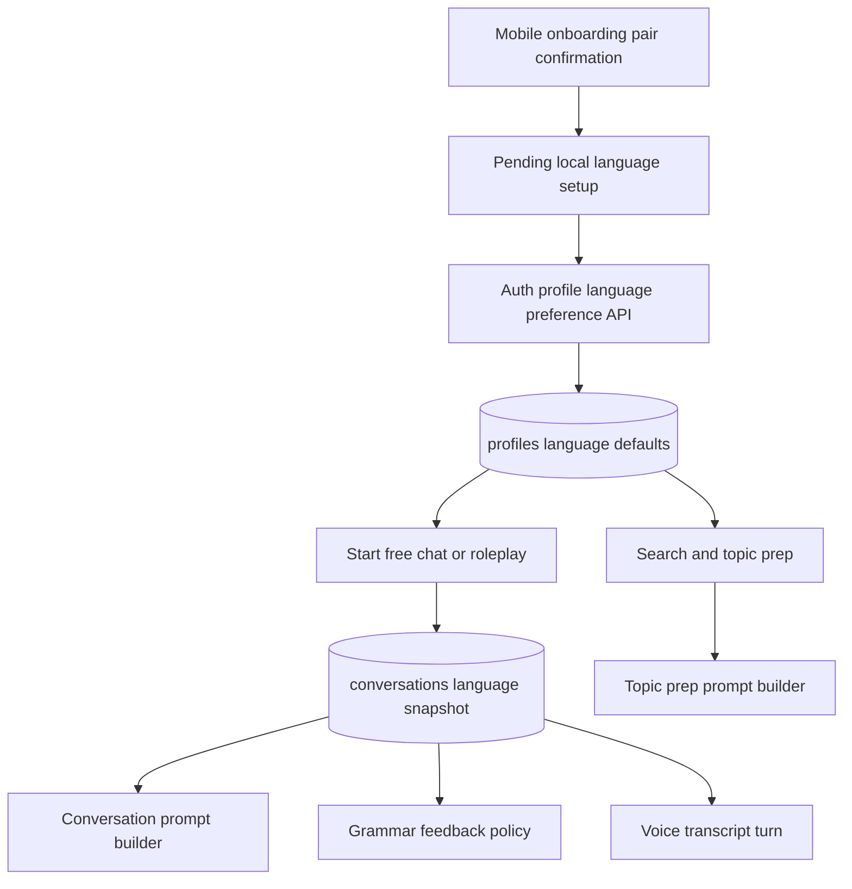
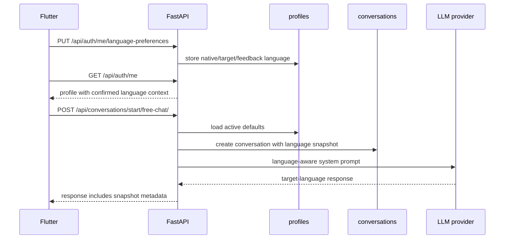

# Language Pairs Domain Refactor - Plan

## Goal Capsule

| Field | Value |
|---|---|
| Objective | Promote learner language settings from English-only prompt assumptions into a first-class product and API contract that supports Korean speakers learning English, English speakers learning Korean, and Chinese speakers learning Korean or English. |
| Authority | User direction: the service should expand beyond Korean users learning English, and language pair selection should be part of first-run UX rather than a per-conversation burden. |
| Execution profile | Deep cross-surface refactor touching profile data, conversation snapshots, prompt construction, grammar feedback policy, search/topic-prep output language, mobile onboarding, and documentation. |
| Stop conditions | Stop if real production data preservation becomes required, if supported language pairs expand beyond `ko-en`, `en-ko`, `zh-en`, and `zh-ko`, or if model quality evaluation becomes a launch blocker instead of a follow-up benchmark. |
| Tail ownership | Implementation should finish with API docs, backend tests, Flutter tests, and a manual QA checklist proving each supported language pair can start a conversation without breaking existing Korean-to-English behavior. |

---

## Product Contract

### Summary

Curitalk should treat language configuration as learner state, not as hardcoded English-study copy and prompts.
The app should ask for a learner's native language and target practice language during first-run onboarding, store those preferences, show the active pair in the app shell, and let the backend snapshot the active pair on every new conversation.
Existing Korean-to-English behavior remains the default compatibility path, while new English-to-Korean, Chinese-to-English, and Chinese-to-Korean paths become explicit contracts.

### Problem Frame

The current product describes itself as an English conversation app, and backend prompts enforce English-only responses.
That makes the storage model look language-neutral while the actual behavior remains English-only.
If language pair state is added only as UI copy or ad hoc prompt parameters, existing conversations can drift when a user changes preferences, grammar feedback can analyze the wrong language, and search/topic-prep cards can return the wrong summary language.

The refactor needs a durable language context that flows through profile defaults, new conversation creation, prompt builders, grammar feedback, search prep, and mobile UX.
It should not turn every screen into a language picker.

### Requirements

- R1. The backend must define a stable language context with `native_language`, `target_language`, and `feedback_language` semantics; UI locale is derived client-side for MVP copy and is not persisted in this phase.
- R2. The initial supported language pairs are `ko -> en`, `en -> ko`, `zh -> en`, and `zh -> ko`.
- R3. A learner profile must persist default language preferences and remain backward-compatible for existing profiles by defaulting to `ko -> en`.
- R4. Every new conversation must snapshot the active language context so later preference changes do not alter existing conversation behavior.
- R5. Conversation prompts must use the conversation snapshot to choose the target language, explanation language, roleplay behavior, and response-language rule.
- R6. Grammar feedback must analyze the target language instead of assuming English, and explanations must use the configured feedback language.
- R7. Search and Topic Prep must use the active language context for query analysis, search region hints, summary language, conversation directions, and first questions.
- R8. Mobile onboarding must collect or confirm the learner's native language and target language before marking onboarding complete, with a device-locale-derived default when possible.
- R9. Home and profile surfaces must show the active learning pair, and profile settings must provide a non-blocking path to change it later.
- R10. Language settings must not be requested on every Free Chat, Roleplay, or Topic Prep start unless the user explicitly changes the active pair.
- R11. The API contract and Flutter models must expose language context where clients need to render, cache, or update it.
- R12. Pair-specific model routing is deferred; the first implementation must keep the existing Gemini/OpenRouter fallback model behavior for all pairs while carrying language/task metadata in code paths that a later benchmark can use.
- R13. Existing Korean-to-English conversations, grammar polling, voice turns, and recent conversation flows must continue to pass with no client-visible regression.
- R14. Chinese-speaker MVP UX must localize the narrow surfaces needed to choose, understand, and change the language pair: onboarding pair selection, auth CTA/errors, active-pair display, Topic Prep states, grammar feedback labels, and settings.

### Acceptance Examples

- AE1. Given a fresh install, when an English-speaking learner chooses Korean as the practice language during onboarding, then Home shows the active `English -> Korean` pair and new conversations use Korean practice prompts.
- AE2. Given a Chinese-speaking learner chooses English, when they open Topic Prep for a current-events topic, then the prep summary/questions are suitable for English practice and support Chinese-language retry guidance or feedback copy.
- AE3. Given an existing Korean-to-English user with no stored language fields, when they sign in after the migration, then `/api/auth/me` returns default `ko -> en` language preferences and existing app behavior continues.
- AE4. Given a learner changes their default target language from English to Korean, when they continue an older English-practice conversation, then the old conversation still uses its original English snapshot.
- AE5. Given a Korean-practice message with a particle or honorific error, when grammar feedback completes, then the correction explains the Korean issue rather than applying English subject-verb rules.
- AE6. Given a voice turn in any supported pair, when STT returns a transcript, then the transcript is analyzed and responded to using the conversation's target-language context.

### Scope Boundaries

- In scope: language value objects, backend persistence, profile preference API, conversation snapshots, prompt builders, grammar feedback policy, search/topic-prep language context, mobile first-run confirmation, app display/change of active pair, narrow Chinese-speaker MVP copy, tests, and docs.
- Deferred to Follow-Up Work: full app i18n translation for every screen, pronunciation scoring, CEFR/TOPIK/HSK leveling, paid model benchmarking, pair-specific model routing, per-region Chinese variants, and curriculum content.
- Outside this product's identity: forcing a language selection before every conversation, replacing interest-driven conversation with a course-only learning flow, or exposing LLM provider/model choices directly to learners.

---

## Planning Contract

### Key Technical Decisions

- KTD1. Store profile defaults and conversation snapshots separately.
  Profile defaults answer "what should new conversations use"; conversation snapshots answer "what did this conversation use when it started."
- KTD2. Use a shared language value object, not cross-domain imports.
  Project rules avoid direct domain-to-domain coupling, so backend domains should import common language enums and validation from `backend/shared/language.py` while domain services own their own persistence and behavior.
- KTD3. Keep the MVP language code set small and explicit. (session-settled: user-directed — chosen over a broader language matrix: the first release should support only the four confirmed pairs.)
  Use `ko`, `en`, and `zh` as learning-language codes for this phase, with supported pair validation preventing unsupported combinations from leaking into prompts.
- KTD4. Keep language preference writes in the profile/auth boundary.
  `/api/auth/me` can return preferences for hydration, and updates should live behind narrow authenticated routes such as `GET /api/auth/me/language-preferences` and `PUT /api/auth/me/language-preferences`. This avoids a new backend domain that would need to write through `domains.auth` while still making language preferences a first-class profile contract.
- KTD5. Prompt construction should move from inline English strings to language-aware builders.
  Conversation, roleplay, grammar, and topic prep need reusable context rendering so every LLM stage receives the same target/feedback language contract.
- KTD6. Grammar feedback remains structurally compatible.
  Keep `GrammarFeedback` fields stable for mobile, but generate language-specific corrections and explanations; add metadata only when the UI or API needs to display the language context.
- KTD7. Search region remains configurable and can be influenced by language context.
  Keep `SEARCH_REGION` as the global default, then add a language-pair-aware resolver for query/search hints instead of hardcoding `kr-kr` into all user paths.
- KTD8. Model routing stays out of the implementation scope. (session-settled: user-directed — chosen over adding DeepSeek/Qwen routing now: provider quality should be benchmarked later.)
  The code should carry language context to prompts and logs where useful, but pair-specific model selection, new model env vars, and provider defaults wait for a benchmark-backed follow-up.
- KTD9. Mobile onboarding uses defaulted confirmation, not a blank chooser.
  The app should infer the likely native language from the device/app locale, preselect the most likely supported pair, and let the learner continue with one action while still offering clear pair-card selection.
- KTD10. Post-login preference sync gates Home hydration.
  Because onboarding currently runs before login, selected language preferences must be stored locally as pending setup state, saved after authentication, and reflected in `/api/auth/me` before Home renders the active pair.
- KTD11. Existing DB data preservation is out of scope. (session-settled: user-directed — chosen over production-grade historical data migration: current database contents are not important for this refactor.)
  Keep Alembic schema changes and defaults so fresh and reset databases work, but do not add custom backfill scripts, seeded legacy-data migration tests, or rollback choreography for preserving current profile/conversation rows.
- KTD12. Chinese UX follows the narrow MVP localization floor. (session-settled: user-approved — chosen over full app translation: the first release needs enough Chinese UX to complete core setup and learning flows.)
  Localize only the Chinese-speaker surfaces named in R14 during this implementation; full-screen translation and regional/script variants stay deferred.

### High-Level Technical Design

### Assumptions

- Schema changes should add language columns with default values for fresh/reset databases and keep repository-level defaults for defensive reads; no existing production data preservation or custom historical backfill is required.
- Chinese is represented as `zh` for MVP learning behavior; script/region-specific UI localization can be added later.
- `feedback_language` defaults to `native_language`; UI copy locale is derived on mobile and only narrow MVP surfaces receive Chinese copy in this phase.
- Existing messages do not need per-message language metadata in this phase; the conversation snapshot is sufficient.
- Topic Prep remains authenticated, so the backend can resolve language context from the current profile without requiring every request to send language fields.
- Voice STT/TTS provider selection and language-pair model routing remain separate follow-up concerns in this phase.

### Dependencies and Prerequisites

- Alembic migrations are available and should be used for schema changes.
- Supabase Auth profile upsert currently creates `profiles` rows; new language defaults must not be lost during repeated auth claim upserts.
- Flutter already has secure storage, Riverpod, Supabase auth, and onboarding routing that can be extended without adding a new state management system.
- API/contract changes must be synchronized across `README.md`, `docs/DSL.md`, `.agent/architecture.md`, and `mobile/README.md`; environment variable docs stay unchanged unless implementation discovers a non-model environment variable requirement.

### Sources and Local Patterns

- `backend/domains/auth/models.py` owns `ProfileModel` and is the natural place for persisted learner defaults.
- `backend/domains/conversation/models.py` owns `ConversationModel` and should snapshot language context at conversation creation.
- `backend/domains/conversation/service.py` currently builds English-only free-chat and roleplay prompts inline.
- `backend/domains/grammar/service.py` currently builds English-specific grammar analysis prompts and examples.
- `backend/domains/search/service.py` currently asks for English summaries, English learner topic-prep cards, and English first questions.
- `backend/domains/search/provider.py` currently uses global `settings.search_region`, while `backend/config.py` defaults it to `kr-kr`.
- `mobile/lib/features/onboarding/data/onboarding_storage.dart` currently stores only `curitalk.onboarding_completed`.
- `mobile/lib/features/auth/domain/user_profile.dart` is the mobile hydration point for profile data returned by `/api/auth/me`.

---

## System-Wide Impact

- Database: `profiles` gains default language preference columns, and `conversations` gains snapshot columns.
- API contract: `/api/auth/me` response expands, profile-scoped language-preference routes are added, and conversation/search responses may include language context where clients need it.
- Prompt behavior: conversation, roleplay, grammar, search summary, query analysis, and topic prep stop assuming English.
- Mobile UX: onboarding becomes a real setup flow rather than only a feature tour, and Home/Profile reflect the active learning pair.
- Model operations: current single `OPENROUTER_MODEL` and grammar override behavior remain unchanged; pair-specific routing is intentionally deferred.
- Documentation: product descriptions change from "AI English conversation app" to a multilingual conversation-learning app with explicit supported pairs.

---

## Risks and Mitigations

| Risk | Impact | Mitigation |
|---|---|---|
| Profiles lack language defaults after schema change | Returning `/api/auth/me` or starting conversations can fail in fresh/reset environments | Add DB defaults and repository-level fallback to `ko -> en`; cover with profile parsing and repository tests. |
| Preference changes mutate old conversation behavior | Users see conversations switch languages mid-thread | Store conversation snapshots and make continue-turn prompts read from the conversation row. |
| Korean grammar feedback is treated like English grammar | Feedback quality becomes visibly wrong for `en -> ko` and `zh -> ko` | Introduce target-language feedback policies with Korean-specific examples for particles, endings, spacing, and honorific level. |
| Topic Prep returns content in the wrong language | First question handoff becomes confusing and breaks learning intent | Pass language context through query analysis, summary, card generation, and retry guidance. |
| Mobile marks onboarding complete without valid preferences | New users can enter Home with missing language context | Gate onboarding completion on valid local pair confirmation, then gate Home after login on pending preference sync and `/api/auth/me` refresh. |
| Preference update overposts profile fields | Authenticated users could mutate email, avatar, or active state through a narrow settings endpoint | Use strict request schemas with extra fields forbidden and repository methods that update only language columns for `current_user.id`. |
| Language preferences leak through logs or provider prompts | Native language and feedback language become unnecessary profile-data exposure | Do not log raw preference request bodies; send only minimal language labels needed for the current LLM/search prompt. |
| Model routing grows before quality is measured | Provider churn and hidden cost regressions | Keep routing out of this implementation and defer pair-specific model choices to a benchmark follow-up. |
| Docs and tests continue using English-only examples | Future regressions hide in green tests | Add representative examples for all four supported pairs in backend and Flutter tests. |

---

## Implementation Units

### U1. Define shared language context contract

- **Goal:** Add a single backend and mobile representation of supported languages, pairs, and defaulting rules.
- **Requirements:** R1, R2, R11, R13
- **Dependencies:** None
- **Files:** `backend/shared/language.py`, `backend/tests/shared/test_language.py`, `mobile/lib/core/language/learning_language.dart`, `mobile/test/core/language/learning_language_test.dart`, `docs/DSL.md`
- **Approach:** Define `LanguageCode`, `LearningLanguagePair`, and `LearningLanguageContext` with validation for `ko-en`, `en-ko`, `zh-en`, and `zh-ko`. Keep helper names neutral so conversation, grammar, search, and auth can depend on them without importing each other. Do not include persisted `ui_locale` in this backend contract.
- **Patterns to follow:** Existing enum style in `backend/domains/conversation/enums.py`; existing Dart enum parsing style in `mobile/lib/features/conversation/domain/conversation_models.dart`.
- **Test scenarios:**
  - Valid supported pairs parse and serialize with stable lowercase codes.
  - Unsupported pairs such as `en -> zh` are rejected with a clear validation error.
  - Missing values default to `native_language=ko`, `target_language=en`, and `feedback_language=ko`.
  - Mobile JSON parsing rejects unknown language codes without crashing app-level tests.
  - Malformed, oversized, or prompt-like language strings are rejected before reaching prompt builders.
- **Verification:** Shared language code becomes the only place where pair support is enumerated.

### U2. Persist profile defaults and conversation snapshots

- **Goal:** Store learner defaults on `profiles` and immutable language context on new `conversations`.
- **Requirements:** R3, R4, R13
- **Dependencies:** U1
- **Files:** `backend/domains/auth/models.py`, `backend/domains/auth/schemas.py`, `backend/domains/auth/repository.py`, `backend/domains/conversation/models.py`, `backend/domains/conversation/schemas.py`, `backend/alembic/versions/*.py`, `backend/tests/domains/auth/test_profiles_repository.py`, `backend/tests/domains/conversation/test_conversation_repository.py`
- **Approach:** Add language columns to `profiles` for defaults and to `conversations` for snapshots. Use schema defaults and repository fallbacks for fresh/reset database safety, but do not build a custom historical backfill because current DB contents are not important for this refactor. Preserve new profile preference values during repeated Supabase claim refresh.
- **Patterns to follow:** The additive migration style after `backend/alembic/versions/20260718_0001_move_users_to_profiles.py`; current Pydantic `from_attributes` schema parsing.
- **Test scenarios:**
  - Fresh profile creation receives default `ko -> en` language settings.
  - Existing profile upsert updates name/avatar without overwriting chosen language preferences.
  - New conversation rows snapshot the current profile language context.
  - A fresh/reset DB applies the schema and creates profiles/conversations with default language values.
  - Conversation list/detail responses expose language context only in the agreed schema shape.
- **Verification:** Changing profile defaults after conversation creation does not modify that conversation's snapshot.

### U3. Add profile language preference API and documentation contract

- **Goal:** Give mobile a narrow authenticated API to read and update active language preferences.
- **Requirements:** R3, R8, R9, R10, R11
- **Dependencies:** U1, U2
- **Files:** `backend/domains/auth/router.py`, `backend/domains/auth/schemas.py`, `backend/domains/auth/service.py`, `backend/domains/auth/repository.py`, `backend/tests/domains/auth/test_language_preferences_router.py`, `README.md`, `docs/DSL.md`, `.agent/architecture.md`
- **Approach:** Add authenticated profile-scoped endpoints such as `GET /api/auth/me/language-preferences` and `PUT /api/auth/me/language-preferences`. The update schema must forbid extra fields and accept only `native_language`, `target_language`, and `feedback_language`; repository methods must update only those columns for `current_user.id`. Keep `/api/auth/me` hydrated with the same context so app startup can avoid an extra request when only reading is needed.
- **Patterns to follow:** Current `GET /api/auth/me` envelope shape; existing auth dependency and repository boundaries.
- **Test scenarios:**
  - Authenticated read returns defaults for an old profile.
  - Valid update persists and returns normalized language context.
  - Unsupported pair update returns validation failure and does not modify the profile.
  - Overposted fields such as `email`, `avatar_url`, or `is_active` are rejected or ignored without mutation.
  - Repeating the same update is idempotent and does not create duplicate side effects.
  - `/api/auth/me` includes language context after the change.
  - Unauthenticated preference requests follow the existing protected-route auth behavior.
- **Verification:** Mobile can hydrate and update preferences without calling conversation or search endpoints.

### U4. Thread language context through conversation, voice, and roleplay

- **Goal:** Make every new and continued conversation use the correct language snapshot.
- **Requirements:** R4, R5, R10, R13, AE1, AE4, AE6
- **Dependencies:** U1, U2, U3
- **Files:** `backend/domains/conversation/router.py`, `backend/domains/conversation/service.py`, `backend/domains/conversation/schemas.py`, `backend/tests/domains/conversation/test_conversation_router.py`, `backend/tests/domains/voice/test_multimodal_conversation_router.py`, `mobile/lib/features/conversation/domain/conversation_models.dart`, `mobile/lib/features/conversation/data/api_conversation_repository.dart`, `mobile/test/features/conversation/data/api_conversation_repository_test.dart`
- **Approach:** Resolve language context from the current profile when starting Free Chat or Roleplay, save it on the conversation, and read it back for all continued text/audio turns. Refactor `build_free_chat_prompt`, `build_roleplay_prompt`, `build_topic_prep_prompt`, and roleplay greeting into language-aware prompt builders.
- **Patterns to follow:** Existing multimodal router parsing keeps one canonical user input before calling `ConversationService`; preserve that boundary and add language context beside the conversation metadata.
- **Test scenarios:**
  - Free Chat start for each supported pair produces a prompt with the expected target and feedback language rules.
  - Roleplay greeting for `en -> ko` responds in Korean practice mode.
  - Continued turns use the stored conversation snapshot, not the current profile defaults.
  - Audio turns feed the transcript into the same language-aware conversation path as text turns.
  - Existing Korean-to-English start/continue tests still pass with default context.
- **Verification:** Prompt-building unit tests prove no English-only system prompt remains in conversation paths.

### U5. Generalize grammar feedback into target-language policies

- **Goal:** Replace English-only grammar prompt assumptions with target-language analysis policies and feedback-language explanations.
- **Requirements:** R6, R13, AE5, AE6
- **Dependencies:** U1, U2, U4
- **Files:** `backend/domains/grammar/service.py`, `backend/domains/grammar/schemas.py`, `backend/domains/grammar/models.py`, `backend/domains/grammar/router.py`, `backend/tests/domains/grammar/test_grammar_service.py`, `backend/tests/domains/grammar/test_grammar_router.py`, `mobile/lib/features/conversation/domain/grammar_feedback.dart`, `mobile/lib/features/conversation/presentation/widgets/grammar_feedback_card.dart`, `mobile/test/features/conversation/domain/conversation_models_test.dart`, `mobile/test/features/conversation/presentation/widgets/conversation_widgets_test.dart`
- **Approach:** Add a `GrammarFeedbackPolicy` keyed by target and feedback language. English policy keeps current behavior; Korean policy checks particles, endings, spacing, tense/aspect markers, honorific/formality fit, and naturalness. `ConversationService.process_grammar_feedback_background` must receive the conversation language snapshot when it schedules analysis; polling only reads already-generated feedback and cannot repair language choice after analysis.
- **Patterns to follow:** Current JSON-only grammar response parser and background polling contract; keep server-side parsing tolerant but add stronger prompt/output invariants.
- **Test scenarios:**
  - English policy keeps current subject-verb and question-order examples.
  - Korean policy includes particle and honorific examples and asks for explanation in the feedback language.
  - Background grammar analysis receives the conversation snapshot before it calls `GrammarService.check_grammar`.
  - Grammar polling for a message reads stored feedback and preserves ownership checks without re-analyzing the message.
  - Standalone `POST /api/grammar/check/` uses current profile defaults or an explicit request context validated through the shared language value object.
  - Mobile renders feedback with unchanged fields for existing responses and optional language metadata for new responses.
- **Verification:** Grammar feedback tests cover at least one error example for English and one for Korean.

### U6. Make Search and Topic Prep language-aware

- **Goal:** Make search preparation produce summaries, retry guidance, directions, and first questions for the active learning pair.
- **Requirements:** R7, R10, R13, AE2
- **Dependencies:** U1, U3
- **Files:** `backend/domains/search/router.py`, `backend/domains/search/service.py`, `backend/domains/search/query.py`, `backend/domains/search/provider.py`, `backend/domains/search/schemas.py`, `backend/tests/domains/search/test_query_analysis.py`, `backend/tests/domains/search/test_topic_prep_service.py`, `backend/tests/domains/search/test_search_router.py`, `mobile/lib/features/topic_prep/domain/topic_prep_result.dart`, `mobile/lib/features/topic_prep/data/api_topic_prep_repository.dart`, `mobile/test/features/topic_prep/domain/topic_prep_result_test.dart`, `mobile/test/features/topic_prep/presentation/topic_prep_screen_test.dart`
- **Approach:** Resolve language context from the current profile in search routes and pass it through query analysis, source judge, summarization, retry examples, topic prep card generation, and fallback questions. Add a search-region resolver that can keep `SEARCH_REGION` as default while allowing pair-sensitive hints.
- **Patterns to follow:** Existing server-side LLM output invariant checks in `SearchService._has_complete_topic_prep_payload`; keep card completeness validation independent of LLM claims.
- **Test scenarios:**
  - Topic Prep for `zh -> en` requests English practice questions with Chinese-friendly retry guidance.
  - Topic Prep for `en -> ko` produces Korean practice questions and Korean-target fallback questions.
  - Query analysis detects recency terms across Korean, English, and Chinese examples.
  - Low-quality results return example topics in the expected feedback language.
  - Existing `ko -> en` topic prep snapshots remain compatible with current mobile parsing.
- **Verification:** Search tests prove language context reaches every LLM prompt builder and fallback path.

### U8. Add mobile language selection and active-pair surfaces

- **Goal:** Let users choose a language pair during first-run setup and change it later without adding per-conversation friction.
- **Requirements:** R8, R9, R10, R11, R14, AE1, AE2
- **Dependencies:** U1, U3
- **Files:** `mobile/lib/features/onboarding/presentation/onboarding_screen.dart`, `mobile/lib/features/onboarding/application/onboarding_controller.dart`, `mobile/lib/features/onboarding/data/onboarding_storage.dart`, `mobile/lib/features/auth/domain/user_profile.dart`, `mobile/lib/features/auth/application/auth_controller.dart`, `mobile/lib/features/home/presentation/home_screen.dart`, `mobile/lib/features/home/presentation/account_sheet.dart`, `mobile/lib/features/language/language.dart`, `mobile/lib/features/language/data/api_language_preferences_repository.dart`, `mobile/lib/features/language/application/language_preferences_controller.dart`, `mobile/lib/features/language/presentation/language_pair_selector.dart`, `mobile/test/app/app_test.dart`, `mobile/test/features/onboarding/presentation/onboarding_screen_test.dart`, `mobile/test/features/home/presentation/home_screen_test.dart`, `mobile/test/features/auth/domain/user_profile_test.dart`
- **Approach:** Add a defaulted first-run pair confirmation step before onboarding completion. Render four pair cards, preselect the likely pair from device/app locale, hide unsupported combinations instead of showing invalid dropdown states, and allow one-tap continuation with the preselected pair. Persist local pending setup enough to survive restart; after authentication, save the pending preference before Home hydration and refetch `/api/auth/me`. Show the active pair as a compact actionable chip in the Home header and account sheet; the settings flow must support edit, cancel, save loading, save error with rollback, success state, and copy that changes apply to new conversations only.
- **Patterns to follow:** Current onboarding `PageView`, Riverpod `AsyncNotifier`, and account sheet patterns.
- **Test scenarios:**
  - Onboarding preselects a supported pair from device/app locale and can complete with one action.
  - Unsupported pairs are not selectable, and every pair card has accessible semantics, stable focus order, touch targets, and dynamic text behavior.
  - Existing completed-onboarding installs with no local language selection hydrate from `/api/auth/me` defaults.
  - Pending pre-auth language setup syncs after login before Home renders.
  - Failed backend preference sync shows retryable state and does not silently show the wrong default pair.
  - Home shows the current active pair and does not prompt before starting Free Chat or Roleplay.
  - Changing the pair from settings updates backend preferences, refreshes local profile state, and explains that old conversations keep their snapshot.
  - App routing still follows Splash -> Onboarding -> Login -> Home for fresh installs.
- **Verification:** Widget tests cover first-run pair selection and existing-user default behavior.

### U9. Synchronize docs, examples, and regression coverage

- **Goal:** Remove English-only product assumptions from public docs and lock the migration with cross-pair regression tests.
- **Requirements:** R2, R11, R13, R14
- **Dependencies:** U1, U2, U3, U4, U5, U6, U8
- **Files:** `README.md`, `docs/DSL.md`, `.agent/architecture.md`, `mobile/README.md`, `backend/tests/domains/conversation/test_conversation_router.py`, `backend/tests/domains/grammar/test_grammar_service.py`, `backend/tests/domains/search/test_topic_prep_service.py`, `mobile/test/app/app_test.dart`
- **Approach:** Update product descriptions, API examples, narrow MVP localization notes, and manual QA notes to describe supported language pairs. Add representative fixtures for all supported pairs while keeping a compatibility fixture for the original Korean-to-English path. Keep pair-specific model routing documented as deferred until benchmarks choose defaults.
- **Patterns to follow:** Project N-way sync rules for API endpoint documentation.
- **Test scenarios:**
  - README and DSL describe the same language preference fields and endpoints.
  - Docs distinguish narrow MVP localized surfaces from deferred full app translation.
  - Backend fixtures cover `ko-en`, `en-ko`, `zh-en`, and `zh-ko` start paths.
  - Mobile app test proves onboarding/profile language state reaches Home.
  - `git diff --check` reports no markdown whitespace issues.
- **Verification:** A reviewer can search for "English conversation app" and find only intentional historical references or updated multilingual phrasing.

---

## Verification Contract

| Gate | Command | Proves |
|---|---|---|
| Backend language unit tests | `uv run pytest backend/tests/shared/test_language.py backend/tests/domains/auth/test_language_preferences_router.py` from repo root | Language validation, defaults, and preference API behavior. |
| Backend conversation tests | `uv run pytest backend/tests/domains/conversation/test_conversation_router.py backend/tests/domains/voice/test_multimodal_conversation_router.py` from repo root | Conversation snapshots, prompt context, and voice turn compatibility. |
| Backend grammar tests | `uv run pytest backend/tests/domains/grammar/test_grammar_service.py backend/tests/domains/grammar/test_grammar_router.py` from repo root | Target-language grammar policies and polling ownership behavior. |
| Backend search tests | `uv run pytest backend/tests/domains/search/test_query_analysis.py backend/tests/domains/search/test_topic_prep_service.py backend/tests/domains/search/test_search_router.py` from repo root | Language-aware search analysis, topic prep, retry guidance, and fallback questions. |
| Alembic migration smoke | `cd backend && uv run alembic upgrade head` on a disposable fresh/reset DB | Profile and conversation language columns apply cleanly for the supported development/deploy path. |
| Flutter analyzer | `flutter analyze --no-pub` from `mobile/` | New language models, providers, onboarding widgets, and profile parsing are analyzer-clean. |
| Flutter focused tests | `flutter test test/app/app_test.dart test/features/onboarding/presentation/onboarding_screen_test.dart test/features/home/presentation/home_screen_test.dart --reporter=compact` from `mobile/` | First-run setup, route gating, and active-pair display. |
| Flutter full tests | `flutter test --reporter=compact` from `mobile/` | Cross-feature regressions across auth, topic prep, conversation, voice, and history. |
| Diff hygiene | `git diff --check` from repo root | No whitespace or markdown formatting regressions. |

Manual QA should cover fresh install onboarding for each supported pair, existing-user sign-in with default `ko -> en`, changing preferences in profile, starting Free Chat, starting Roleplay, Topic Prep handoff, typed conversation turn, audio conversation turn, grammar polling, and reopening an old conversation after changing profile defaults.

---

## Definition of Done

- U1 done when backend and mobile share the same supported language codes, pair validation, serialization, and defaulting behavior.
- U2 done when `profiles` defaults and `conversations` snapshots are schema-backed for fresh/reset databases and covered by repository tests.
- U3 done when mobile can read and update language preferences through authenticated API envelopes and `/api/auth/me` hydrates the same context.
- U4 done when all conversation start/continue paths, including voice turns, build prompts from conversation language snapshots.
- U5 done when grammar feedback supports English and Korean target-language policies with feedback explanations in the configured feedback language.
- U6 done when search and Topic Prep produce language-aware summaries, questions, fallback questions, retry guidance, and query analysis.
- U8 done when onboarding requires a supported language pair once, Home/Profile show the active pair, and users can change it later without per-conversation prompts.
- U9 done when README, DSL, architecture, and mobile docs describe the same multilingual contract.
- All Verification Contract gates pass, except manual QA may be recorded as pending only if a device/simulator path is unavailable.
- No dead-end prototype prompt builders, duplicate language enums, or outdated English-only code paths remain in the diff.
