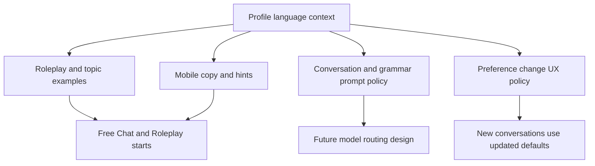

# Language Pair Learning Experience Follow-Ups - Plan

## Goal Capsule

| Field | Value |
|---|---|
| Objective | 언어쌍 도메인 리팩터 이후, STT/TTS와 테스트 확대를 제외한 후속 작업을 정리해 각 지원 언어쌍이 실제 학습 경험으로 자연스럽게 느껴지게 한다. |
| Authority | 사용자 결정: 음성 인식/STT와 TTS 언어 설정은 다른 에이전트가 담당하며, 여기서는 나머지 필요한 작업을 `docs/plans/`에 정리한다. |
| Execution profile | 모바일 UX copy, 학습 콘텐츠 프리셋, LLM 프롬프트 품질, 언어쌍 변경 정책, 모델 라우팅 설계 문서로 나뉘는 후속 개선 작업. |
| Stop conditions | STT/TTS provider 언어 설정, 대규모 테스트 작성, 신규 언어쌍 추가, 실제 모델 provider 전환 구현이 범위에 들어오면 멈추고 별도 계획으로 분리한다. |
| Tail ownership | 구현 후에는 핵심 문서와 앱 copy가 영어회화 전용 표현을 남기지 않고, 네 개 언어쌍별 학습 목적과 설정 변경 정책이 사용자에게 명확히 보여야 한다. |

---

## Product Contract

### Summary

언어쌍은 이제 프로필 기본값과 conversation snapshot으로 존재하지만, 제품 경험 전체가 아직 “영어회화 앱”의 습관을 일부 갖고 있다.
다음 작업은 데이터 구조를 더 키우는 것이 아니라, 사용자가 `ko -> en`, `en -> ko`, `zh -> en`, `zh -> ko` 중 어떤 경로를 선택해도 앱 문구, 토픽 준비, 롤플레이, 피드백, 설정 변경 안내가 그 학습 목적에 맞게 보이도록 다듬는 것이다.

### Problem Frame

언어쌍 리팩터는 기반 공사에 가깝다.
기반은 맞지만 UX copy와 프롬프트 예시가 영어 학습 중심으로 남아 있으면 영어 사용자의 한국어 학습자나 중국어 사용자는 “기능은 되지만 나를 위한 앱은 아니다”라고 느낄 수 있다.
반대로 이 단계에서 모델 라우팅까지 바로 구현하면 품질·비용·지연시간을 검증하지 않은 채 provider 복잡도만 증가한다.

따라서 후속 작업은 세 단계로 나눈다.
첫째, 사용자가 보는 표면을 언어쌍 중립 또는 언어쌍 맞춤으로 정리한다.
둘째, 대화·문법·Topic Prep 프롬프트가 언어쌍별 학습 포인트를 더 잘 잡도록 개선한다.
셋째, DeepSeek/Qwen 같은 중국어권 모델 후보는 실행 구현이 아니라 라우팅 설계와 평가 기준 문서로 준비한다.

### Requirements

- R1. 앱 copy는 “영어회화 전용” 표현을 제거하고, 선택된 target language 기준으로 학습 행동을 설명해야 한다.
- R2. 중국어 사용자는 최소 핵심 흐름에서 중국어 안내를 받아야 하며, 전체 앱 i18n은 이번 범위에 포함하지 않는다.
- R3. Topic Prep 입력·retry·first answer UX는 target language를 반영해야 하며 `English` 같은 고정 힌트를 남기지 않아야 한다.
- R4. Roleplay preset과 difficulty 설명은 target language와 학습 문화 차이를 고려해 한국어 학습·영어 학습 모두에 자연스러운 상황을 제공해야 한다.
- R5. Conversation prompt는 언어쌍별 학습 포인트를 반영해야 한다. 한국어 학습은 조사, 어미, 존댓말, 자연스러운 어순을 더 선명히 다루고, 영어 학습은 시제, 관사, 전치사, 질문 구조, 자연스러운 구어체를 더 선명히 다룬다.
- R6. Grammar feedback prompt는 target language별 평가 항목을 더 체계화하되 기존 응답 schema는 유지해야 한다.
- R7. 사용자가 계정 설정에서 언어쌍을 변경하면 기존 대화는 snapshot을 유지하고 새 대화부터 적용된다는 정책을 UI와 문서에 명확히 드러내야 한다.
- R8. 모델 라우팅은 이번 작업에서 구현하지 않는다. 대신 언어쌍·task별 provider 후보, 평가 기준, fallback 정책을 문서화한다.
- R9. STT/TTS 언어 설정은 이 계획 범위 밖이다. 이 계획은 음성 provider 설정을 수정하거나 소유하지 않는다.
- R10. 테스트 확대는 이 계획의 작업 단위에서 제외한다. 구현자가 코드 변경을 할 경우 기존 checks를 돌리는 것은 가능하지만, 신규 테스트 작성 자체를 목표로 삼지 않는다.

### Acceptance Examples

- AE1. Given an English-speaking learner selected `en -> ko`, when they open Topic Prep, then the first-answer field invites them to answer in Korean rather than English.
- AE2. Given a Chinese-speaking learner selected `zh -> ko`, when a Topic Prep search is low quality, then recovery guidance is understandable in Chinese while practice questions remain suitable for Korean practice.
- AE3. Given a learner changes language pair in Account, when the save succeeds, then the sheet or surrounding UI explains that the new pair applies to new conversations and old conversations keep their original language.
- AE4. Given a Korean-learning conversation, when prompt instructions are generated, then Korean-specific learning points such as particles, endings, honorific level, and naturalness are explicit.
- AE5. Given a product maintainer evaluates provider options later, when they open the model routing design doc, then they can see why Gemini remains current default and what evidence is needed before trying Qwen or DeepSeek for Chinese-native flows.

### Scope Boundaries

- In scope: mobile copy audit and replacement, narrow Chinese UX copy, target-language-aware hints, roleplay/topic preset tuning, prompt policy improvements, preference-change UX policy, documentation updates, model-routing design document.
- Deferred for later: STT/TTS language configuration, provider implementation for DeepSeek/Qwen/Qwen-compatible endpoints, model benchmark harness, full app translation, new language pairs, curriculum/leveling systems, pronunciation scoring, dedicated test expansion.
- Outside this product's identity: exposing model/provider choices to learners, making every conversation start ask for a language pair again, or turning the app into a rigid textbook course.

---

## Planning Contract

### Key Technical Decisions

- KTD1. Treat this as experience completion, not another data-model refactor.
  The first-class language context already exists in `backend/shared/language.py` and `mobile/lib/features/language/domain/learning_language.dart`; follow-up work should consume it rather than creating a second preference model.
- KTD2. Keep narrow i18n local to the touched surfaces.
  The app does not yet have a full localization framework. For this pass, use the existing locale-branching pattern in `LearningLanguageContext.displayName`, `LearningLanguageContext.helperText`, and onboarding copy helpers instead of introducing a full ARB/l10n migration.
- KTD3. Make target language the learner-action language.
  Input hints, first questions, roleplay prompts, and conversation instructions should use `target_language`; feedback/recovery guidance may use `feedback_language`.
- KTD4. Preserve conversation snapshot semantics in UX language.
  Changing profile preferences should never imply that old conversations mutate. The UI should say the change applies to new conversations, matching the backend snapshot contract.
- KTD5. Improve prompt specificity before changing models.
  Better task and language instructions are cheaper and lower-risk than provider routing. Model routing remains a design artifact until there is benchmark evidence.
- KTD6. Do not create a test-only workstream in this plan.
  The user explicitly asked for non-test follow-ups. Verification is described as manual/code-review checks and existing command gates only where implementation touches code.

### High-Level Technical Design

### Assumptions

- Supported language pairs remain fixed at `ko -> en`, `en -> ko`, `zh -> en`, and `zh -> ko`.
- Current model behavior remains Gemini/OpenRouter-backed for all pairs until a future routing implementation.
- Chinese UX follows the previously chosen narrow MVP approach: enough Chinese copy to complete setup, understand recovery states, and change preferences.
- There is no requirement to preserve historical local copy snapshots; copy can be updated in place.
- Another agent owns STT/TTS language handling, so this plan should avoid changes under `backend/domains/voice/` unless a future integration handoff explicitly requests them.

### Sources and Local Patterns

- `docs/plans/2026-07-20-001-refactor-language-pairs-domain-plan.md` defines the completed language context foundation and settled scope decisions.
- `backend/shared/language.py` owns backend language codes, supported pairs, defaults, and display names.
- `mobile/lib/features/language/domain/learning_language.dart` owns mobile language codes, supported contexts, locale display labels, and helper text.
- `mobile/lib/features/onboarding/presentation/onboarding_screen.dart` already uses a locale-specific copy helper for the language-pair page but still has English-study copy in later onboarding pages.
- `mobile/lib/features/topic_prep/presentation/topic_prep_screen.dart` currently contains a fixed first-answer hint: `Type your first answer in English...`.
- `mobile/lib/features/home/presentation/account_sheet.dart` saves language preferences but does not yet visibly explain the new-conversation-only policy.
- `backend/domains/conversation/service.py` contains language-aware prompts, but the roleplay examples still include English-teacher-oriented examples and can be made more pair-aware.
- `backend/domains/grammar/service.py` contains separate Korean and generic grammar prompts; the generic branch is still mostly English-shaped.
- `backend/domains/search/service.py` contains target/feedback-language-aware Topic Prep and retry generation, making it the natural place for language-pair content tuning.
- `README.md`, `docs/DSL.md`, `.agent/architecture.md`, and `mobile/README.md` are the public/internal documentation surfaces to keep synchronized.

### Sequencing

1. Do U1 first because stale visible copy is the fastest user-facing mismatch to remove.
2. Do U2 next because roleplay/topic content changes affect what users can start practicing.
3. Do U3 after U1-U2 so backend prompts reflect the same product language and examples the app exposes.
4. Do U4 once the settings surface copy is known, because it should reuse the same language labels and tone.
5. Do U5 last because it should describe current behavior after UX/prompt tuning, not preempt it.

---

## System-Wide Impact

- Mobile: onboarding, Topic Prep, Account, Home, Roleplay Setup, and shared language selector copy become less English-centric.
- Backend prompts: conversation, roleplay, grammar, and Topic Prep instructions become more explicit about target-language learning behavior.
- Documentation: model routing moves from informal discussion into a durable design note, while supported-pair UX policy becomes easier to find.
- Operations: no new environment variables or provider credentials should be introduced by this plan.
- Voice: no ownership change; STT/TTS remains delegated to the separate agent’s work.

---

## Risks and Mitigations

| Risk | Impact | Mitigation |
|---|---|---|
| Copy changes become a partial i18n migration | Scope expands and slows down implementation | Use small locale helpers near existing widgets; defer full localization infrastructure. |
| Prompt tuning accidentally changes API contracts | Mobile parsing or grammar cards can break | Keep response schemas unchanged and limit changes to prompt text/policy. |
| Chinese UX uses awkward or inconsistent terms | Chinese-native users lose trust quickly | Keep Chinese copy short, operational, and consistent around “练习语言”, “反馈语言”, and retry guidance. |
| Roleplay examples stay English-learning biased | Korean learners see irrelevant situations or teacher framing | Split examples by target language or generate examples from target-language learning goals. |
| Model routing design becomes premature implementation | New provider complexity arrives without evidence | Keep U5 as docs-only design with explicit “not implemented yet” boundary. |
| Settings copy implies old conversations change | Users misread snapshot behavior | Add explicit “new conversations only” language in Account and docs. |

---

## Implementation Units

### U1. Audit and replace English-centric mobile UX copy

- **Goal:** Remove visible English-learning assumptions from core mobile surfaces and make copy reflect the selected or default language pair.
- **Requirements:** R1, R2, R3, AE1, AE2
- **Dependencies:** None
- **Files:** `mobile/lib/features/onboarding/presentation/onboarding_screen.dart`, `mobile/lib/features/topic_prep/presentation/topic_input_screen.dart`, `mobile/lib/features/topic_prep/presentation/topic_prep_screen.dart`, `mobile/lib/features/home/presentation/home_screen.dart`, `mobile/lib/features/home/presentation/conversation_start_sheet.dart`, `mobile/lib/features/language/domain/learning_language.dart`, `mobile/lib/features/language/presentation/language_pair_selector.dart`, `mobile/README.md`
- **Approach:** Scan visible strings in the listed surfaces for fixed English-learning assumptions. Replace fixed mentions such as “Practice English” and first-answer English hints with neutral copy or target-language-aware copy. Keep locale-specific Chinese/Korean/English branches small and colocated with the widget/helper that needs them.
- **Non-test verification:** Run a manual copy review for all four language pairs and confirm no core flow asks every learner to answer “in English” unless target language is English.
- **Out of scope:** New l10n framework, ARB files, full-screen Chinese translation, screenshot automation.

### U2. Tune roleplay and Topic Prep content for each target language

- **Goal:** Make conversation starters, roleplay presets, and topic examples feel relevant for Korean learning as well as English learning.
- **Requirements:** R3, R4, AE1, AE2
- **Dependencies:** U1
- **Files:** `mobile/lib/features/roleplay_setup/domain/roleplay_scenario.dart`, `mobile/lib/features/roleplay_setup/domain/roleplay_difficulty.dart`, `mobile/lib/features/roleplay_setup/domain/roleplay_setup_payload.dart`, `mobile/lib/features/roleplay_setup/presentation/roleplay_setup_screen.dart`, `backend/domains/search/service.py`, `backend/domains/conversation/service.py`, `docs/DSL.md`
- **Approach:** Review preset scenarios and difficulty wording against target language. For Korean practice, prioritize daily-life and honorific-sensitive contexts such as cafe ordering, travel, hospital/front desk, workplace greeting, and self-introduction. For English practice, keep current broad topics but avoid implying the whole app is English-only. Make Topic Prep examples use target-language learning goals while retry guidance stays in feedback language.
- **Non-test verification:** Sample the generated prompt/copy paths for `en -> ko`, `zh -> ko`, `ko -> en`, and `zh -> en` and confirm content categories fit the target language.
- **Out of scope:** Full curriculum taxonomy, CEFR/TOPIK/HSK levels, external content CMS.

### U3. Refine conversation and grammar prompt policy by language target

- **Goal:** Improve LLM behavior for Korean and English learning without changing providers or API schemas.
- **Requirements:** R5, R6, AE4
- **Dependencies:** U1, U2
- **Files:** `backend/domains/conversation/service.py`, `backend/domains/grammar/service.py`, `backend/domains/search/service.py`, `backend/shared/language.py`, `.agent/architecture.md`, `README.md`
- **Approach:** Extract or structure target-language policy text enough that conversation, roleplay, grammar, and Topic Prep share consistent learning priorities. Korean target policy should call out particles, endings, honorific/formality, spacing, and naturalness. English target policy should call out tense, articles, prepositions, question formation, and natural spoken phrasing. Feedback language remains separate from target language.
- **Non-test verification:** Capture representative prompt snapshots or logs locally during development review and confirm target-language policy is present without schema changes.
- **Out of scope:** Prompt evaluation harness, provider benchmark, grammar result schema changes.

### U4. Clarify language preference change policy in UX and docs

- **Goal:** Make the “new conversations only” behavior clear when users change language pair settings.
- **Requirements:** R7, AE3
- **Dependencies:** U1
- **Files:** `mobile/lib/features/home/presentation/account_sheet.dart`, `mobile/lib/features/home/presentation/home_screen.dart`, `mobile/lib/features/language/application/language_preferences_controller.dart`, `mobile/lib/features/auth/application/auth_controller.dart`, `README.md`, `docs/DSL.md`, `.agent/architecture.md`
- **Approach:** Add concise policy copy around language-pair save success or near the selector: changing the pair updates future conversations, while existing conversations keep their original language. Keep the account sheet compact and avoid a modal confirmation unless implementation discovers accidental data loss or ambiguous behavior.
- **Non-test verification:** Manually follow the setting change path and confirm the active pair display updates while old conversation language labels remain snapshot-based.
- **Out of scope:** Bulk converting old conversations, per-conversation language editing, forced restart of active conversations.

### U5. Document future model routing design without implementing it

- **Goal:** Prepare a durable design note for pair/task-specific model routing so DeepSeek/Qwen/Gemini choices can be evaluated later.
- **Requirements:** R8, AE5
- **Dependencies:** U3
- **Files:** `docs/plans/2026-07-21-002-design-language-pair-model-routing-plan.md`, `README.md`, `.agent/architecture.md`, `.env.example`
- **Approach:** Write a follow-up design or plan that names routing dimensions: native language, target language, task type, latency, cost, JSON reliability, Korean correction quality, Chinese explanation quality, and fallback. State that current runtime remains on existing `OPENROUTER_MODEL` and `GRAMMAR_OPENROUTER_MODEL` settings until benchmark evidence justifies adding provider-specific env vars.
- **Non-test verification:** Documentation review should answer three questions: which pairs might benefit from Qwen/DeepSeek, what metrics decide the switch, and what fallback keeps the current behavior stable.
- **Out of scope:** Adding new provider clients, changing default model env vars, running paid benchmarks, exposing model settings in the app.

---

## Verification Contract

This plan intentionally excludes a test-expansion workstream.
Implementation may still run existing checks after code changes, but the planned value is UX/content/prompt completion rather than adding new test coverage.

| Gate | Applies to | Done signal |
|---|---|---|
| Copy audit | U1, U4 | Core mobile surfaces no longer contain English-only learning copy except where target language is English. |
| Language-pair walkthrough | U1, U2, U4 | Each supported pair can be followed through onboarding/account copy, Topic Prep first-answer copy, and conversation start labels without contradictory language instructions. |
| Prompt snapshot review | U2, U3 | Conversation, roleplay, grammar, and Topic Prep prompts include target-language-specific learning priorities and preserve existing JSON/API response shapes. |
| Documentation review | U4, U5 | README/DSL/architecture describe the new-conversation-only policy and model-routing deferral consistently. |
| Existing checks as needed | Any code-changing unit | Implementer may run focused existing `flutter analyze --no-pub`, `flutter test`, or `uv run pytest` commands touched by their changes, but new tests are not the purpose of this plan. |

---

## Definition of Done

- D1. U1-U4 are implemented or explicitly split into smaller follow-up PRs with no English-only copy left in the core language-pair flows.
- D2. STT/TTS work remains untouched by this plan unless a separate handoff explicitly requests integration.
- D3. Existing supported-pair contract stays fixed at `ko -> en`, `en -> ko`, `zh -> en`, and `zh -> ko`.
- D4. Profile preference changes are described consistently as applying to new conversations only.
- D5. Model routing remains unimplemented but has a clear design artifact and evidence checklist for a later decision.
- D6. Documentation surfaces touched by the implementation are synchronized in the same change set.
- D7. Abandoned experiments, duplicate copy helpers, and unused prompt fragments are removed before the work is considered complete.
