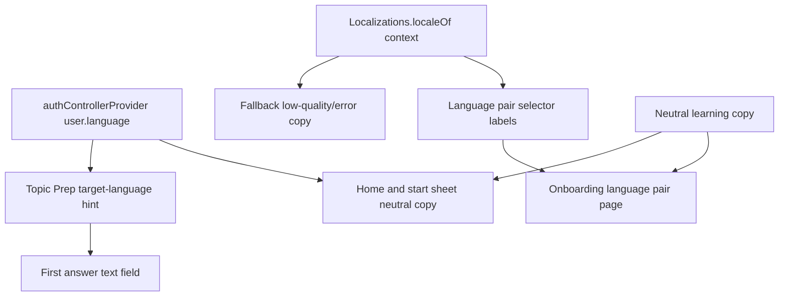

# Language Pair Mobile UX Copy - Plan

## Goal Capsule

| Field | Value |
|---|---|
| Objective | 상위 후속 계획의 U1을 구현 가능한 모바일 작업으로 분해해, 핵심 화면의 영어회화 전용 copy를 제거하고 선택된 언어쌍에 맞는 UX 문구를 제공한다. |
| Authority | `docs/plans/2026-07-21-001-feat-language-pair-experience-followups-plan.md`의 U1과 사용자 요청: U1 구현 전 전용 계획 문서를 생성한다. |
| Execution profile | Flutter 모바일 copy pass. 온보딩, 홈, 시작 sheet, Topic Input, Topic Prep, 언어쌍 selector, 모바일 문서만 다룬다. |
| Stop conditions | STT/TTS, Roleplay preset 재설계, backend prompt 튜닝, 모델 라우팅, 전체 i18n framework 도입, 신규 테스트 확대가 범위로 들어오면 멈추고 별도 계획으로 분리한다. |
| Tail ownership | 구현자는 네 개 지원 언어쌍을 기준으로 visible copy와 accessibility label이 target/feedback language를 혼동하지 않는지 수동 walkthrough로 확인한다. |

---

## Product Contract

### Summary

현재 모바일 앱은 언어쌍 선택과 badge를 제공하지만, 일부 화면 copy는 여전히 영어 학습 전용 표현을 포함한다.
대표적으로 onboarding interest page의 `Practice English...` 문구와 Topic Prep 첫 답변 힌트의 `Type your first answer in English...`가 남아 있다.
U1은 이 남은 문구를 언어쌍 중립 또는 target-language-aware copy로 바꿔, 영어 사용자의 한국어 학습자와 중국어 사용자의 한국어/영어 학습자도 첫 흐름에서 배제감을 느끼지 않게 하는 작업이다.

### Problem Frame

언어쌍 도메인은 이미 `LearningLanguageContext`로 앱에 들어와 있다.
그런데 core screen copy가 영어회화 중심으로 남으면 데이터 모델은 확장되었는데 제품의 목소리는 과거 상태에 머문다.
이 작업은 대규모 localization 도입보다 작고 빠르게 끝낼 수 있어야 한다.
필요한 곳에서만 현재 locale과 active language pair를 읽고, 나머지는 학습 언어를 특정하지 않는 자연스러운 문구로 정리한다.

### Requirements

- R1. Onboarding의 언어쌍 이후 소개 페이지는 영어만 연습한다고 말하지 않아야 한다.
- R2. Topic Input은 특정 언어권 topic 예시에 치우치지 않고, 사용자의 관심사를 가져오라는 메시지를 유지해야 한다.
- R3. Topic Prep ready 화면의 첫 답변 힌트는 active target language를 반영해야 한다.
- R4. Topic Prep low-quality fallback copy와 action label은 feedback language 또는 locale 기준으로 이해 가능해야 하며, backend retry guidance를 덮어쓰지 않아야 한다.
- R5. Home과 conversation start sheet는 “새 대화 시작” 의미를 유지하되, 앱 전체가 영어 전용처럼 보이는 표현을 남기지 않아야 한다.
- R6. `LanguagePairSelector`의 pair label, helper text, semantic copy는 native/target/feedback language의 역할을 혼동하지 않아야 한다.
- R7. 기존 onboarding 완료와 pending language sync 흐름은 바꾸지 않는다.
- R8. 이 작업은 STT/TTS, Roleplay preset 내용 조정, backend prompt 튜닝, 모델 라우팅, 신규 테스트 확대를 포함하지 않는다.

### Acceptance Examples

- AE1. Given an English-locale user with default `en -> ko`, when they reach Topic Prep ready state, then the first-answer hint asks for Korean rather than English.
- AE2. Given a Chinese-locale user with `zh -> ko`, when Topic Prep has low-quality results and no backend retry guidance is available, then fallback recovery copy is understandable in Chinese.
- AE3. Given a Korean-locale user with default `ko -> en`, when they complete onboarding, then copy still feels natural for English practice and the existing pending-language storage behavior is unchanged.
- AE4. Given any supported language pair, when the user opens Home and the start sheet, then visible copy invites conversation practice without implying that the whole app is English-only.
- AE5. Given a screen reader reads language selection cards, when it encounters a pair option, then the learner can distinguish conversation target language from feedback language.

### Scope Boundaries

- In scope: mobile visible strings, local helper methods for language-aware labels, Topic Prep first-answer hint, fallback low-quality copy, mobile README wording.
- Deferred for later: Roleplay content/preset redesign, prompt policy improvements, preference-change success policy copy from U4, model routing docs, full app translation, visual redesign.
- Outside this product's identity: asking users to choose language pair again in Topic Prep or Free Chat, exposing internal language codes, or turning learning copy into long instructional text.

---

## Planning Contract

### Key Technical Decisions

- KTD1. Prefer neutral copy where the learner does not need a language-specific instruction.
  Onboarding and Home should not overfit to target language unless the user action requires it. “Practice conversation” is more durable than branching every sentence.
- KTD2. Use active language context only where it changes the task.
  Topic Prep first-answer input needs target language because it tells the learner what to type. Start sheet labels and onboarding feature descriptions can stay neutral.
- KTD3. Source active language from existing mobile state, not a new API.
  `authControllerProvider` already hydrates `UserProfile.language`; `TopicPrepResult` currently does not parse `language`. For U1, prefer passing the current profile/default language into presentation widgets instead of expanding API models solely for hints.
- KTD4. Keep fallback copy short and local.
  Existing backend retry guidance can arrive in feedback language. Mobile fallback strings are only used when backend guidance is missing or a network/local state needs copy.
- KTD5. Avoid full localization infrastructure in this pass.
  The app currently uses localized branch helpers in files like `mobile/lib/features/language/domain/learning_language.dart` and onboarding copy helpers. Follow that local pattern rather than introducing ARB/l10n.
- KTD6. Tests are not a workstream, but fragile expectations must be known.
  Existing widget/app tests reference copy such as `What topic do you want to talk about?`, `Free Chat`, and `START CONVERSATION`. Implementation can update expected strings if required, but this plan does not require adding new coverage.

### High-Level Technical Design

### Assumptions

- Supported language pairs stay fixed at `ko -> en`, `en -> ko`, `zh -> en`, and `zh -> ko`.
- `UserProfile.language` is available on authenticated Home/Topic Prep flows; if not, UI can fall back to `LearningLanguageContext.defaultContext`.
- Backend Topic Prep already generates card content in target language and retry guidance in feedback language where applicable.
- U4 will later add explicit “new conversations only” settings policy copy; U1 should not take over that behavior beyond avoiding contradictory language.
- This work can be done without changing `backend/` or `backend/domains/voice/`.

### Current Copy Findings

| Surface | Current signal | Issue |
|---|---|---|
| `mobile/lib/features/onboarding/presentation/onboarding_screen.dart` | `Practice English with news...` | English-only onboarding promise after the language pair page. |
| `mobile/lib/features/onboarding/presentation/onboarding_screen.dart` | English-only feedback sample sentence | Acceptable as an example only if surrounding copy becomes language-neutral; otherwise it reinforces English-only identity. |
| `mobile/lib/features/topic_prep/presentation/topic_prep_screen.dart` | `Type your first answer in English...` | Directly wrong for `en -> ko` and `zh -> ko`. |
| `mobile/lib/features/topic_prep/presentation/topic_input_screen.dart` | Korean topic examples | Not wrong, but should be reviewed for Chinese/English users because examples currently lean Korean-local. |
| `mobile/lib/features/topic_prep/presentation/widgets/topic_retry_card.dart` | English fallback labels | Backend guidance may be localized, but fallback title/actions remain English-only. |
| `mobile/lib/features/home/presentation/conversation_start_sheet.dart` | `Free Chat`, `Roleplay`, neutral descriptions | Mostly acceptable; review wording for language-neutral consistency. |
| `mobile/lib/features/home/presentation/account_sheet.dart` | `Language Pair`, save/error strings | Mostly U4 territory; only avoid conflicting language role wording in U1. |

### Sources and Local Patterns

- `docs/plans/2026-07-21-001-feat-language-pair-experience-followups-plan.md` U1 defines the parent scope and excludes STT/TTS and test expansion.
- `mobile/lib/features/language/domain/learning_language.dart` provides `LearningLanguageCode.displayName`, `LearningLanguageContext.pairLabel`, `helperText`, `supportedContexts`, and locale-derived defaults.
- `mobile/lib/features/onboarding/presentation/onboarding_screen.dart` already has `_LanguagePairCopy.forLocale`, which is the local pattern for small copy branching.
- `mobile/lib/features/topic_prep/presentation/topic_prep_screen.dart` owns the ready/low-quality Topic Prep widgets and can receive a `LearningLanguageContext` from its parent state.
- `mobile/lib/features/home/presentation/home_screen.dart` already watches `authControllerProvider` and can pass user language to child flows if needed.
- `mobile/README.md` documents app flow and should be updated if screen behavior or copy semantics change.

### Sequencing

1. Do U1.1 first to add small reusable label helpers; this prevents copy branching from spreading awkwardly across widgets.
2. Do U1.2 and U1.3 next because onboarding and Topic Prep contain the known English-only strings.
3. Do U1.4 after Topic Prep because low-quality fallback copy should share the same locale/feedback-language thinking.
4. Do U1.5 last to sweep Home/start sheet/language selector and docs for consistency.

---

## System-Wide Impact

- Mobile presentation: visible strings and semantic labels in the language-pair onboarding and free-chat preparation flow become target-aware or language-neutral.
- Mobile domain helpers: `LearningLanguageContext` may gain small presentation helpers for target-language input hints or learner-facing role labels.
- Documentation: `mobile/README.md` may need a short note that core copy avoids English-only assumptions and uses active target language where the user is asked to answer.
- Backend/API: no expected changes.
- Voice/STT/TTS: no expected changes.

---

## Risks and Mitigations

| Risk | Impact | Mitigation |
|---|---|---|
| Copy helper grows into hidden localization framework | Harder later migration to proper i18n | Keep helpers narrowly named around language-pair UX, not generic app translation. |
| Topic Prep hint reads stale language after profile changes | User sees wrong target language in an open screen | Use current auth state at build time and fall back predictably; U4 owns clearer settings-change behavior. |
| Chinese fallback copy is too broad or awkward | Chinese-native users see machine-like UX | Keep Chinese fallback operational and short; prefer backend retry guidance when present. |
| Existing tests fail on changed strings | Implementation gets slowed by brittle expectations | List affected existing tests in each unit so expected text updates are deliberate. |
| Neutral copy becomes vague | App loses its learning focus | Keep verbs like practice, answer, conversation, feedback; remove only English-only assumptions. |

---

## Implementation Units

### U1.1. Add narrow language-aware copy helpers

- **Goal:** Provide a small place to derive target-language action text without scattering switch statements across screens.
- **Requirements:** R3, R4, R6, AE1, AE2, AE5
- **Dependencies:** None
- **Files:** `mobile/lib/features/language/domain/learning_language.dart`, `mobile/test/features/language/domain/learning_language_test.dart`
- **Approach:** Add narrowly scoped helpers only if implementation needs them, such as target-language display in imperative copy or first-answer hint text. Keep existing `displayName`, `pairLabel`, and `helperText` intact unless wording clarity requires small edits.
- **Existing test impact:** Existing language domain tests may need expectation updates if helper behavior is added or helperText wording changes.
- **Non-test verification:** Review helper output for `ko`, `en`, and `zh` locale codes and all four supported contexts.

### U1.2. Make onboarding feature copy language-neutral

- **Goal:** Remove English-only onboarding promise while preserving the app’s conversational learning identity.
- **Requirements:** R1, R7, AE3
- **Dependencies:** U1.1 only if helper text is reused.
- **Files:** `mobile/lib/features/onboarding/presentation/onboarding_screen.dart`, `mobile/test/app/app_test.dart`
- **Approach:** Replace `Practice English...` with neutral conversation-learning copy. Decide whether the English feedback sample stays as an illustrative example or becomes target-neutral; if retained, ensure surrounding copy does not imply all feedback is English grammar only.
- **Existing test impact:** App-level onboarding tests may assert visible onboarding flow strings.
- **Non-test verification:** Walk through onboarding in `ko`, `en`, and `zh` device locales and confirm page 1 still defaults to the intended language pair.

### U1.3. Make Topic Prep first-answer UX target-language-aware

- **Goal:** Ensure the ready-state first-answer field tells learners to answer in their active target language.
- **Requirements:** R3, AE1
- **Dependencies:** U1.1
- **Files:** `mobile/lib/features/topic_prep/presentation/topic_prep_screen.dart`, `mobile/lib/features/auth/application/auth_controller.dart`, `mobile/test/features/topic_prep/presentation/topic_prep_screen_test.dart`, `mobile/test/app/app_test.dart`
- **Approach:** Read the current profile language from existing auth state in `TopicPrepScreen`, fall back to `LearningLanguageContext.defaultContext`, and pass the context into `_ReadyTopicPrepView`. Generate hint/semantic label from `targetLanguage.displayName(localeCode)` so `en -> ko` and `zh -> ko` say Korean, while `ko -> en` and `zh -> en` say English.
- **Existing test impact:** Topic Prep screen tests may need fixture setup for auth language or changed hint text.
- **Non-test verification:** Manually inspect `ko -> en`, `en -> ko`, `zh -> en`, and `zh -> ko` ready states and confirm the answer field names the correct target language.

### U1.4. Localize Topic Prep fallback copy only where backend is silent

- **Goal:** Keep low-quality/error recovery understandable without overriding backend-provided feedback-language guidance.
- **Requirements:** R2, R4, AE2
- **Dependencies:** U1.1
- **Files:** `mobile/lib/features/topic_prep/presentation/topic_prep_screen.dart`, `mobile/lib/features/topic_prep/presentation/widgets/topic_retry_card.dart`, `mobile/test/features/topic_prep/presentation/topic_prep_screen_test.dart`, `mobile/test/features/topic_prep/presentation/widgets/topic_prep_widgets_test.dart`
- **Approach:** Preserve `result.retryGuidance` and `result.quality.retrySuggestion` as the primary messages. Localize only the fallback title/message/action labels when those backend fields are missing or when static widget labels are displayed.
- **Existing test impact:** Widget tests may assert `We need a clearer topic`, `Edit topic`, or similar static labels.
- **Non-test verification:** Force a low-quality result without retry guidance in local fixtures and inspect fallback copy for English, Korean, and Chinese locales.

### U1.5. Sweep Home, start sheet, selector, and mobile docs

- **Goal:** Finish the mobile copy pass by checking remaining core entry surfaces and documenting the copy policy.
- **Requirements:** R5, R6, AE4, AE5
- **Dependencies:** U1.1, U1.2, U1.3, U1.4
- **Files:** `mobile/lib/features/home/presentation/home_screen.dart`, `mobile/lib/features/home/presentation/conversation_start_sheet.dart`, `mobile/lib/features/home/presentation/account_sheet.dart`, `mobile/lib/features/language/presentation/language_pair_selector.dart`, `mobile/README.md`, `mobile/test/features/home/presentation/home_screen_test.dart`
- **Approach:** Keep Home/start sheet copy concise and language-neutral. Review `LanguagePairSelector` helper text for role clarity. Update `mobile/README.md` if implementation changes how active language context is used in copy.
- **Existing test impact:** Home screen tests may assert start sheet labels and visible button text.
- **Non-test verification:** Run a source sweep for fixed English-learning phrases such as `Practice English`, `answer in English`, and `first answer in English` under `mobile/lib/features`.

---

## Verification Contract

This U1 plan does not require new tests.
If implementation changes existing asserted strings, update the affected existing tests as maintenance rather than expanding coverage.

| Gate | Applies to | Done signal |
|---|---|---|
| Source copy sweep | U1.2-U1.5 | `mobile/lib/features` no longer contains fixed English-learning instructions except intentional examples or target-English contexts. |
| Four-pair manual walkthrough | U1.3 | First-answer hint resolves to English for `ko -> en` and `zh -> en`, and Korean for `en -> ko` and `zh -> ko`. |
| Locale fallback review | U1.1, U1.4 | Static fallback copy reads acceptably for `ko`, `en`, and `zh` locales without hiding backend retry guidance. |
| Existing checks if code changes | All units | `flutter analyze --no-pub` remains clean; focused existing widget tests may be run if implementation changes asserted text. |
| Documentation consistency | U1.5 | `mobile/README.md` describes active-language copy behavior without implying full app i18n. |

---

## Definition of Done

- D1. Onboarding no longer promises English-only practice after language-pair selection.
- D2. Topic Prep first-answer hint and semantic label use active target language.
- D3. Topic Prep low-quality fallback copy is understandable in English, Korean, and Chinese locales when backend guidance is unavailable.
- D4. Home and start sheet copy remain language-neutral and do not reintroduce English-only app positioning.
- D5. Language pair selector copy keeps native, target, and feedback language roles clear.
- D6. `mobile/README.md` is updated if copy behavior or language-context usage changes.
- D7. STT/TTS, backend prompt policy, Roleplay content tuning, model routing, and new test expansion remain outside this U1 implementation.
