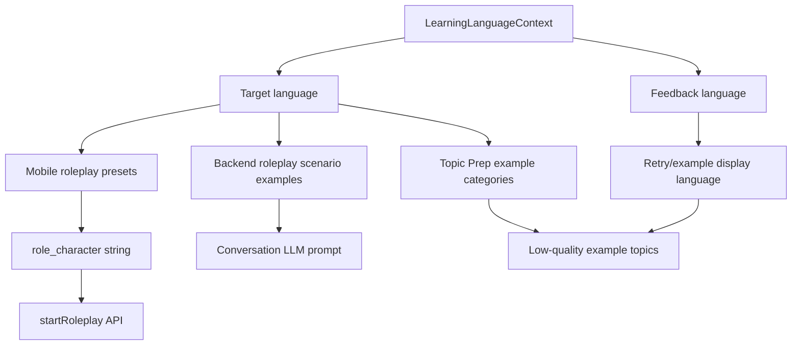

# Language Pair Content Tuning - Plan

## Goal Capsule

| Field | Value |
|---|---|
| Objective | U2 범위에서 roleplay preset, difficulty/custom role prompt, backend roleplay prompt examples, Topic Prep low-quality examples를 target language 기준으로 조정한다. |
| Authority | 상위 계획 U2: `docs/plans/2026-07-21-001-feat-language-pair-experience-followups-plan.md`의 R3, R4, AE1, AE2를 구현 가능한 작업 단위로 분해한다. |
| Execution profile | 모바일 roleplay setup과 backend conversation/search prompt content를 함께 조정하는 bounded content refactor. |
| Stop conditions | STT/TTS provider 언어 설정, 모델 라우팅, 신규 언어쌍, full curriculum taxonomy, 신규 테스트 확대가 범위에 들어오면 멈추고 별도 계획으로 분리한다. |
| Tail ownership | 네 개 지원 언어쌍에서 사용자가 보는 시작 상황과 backend가 받는 prompt examples가 target language 학습 목적에 맞게 정렬되어야 한다. |

---

## Product Contract

### Summary

U1은 영어회화 전용 copy를 걷어내고 Topic Prep 첫 답변 힌트를 target language 기준으로 바꿨다.
U2는 그 다음 단계로, 사용자가 실제로 연습을 시작할 때 고르는 roleplay 상황과 Topic Prep 재시도 예시가 한국어 학습과 영어 학습 모두에 맞게 느껴지도록 다듬는다.

핵심은 언어쌍을 다시 모델링하는 것이 아니라 이미 존재하는 `LearningLanguageContext`를 콘텐츠 선택 기준으로 소비하는 것이다.
UI 설명은 feedback/native language를 고려해 이해 가능해야 하고, 연습 행동과 prompt content는 target language를 기준으로 해야 한다.

### Problem Frame

현재 roleplay preset은 `Cafe order`, `Hotel check-in`, `Airport immigration`, `Job interview`처럼 일반적인 영어 회화 앱에도 잘 맞는 구성이지만, 한국어 학습자에게 중요한 존댓말, 호칭, 서비스 상황, 자기소개, 직장 인사 같은 뉘앙스를 드러내지는 않는다.
또한 backend roleplay prompt의 scenario examples에는 `English Teacher`가 남아 있어 target language가 Korean인 경우에도 영어 학습 프레임이 섞여 보일 수 있다.

Topic Prep은 target/feedback language context를 이미 받지만, low-quality retry examples는 feedback language만 보고 구성된다.
이 구조는 안내 언어로는 맞지만, 예시 주제의 방향이 target language 학습 목표에 맞게 조정되지는 않는다.

### Requirements

- R1. Roleplay preset display content는 target language가 Korean일 때 한국어 학습에 자연스러운 상황을 우선 보여야 한다.
- R2. Roleplay preset display content는 target language가 English일 때 현재의 broad everyday/business/travel 상황을 유지하되 앱 전체가 영어 전용이라는 표현을 만들지 않아야 한다.
- R3. Korean practice content는 존댓말/반말 전환, 조사와 어미, 요청과 거절, 자기소개, 직장/서비스 상황처럼 한국어 학습자가 실제로 부딪히는 대화 과제를 반영해야 한다.
- R4. English practice content는 시제, 질문 구조, 자연스러운 small talk, 의견 말하기, travel/work 상황처럼 기존 영어 학습자의 핵심 과제를 유지해야 한다.
- R5. Custom roleplay prompt 합성은 learner가 적은 상황을 target-language practice context로 해석하되, 사용자에게 다시 언어 선택을 요구하지 않아야 한다.
- R6. Backend roleplay system prompt examples는 target language에 맞는 scenario examples를 사용해야 하며 `English Teacher` 같은 fixed-English example을 제거해야 한다.
- R7. Topic Prep low-quality example topics는 사용자가 이해할 수 있도록 feedback language로 작성하되, 예시의 종류와 힌트는 target language practice에 맞게 조정되어야 한다.
- R8. Topic Prep ready card의 fallback direction metadata는 target language를 이미 언급하는 부분을 유지하면서, fallback title/description/question이 특정 영어 학습 프레임에 갇히지 않게 해야 한다.
- R9. 기존 API request/response schema와 conversation snapshot semantics는 변경하지 않는다.
- R10. 새 테스트 작성 자체는 이번 작업의 목표가 아니며, 구현 중 행동 변경이 생기면 기존 테스트 표면을 최소 수정하거나 기존 checks로 검증한다.

### Acceptance Examples

- AE1. Given `en -> ko`, when the learner opens Roleplay Setup, then preset situations include Korean-practice-relevant daily contexts such as service ordering, self-introduction, travel/front desk, workplace greeting, or polite request handling.
- AE2. Given `zh -> ko`, when Topic Prep search quality is low, then retry guidance remains understandable in Chinese while examples steer the learner toward concrete Korean-practice conversation topics.
- AE3. Given `ko -> en`, when the learner opens Roleplay Setup, then the existing English-practice-friendly range such as cafe, travel, interview, meeting, and friend conversation remains available without app-wide English-only framing.
- AE4. Given a roleplay conversation with target language Korean, when the backend builds the system prompt, then scenario examples no longer include `English Teacher` and instead illustrate Korean-appropriate roles.
- AE5. Given a custom roleplay situation, when the app sends `role_character`, then the prompt describes the counterpart role and difficulty behavior without assuming English is the practice language.

### Scope Boundaries

#### In Scope

- Mobile roleplay preset titles, descriptions, role prompt bases, custom hint, and difficulty wording.
- Backend roleplay prompt scenario examples and target-language scenario policy.
- Topic Prep low-quality retry examples and fallback direction metadata where they are visibly English-shaped.
- `docs/DSL.md` documentation of content-language policy if the implementation makes this behavior observable.

#### Deferred for Later

- STT/TTS language and voice provider configuration.
- Model routing to DeepSeek, Qwen, or provider-specific models.
- Full i18n/ARB migration for the Flutter app.
- New language pairs beyond `ko -> en`, `en -> ko`, `zh -> en`, and `zh -> ko`.
- TOPIK/CEFR/HSK-style curriculum levels or a CMS-backed content taxonomy.

#### Outside This Product's Identity

- Asking users to choose a language pair again every time they start a roleplay.
- Exposing model/provider choices in the learner UI.
- Turning roleplay presets into a rigid textbook curriculum.

---

## Planning Contract

### Key Technical Decisions

- KTD1. Use target language as the content-routing key.
  Roleplay situations and backend scenario examples should branch on `target_language`, while guidance/retry copy can branch on `feedback_language`.
- KTD2. Keep content helpers local to their current domain.
  This is a content-tuning pass, not a new cross-platform content registry.
  Mobile roleplay content can evolve inside `mobile/lib/features/roleplay_setup/domain/roleplay_scenario.dart`, and backend prompt content can stay near `backend/domains/conversation/service.py` and `backend/domains/search/service.py`.
- KTD3. Keep prompt instructions in English where they are internal LLM system instructions.
  The system prompt can be written in English for consistency with existing prompt code, but the policy it describes must name the target language and target-specific learning priorities.
- KTD4. Separate learner-readable language from practice-content language.
  For Topic Prep low-quality examples, the string should be readable in `feedback_language`, but its examples should be chosen based on `target_language`.
- KTD5. Preserve current roleplay API shape.
  The mobile app still sends a single `role_character` string to `startRoleplay`; if richer content is needed, derive it before that string is produced rather than changing the API in U2.
- KTD6. Treat tests as maintenance, not a new workstream.
  Existing tests may need expectation updates if copy or prompt strings change, but this plan does not introduce dedicated new coverage as a goal.

### High-Level Technical Design

### Current Code Findings

| Surface | Current finding | Planning implication |
|---|---|---|
| `mobile/lib/features/roleplay_setup/domain/roleplay_scenario.dart` | Presets are a single static list with English labels and prompt bases. | Add target-aware content without introducing a full content registry. |
| `mobile/lib/features/roleplay_setup/domain/roleplay_difficulty.dart` | Difficulty copy is generic and mostly safe, but prompt instructions can be made more language-neutral and roleplay-specific. | Keep labels stable if possible; tune descriptions/instructions only where needed. |
| `mobile/lib/features/roleplay_setup/domain/roleplay_setup_payload.dart` | Custom prompt fallback says “realistic counterpart” and uses cafe barista as the only example. | Keep opposite-role behavior but avoid a single English-learning-flavored example. |
| `mobile/lib/features/roleplay_setup/presentation/roleplay_setup_screen.dart` | Screen reads static `roleplayPresetScenarios` and uses a fixed custom hint. | Screen will need access to current language context before rendering presets/hints. |
| `backend/domains/conversation/service.py` | `build_roleplay_prompt` receives language context but scenario examples include `English Teacher`. | Move examples behind target-language-aware helper text. |
| `backend/domains/search/service.py` | Retry guidance localizes by feedback language; example topics do not branch by target language. | Keep readable language but tune example category templates by target language. |
| `docs/DSL.md` | API language fields are documented, but content-language policy for roleplay/topic examples is not explicit. | Add a short policy note if implementation changes observable behavior. |

### Assumptions

- U1 is already implemented, so mobile has target-language helper text and Topic Prep result language parsing available.
- The four supported pairs remain fixed: `ko -> en`, `en -> ko`, `zh -> en`, and `zh -> ko`.
- Mobile does not yet have full localization infrastructure; small local helper methods are acceptable.
- Backend prompt examples can be deterministic string templates rather than LLM-generated preset data.
- Existing roleplay start API remains `role_character: String`.

### Sequencing

1. Tune mobile roleplay content first so the user-facing preset surface is correct.
2. Tune mobile roleplay payload/difficulty wording next so the backend receives better context from both preset and custom paths.
3. Tune backend roleplay prompt examples to match the same target-language content policy.
4. Tune Topic Prep example topics and fallback metadata after the roleplay content policy is settled.
5. Update documentation and run focused verification sweeps.

---

## System-Wide Impact

- Mobile UX: Roleplay Setup becomes the main user-visible target-language content surface after U1 copy cleanup.
- Backend prompts: Roleplay and Topic Prep prompt inputs become less English-learning biased without changing response schemas.
- Documentation: `docs/DSL.md` may need a small note that target language controls practice content while feedback language controls recovery guidance.
- Voice/modeling: No ownership or runtime provider changes; STT/TTS and model routing remain outside this plan.

---

## Risks and Mitigations

| Risk | Impact | Mitigation |
|---|---|---|
| Target-aware presets duplicate too much content | Mobile content becomes harder to maintain as pairs grow | Branch by target language, not full native-target pair, unless wording genuinely depends on native language. |
| Korean presets overfit to formal contexts only | Learners do not practice casual everyday Korean | Include both polite/service contexts and friend/self-introduction contexts. |
| Topic examples become unreadable to Chinese/English-native learners | Low-quality recovery UX regresses | Keep example strings in feedback language while tuning categories by target language. |
| Backend prompt examples diverge from mobile presets | LLM behavior feels inconsistent with selected scenario | Reuse the same target-language content policy, even if not the same exact strings. |
| Copy-only changes accidentally require broad test rewrites | U2 expands into test work despite the boundary | Update existing expectations only when broken by intended string changes; avoid new coverage unless implementation reveals a contract risk. |

---

## Implementation Units

### U1. Make roleplay presets target-aware in mobile

- **Goal:** Render preset roleplay situations that fit Korean practice when `targetLanguage == ko` and preserve broad English practice scenarios when `targetLanguage == en`.
- **Requirements:** R1, R2, R3, R4, AE1, AE3
- **Dependencies:** None
- **Files:** `mobile/lib/features/roleplay_setup/domain/roleplay_scenario.dart`, `mobile/lib/features/roleplay_setup/presentation/roleplay_setup_screen.dart`, `mobile/test/features/roleplay_setup/presentation/roleplay_setup_screen_test.dart`
- **Approach:** Replace the single exported static preset list with a target-aware accessor or helper while keeping `RoleplayScenario` as the domain shape.
  For Korean target, include situations such as cafe/service ordering with polite endings, travel/front desk, self-introduction, workplace greeting/small talk, polite request/refusal, and friend conversation.
  For English target, keep the existing range but remove any framing that implies every learner is practicing English globally.
- **Patterns to follow:** Use the language-context reading pattern already used after U1 in Topic Prep and language selector surfaces; keep UI state in `RoleplaySetupController` unchanged unless selected scenario refresh requires minimal reconciliation.
- **Test scenarios:** Existing roleplay screen tests should still find difficulty selection, preset selection, custom mode, and start enablement.
  If expectations assert exact preset text, update them to cover one Korean-target preset and one English-target preset rather than only the previous static list.
- **Verification:** A manual copy sweep for `en -> ko`, `zh -> ko`, `ko -> en`, and `zh -> en` confirms the displayed scenarios match the target language and selection still starts roleplay.

### U2. Tune difficulty and custom roleplay prompt wording

- **Goal:** Ensure difficulty descriptions and custom roleplay prompt composition remain target-language-neutral and useful for both Korean and English practice.
- **Requirements:** R5, AE5
- **Dependencies:** U1
- **Files:** `mobile/lib/features/roleplay_setup/domain/roleplay_difficulty.dart`, `mobile/lib/features/roleplay_setup/domain/roleplay_setup_payload.dart`, `mobile/lib/features/roleplay_setup/presentation/roleplay_setup_screen.dart`, `mobile/test/features/roleplay_setup/domain/roleplay_setup_payload_test.dart`, `mobile/test/features/roleplay_setup/application/roleplay_setup_controller_test.dart`
- **Approach:** Keep the three difficulty levels unless implementation discovers UI pressure.
  Tune `promptInstruction` so it describes pacing, follow-up intensity, and answer length without implying English.
  Replace the cafe-only custom example with a neutral opposite-role example or a target-aware custom hint if the screen already has language context available from U1.
- **Patterns to follow:** Preserve `RoleplaySetupPayload.roleCharacter` as the single string passed to the conversation start controller.
- **Test scenarios:** Existing payload tests should verify preset role character composition, custom opposite-role composition, invalid short custom input, and difficulty instruction inclusion.
  Update only changed string expectations.
- **Verification:** For a custom situation such as “I am a hotel guest asking for help” and a Korean-target context, the generated role character should not mention English and should still instruct the assistant to play the counterpart role.

### U3. Make backend roleplay scenario examples target-aware

- **Goal:** Remove fixed-English roleplay examples from the system prompt and provide target-language-appropriate scenario examples.
- **Requirements:** R3, R4, R6, AE4
- **Dependencies:** U1, U2
- **Files:** `backend/domains/conversation/service.py`, `backend/tests/domains/conversation/test_topic_prep_handoff.py`, `backend/tests/domains/voice/test_multimodal_conversation_router.py`
- **Approach:** Extract the `## Scenario Examples` body behind a small helper that receives `LearningLanguageContext`.
  For Korean target, examples should emphasize polite service interaction, self-introduction, workplace greetings, travel/front desk, and social conversation with formality awareness.
  For English target, examples can keep cafe/interview/hotel/meeting/friend contexts but should avoid `English Teacher` as a hardcoded scenario.
- **Patterns to follow:** Match existing prompt-builder style in `build_roleplay_prompt`, where language names are resolved with `ensure_language_context` and `language_name`.
- **Test scenarios:** Existing backend prompt-related tests should continue to pass.
  If there is an existing prompt snapshot/assertion surface, update it to assert that Korean-target roleplay prompts include Korean-appropriate scenario examples and do not include `English Teacher`.
- **Verification:** Prompt review for `en -> ko` and `ko -> en` confirms the learner language context remains present, response-length rules remain unchanged, and scenario examples vary by target language.

### U4. Tune Topic Prep low-quality examples by target language

- **Goal:** Make low-quality retry examples readable in feedback language while steering examples toward target-language practice content.
- **Requirements:** R7, R8, AE2
- **Dependencies:** U3
- **Files:** `backend/domains/search/service.py`, `backend/tests/domains/search/test_topic_prep_service.py`, `backend/tests/domains/search/test_topic_prep_router.py`
- **Approach:** Split `_build_example_topics` into feedback-language rendering and target-language category selection, or add a small target-aware helper used by the current method.
  Korean target examples should nudge toward concrete contexts where Korean conversation practice benefits from specificity, such as service requests, workplace/social etiquette, travel help, introductions, and current issues.
  English target examples can keep current event/debate/outcome patterns.
  Keep retry guidance itself in `feedback_language`.
- **Patterns to follow:** Preserve the current fallback behavior in `_build_low_quality_result` and `_build_retry_guidance`; only change the examples fed into the guidance.
- **Test scenarios:** Existing Topic Prep service/router tests should still validate low-quality responses, `example_topics`, and localized retry guidance.
  If tests assert exact examples, update them for at least Chinese feedback plus Korean target and Korean feedback plus English target.
- **Verification:** Sample low-quality output for `zh -> ko` shows Chinese guidance with Korean-practice-relevant examples; `ko -> en` remains Korean guidance with English-practice-relevant examples.

### U5. Document content-language policy and run sweeps

- **Goal:** Keep public/internal docs aligned with the target-language content policy introduced by U2.
- **Requirements:** R9, R10
- **Dependencies:** U1, U2, U3, U4
- **Files:** `docs/DSL.md`, `mobile/README.md`, `.agent/architecture.md`
- **Approach:** Add only the minimal documentation needed to explain observable behavior: target language controls practice prompts/content, feedback language controls explanations/retry guidance, and roleplay start API remains unchanged.
  Skip docs that would imply STT/TTS or model routing ownership.
- **Patterns to follow:** Follow the existing language-pair documentation wording from the U1 and language-pair refactor work.
- **Test scenarios:** Test expectation: none -- this is documentation and sweep work, not a behavioral unit.
- **Verification:** Search docs/mobile/backend touched surfaces for stale fixed-English roleplay/topic-prep phrasing and confirm no new API fields are documented.

---

## Verification Contract

This plan follows the parent plan's boundary: no standalone test-expansion workstream.
Implementation can still run focused existing checks when code or expected copy changes.

| Gate | Applies to | Done signal |
|---|---|---|
| Mobile roleplay copy walkthrough | U1, U2 | `en -> ko`, `zh -> ko`, `ko -> en`, and `zh -> en` display roleplay situations and custom hints that match the target language. |
| Backend roleplay prompt review | U3 | `build_roleplay_prompt` output varies scenario examples by target language and no longer includes fixed `English Teacher` examples. |
| Topic Prep low-quality review | U4 | Retry guidance is in feedback language, while examples are selected from target-language-appropriate categories. |
| API/schema preservation | U2, U3, U4, U5 | Roleplay start still accepts `role_character`, Topic Prep response shape remains unchanged, and docs do not introduce new fields. |
| Existing focused checks | Any code-changing unit | Existing Flutter/backend checks touched by copy or prompt expectation changes pass after minimal expectation updates. |
| Stale-copy sweep | U5 | `rg` review finds no roleplay/topic-prep strings that force every learner into English practice. |

---

## Definition of Done

- D1. Roleplay presets are target-aware for Korean and English practice without adding new supported language pairs.
- D2. Difficulty and custom roleplay prompt wording no longer relies on English-only assumptions.
- D3. Backend roleplay prompt examples no longer include fixed-English examples and reflect target-language practice priorities.
- D4. Topic Prep low-quality examples combine feedback-language readability with target-language practice relevance.
- D5. `docs/DSL.md` and any touched core docs describe the content-language policy without implying STT/TTS or model routing changes.
- D6. Existing API schemas, response shapes, and conversation snapshot semantics remain unchanged.
- D7. Any changed tests are limited to existing expectations needed by intended copy/prompt changes.
