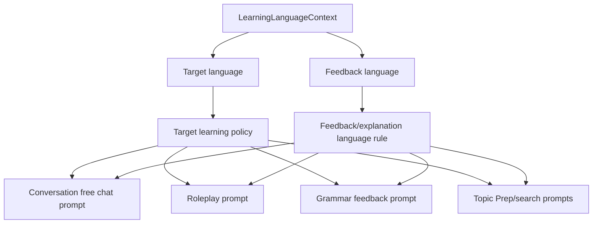

# Language Pair Prompt Policy - Plan

## Goal Capsule

| Field | Value |
|---|---|
| Objective | U3 범위에서 conversation, roleplay, grammar, Topic Prep prompt가 target language별 학습 포인트를 일관되게 반영하도록 정리한다. |
| Authority | 상위 후속 계획 U3의 R5, R6, AE4를 구현 가능한 backend prompt policy 작업으로 분해한다. |
| Execution profile | API schema나 provider를 바꾸지 않는 backend prompt policy refactor. |
| Stop conditions | 모델 라우팅, STT/TTS 언어 설정, grammar response schema 변경, 신규 언어쌍, benchmark harness가 범위에 들어오면 별도 계획으로 분리한다. |
| Tail ownership | 새 conversation과 기존 conversation continuation 모두 conversation snapshot의 Learning Language Context로 같은 학습 정책을 받아야 한다. |

---

## Product Contract

### Summary

언어쌍은 profile default와 conversation snapshot으로 이미 존재하고, U1/U2에서 모바일 copy와 roleplay/topic content가 target language를 소비하도록 정리되었다.
U3는 backend LLM prompt의 학습 정책을 같은 수준으로 끌어올린다.

핵심은 “어떤 언어로 말할지”만 지시하는 현재 prompt를 “그 언어를 배울 때 무엇을 더 신경 써야 하는지”까지 지시하도록 바꾸는 것이다.
한국어 target은 조사, 어미, 존댓말/격식, 띄어쓰기, 자연스러운 어순과 뉘앙스를 더 선명히 다루고, 영어 target은 시제, 관사, 전치사, 질문 구조, 문장 완성도, 자연스러운 구어체를 더 선명히 다룬다.
feedback language는 설명 언어로 유지하고, target language와 섞어서 새 schema나 provider 선택을 만들지 않는다.

### Problem Frame

현재 `backend/domains/conversation/service.py`, `backend/domains/grammar/service.py`, `backend/domains/search/service.py`는 모두 `LearningLanguageContext`를 받지만 각 prompt가 target-language policy를 제각각 작성한다.
Conversation prompt는 자연스럽게 대화하라는 일반 규칙이 중심이고, grammar prompt는 Korean 분기만 상대적으로 구체적이며, Topic Prep prompt는 target/feedback 언어 분리는 있으나 학습 포인트 정책은 얇다.

이 상태에서는 `en -> ko`나 `zh -> ko` 사용자가 같은 Korean-learning 제품 경험을 기대해도 conversation, grammar, Topic Prep이 서로 다른 기준으로 응답할 수 있다.
U3는 prompt policy를 공통화하거나 최소한 같은 helper에서 파생되게 만들어 이 drift를 줄인다.

### Requirements

- R1. Conversation free chat prompt는 target language별 학습 포인트를 포함해야 하며, response language와 feedback language 규칙은 기존처럼 분리해야 한다. Origin: R5.
- R2. Roleplay prompt는 U2의 target-aware role examples를 유지하면서 같은 target language 학습 포인트를 적용해야 한다. Origin: R5, AE4.
- R3. Grammar feedback prompt는 target language별 평가 항목을 체계화해야 하며 기존 JSON response schema를 바꾸지 않아야 한다. Origin: R6.
- R4. Topic Prep prompt와 direction guidance는 target language practice priorities를 반영하되 ready card와 retry response shape를 바꾸지 않아야 한다. Origin: R5, R6.
- R5. Korean target policy는 조사, 어미, 높임/격식, 띄어쓰기, 어순, 자연스러운 대화 뉘앙스를 명시해야 한다. Origin: R5, AE4.
- R6. English target policy는 tense, articles, prepositions, question formation, sentence completeness, natural spoken phrasing을 명시해야 한다. Origin: R5.
- R7. Chinese native 또는 feedback language는 설명 언어 선택에만 영향을 주며 target-specific practice policy를 바꾸지 않아야 한다. Origin: R5, R6.
- R8. Provider, model setting, API schema, DB schema, STT/TTS behavior는 변경하지 않는다. Origin: R8, R9.
- R9. 검증은 prompt snapshot/assertion review와 기존 focused checks를 우선하며, 새 테스트 작성 자체를 U3의 목표로 만들지 않는다. Origin: R10.

### Acceptance Examples

- AE1. Given `en -> ko`, when a free-chat system prompt is built, then it instructs Korean conversation practice and names Korean-specific learning points such as particles, endings, honorific level, spacing, and naturalness.
- AE2. Given `zh -> ko`, when grammar feedback prompt is built, then it checks Korean-specific issues and asks explanations to be written in Chinese without changing the JSON schema.
- AE3. Given `ko -> en`, when grammar feedback prompt is built, then it checks English-specific issues such as tense, articles, prepositions, and question structure.
- AE4. Given a Topic Prep handoff for Korean target, when conversation direction guidance is attached, then the guidance remains target-language practice oriented and does not imply English-only learning.
- AE5. Given any supported language pair, when prompt builders are called, then no provider/model selection changes occur and existing response schemas remain valid.

### Scope Boundaries

#### In Scope

- Backend prompt policy helper or small shared structure for target-language learning priorities.
- Free chat, roleplay, Topic Prep handoff, Topic Prep card generation, source/search quality prompt wording where it carries learner-facing policy.
- Grammar prompt target-language evaluation criteria while preserving parseable JSON output.
- Focused prompt assertions may be extended only as implementation guardrails where touched tests already exist.
- Synchronized documentation notes in `.agent/architecture.md`, `README.md`, and `docs/DSL.md` where prompt-language policy becomes a durable backend rule.

#### Deferred for Later

- Model routing design and provider comparison.
- STT/TTS language selection and voice settings.
- Prompt evaluation harness, scored benchmark set, or paid model quality experiments.
- New language pairs and curriculum/level taxonomy.
- Broad test expansion unrelated to the changed prompt contracts.

#### Outside This Product's Identity

- Exposing model/provider choice to learners.
- Turning conversation prompts into rigid textbook lesson plans.
- Asking the user to choose language pair again at every conversation start.

---

## Planning Contract

### Key Technical Decisions

- KTD1. Centralize target-language policy enough to prevent prompt drift.
  Prefer a small prompt-oriented shared module, such as `backend/shared/language_prompt_policy.py`, when multiple domains need the same policy text.
  Keep `backend/shared/language.py` focused on enum/context primitives unless implementation discovers the policy helper is truly just a small language primitive.
- KTD2. Keep target policy separate from feedback language.
  Target language decides practice behavior and correction criteria; feedback language decides explanation wording.
  This preserves the existing `LearningLanguageContext` contract and avoids inventing a second language model.
- KTD3. Preserve JSON invariants before improving grammar wording.
  Grammar prompts can become more specific, but the output contract consumed by `parse_grammar_response` remains unchanged.
- KTD4. Keep LLM system instructions in English.
  Existing backend prompts are English-written instructions naming target and feedback languages.
  U3 should improve their content without introducing mixed-language system prompt templates that are harder to maintain.
- KTD5. Prefer prompt snapshot review and existing focused assertions over runtime LLM evaluation.
  The implementation should prove that the right policy text reaches prompt builders.
  Model quality evaluation remains later work because provider routing and benchmark harness are out of scope.

### High-Level Technical Design

The policy layer should be deterministic and side-effect free.
It should return prompt-ready guidance for the current `target_language` and leave provider/model selection untouched.

### Current Code Findings

| Surface | Current finding | Planning implication |
|---|---|---|
| `backend/shared/language.py` | Owns `LanguageCode`, supported pairs, `LearningLanguageContext`, `language_name`, and default coercion. | Keep language primitives here; add prompt-policy text in a separate shared module if it grows beyond a tiny helper. |
| `backend/domains/conversation/service.py` | Free chat and roleplay prompts both state target/feedback language rules; U2 added target-aware roleplay examples. | Add reusable target policy text to both prompt builders without undoing U2 content. |
| `backend/domains/grammar/service.py` | Korean target has a richer branch; non-Korean branch is English-shaped but written as generic `{target_name}`. | Make English policy explicit and avoid pretending the generic branch handles all future languages equally. |
| `backend/domains/search/service.py` | Topic Prep already separates target-language content from feedback-language retry guidance; several search-quality prompts still use generic conversation-app wording. | Add concise practice-priority guidance where it helps LLM output, without changing response schemas. |
| `backend/tests/domains/grammar/test_grammar_service.py` | Existing tests assert Korean and English grammar prompt shape. | Extend these focused tests rather than creating a broad test workstream. |
| `backend/tests/domains/conversation/test_topic_prep_handoff.py` | Existing prompt tests cover free chat, roleplay, and Topic Prep handoff. | Add prompt policy assertions here for conversation/roleplay paths. |

### Assumptions

- U2 implementation is the active baseline: roleplay scenario examples and Topic Prep retry/example language policy already exist in the branch.
- The initial supported language pairs remain `ko -> en`, `en -> ko`, `zh -> en`, and `zh -> ko`.
- Chinese target is not supported yet; any helper should fail closed or fall back conservatively rather than create Chinese-learning policy.
- Prompt text changes can be tested through builder outputs without calling external LLM providers.

### Sequencing

1. Define the target-language policy representation first.
2. Apply it to conversation and roleplay prompts, preserving U2 role examples.
3. Apply it to grammar prompts, preserving JSON schema and parser behavior.
4. Apply it to Topic Prep/search prompts only where policy text materially affects generated content.
5. Update docs and run focused prompt-policy verification.

---

## Implementation Units

### U1. Define Backend Target-Language Policy

- **Goal:** Create a small reusable prompt policy source for target-language learning priorities.
- **Requirements:** R5, R6, R7, R8
- **Dependencies:** None
- **Files:** `backend/shared/language.py`, `backend/shared/language_prompt_policy.py`, `backend/tests/shared/test_language.py`
- **Approach:** Add a deterministic helper or data object that maps `LanguageCode.KOREAN` and `LanguageCode.ENGLISH` to prompt-ready learning priorities.
  Korean policy should name particles, endings, honorific/formality, spacing, word order, and naturalness.
  English policy should name tense, articles, prepositions, question formation, sentence completeness, and spoken phrasing.
  Prefer `backend/shared/language_prompt_policy.py` if the helper contains prompt wording rather than validation primitives.
  Keep unsupported future targets conservative and avoid changing supported-pair validation.
- **Patterns to follow:** Existing `language_name` and `ensure_language_context` helpers are pure and small; keep the new policy similarly simple.
- **Test scenarios:**
  - Given `LanguageCode.KOREAN`, the helper returns Korean-learning priorities including particles and honorific/formality.
  - Given `LanguageCode.ENGLISH`, the helper returns English-learning priorities including tense, articles, prepositions, and question formation.
  - Existing supported-pair validation and default context tests still pass.
- **Verification:** Prompt snapshot review or existing shared language tests show the helper is deterministic and does not alter `LearningLanguageContext` serialization or validation.

### U2. Apply Policy to Conversation and Roleplay Prompts

- **Goal:** Make free chat and roleplay prompts include the same target-language learning priorities.
- **Requirements:** R1, R2, R5, R6, R7, AE1, AE4, AE5
- **Dependencies:** U1
- **Files:** `backend/domains/conversation/service.py`, `backend/tests/domains/conversation/test_topic_prep_handoff.py`
- **Approach:** Inject the policy text into `build_free_chat_prompt` and `build_roleplay_prompt` near the existing learner language context section.
  Preserve the existing response-length rule, reference-information section, Topic Prep handoff behavior, and U2 roleplay scenario examples.
  `continue_conversation` already uses conversation snapshot language; implementation should keep that path untouched except for the prompt content it eventually builds.
- **Patterns to follow:** Current prompt builder style resolves names through `ensure_language_context` and `language_name` before constructing the system prompt.
- **Test scenarios:**
  - Covers AE1. Given `en -> ko`, `build_free_chat_prompt` includes Korean target language plus Korean-specific priorities.
  - Given default `ko -> en`, `build_free_chat_prompt` includes English-specific priorities and keeps the short-response rule.
  - Covers AE4. Given Korean target roleplay, `build_roleplay_prompt` includes Korean-specific priorities and keeps U2 Korean scenario examples.
  - Regression: roleplay prompt still does not include `English Teacher`.
- **Verification:** Prompt snapshots or existing focused assertions confirm target policy appears in both free chat and roleplay prompts for Korean and English targets.

### U3. Apply Policy to Grammar Feedback Prompts

- **Goal:** Make grammar feedback criteria explicit for Korean and English targets while keeping the JSON response contract stable.
- **Requirements:** R3, R5, R6, R7, R8, AE2, AE3, AE5
- **Dependencies:** U1
- **Files:** `backend/domains/grammar/service.py`, `backend/tests/domains/grammar/test_grammar_service.py`, `backend/tests/domains/grammar/test_grammar_router.py`
- **Approach:** Replace the current raw `target_language.value == "ko"` branch with enum-based target policy routing.
  Keep the Korean branch's strengths, make the English branch explicitly English instead of generic `{target_name}`, and ensure explanations still use `feedback_language`.
  Do not change `GrammarAnalysis`, `GrammarFeedback`, `parse_grammar_response`, router envelopes, or persistence.
- **Patterns to follow:** Existing grammar tests assert prompt content without external LLM calls; keep the same fast unit-test style.
- **Test scenarios:**
  - Covers AE2. Given `zh -> ko`, grammar prompt checks Korean-specific items and says explanations should be in Chinese.
  - Covers AE3. Given `ko -> en`, grammar prompt checks English-specific items including articles, prepositions, tense, and question formation.
  - Regression: prompt still instructs JSON with `has_errors`, `corrected_sentence`, and `errors`.
  - Regression: `parse_grammar_response` tests and grammar router ownership tests remain unchanged.
- **Verification:** Prompt snapshot review or existing grammar service assertions prove target-specific criteria and feedback-language separation without altering response schemas.

### U4. Apply Policy to Topic Prep and Search Prompts

- **Goal:** Make Topic Prep/search LLM prompts reflect target-language learning priorities where they generate conversation material or quality guidance.
- **Requirements:** R4, R5, R6, R7, R8, AE4, AE5
- **Dependencies:** U1
- **Files:** `backend/domains/search/service.py`, `backend/tests/domains/search/test_topic_prep_service.py`, `backend/tests/domains/search/test_search_router.py`, `backend/tests/domains/search/test_topic_prep_router.py`
- **Approach:** Add concise target policy guidance to Topic Prep card generation and source/search quality prompts only where it helps the LLM produce or judge conversation-practice material.
  Preserve U2 behavior: sufficient card content uses target language, retry guidance uses feedback language, example topics are target-aware.
  Avoid expanding query-analysis prompts into curriculum design; search relevance still judges whether sources can support a concrete conversation.
- **Patterns to follow:** Existing `_build_topic_prep_system_prompt`, `_build_retry_guidance`, and `_default_direction_metadata` already receive `LearningLanguageContext`.
- **Test scenarios:**
  - Given Korean target, Topic Prep system prompt includes Korean-practice priorities and still instructs sufficient cards to write in Korean.
  - Given English target, Topic Prep system prompt includes English-practice priorities and still writes retry guidance in feedback language when insufficient.
  - Regression: low-quality Topic Prep result remains `ready=false` with `card=None`, aligned `quality.retry_suggestion`, `retry_guidance`, and `example_topics`.
  - Regression: search router language context tests still pass for `zh -> en` and default contexts.
- **Verification:** Prompt snapshot review or existing search assertions confirm prompt policy content without changing `TopicPrepResult` or `SearchResult` schemas.

### U5. Update Documentation and Architecture Notes

- **Goal:** Document the prompt-language policy so future model-routing or voice work does not reinterpret it.
- **Requirements:** R7, R8, R9, AE5
- **Dependencies:** U2, U3, U4
- **Files:** `.agent/architecture.md`, `README.md`, `docs/DSL.md`
- **Approach:** Add a short backend prompt policy note: target language controls conversation practice and correction criteria; feedback language controls explanations and retry guidance; conversation snapshots remain the source during existing conversations.
  Do not imply STT/TTS or model routing implementation.
- **Patterns to follow:** Existing docs already describe Learning Language Context and U1/U2 content-language policy.
- **Test scenarios:** Test expectation: none -- documentation-only unit.
- **Verification:** Documentation review confirms README/DSL/architecture agree on target-vs-feedback language responsibilities and preserve the model-routing deferral.

---

## Verification Contract

| Gate | Applies to | Done signal |
|---|---|---|
| Prompt snapshot review | U1-U4 | Representative prompt builder outputs show target-language policy is present and feedback-language rules remain separate. |
| Existing focused assertions | U1-U4 | Existing shared/conversation/grammar/search tests may be extended only where they already cover touched prompt builders or response-shape invariants. |
| Documentation sweep | U5 | README, DSL, and architecture describe prompt policy without claiming model routing or STT/TTS changes. |

---

## Definition of Done

- D1. Prompt policy for Korean and English targets is available from a single backend source or a clearly equivalent local helper pattern.
- D2. Free chat, roleplay, grammar, and Topic Prep/search prompt builders consume the target-language policy consistently.
- D3. Korean target prompts mention Korean-specific learning priorities from R5.
- D4. English target prompts mention English-specific learning priorities from R6.
- D5. Feedback/retry explanations still follow `feedback_language`, not `target_language`.
- D6. API schemas, DB schema, provider/model settings, STT/TTS behavior, and grammar JSON output shape remain unchanged.
- D7. Prompt snapshot review and existing focused checks cover the prompt builders touched by the plan without creating a separate test-expansion workstream.
- D8. Documentation names the backend prompt policy and keeps model routing deferred to the future parent U5 model-routing design artifact.
- D9. Abandoned exploratory prompt helpers or duplicated policy strings are removed before the work is considered complete.
