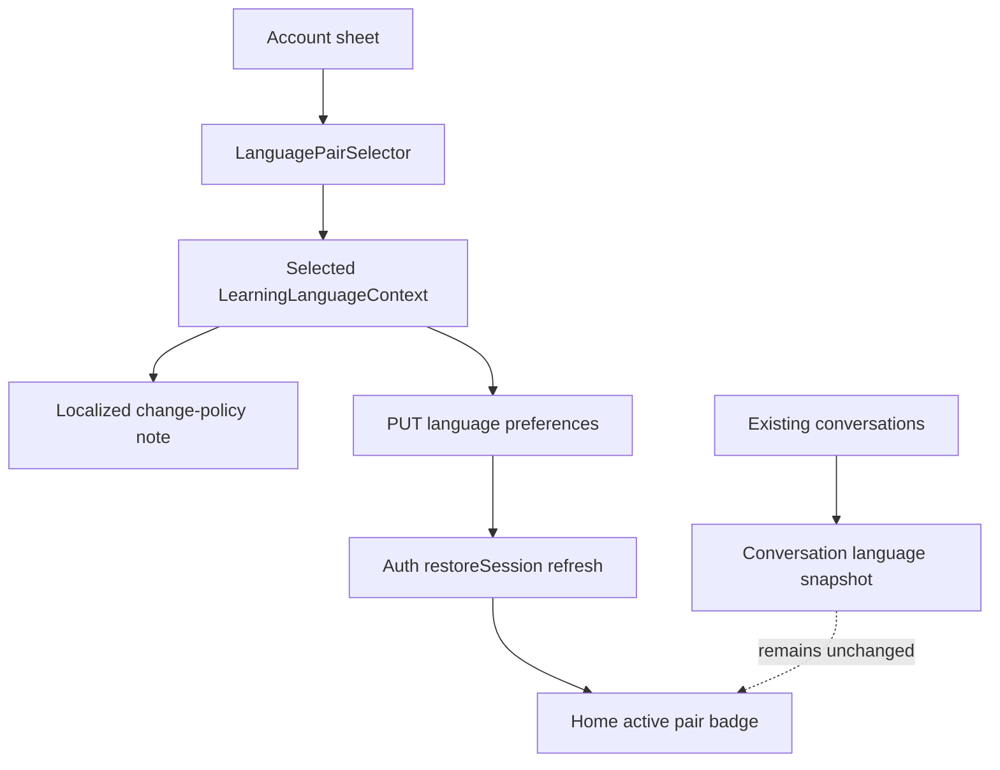

# Language Pair Change Policy UX - Plan

## Goal Capsule

| Field | Value |
|---|---|
| Objective | U4 범위에서 사용자가 계정 설정의 언어쌍을 변경할 때 “새 대화부터 적용, 기존 대화는 생성 시점 언어 유지” 정책을 앱 UX와 문서에 명확히 드러낸다. |
| Authority | 상위 후속 계획 U4의 R7, AE3을 구현 가능한 mobile UX 및 documentation 작업으로 분해한다. |
| Execution profile | API/DB/schema 변경 없이 Flutter account sheet copy, preference save feedback, 문서 sync를 정리하는 소규모 UX 구현. |
| Stop conditions | 기존 conversation 언어 일괄 변경, per-conversation 언어 편집, STT/TTS 언어 설정, provider/model routing, 신규 언어쌍 추가가 범위에 들어오면 별도 계획으로 분리한다. |
| Tail ownership | 언어쌍 변경 후 Home의 active pair는 새 profile default를 보여주고, 기존 conversation 진입은 conversation snapshot 의미를 계속 유지해야 한다. |

---

## Product Contract

### Summary

언어쌍은 profile default와 conversation snapshot으로 이미 분리되어 있다.
문제는 사용자가 Account sheet에서 언어쌍을 바꿀 때 이 정책을 충분히 보지 못한다는 점이다.
U4는 새 데이터 모델을 만들지 않고, 설정 변경 UX가 backend snapshot semantics를 정확히 설명하도록 만든다.

핵심 문장은 짧고 일관되어야 한다.
언어쌍 변경은 앞으로 시작하는 Free Chat, Roleplay, Topic Prep handoff에 적용되고, 이미 만든 대화는 대화가 시작된 시점의 언어쌍을 유지한다.
이는 데이터 보호 알림이 아니라 예측 가능성 안내이므로, 별도 confirmation modal보다 selector 주변의 compact helper copy와 저장 후 짧은 confirmation feedback이 더 적합하다.

### Problem Frame

현재 `mobile/lib/features/home/presentation/account_sheet.dart`는 언어쌍 selector와 save button을 제공하지만, 저장 결과가 기존 대화에 어떤 영향을 주는지 설명하지 않는다.
저장 성공 시 sheet가 닫히고 `authControllerProvider.restoreSession()`으로 profile을 다시 hydration하므로 Home의 active pair는 갱신되지만, 사용자는 기존 History나 Conversation이 왜 다른 언어쌍을 유지하는지 혼동할 수 있다.

이 혼동은 특히 `ko -> en`에서 `en -> ko` 또는 `zh -> ko`로 전환하는 사용자에게 크다.
사용자가 “앱 전체가 즉시 바뀐다”고 예상하면 기존 대화의 snapshot behavior가 버그처럼 보일 수 있다.
U4는 정책 copy를 제품 표면과 문서에 고정해 이 기대 차이를 줄인다.

### Requirements

- R1. Account sheet의 언어쌍 설정 영역은 변경된 언어쌍이 새 conversation부터 적용된다는 copy를 표시해야 한다. Origin: R7.
- R2. 같은 copy는 기존 conversation이 생성 시점의 언어쌍을 유지한다는 점을 명확히 말해야 한다. Origin: R7, AE3.
- R3. Copy는 현재 앱의 narrow i18n 패턴을 따라 locale별로 최소 분기할 수 있어야 한다. 한국어, 영어, 중국어 사용자가 모두 이해 가능한 안내가 필요하다. Origin: R2, R7.
- R4. 저장 성공 UX는 사용자가 변경이 반영되었다는 것을 알 수 있어야 하며, 불필요하게 큰 confirmation modal이나 중단형 flow를 만들지 않아야 한다. Origin: AE3.
- R5. 저장 실패 UX는 현재 `languageError` 경로를 유지하되, 정책 안내와 오류 copy가 서로 충돌하지 않아야 한다.
- R6. Home active pair display는 profile hydration 이후 새 default를 보여야 하며, 기존 conversation snapshot semantics를 바꿔서는 안 된다. Origin: R7.
- R7. API request/response schema, DB schema, provider/model routing, STT/TTS behavior는 변경하지 않는다. Origin: R8, R9.
- R8. README, mobile README, DSL, architecture 문서는 target-vs-feedback policy와 preference-vs-snapshot policy를 같은 의미로 설명해야 한다.
- R9. 새 테스트 작성 자체를 별도 작업 목표로 삼지 않는다. 구현 중 copy/state behavior가 바뀌는 기존 테스트 표면은 최소 보강할 수 있다. Origin: R10.

### Acceptance Examples

- AE1. Given a learner opens Account sheet, when they inspect Language Pair settings, then they see that changing the pair affects new conversations.
- AE2. Given a learner changes from `ko -> en` to `en -> ko`, when save succeeds, then Home shows the updated active pair after profile refresh.
- AE3. Given the learner opens an old conversation after changing profile preferences, then the UI and docs do not imply the old conversation should switch language.
- AE4. Given locale is Chinese, when the policy helper copy is rendered, then the learner can understand the new-conversations-only rule in Chinese without requiring full app localization.
- AE5. Given save fails, when the error message is shown, then the policy note remains informational and the error remains the actionable failure state.

### Scope Boundaries

#### In Scope

- Account sheet language-pair section helper copy.
- Optional save-success confirmation surface if it can be done compactly without disrupting the existing sheet flow.
- Small mobile domain helper for localized language-preference policy text if needed.
- Home/profile hydration behavior review to ensure active pair display still updates after save.
- Documentation sync in `README.md`, `docs/DSL.md`, `.agent/architecture.md`, and `mobile/README.md`.

#### Deferred for Later

- Per-conversation language editing.
- Bulk migration or conversion of old conversations to a new language pair.
- Full app localization with ARB/l10n infrastructure.
- Dedicated UX research, analytics instrumentation, or onboarding replay flow.
- STT/TTS language handling and provider/model routing.

#### Outside This Product's Identity

- Asking for language pair at every conversation start.
- Exposing internal snapshot mechanics as a technical warning-heavy workflow.
- Treating language preference changes as destructive data changes requiring a scary confirmation dialog.

---

## Planning Contract

Product Contract preservation: 상위 후속 계획의 U4 범위(R7, AE3)를 좁혀 구현 계획으로 분리했으며, profile default와 conversation snapshot의 제품 의미는 변경하지 않는다.

### Key Technical Decisions

- KTD1. Use profile preference copy, not data-model changes.
  Backend already separates profile defaults from conversation snapshots, so U4 should not introduce new persistence or API fields.
  The implementation should explain the existing contract instead of changing it.
- KTD2. Put the policy note close to the selector.
  A compact note near `LanguagePairSelector` is visible before the user taps save, works whether save succeeds or fails, and avoids adding a modal solely to explain non-destructive behavior.
- KTD3. Keep save success lightweight.
  Current behavior closes the sheet and refreshes auth profile state.
  If implementation adds success feedback, prefer a short `SnackBar` or equivalent non-blocking confirmation after the sheet closes; do not keep users trapped in settings.
- KTD4. Centralize localized policy copy only if it prevents duplication.
  `LearningLanguageContext` already owns pair labels, helper text, and first-answer hints.
  A method such as `preferenceChangePolicyText(localeCode)` belongs there if both selector and tests need the same copy; otherwise `account_sheet.dart` can own a private copy helper.
- KTD5. Preserve controller responsibilities.
  `languagePreferencesControllerProvider` reads preferences and `authControllerProvider.restoreSession()` hydrates the authenticated profile.
  U4 can keep the current repository write plus invalidation/restore path unless implementation discovers a stale Home active pair bug.

### High-Level Technical Design

The product rule is one-way: profile preference changes affect future conversation creation only.
Existing conversation screens should continue to consume conversation response/message data and backend snapshot behavior; they do not need a new client-side override.

### Current Code Findings

| Surface | Current finding | Planning implication |
|---|---|---|
| `mobile/lib/features/home/presentation/account_sheet.dart` | Shows account info, logout, `LanguagePairSelector`, save button, and error state; save writes repository, invalidates language preferences, restores auth session, then closes the sheet. | Add policy copy in this section and verify save still refreshes Home active pair. |
| `mobile/lib/features/language/presentation/language_pair_selector.dart` | Renders supported contexts with `pairLabel` and `helperText`. | Keep selector focused on options; do not bury the snapshot policy inside each repeated card unless implementation needs per-option wording. |
| `mobile/lib/features/language/domain/learning_language.dart` | Owns locale-aware labels and helper copy for language context. | Add reusable localized policy text here if account sheet and tests need stable wording. |
| `mobile/lib/features/home/presentation/home_screen.dart` | Shows active pair badge from `user.language`. | Ensure account save refresh path keeps this display accurate for future conversations. |
| `mobile/test/features/home/presentation/home_screen_test.dart` | Opens Account sheet and can assert visible copy; fake language repository currently returns selected context. | Extend existing widget tests only as guardrails for visible policy copy and save refresh behavior. |
| `README.md`, `docs/DSL.md`, `.agent/architecture.md`, `mobile/README.md` | Already document language context and prompt policy after U1-U3. | Add or tighten the account preference-change policy without implying API/schema changes. |

### Assumptions

- U1, U2, and U3 are the active baseline on `feat/language-pairs`.
- The supported language pairs remain `ko -> en`, `en -> ko`, `zh -> en`, and `zh -> ko`.
- Conversation snapshot persistence and backend continuation behavior are already correct.
- No historical local copy snapshots must be preserved.
- The implementation should not touch `backend/domains/voice/` or provider configuration.

### Sequencing

1. Add or choose a localized policy-copy helper.
2. Render the policy note in Account sheet next to the language pair selector.
3. Preserve or lightly improve save-success feedback while keeping Home active pair refresh behavior.
4. Sync README, DSL, architecture, and mobile README.
5. Run focused mobile checks for changed copy/state surfaces.

---

## Implementation Units

### U1. Add localized preference-change policy copy

- **Goal:** Provide concise copy that explains new-conversations-only semantics in the user's locale.
- **Requirements:** R1, R2, R3, R7, AE1, AE4
- **Dependencies:** None
- **Files:** `mobile/lib/features/language/domain/learning_language.dart`, `mobile/test/features/language/domain/learning_language_test.dart`
- **Approach:** Add a small locale-aware helper if implementation needs reusable text.
  Keep wording informational and compact.
  Suggested English meaning: "Applies to new conversations. Existing conversations keep the language pair they started with."
  Korean and Chinese variants should match that meaning without adding technical jargon.
  Do not add full localization infrastructure.
- **Patterns to follow:** Existing `helperText`, `firstAnswerHint`, and `firstAnswerSemanticLabel` methods use a `localeCode` switch and display names from `LearningLanguageCode`.
- **Test scenarios:**
  - Given locale `en`, the helper mentions new conversations and existing conversations.
  - Given locale `ko`, the helper expresses 새 대화 적용 and 기존 대화 유지.
  - Given locale `zh`, the helper expresses new conversations and existing conversations in Chinese.
- **Verification:** Existing language domain tests confirm helper output is deterministic and supported language context serialization remains unchanged.

### U2. Surface policy in Account sheet

- **Goal:** Show the preference-change policy where users change language pair settings.
- **Requirements:** R1, R2, R3, R4, R5, AE1, AE5
- **Dependencies:** U1
- **Files:** `mobile/lib/features/home/presentation/account_sheet.dart`, `mobile/test/features/home/presentation/home_screen_test.dart`
- **Approach:** Render the policy note near the `LanguagePairSelector`, ideally between the section label and the selector or just below the selector.
  Use existing typography and spacing tokens.
  The note should be scannable, not a second card nested inside the sheet.
  Keep `languageError` as the explicit failure state and ensure the save button disabled/loading behavior remains unchanged.
- **Patterns to follow:** Existing Account sheet uses `AppSectionLabel`, `AppSpacing`, `AppTypography`, `AppPrimaryButton`, and `Semantics(liveRegion: true)` for errors.
- **Test scenarios:**
  - Account sheet displays the policy note.
  - Selecting a different language pair does not remove the policy note.
  - Save failure still shows `Language pair could not be saved.` and leaves the policy note informational.
- **Verification:** Focused Home widget tests prove the copy is visible and current save/error behavior is preserved.

### U3. Preserve save refresh and active-pair visibility

- **Goal:** Ensure saving language preferences refreshes the authenticated profile so Home shows the new default pair for future conversations.
- **Requirements:** R4, R6, R7, AE2, AE3
- **Dependencies:** U2
- **Files:** `mobile/lib/features/home/presentation/account_sheet.dart`, `mobile/lib/features/home/presentation/home_screen.dart`, `mobile/lib/features/language/application/language_preferences_controller.dart`, `mobile/lib/features/auth/application/auth_controller.dart`, `mobile/test/features/home/presentation/home_screen_test.dart`
- **Approach:** First characterize current behavior: Account sheet writes preferences, invalidates language preferences, calls `authControllerProvider.notifier.restoreSession()`, and closes.
  If this already updates Home active pair reliably, keep the implementation untouched and add only focused assertion coverage.
  If it does not, adjust the narrowest state path so restored `UserProfile.language` becomes the source of the Home badge.
  Do not introduce a second local preference source for Home.
- **Patterns to follow:** `authControllerProvider` is authoritative for authenticated user profile state; `languagePreferencesControllerProvider` owns explicit preference reads/writes.
- **Test scenarios:**
  - Given fake repository returns `en -> ko` after save, Home active pair updates after Account sheet save.
  - Given old conversation navigation exists, no UI copy says existing conversations are converted.
  - Regression: logout still clears Supabase and Google session state.
- **Verification:** Focused Home widget tests show profile hydration and Account sheet interactions still work.

### U4. Sync durable documentation

- **Goal:** Keep external and internal docs aligned with the preference-vs-snapshot UX policy.
- **Requirements:** R7, R8, R9, AE3
- **Dependencies:** U1-U3
- **Files:** `README.md`, `docs/DSL.md`, `.agent/architecture.md`, `mobile/README.md`
- **Approach:** Add concise notes that language preference updates affect future conversations while existing conversations keep their stored snapshot.
  Mention this as UX/product behavior, not as a new API contract.
  Keep model routing and STT/TTS explicitly outside the change if nearby sections mention them.
- **Patterns to follow:** Existing docs already describe profile defaults, conversation snapshots, and target-vs-feedback prompt policy; reuse those terms.
- **Test scenarios:** Documentation-only unit; no dedicated test scenario.
- **Verification:** Documentation review confirms the same policy is stated consistently across README, DSL, architecture, and mobile README.

---

## Verification Contract

| Check | Command | Covers | Done signal |
|---|---|---|---|
| Dart format | `dart format lib test` from `mobile/` | U1-U3 | Formatter exits successfully without unrelated churn. |
| Flutter analyze | `flutter analyze --no-pub` from `mobile/` | U1-U3 | Static analysis passes. |
| Focused mobile tests | `flutter test test/features/language/domain/learning_language_test.dart test/features/home/presentation/home_screen_test.dart` from `mobile/` | U1-U3 | Policy copy and Account sheet/Home behavior pass. |
| Documentation diff review | `git diff -- README.md docs/DSL.md .agent/architecture.md mobile/README.md` | U4 | Docs agree on profile default vs conversation snapshot semantics. |
| Whitespace check | `git diff --check` from repo root | U1-U4 | No whitespace errors. |

Warnings or failures from unrelated pre-existing tests should be recorded separately rather than broadening U4.

---

## Definition of Done

- D1. Account sheet tells users that language pair changes apply to new conversations.
- D2. Account sheet also tells users that existing conversations keep their original language pair.
- D3. The policy copy is understandable for English, Korean, and Chinese locale users within the existing narrow i18n pattern.
- D4. Saving a new language pair still refreshes the authenticated profile and updates Home's active pair display.
- D5. Existing conversation snapshot semantics, API schemas, DB schemas, STT/TTS behavior, and model routing remain unchanged.
- D6. README, DSL, architecture, and mobile README state the same preference-change policy.
- D7. Focused changed-surface checks pass, or any unrelated pre-existing failure is clearly separated from U4.
