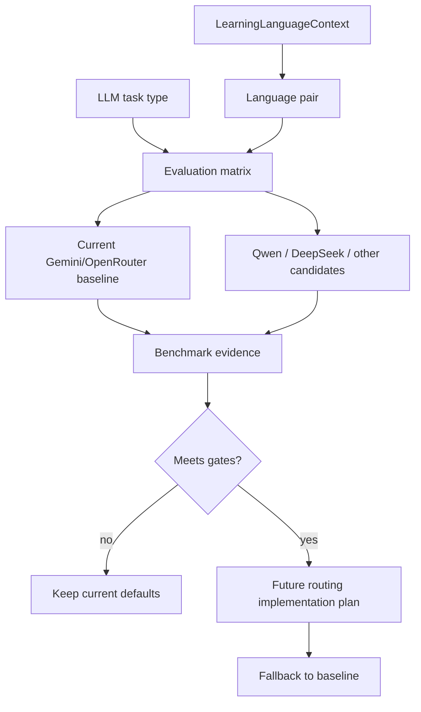

# Language Pair Model Routing Design - Plan

## Goal Capsule

| Field | Value |
|---|---|
| Objective | U5 범위에서 언어쌍·task별 future model routing 설계 문서를 작성해 Gemini, Qwen, DeepSeek 같은 후보를 평가하고 나중에 안전하게 구현할 기준을 남긴다. |
| Authority | 상위 후속 계획 U5의 R8, AE5를 구현 가능한 documentation-only 작업으로 분해한다. |
| Execution profile | Runtime provider/model 선택을 바꾸지 않는 design documentation 작업. |
| Stop conditions | 새 provider client, pair-specific env var, OpenRouter request payload 변경, benchmark harness 구현, STT/TTS 설정 변경이 범위에 들어오면 멈추고 별도 계획으로 분리한다. |
| Tail ownership | 현재 runtime은 기존 `LLM_PROVIDER`, `OPENROUTER_MODEL`, `GRAMMAR_*` 설정을 계속 사용하고, U5 산출물은 이후 구현 PR의 의사결정 기준으로만 작동해야 한다. |

---

## Product Contract

### Summary

언어쌍 UX, 콘텐츠, prompt policy가 정리된 뒤에도 모델 선택은 아직 단일 runtime 설정에 가깝다.
중국어 사용자의 한국어/영어 학습 흐름에서는 Qwen이나 DeepSeek 같은 중국어권 모델 후보를 검토할 이유가 있지만, 지금 바로 provider routing을 구현하면 품질·비용·지연시간·JSON 안정성을 검증하지 않은 채 운영 복잡도만 늘어난다.

U5는 실행 변경 대신 설계 문서를 만든다.
문서는 어떤 언어쌍과 task가 후보 모델 평가 대상인지, 어떤 metric으로 Gemini 기본값과 비교할지, fallback을 어떻게 유지할지, 어떤 증거가 있어야 구현 단계로 넘어갈지를 답해야 한다.

### Problem Frame

현재 backend는 `LLMProviderFactory`로 `openrouter` 또는 `ollama` provider를 만들고, conversation/search는 `get_model_for_provider()`, grammar는 `get_grammar_model_config()`를 통해 모델을 고른다.
이 구조는 단순하고 운영하기 쉽지만, task type과 `LearningLanguageContext`를 routing decision으로 쓰지는 않는다.

무작정 Qwen/DeepSeek를 붙이면 문제의 종류가 늘어난다.
중국어 explanation quality가 좋아질 수는 있지만, Korean correction quality, JSON compliance, latency, fallback behavior, key management, cost predictability가 나빠질 수도 있다.
따라서 라우팅 구현 전에 “무엇을 관찰하면 바꿀 수 있는가”가 먼저 문서화되어야 한다.

### Requirements

- R1. 설계 문서는 현재 runtime이 기존 `LLM_PROVIDER`, `OPENROUTER_MODEL`, `GRAMMAR_MODEL_PROVIDER`, `GRAMMAR_OPENROUTER_MODEL`, `GRAMMAR_OLLAMA_MODEL` 설정을 유지한다고 명시해야 한다. Origin: R8.
- R2. 설계 문서는 routing dimensions를 `native_language`, `target_language`, `feedback_language`, task type, latency, cost, JSON reliability, Korean correction quality, Chinese explanation quality, fallback으로 분리해야 한다. Origin: R8.
- R3. 설계 문서는 지원 언어쌍 `ko -> en`, `en -> ko`, `zh -> en`, `zh -> ko`별로 모델 후보 검토 이유와 보류 이유를 기록해야 한다. Origin: R8, AE5.
- R4. 설계 문서는 conversation, roleplay, grammar feedback, Topic Prep/search quality처럼 현재 LLM task surface를 구분해야 한다.
- R5. 설계 문서는 Gemini 계열을 current default baseline으로 두고, Qwen/DeepSeek는 benchmark evidence가 있어야 시도하는 후보로 표현해야 한다. Origin: AE5.
- R6. 설계 문서는 OpenRouter provider routing 또는 직접 OpenAI-compatible provider integration 중 어떤 implementation path가 가능한지 비교해야 한다.
- R7. 설계 문서는 fallback policy를 포함해야 하며, 후보 모델 실패 시 현재 기본 모델 동작으로 복귀할 수 있어야 한다.
- R8. 설계 문서는 env var 추가 후보를 제안할 수는 있지만, 이번 작업에서 `.env.example`, `backend/config.py`, provider code를 변경하지 않아야 한다.
- R9. 설계 문서는 benchmark harness 구현을 후속 작업으로 남기고, 이번 작업에서 paid benchmark나 runtime LLM call을 수행하지 않아야 한다.
- R10. 설계 문서는 STT/TTS provider 및 음성 언어 설정을 범위 밖으로 유지해야 한다.

### Acceptance Examples

- AE1. Given a maintainer opens the model routing design doc, when they inspect `zh -> ko`, then they see why Qwen/DeepSeek may be worth evaluating for Chinese explanations but not enabled yet.
- AE2. Given a maintainer inspects grammar feedback routing, then they see JSON reliability and Korean correction quality as gating metrics before any model switch.
- AE3. Given a future implementer wants pair-specific routing, then they can identify whether to start with OpenRouter routing/fallbacks or direct OpenAI-compatible provider clients.
- AE4. Given current deployment configuration, then the design confirms no new env vars or default model changes are required by U5.
- AE5. Given STT/TTS work is happening elsewhere, then the design does not prescribe voice model/provider behavior.

### Scope Boundaries

#### In Scope

- New durable design document for future language-pair model routing.
- Documentation references from README and architecture to the design note.
- Current provider/config surface audit.
- Evaluation matrix for supported language pairs and LLM task types.
- Fallback and rollout criteria for a future implementation.

#### Deferred for Later

- Pair-specific model routing implementation.
- New provider clients for DeepSeek, Qwen Cloud, DashScope, or other OpenAI-compatible APIs.
- OpenRouter request-level `provider` routing payload changes.
- Benchmark dataset, automated scoring harness, paid model runs, and monitoring dashboards.
- New language pairs, curriculum levels, or full i18n.
- STT/TTS language and voice provider settings.

#### Outside This Product's Identity

- Exposing provider/model choice to learners.
- Switching models because of brand fit rather than measured learning quality.
- Adding provider complexity that cannot fail back to the known baseline.

---

## Planning Contract

Product Contract preservation: 상위 후속 계획의 U5 범위(R8, AE5)를 documentation-only work로 좁혀 구현 계획으로 분리했으며, provider/model runtime behavior는 변경하지 않는다.

### Key Technical Decisions

- KTD1. Design first, implementation later.
  Pair/task-specific model routing is explicitly deferred from the language-pair refactor.
  U5 should create a decision artifact that future implementation can execute only after quality evidence exists.
- KTD2. Keep current env configuration authoritative.
  `LLM_PROVIDER`, `OPENROUTER_MODEL`, and `GRAMMAR_*` remain the only runtime model controls in this work.
  Proposed future env vars may appear in the design doc as candidates, not in `.env.example`.
- KTD3. Evaluate by task, not just by native language.
  The same learner pair can need different model qualities for free conversation, grammar correction, source quality judging, and Topic Prep generation.
  Grammar has the strictest JSON and correction-quality risk.
- KTD4. Treat Chinese-native flows as a hypothesis, not a default switch.
  Qwen/DeepSeek may improve Chinese explanations or Chinese-native prompt following, but Korean-learning quality and JSON reliability must be proven before routing `zh -> ko`.
- KTD5. Prefer reversible routing paths.
  A future implementation should begin with a feature-flagged or config-gated route that can fall back to the current default model.
  This protects active learners while model quality is being measured.
- KTD6. Separate LLM text routing from voice ownership.
  STT/TTS language handling is owned by another workstream and must not be pulled into U5.

### High-Level Technical Design

The U5 implementation produces the matrix and decision gates.
It does not add the router represented by `FuturePlan`.

### Current Code Findings

| Surface | Current finding | Planning implication |
|---|---|---|
| `backend/config.py` | `get_model_for_provider()` returns one conversation/search model per provider; `get_grammar_model_config()` allows grammar-specific provider/model override. | Design around existing conversation/search vs grammar split before proposing more dimensions. |
| `backend/domains/llm/factory.py` | Provider factory currently supports `openrouter` and `ollama`. | Direct DeepSeek/Qwen provider clients are future work, not U5. |
| `backend/domains/llm/openrouter.py` | Request passes `request.extra_params`, so future OpenRouter provider routing could be carried in request payload if service code chooses to supply it later. | Design can compare OpenRouter-native routing with new provider clients. |
| `backend/domains/conversation/service.py` | Conversation and roleplay currently call the default provider/model path. | Future routing may need task type plus language context at request construction time. |
| `backend/domains/grammar/service.py` | Grammar already has separate provider/model config. | Grammar is the lowest-risk first routing seam only if JSON reliability is benchmarked. |
| `backend/domains/search/service.py` | Query analysis, source judge, summary, and Topic Prep card generation all call LLM with different output needs. | Design should treat search sub-tasks separately instead of one generic search model. |
| `README.md`, `docs/DSL.md`, `.agent/architecture.md` | Current docs describe provider settings and note model routing is deferred. | U5 should add references to the new design doc without implying implementation. |

### Sources and Research

- Google AI Gemini model docs were checked on 2026-07-21 and show Gemini model availability/versioning changes frequently, including stable and preview variants. Future implementation should verify exact model IDs again before changing env defaults: https://ai.google.dev/gemini-api/docs/models
- DeepSeek API docs were checked on 2026-07-21 and document OpenAI-compatible access plus current model IDs such as `deepseek-v4-flash` and `deepseek-v4-pro`. Future implementation should verify deprecations before using model aliases: https://api-docs.deepseek.com/
- Qwen Cloud docs were checked on 2026-07-21 and document OpenAI-compatible API migration through base URL, API key, and model changes, with `qwen3.7-plus` shown in examples: https://docs.qwencloud.com/api-reference/toolkitframework/openai-compatible/overview
- OpenRouter routing docs were checked on 2026-07-21 and document request-level provider controls such as `order`, `allow_fallbacks`, `sort`, `only`, and `ignore`: https://openrouter.ai/docs/guides/routing/provider-selection

### Assumptions

- U1-U4 language-pair UX/content/prompt policy work is the active baseline.
- The supported language pairs remain fixed at `ko -> en`, `en -> ko`, `zh -> en`, and `zh -> ko`.
- Current production defaults continue to be managed through existing environment variables.
- No current benchmark dataset exists for comparing model quality across supported pairs and task types.
- External model names, pricing, context windows, and availability are unstable enough that implementation must re-check official docs at execution time.

### Sequencing

1. Create the model routing design document skeleton.
2. Fill current baseline and task-surface inventory from backend code.
3. Add candidate matrix and benchmark gates for Gemini/Qwen/DeepSeek.
4. Add future implementation paths and fallback policy.
5. Sync README and architecture references without touching runtime config.

---

## System-Wide Impact

- Backend runtime: no code or env behavior changes in U5.
- Documentation: maintainers gain one durable place to evaluate future model routing instead of scattering decisions across README comments.
- Operations: future provider credentials and cost controls are explicitly deferred until benchmark evidence and implementation planning exist.
- Product: learner-facing model choice remains hidden; routing remains an internal quality/cost decision.
- Voice: STT/TTS ownership remains separate.

---

## Risks and Mitigations

| Risk | Impact | Mitigation |
|---|---|---|
| Design doc accidentally reads like implementation is complete | Maintainers may configure unsupported routes | Use explicit "current runtime unchanged" language in the design and docs. |
| Model IDs go stale quickly | Future implementer may copy outdated names | Mark model names as examples checked on 2026-07-21 and require official-doc verification before implementation. |
| Candidate selection overweights Chinese explanation quality | Korean correction or English conversation quality regresses | Require task-specific metrics, including Korean correction quality and JSON reliability. |
| OpenRouter routing and direct provider integration get conflated | Future implementation may add redundant provider layers | Compare the two paths and name their tradeoffs separately. |
| `.env.example` receives premature variables | Ops surface expands without working code | Treat env vars as proposed future candidates only; do not edit runtime config in U5. |

---

## Implementation Units

### U1. Create model routing design document

- **Goal:** Add a durable design artifact that frames future language-pair model routing without changing runtime behavior.
- **Requirements:** R1, R2, R3, R5, R8, R9, R10, AE1, AE4, AE5
- **Dependencies:** None
- **Files:** `docs/design/LANGUAGE_PAIR_MODEL_ROUTING.md`
- **Approach:** Create a design doc that opens with the current non-implementation boundary, current baseline, and why routing is deferred.
  Include an explicit "Current state" section naming existing provider/model settings and a "Non-goals" section excluding STT/TTS, new provider clients, env vars, and learner-visible model choice.
  Use examples for Gemini/Qwen/DeepSeek as candidates, but avoid presenting any candidate as chosen.
- **Patterns to follow:** `docs/design/DESIGN_SYSTEM.md` shows durable design docs in `docs/design/`; use concise headings and tables rather than a plan-style execution artifact.
- **Test scenarios:** Test expectation: none -- documentation-only unit.
- **Verification:** The design doc clearly answers why current runtime remains unchanged and where future routing decisions should be made.

### U2. Define routing dimensions and task inventory

- **Goal:** Document the decision keys a future router would need and map them to current backend LLM task surfaces.
- **Requirements:** R2, R4, R6, R7, AE2, AE3
- **Dependencies:** U1
- **Files:** `docs/design/LANGUAGE_PAIR_MODEL_ROUTING.md`
- **Approach:** Add a matrix for language dimensions (`native_language`, `target_language`, `feedback_language`) and task dimensions (`conversation`, `roleplay`, `grammar`, `search query analysis`, `source quality judge`, `summary`, `Topic Prep card`).
  For each task, name output shape risk, latency sensitivity, JSON/schema sensitivity, and whether fallback to current default is acceptable.
  Grammar and Topic Prep JSON tasks should be treated as higher risk than ordinary conversation.
- **Patterns to follow:** Current services already separate task entry points in `backend/domains/conversation/service.py`, `backend/domains/grammar/service.py`, and `backend/domains/search/service.py`.
- **Test scenarios:** Test expectation: none -- documentation-only unit.
- **Verification:** A reader can identify every current LLM task surface and the routing dimensions that would affect it.

### U3. Add candidate model evaluation matrix

- **Goal:** Define how Gemini, Qwen, DeepSeek, and current OpenRouter/Ollama paths should be evaluated before a switch.
- **Requirements:** R3, R5, R6, R7, R9, AE1, AE2, AE3
- **Dependencies:** U1, U2
- **Files:** `docs/design/LANGUAGE_PAIR_MODEL_ROUTING.md`
- **Approach:** Add a candidate table with columns for likely fit, evidence needed, known integration path, risks, and decision status.
  Suggested rows include current Gemini/OpenRouter baseline, Qwen via OpenAI-compatible API, DeepSeek via OpenAI-compatible API, and local Ollama as development-only baseline.
  Add benchmark gates: JSON parse success, correction accuracy for Korean/English, Chinese explanation quality, conversation naturalness, latency, cost, rate limit behavior, and fallback recoverability.
- **Execution note:** Do not run live model benchmarks during U5; this unit defines the benchmark requirements only.
- **Patterns to follow:** `docs/solutions/design-patterns/server-side-llm-output-invariants.md` captures why server-side LLM output validation matters; apply the same invariant mindset to routing gates.
- **Test scenarios:** Test expectation: none -- documentation-only unit.
- **Verification:** The design doc answers which pairs might benefit from Qwen/DeepSeek and what evidence is required before trying them.

### U4. Specify future implementation and fallback paths

- **Goal:** Document the implementation options for a later routing PR without selecting or implementing one now.
- **Requirements:** R6, R7, R8, R9, R10, AE3, AE4, AE5
- **Dependencies:** U2, U3
- **Files:** `docs/design/LANGUAGE_PAIR_MODEL_ROUTING.md`
- **Approach:** Compare two future implementation paths.
  Path A: use OpenRouter request-level routing/fallback controls where possible.
  Path B: add direct OpenAI-compatible provider clients for Qwen/DeepSeek.
  Document fallback behavior, rollout guardrails, required env var proposals, and rollback expectations.
  Keep all proposed env vars in the design doc only.
- **Patterns to follow:** Existing `LLMProviderFactory`, `OpenRouterProvider`, and grammar-specific config split.
- **Test scenarios:** Test expectation: none -- documentation-only unit.
- **Verification:** A future implementer can decide whether to write an OpenRouter-routing PR or a direct-provider PR and can see how to fall back safely.

### U5. Sync references from core docs

- **Goal:** Make the design artifact discoverable without changing API/runtime contracts.
- **Requirements:** R1, R8, R10, AE4, AE5
- **Dependencies:** U1-U4
- **Files:** `README.md`, `.agent/architecture.md`, `docs/DSL.md`, `.env.example`
- **Approach:** Add short references in README and architecture that model routing is documented in `docs/design/LANGUAGE_PAIR_MODEL_ROUTING.md` and remains unimplemented.
  Review `docs/DSL.md` and `.env.example`; update only if an existing statement would mislead readers into expecting pair-specific routing today.
  Do not add new environment variables.
- **Patterns to follow:** Existing docs already list OpenRouter/Ollama provider settings and state that prompt policy does not change provider/model routing.
- **Test scenarios:** Test expectation: none -- documentation-only unit.
- **Verification:** Docs point maintainers to the design note while preserving current env/API contracts.

---

## Verification Contract

| Check | Command | Covers | Done signal |
|---|---|---|---|
| Design doc review | `rg -n "Current runtime|not implemented|fallback|benchmark|Qwen|DeepSeek|Gemini" docs/design/LANGUAGE_PAIR_MODEL_ROUTING.md` | U1-U4 | Required routing boundaries, candidates, fallback, and benchmark gates are present. |
| Runtime non-change check | `git diff -- backend/config.py backend/domains/llm backend/domains/conversation/service.py backend/domains/grammar/service.py backend/domains/search/service.py .env.example` | U1-U5 | No runtime config/provider/model code changes appear unless explicitly approved in a later plan. |
| Documentation sync review | `git diff -- README.md .agent/architecture.md docs/DSL.md docs/design/LANGUAGE_PAIR_MODEL_ROUTING.md` | U5 | Core docs point to the design note and do not imply implemented routing. |
| Whitespace check | `git diff --check` from repo root | U1-U5 | No whitespace errors. |

No unit should run paid model calls or create benchmark fixtures during U5.

---

## Definition of Done

- D1. `docs/design/LANGUAGE_PAIR_MODEL_ROUTING.md` exists and states that runtime model routing is not implemented.
- D2. The design names current baseline behavior through existing `LLM_PROVIDER`, `OPENROUTER_MODEL`, and `GRAMMAR_*` settings.
- D3. The design maps supported language pairs and LLM task types to routing considerations.
- D4. The design includes candidate evaluation criteria for Gemini, Qwen, DeepSeek, and current fallback paths.
- D5. The design defines benchmark gates for JSON reliability, Korean correction quality, Chinese explanation quality, latency, cost, and fallback recovery.
- D6. README/architecture references make the design discoverable without changing env/API contracts.
- D7. `.env.example`, provider code, STT/TTS code, and runtime defaults remain unchanged unless a later implementation plan explicitly changes them.
