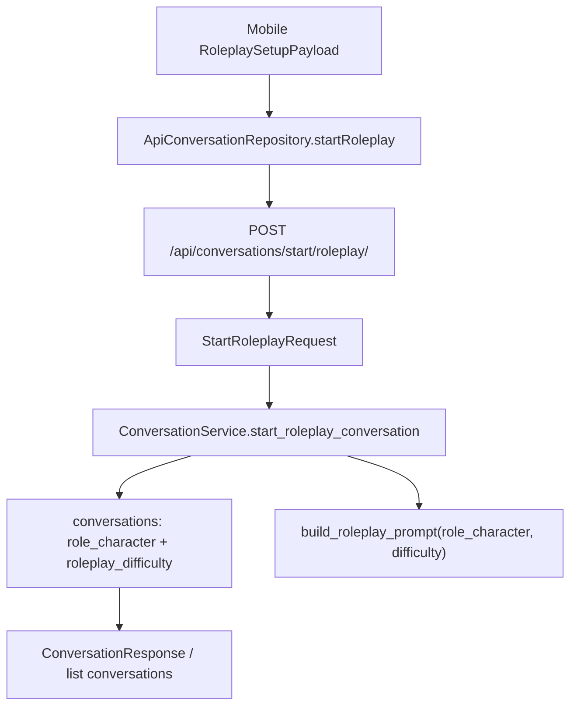

# Roleplay Difficulty Separation - Plan

## Goal Capsule

- **Objective:** Separate roleplay difficulty from `role_character` so role identity, difficulty/style, persistence, and API contracts stop sharing one string.
- **Authority hierarchy:** Preserve existing roleplay start behavior first; maintain backward-compatible API defaults second; improve storage/display clarity third.
- **Execution profile:** Standard backend/mobile contract refactor with a PostgreSQL migration and focused regression coverage.
- **Stop conditions:** Stop if production data shows non-roleplay rows depend on roleplay-specific fields, or if Alembic enum handling differs between local SQLite tests and PostgreSQL.
- **Tail ownership:** Implementation owns code, tests, docs, and migration verification.

---

## Product Contract

### Summary

Roleplay start requests will carry role identity and difficulty as separate concepts.
`role_character` will describe the role or scenario prompt.
`roleplay_difficulty` will store the selected difficulty as a closed enum.
The backend will combine them only when building the system prompt.

### Problem Frame

The current mobile roleplay flow concatenates the preset role and difficulty prompt into `role_character`.
That produced a 101-character string for a normal cafe order and exceeded the backend `conversations.role_character varchar(100)` column.
The deeper issue is semantic overloading: the same field stores display identity, prompt style, and difficulty.

### Requirements

**Roleplay contract**

- R1. Roleplay start accepts `role_character` and optional `roleplay_difficulty`.
- R2. `roleplay_difficulty` is a closed value: `EASY`, `NORMAL`, or `CHALLENGE`.
- R3. Missing `roleplay_difficulty` defaults to `NORMAL` for backward compatibility.

**Persistence and prompt behavior**

- R4. Roleplay conversations persist `role_character` separately from `roleplay_difficulty`.
- R5. Free chat conversations do not need a meaningful `roleplay_difficulty`.
- R6. System prompts combine role identity and difficulty at prompt-build time, not before persistence.
- R7. Conversation titles stay inside the existing title storage limit.

**Mobile behavior**

- R8. Mobile sends preset/custom role text and selected difficulty as separate request fields.
- R9. Mobile response models tolerate `roleplay_difficulty` in roleplay conversation responses and list items.

### Acceptance Examples

- AE1. Given the cafe preset and Normal difficulty, when mobile starts roleplay, then the request contains `role_character: "a friendly cafe barista taking an order"` and `roleplay_difficulty: "NORMAL"`.
- AE2. Given an old client omits `roleplay_difficulty`, when the backend starts roleplay, then the saved conversation uses `NORMAL`.
- AE3. Given a long custom roleplay prompt, when the backend saves the conversation, then no `varchar(100)` truncation error occurs and the title remains at most 200 characters.

### Scope Boundaries

- In scope: backend enum/schema/model/service changes, Alembic migration, mobile request/model changes, and README/DSL contract docs.
- Deferred to Follow-Up Work: split custom roleplay into separate `roleplay_situation` or `learner_role` fields if custom prompts need richer analytics later.
- Out of scope: changing roleplay scenario copy, changing TTS/STT behavior, and redesigning the roleplay setup UI.

---

## Planning Contract

### Key Technical Decisions

- KTD1. **Store difficulty as a nullable roleplay-only enum.** Use a backend `RoleplayDifficulty` enum and a nullable `conversations.roleplay_difficulty` column so free chat rows do not carry fake difficulty state.
- KTD2. **Default missing difficulty to Normal.** `(session-settled: user-approved - chosen over requiring all clients to send the new field: old clients and Swagger tests should keep working.)`
- KTD3. **Keep `role_character` prompt-capable and widen storage.** Increase `role_character` beyond 100 characters, likely to 500, because custom roleplay still uses scenario text and old clients may send combined strings during rollout.
- KTD4. **Truncate generated roleplay titles, not role data.** Keep `title` within `String(200)` by using a helper that shortens `Role: ...` display text without mutating `role_character`.
- KTD5. **Let prompt construction own style wording.** Map `RoleplayDifficulty` to prompt instructions in the backend service and keep mobile as a sender of enum intent, not prompt prose.

### High-Level Technical Design

### Assumptions

- The new enum values should be API-facing uppercase strings to match existing backend enum style.
- Existing roleplay rows without a difficulty can be treated as `NORMAL`.
- No analytics or product UI currently depends on parsing difficulty back out of `role_character`.

### System-Wide Impact

- Database schema changes require an Alembic migration and deployment through the usual migration path before the backend assumes the column exists.
- API contract docs must change in `README.md` and `docs/DSL.md` because `StartRoleplayRequest`, `Conversation`, and `ConversationResponse` gain a new field.
- Mobile and backend can roll out incrementally if the backend accepts missing `roleplay_difficulty`.

---

## Implementation Units

### U1. Add Backend Roleplay Difficulty Contract

- **Goal:** Add the backend enum, request/response fields, and defaulting contract.
- **Requirements:** R1, R2, R3, R9.
- **Dependencies:** None.
- **Files:** `backend/domains/conversation/enums.py`, `backend/domains/conversation/schemas.py`, `backend/tests/domains/voice/test_multimodal_conversation_router.py`.
- **Approach:**
  1. Add `RoleplayDifficulty` with `EASY`, `NORMAL`, and `CHALLENGE`.
  2. Add optional/defaulted `roleplay_difficulty` to `StartRoleplayRequest`.
  3. Add optional `roleplay_difficulty` to `Conversation` and `ConversationResponse`.
  4. Update route tests to assert the new field is accepted and returned.
- **Patterns to follow:** Existing `ConversationType` and `FreeChatConversationDirection` enum patterns in `backend/domains/conversation/enums.py`.
- **Test scenarios:**
  - Posting roleplay JSON with `roleplay_difficulty: "CHALLENGE"` passes validation and forwards the enum to the service.
  - Posting roleplay JSON without `roleplay_difficulty` forwards `NORMAL`.
  - OpenAPI/request body contract includes `roleplay_difficulty`.
- **Verification:** Backend route tests prove the API contract and default behavior.

### U2. Migrate Conversation Persistence

- **Goal:** Persist roleplay difficulty separately and make role storage safe for current custom/preset payloads.
- **Requirements:** R4, R5, R7, AE2, AE3.
- **Dependencies:** U1.
- **Files:** `backend/domains/conversation/models.py`, `backend/alembic/versions/<new_revision>_add_roleplay_difficulty.py`, `backend/tests/domains/conversation/test_conversation_repository.py`.
- **Approach:**
  1. Add `roleplay_difficulty` to `ConversationModel` as nullable enum storage.
  2. Increase `role_character` length from 100 to 500 in the model and migration.
  3. Backfill existing `ROLE_PLAYING` rows to `NORMAL`; leave free chat rows null.
  4. Keep downgrade behavior explicit for enum/drop-column handling.
- **Patterns to follow:** Existing Alembic revisions under `backend/alembic/versions/`, especially enum creation and batch alteration patterns already used for conversation schema changes.
- **Test scenarios:**
  - A roleplay conversation with a role string over 100 characters can be saved.
  - A free chat conversation can be saved with null `roleplay_difficulty`.
  - A roleplay conversation can be saved and read back with `roleplay_difficulty: NORMAL`.
- **Verification:** Repository tests pass on SQLite metadata, and migration applies cleanly against a local database target.

### U3. Update Roleplay Service Prompt and Title Handling

- **Goal:** Combine role and difficulty only inside prompt construction and keep persisted title bounded.
- **Requirements:** R4, R6, R7, AE1, AE2, AE3.
- **Dependencies:** U1, U2.
- **Files:** `backend/domains/conversation/service.py`, `backend/tests/domains/conversation/test_topic_prep_handoff.py`, `backend/tests/domains/conversation/test_conversation_repository.py`.
- **Approach:**
  1. Thread `roleplay_difficulty` through `start_roleplay_conversation`.
  2. Save the raw role text in `role_character` and the enum in `roleplay_difficulty`.
  3. Add a title helper that truncates `Role: {role_character}` to at most 200 characters.
  4. Add a service helper that maps difficulty to style instructions for `build_roleplay_prompt`.
  5. Include difficulty style in both the system prompt and initial greeting prompt where useful.
- **Patterns to follow:** Existing language-context prompt helpers in `ConversationService`.
- **Test scenarios:**
  - Starting roleplay with cafe role and `NORMAL` stores the cafe role without difficulty prose.
  - Starting roleplay without a difficulty uses `NORMAL`.
  - Prompt generation for `EASY`, `NORMAL`, and `CHALLENGE` includes distinct style guidance.
  - Very long role text produces a title no longer than 200 characters.
- **Verification:** Conversation service tests prove persistence, title, and prompt behavior without calling external LLM providers.

### U4. Update Mobile Roleplay Request and Models

- **Goal:** Stop composing difficulty prose into `roleCharacter` on mobile and send difficulty as an enum field.
- **Requirements:** R8, R9, AE1.
- **Dependencies:** U1.
- **Files:** `mobile/lib/features/roleplay_setup/domain/roleplay_setup_payload.dart`, `mobile/lib/features/roleplay_setup/domain/roleplay_difficulty.dart`, `mobile/lib/features/conversation/domain/conversation_repository.dart`, `mobile/lib/features/conversation/data/api_conversation_repository.dart`, `mobile/lib/features/conversation/domain/conversation_models.dart`, `mobile/test/features/roleplay_setup/domain/roleplay_setup_payload_test.dart`, `mobile/test/features/conversation/data/api_conversation_repository_test.dart`, `mobile/test/features/conversation/domain/conversation_models_test.dart`, `mobile/test/features/conversation/application/start_conversation_controller_test.dart`.
- **Approach:**
  1. Add API value mapping on `RoleplayDifficulty`.
  2. Change `RoleplaySetupPayload.roleCharacter` to return only the situation prompt base.
  3. Add a payload property for API difficulty value.
  4. Thread difficulty through `StartConversationController` and `ConversationRepository.startRoleplay`.
  5. Include `roleplay_difficulty` in the JSON body sent to `conversations/start/roleplay/`.
  6. Parse optional `roleplay_difficulty` from conversation responses and summaries if exposed.
- **Patterns to follow:** Existing mobile enum `.value` patterns in `ConversationType` and repository request body tests.
- **Test scenarios:**
  - Preset roleplay payload returns the preset role only and a separate `NORMAL` difficulty value.
  - API repository sends `role_character` and `roleplay_difficulty` as separate JSON fields.
  - Conversation response parsing succeeds when `roleplay_difficulty` is present.
  - Conversation response parsing still succeeds when `roleplay_difficulty` is absent.
- **Verification:** Focused Flutter unit tests prove request serialization and response parsing.

### U5. Update External Contract Documentation

- **Goal:** Keep documented API surfaces aligned with the backend and mobile contract.
- **Requirements:** R1, R2, R3, R8, R9.
- **Dependencies:** U1, U4.
- **Files:** `README.md`, `docs/DSL.md`, `.agent/architecture.md`.
- **Approach:**
  1. Update the roleplay start request examples with `roleplay_difficulty`.
  2. Replace the DSL note that says `role_character` combines preset/custom situation and difficulty.
  3. Add response/list field descriptions where the contract exposes difficulty.
  4. Note that difficulty is a roleplay-only concept and defaults to `NORMAL`.
- **Patterns to follow:** Existing Conversation API sections in `README.md` and `docs/DSL.md`.
- **Test scenarios:** Test expectation: none -- documentation-only unit.
- **Verification:** Documentation matches generated schema and mobile request body tests.

---

## Verification Contract

| Gate | Scope | Done Signal |
|---|---|---|
| Backend conversation tests | U1, U2, U3 | `uv run pytest tests/domains/conversation tests/domains/voice/test_multimodal_conversation_router.py` passes from `backend/`. |
| Migration smoke | U2 | Alembic upgrade applies on a local database and creates `roleplay_difficulty` plus widened `role_character`. |
| Mobile roleplay tests | U4 | `flutter test test/features/roleplay_setup test/features/conversation` passes from `mobile/`. |
| Static checks | All units | `flutter analyze --no-pub` and Python tests show no new warnings or failures. |
| Contract review | U5 | `README.md`, `docs/DSL.md`, backend schemas, and mobile request serialization describe the same fields. |

---

## Definition of Done

- Roleplay can start with the reported cafe Normal scenario without DB truncation.
- Backend stores role identity and difficulty in separate fields.
- Mobile sends difficulty as an enum value rather than prompt prose inside `role_character`.
- Existing clients that omit `roleplay_difficulty` still start roleplay with `NORMAL`.
- Long custom roleplay text does not break persistence, and generated titles stay within the title column limit.
- Tests cover API defaulting, persistence, prompt construction, mobile serialization, and response parsing.
- Documentation is synchronized across README, DSL, and architecture notes.
- No abandoned transitional debug code or one-off test scaffolding remains in the diff.
