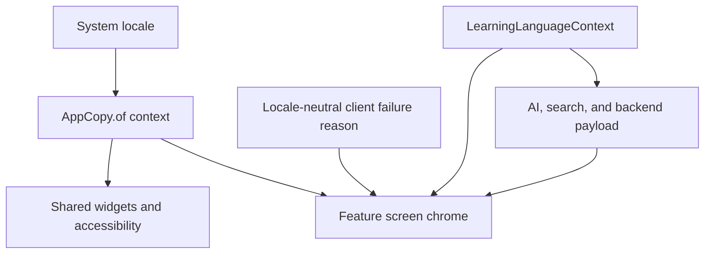

# System Locale UI Copy - Plan

## Goal Capsule

- **Objective:** Curitalk의 사용자 인터페이스가 기기 시스템 언어에 따라 한국어 또는 영어로 일관되게 표시되게 한다.
- **Means:** 가벼운 공통 `AppCopy` 계층을 도입하고, 공유 chrome부터 화면별 문구와 오류 상태를 순서대로 이전한다.
- **Authority:** 이 계획은 Flutter 모바일 앱의 UI 문구와 클라이언트 표시 오류만 다룬다. 백엔드 계약, 새 사용자 설정, 추가 지원 언어는 포함하지 않는다.
- **Stop conditions:** 앱 chrome, 접근성 라벨, 표시용 오류가 `en`/`ko` system locale과 일치하고 학습 콘텐츠가 기존 언어 계약을 유지하면 완료한다.

---

## Product Contract

### Summary

시스템 locale은 Curitalk의 화면 chrome을 결정해야 한다. 현재 온보딩과 로그인만 이 기준을 따르고, 로그인 이후 화면과 재사용 위젯에는 영어 문구가 흩어져 있다.

이 작업은 공통 locale resolver와 copy API를 먼저 만들고, 모든 정적 UI chrome·접근성 라벨·클라이언트 오류를 그 API로 이전한다. 검색 입력으로 쓰이는 예시 주제는 UI chrome이 아니라 학습 문맥 콘텐츠로 다룬다. 학습 대상 언어와 피드백 언어는 계속 `LearningLanguageContext`가 결정한다.

### Problem Frame

한국어 시스템 언어 사용자는 로그인 뒤에도 영어 내비게이션, 입력 안내, 오류, 음성 상태를 보게 된다. 반대로 학습 언어 설정과 시스템 표시 언어의 책임이 분리되지 않아, UI를 번역할 때 AI 피드백이나 역할극 의미까지 바뀔 위험이 있다.

### Requirements

- R1. 앱 chrome은 `ko` system locale에서 한국어를, `en`과 그 밖의 locale에서 영어를 표시해야 한다.
- R2. locale 판별은 한 공통 API가 소유해야 하며, 화면이나 위젯이 개별 fallback 규칙을 중복하면 안 된다.
- R3. 하단 내비게이션, 공통 상태 화면, 페이지 표시, 입력·음성 control, 버튼 tooltip, semantic label은 system locale을 따라야 한다.
- R4. Home, 시작 sheet, Account, History, Topic Input, Topic Prep, Conversation, Roleplay, Splash, Onboarding, Login의 정적 UI 문구는 system locale을 따라야 한다.
- R5. `LearningLanguageContext`는 학습 대상 언어, 피드백 언어, 역할극 학습 의미를 계속 소유해야 한다. 시스템 locale 변경은 저장된 언어쌍이나 기존 conversation snapshot을 바꾸면 안 된다.
- R6. 사용자 메시지, AI 응답, 문법 피드백 payload, 검색 출처, Topic Prep의 서버 `retry_guidance`, 예시 주제, 방향과 질문은 원문 그대로 표시해야 한다.
- R7. 클라이언트가 사용자에게 보여주는 전송·녹음·재생·문법 polling 실패는 presentation에서 locale-neutral reason을 system-locale 문구로 변환해야 한다.
- R8. 현재 backend audio 오류에는 표시용 reason code가 없으므로, 모든 assistant `audio_error`는 원문 메시지 대신 locale별 일반 audio-unavailable 안내로 표시해야 한다. 응답 텍스트와 완료된 conversation turn은 성공 상태로 유지한다.
- R9. 기존 또는 레거시 `zh` 학습 프로필은 계속 동작해야 한다. 이 경우 app chrome은 영어 fallback을 사용하고 학습 콘텐츠 규칙은 유지한다.
- R10. 한국어와 영어 system locale의 공통 UI 및 대표 사용자 흐름을 자동 테스트로 고정하고, 모바일 문서에 두 언어 책임의 경계를 기록해야 한다.
- R11. feedback, validation, recovery copy는 학습자를 평가하거나 탓하지 않고, 재시도 가능한 서비스 상태와 학습자 입력을 구분하는 낮은 압박의 문구여야 한다.
- R12. Topic Input의 예시 검색어는 system locale이 아니라 사용자의 native language를 따라야 하며, 선택 시 해당 언어의 query가 그대로 검색 요청에 사용되어야 한다.

### Key Flows

- F1. 한국어 chrome과 한국어 학습 대상
  - **Trigger:** system locale이 `ko`이고 사용자의 target language가 English 또는 Korean이다.
  - **Outcome:** 내비게이션, 로딩, 오류, tooltip, semantic label은 한국어로 보인다. target/feedback language가 필요한 학습 콘텐츠는 기존 언어쌍 계약을 따른다.
  - **Covers:** R1, R3, R5, R7

- F2. 영어 fallback과 레거시 학습 프로필
  - **Trigger:** system locale이 `en`도 `ko`도 아니고, 프로필에 `zh`가 포함될 수 있다.
  - **Outcome:** app chrome은 영어로 보인다. Chinese를 포함한 기존 learning context와 backend payload는 변경하지 않는다.
  - **Covers:** R1, R5, R9

- F3. Topic Prep recovery
  - **Trigger:** Topic Prep 결과가 low-quality이거나 준비 요청이 실패한다.
  - **Outcome:** section label과 action chrome은 system locale을 따른다. 서버 retry guidance와 example topic은 그대로 보이며, 서버 guidance가 없을 때의 학습 안내는 feedback language 기준을 유지한다.
  - **Covers:** R4, R5, R6

- F4. Conversation failure recovery
  - **Trigger:** 텍스트·음성 turn 전송, 녹음, audio 재생, grammar polling이 실패한다.
  - **Outcome:** 실패 상태와 재시도 control은 system locale 문구로 표시되고, 재시도할 draft text 또는 audio payload는 보존된다.
  - **Covers:** R3, R7, R8

### Acceptance Examples

- AE1. 한국어 시스템 언어의 Home에서 `Home`, `Chat`, `History`, `Profile` 대신 한국어 하단 내비게이션과 한국어 시작 sheet를 본다. `en -> ko` 언어쌍은 그대로 유지한다.
  - **Covers:** R1, R3, R5

- AE2. 한국어 시스템 언어의 Conversation에서 microphone 권한 거부와 empty recording이 한국어 안내로 보인다. 사용자가 다시 시도하면 기존 녹음·전송 동작은 변하지 않는다.
  - **Covers:** R3, R7

- AE3. 영어 system locale과 `en -> ko` 언어쌍에서 Topic Prep의 chrome은 영어이고, 첫 답변 입력 안내는 Korean target language를 정확히 가리킨다. 서버 summary와 질문은 번역되지 않는다.
  - **Covers:** R4, R5, R6

- AE4. 한국어 system locale과 `ko -> en` 언어쌍에서 역할극 화면의 화면 제목·난이도·검증 오류는 한국어지만 preset scenario와 `roleCharacter` 선택 규칙은 English target language 기준을 유지한다.
  - **Covers:** R4, R5

- AE5. 지원하지 않는 system locale과 `zh` learning context에서 app chrome은 영어로 fallback되고, Chinese feedback fallback과 원격 retry guidance는 기존 동작을 유지한다.
  - **Covers:** R1, R5, R9

- AE6. assistant 응답과 함께 `audio_error`가 오면, 완료된 응답은 대화에 남고 영어 또는 한국어의 비차단 audio 안내만 보인다. 해당 turn을 다시 보내는 control은 나타나지 않는다.
  - **Covers:** R7, R8, R11

- AE7. 영어 system locale의 `ko -> en` 학습 문맥에서도 Topic Input의 예시 검색어는 한국어로 보이고, 선택한 한국어 query가 Topic Prep 요청으로 전달된다.
  - **Covers:** R5, R12

### Scope Boundaries

- **In scope:** Flutter app의 `en`/`ko` chrome copy, 접근성 label, 공통·화면별 오류 표시, 기존 onboarding/login copy 통합, 테스트와 모바일 문서.
- **Out of scope:** Flutter `gen_l10n` 또는 ARB migration, UI language 선택 설정 저장, Chinese app chrome, 백엔드 응답 스키마 변경, AI·사용자 원문 번역, 신규 roleplay scenario 작성.
- **Deferred to Follow-Up Work:** 추가 UI 언어 지원, 서버가 구조화된 TTS 오류 reason을 내려주는 API 계약, 날짜·상대 시간·숫자의 locale-aware formatting 확장.

---

## Planning Contract

### Key Technical Decisions

- KTD1. **공통 `AppCopy` 계층을 사용한다.** `AppCopy.of(context)`가 language code를 `ko` 또는 `en`으로 정규화하고, 모든 static chrome을 제공한다. 화면별 private copy helper와 분산 fallback을 대체한다. (session-settled: user-approved — common copy layer first; chosen over per-screen isolated branches: locale logic and validation must not be duplicated.) Governs R1, R2, R3, R4, R10.

- KTD2. **text ownership을 system chrome과 learning content로 분리한다.** `AppCopy`는 `en`, `ko`, `zh`의 검증된 language code 문자열을 받아 system-locale language name, language-pair description, first-answer UI framing, scenario difficulty 설명을 만든다. 예상하지 못한 code는 원문 code를 그대로 표시하는 결정적 방어 fallback을 사용하며, 학습 언어를 추정하거나 변경하지 않는다. `AppCopy`는 `LearningLanguageContext` 또는 `LearningLanguageCode`를 import하지 않는다. `LearningLanguageContext`는 native/target/feedback code와 conversation snapshot 의미를 보존한다. Governs R4, R5, R6, R9.

- KTD3. **presentation 밖에는 표시 문구가 아니라 failure reason을 남긴다.** conversation send/start, grammar polling, recording, playback, local validation은 closed typed reason 또는 상태값을 전달하고 screen/widget의 local state, snackbar, semantic status가 `AppCopy`로 표시 문구를 고른다. application catch boundary는 `ApiException`과 recorder/player diagnostics를 reason으로 분류한다. 현재 backend schema에는 audio error code가 없으므로 모든 response의 `audio_error`는 decode/application boundary에서 `assistantAudioUnavailable`로 정규화하고 raw `message`와 `provider`를 UI model/state에 전달하지 않는다. `ApiException`의 원인 정보와 remote detail은 debug/cause 용도로만 보존한다. Governs R7, R8, R11.

- KTD4. **Topic Prep의 UI chrome, 검색 입력, 원격 콘텐츠를 분리한다.** `TopicInputScreen`의 heading, section label, validation, CTA는 system-locale `AppCopy` content다. 반면 정적 starter example은 `TopicStarterExamples`가 `LearningLanguageContext.nativeLanguage`로 고르는 검색 입력 콘텐츠이며, 선택한 value가 그대로 Topic Prep 요청으로 전달된다. (session-settled: user-approved — native-language example queries; chosen over system-locale queries because query language can change search results.) backend `TopicPrepResult.exampleTopics`, retry guidance, summary, direction, question, source는 원문 데이터다. card title, section label, retry action은 system chrome이며, backend guidance가 없을 때의 학습 안내만 feedback language를 따른다. Governs R5, R6, R12.

- KTD5. **명시 locale을 주는 위젯 테스트를 표준으로 삼는다.** 기존 영문 테스트 helper는 `Locale('en')`을 명시하고, 한국어 테스트는 같은 interaction을 `Locale('ko')`로 검증한다. 가능한 곳에서는 문구 finder만이 아니라 key, callback, semantic action으로 동작을 검증한다. Governs R10.

### Failure-Reason Matrix

| Operation owner | State value exposed to presentation | Classification rule | Rendering boundary |
|---|---|---|---|
| Login | `LoginFailureReason.identity`, `.request`, `.unknown` | `GoogleIdentityException` maps to `identity`; every `ApiException` maps to `request`; other exceptions map to `unknown` | `LoginScreen` uses `AppCopy`; provider/API messages remain diagnostics only |
| Conversation send | `ConversationSendFailureReason.textRequestFailed` or `.audioRequestFailed` | any `ApiException` and unknown request exception fold into the matching input-mode reason | `ConversationScreen` retry card uses `AppCopy`; draft text/audio file is retained |
| Conversation start | `StartConversationFailureReason.freeChatRequestFailed` or `.roleplayRequestFailed` | any `ApiException` and unknown request exception fold into the matching start-mode reason | Topic Prep and Roleplay start consumers use `AppCopy` |
| Grammar polling | existing `pending`, `timeout`, `error` status with `GrammarFeedbackFailureReason.requestFailed` for `error` | `ApiException` and unknown polling exception map to `requestFailed` | message tile uses `AppCopy` |
| Recorder/player | existing `ConversationAudioExceptionReason`, including `.unknown` | service wraps backend cause with a closed reason; UI never reads its message | Conversation and Topic Prep local state retain the reason only |
| Roleplay validation | `RoleplaySetupValidationReason.customInputTooShort` | controller derives it from input length; no exception mapping | Roleplay input decoration uses `AppCopy` |
| Assistant audio enrichment | `AssistantAudioStatus.unavailable` | every decoded backend `audio_error` maps to `unavailable` | message tile shows a non-blocking `AppCopy` notice; completed turn is never retryable |

`AppCopy` accepts primitive reason values or stable string keys at its public rendering boundary; it does not import feature-owned enum types. Feature types remain owned by their application/domain package.

### High-Level Technical Design

The presentation layer combines system-locale chrome from `AppCopy`, target/feedback-language labels from `LearningLanguageContext`, and unmodified remote content. Controllers and services never receive `BuildContext`.

### Text Ownership

| Text category | Owner | Locale rule | Examples |
|---|---|---|---|
| App chrome | `AppCopy` | system locale | navigation, CTA, section label, tooltip, semantic label |
| Learning-language UI framing | `AppCopy` with language code | system locale sentence, target/feedback language interpolation | first answer hint, pair description, difficulty description |
| Learning semantics | `LearningLanguageContext` and roleplay domain | selected language context | target language, feedback language, preset selection, role character |
| Starter search queries | `TopicStarterExamples` | native language | Topic Input example-chip values sent to Topic Prep |
| Remote content | backend payload | preserve source text | assistant response, grammar payload, summary, source, retry guidance |
| Client failures | typed reason plus `AppCopy` | system locale | permission denied, send failed, playback unavailable |

---

## Implementation Units

### U1. Establish shared copy ownership and migrate entry screens

- **Goal:** Add a single `en`/`ko` system-locale resolver and make all copy consumers use it.
- **Requirements:** R1, R2, R4, R5, R7, R9, R10, R11; KTD1, KTD2, KTD3.
- **Dependencies:** None.
- **Files:**
  - `mobile/lib/core/copy/app_copy.dart`
  - `mobile/lib/core/copy/copy.dart`
  - `mobile/lib/app/app.dart`
  - `mobile/lib/features/language/domain/learning_language.dart`
  - `mobile/lib/features/onboarding/presentation/onboarding_screen.dart`
  - `mobile/lib/features/auth/presentation/login_screen.dart`
  - `mobile/test/core/copy/app_copy_test.dart`
  - `mobile/test/app/app_test.dart`
  - `mobile/test/features/auth/presentation/login_screen_test.dart`
- **Approach:** Define `AppCopy.of(context)` and an explicit code-level resolver that maps only Korean to `ko` and every other locale to `en`. Keep `core` independent from language feature types by passing validated `en`/`ko`/`zh` code strings into copy interpolation methods, with the specified raw-code fallback for an invalid defensive input. Move display-name and language-pair UI composition out of `LearningLanguageContext` where system-language phrasing is required. Replace the private onboarding and login copy records with the common API without changing their approved wording or the onboarding-only default language-pair selection behavior. Map Google/API login failures to `LoginFailureReason` and render only `AppCopy` recovery copy.
- **Patterns to follow:** `CuritalkApp.supportedLocales`, existing onboarding/login locale tests, and `LearningLanguageContext.defaultLanguageContextForLocale` for the separate first-run language-pair policy.
- **Test scenarios:**
  - `AppCopy` returns Korean for `ko` and `ko-KR`, English for `en`, `en-US`, and an unsupported locale.
  - Interpolated `en`, `ko`, and legacy `zh` language names and pair descriptions use the system UI language without changing the underlying learning codes; invalid defensive input follows the raw-code fallback.
  - Existing English onboarding/login copy remains visible for English locale.
  - Korean onboarding/login copy remains visible for Korean locale and sign-in behavior remains unchanged.
  - Google/provider and API failure messages never render verbatim; English and Korean sign-in failure tests assert their matching `AppCopy` recovery copy instead.
  - A runtime `en` to `ko` locale change updates chrome only while the same profile native/target/feedback codes and an existing conversation snapshot remain unchanged.
- **Verification:** The application has one system-locale fallback rule, and entry-screen tests prove both supported UI languages and login failure ownership.

### U2. Localize shared widgets and interaction semantics

- **Goal:** Make reusable UI chrome safe for every feature screen before migrating individual screens.
- **Requirements:** R1, R2, R3, R10; KTD1, KTD5.
- **Dependencies:** U1.
- **Files:**
  - `mobile/lib/core/widgets/app_async_state_view.dart`
  - `mobile/lib/core/widgets/app_page_indicator.dart`
  - `mobile/lib/core/widgets/main_navigation_bar.dart`
  - `mobile/lib/features/language/presentation/language_pair_selector.dart`
  - `mobile/lib/features/conversation/presentation/widgets/chat_composer.dart`
  - `mobile/lib/features/conversation/presentation/widgets/typing_indicator.dart`
  - `mobile/lib/features/conversation/presentation/widgets/grammar_feedback_card.dart`
  - `mobile/lib/features/conversation/presentation/widgets/natural_feedback_badge.dart`
  - `mobile/lib/features/topic_prep/presentation/widgets/source_link_tile.dart`
  - `mobile/lib/features/roleplay_setup/presentation/widgets/roleplay_scenario_card.dart`
  - `mobile/test/core/widgets/state_and_navigation_test.dart`
  - `mobile/test/features/language/presentation/language_pair_selector_test.dart`
  - `mobile/test/features/conversation/presentation/widgets/conversation_widgets_test.dart`
- **Approach:** Replace default loading/error/empty/retry labels and all shared tooltip or semantic strings with `AppCopy`. Remove caller-passed raw system locale values from the language-pair selector so it reads the shared resolver through `BuildContext`. Keep public widget overrides for caller-supplied domain content, but ensure fallback labels no longer lock a screen to English.
- **Patterns to follow:** Existing typed navigation destination callback, `Semantics` usage, and the design-system widget exports.
- **Test scenarios:**
  - The navigation bar, async retry button, and page indicator render English and Korean labels under explicit locales.
  - Composer voice, stop, cancel, and send tooltip/semantic states use the active system locale without changing enabled/disabled behavior.
  - Grammar, typing, source, and roleplay semantic labels translate while their supplied content remains unchanged.
  - Language-pair availability labels and semantic descriptions use the shared resolver instead of a feature-local locale branch.
  - A legacy `zh` context remains visible but unavailable where its current product rule requires that state, with English and Korean chrome supplied by `AppCopy`.
- **Verification:** Shared widgets have no user-visible default English chrome outside `AppCopy`.

### U3. Replace presentation-bound error strings with typed reasons

- **Goal:** Ensure conversation, audio, grammar, start, and local validation states can be rendered in the active system language.
- **Requirements:** R3, R4, R7, R8, R10; KTD3, KTD5.
- **Dependencies:** U1.
- **Files:**
  - `mobile/lib/features/conversation/application/conversation_audio_services.dart`
  - `mobile/lib/features/conversation/application/conversation_controller.dart`
  - `mobile/lib/features/conversation/application/grammar_feedback_polling_controller.dart`
  - `mobile/lib/features/conversation/application/start_conversation_controller.dart`
  - `mobile/lib/features/conversation/domain/conversation_models.dart`
  - `mobile/lib/features/topic_prep/presentation/topic_prep_screen.dart`
  - `mobile/lib/features/roleplay_setup/application/roleplay_setup_controller.dart`
  - `mobile/test/features/conversation/application/conversation_audio_services_test.dart`
  - `mobile/test/features/conversation/application/conversation_controller_test.dart`
  - `mobile/test/features/conversation/application/grammar_feedback_polling_controller_test.dart`
  - `mobile/test/features/conversation/application/start_conversation_controller_test.dart`
  - `mobile/test/features/roleplay_setup/application/roleplay_setup_controller_test.dart`
  - `mobile/test/features/topic_prep/presentation/topic_prep_screen_test.dart`
  - `mobile/test/features/conversation/domain/conversation_models_test.dart`
- **Approach:** Implement the Failure-Reason Matrix before presentation migration. Preserve operation and retry state but replace display-string fields with feature-owned failure reasons. Extend the existing audio exception reason pattern for local recorder and player failures. Convert Topic Prep voice local state to retain recording phase and reason rather than an error message. Keep `ApiException` diagnostics available to application code, but do not expose remote messages through UI state. Normalize every backend `audio_error` to `AssistantAudioStatus.unavailable` without changing the backend schema; remove raw `message` and `provider` from the UI model/state path.
- **Execution note:** Add or update reason-level application tests before changing the presentation consumers, so retry behavior and failure classification remain observable without locale fixtures.
- **Patterns to follow:** `ConversationAudioExceptionReason`, Riverpod immutable state copies, and existing fake repository failure tests.
- **Test scenarios:**
  - Text and audio turn failures preserve the retry payload while exposing the correct send-failure reason.
  - Permission denied, empty recording, recorder start/stop, and playback failures expose distinct reasons.
  - Grammar polling timeout and repository failure expose stable non-display state.
  - Roleplay custom input shorter than two characters exposes validation state instead of English text.
  - Every backend assistant audio error becomes `AssistantAudioStatus.unavailable`, never raw user-visible text, and preserves the completed assistant response.
  - Topic Prep recorder states expose the same reason set as Conversation without replacing its selected question, input, or retry payload.
- **Verification:** No controller or Topic Prep voice state consumed by these screens requires an English string to describe a local failure.

### U4. Migrate Home, account, history, start, and splash chrome

- **Goal:** Localize the primary post-login navigation and account experience.
- **Requirements:** R1, R3, R4, R5, R7, R10; KTD1, KTD2, KTD5.
- **Dependencies:** U1, U2, U3.
- **Files:**
  - `mobile/lib/features/auth/presentation/splash_screen.dart`
  - `mobile/lib/features/home/domain/conversation_summary.dart`
  - `mobile/lib/features/home/presentation/home_screen.dart`
  - `mobile/lib/features/home/presentation/account_sheet.dart`
  - `mobile/lib/features/home/presentation/conversation_start_sheet.dart`
  - `mobile/lib/features/home/presentation/widgets/recent_conversation_card.dart`
  - `mobile/lib/features/history/presentation/history_screen.dart`
  - `mobile/test/features/home/domain/conversation_summary_test.dart`
  - `mobile/test/features/home/presentation/home_screen_test.dart`
  - `mobile/test/features/home/presentation/widgets/recent_conversation_card_test.dart`
  - `mobile/test/features/history/presentation/history_screen_test.dart`
- **Approach:** Move all Home, start-sheet, account, history, and splash chrome into `AppCopy`. Replace `ConversationSummary` presentation getters with locale-aware formatting at the presentation boundary so category, status, message count, and untitled fallback do not bake English into domain data. Preserve conversation title and preview content returned by the backend.
- **Patterns to follow:** Existing Home/History callback injection, account language-pair selector, and `RecentConversationCard` composition.
- **Test scenarios:**
  - Korean locale renders Home greeting fallback, recent/empty/loading/error states, start sheet, account actions, and History states in Korean.
  - English locale preserves the existing Home and History behavior.
  - Conversation cards preserve backend title and preview text while category and count/status chrome changes with the system locale.
  - Language-pair save failure and splash retry use locale-specific copy without changing their action callbacks.
- **Verification:** A user can traverse Home, Chat start sheet, History, and Account entirely in the system UI language.

### U5. Migrate topic input and Topic Prep while preserving remote content

- **Goal:** Localize Free Chat and Topic Prep UI without translating search or learning payloads.
- **Requirements:** R1, R4, R5, R6, R7, R9, R10, R11, R12; KTD1, KTD2, KTD4, KTD5.
- **Dependencies:** U1, U2, U3.
- **Files:**
  - `mobile/lib/features/topic_prep/presentation/topic_input_screen.dart`
  - `mobile/lib/features/topic_prep/domain/topic_starter_examples.dart`
  - `mobile/lib/features/topic_prep/presentation/topic_prep_screen.dart`
  - `mobile/lib/features/topic_prep/presentation/widgets/topic_retry_card.dart`
  - `mobile/test/features/topic_prep/presentation/topic_input_screen_test.dart`
  - `mobile/test/features/topic_prep/presentation/topic_prep_screen_test.dart`
  - `mobile/test/features/topic_prep/presentation/widgets/topic_prep_widgets_test.dart`
- **Approach:** Move `TopicInputScreen` validation, headings, loading/error states, selection labels, voice lifecycle chrome, and retry actions to `AppCopy`; the examples section label is chrome as well. Add a feature-owned `TopicStarterExamples` source that selects example query values from `LearningLanguageContext.nativeLanguage`, independently of the system locale and target language. Selecting a chip must put that exact value in the input and send it unchanged to Topic Prep. Replace the screen's direct system-locale lookup with the shared resolver. Keep `TopicPrepResult` summary, sources, directions, questions, server retry guidance, and `exampleTopics` byte-for-byte as source text. Retain feedback-language fallback guidance only when the backend has no retry guidance, while moving its card shell and actions to system-locale copy. Consume the typed voice and start reasons from U3 only at the presentation boundary.
- **Patterns to follow:** Existing `TopicPrepResult.language`, `TopicRetryCard` injection points, and Topic Prep repository fixtures.
- **Test scenarios:**
  - Korean and English locales render topic-input validation, examples section chrome, and prepare CTA in the correct UI language.
  - Example query values follow native language, not system locale: an English UI with a Korean native language shows Korean queries, and a Korean UI with an English native language shows English queries.
  - Selecting an example preserves its exact native-language query in the input and in the request passed to Topic Prep.
  - English chrome with Korean target language names the Korean first-answer target correctly.
  - Backend retry guidance and example topics remain byte-for-byte unchanged in both locales.
  - Missing backend guidance uses feedback-language fallback guidance, while retry actions use system-locale copy.
  - Topic Prep voice and start failures map typed reasons to the active system locale.
  - Under an unsupported system locale and legacy `zh -> ko` context with no backend guidance, Chinese fallback guidance, English retry chrome, and unchanged target-language directions appear together.
  - English chrome with Korean target language and Korean chrome with English target language each distinguish local starter examples from immutable backend `exampleTopics`.
- **Verification:** Topic Prep preserves backend content while every local control and recovery state follows the system locale.

### U6. Migrate conversation and roleplay chrome, then document and prove cross-language flows

- **Goal:** Complete the high-frequency conversation and roleplay surfaces and lock the language boundary with tests and documentation.
- **Requirements:** R1, R3, R4, R5, R6, R7, R8, R9, R10, R11; KTD1, KTD2, KTD3, KTD5.
- **Dependencies:** U1, U2, U3.
- **Files:**
  - `mobile/lib/features/conversation/presentation/conversation_screen.dart`
  - `mobile/lib/features/conversation/presentation/widgets/conversation_message_tile.dart`
  - `mobile/lib/features/roleplay_setup/domain/roleplay_difficulty.dart`
  - `mobile/lib/features/roleplay_setup/presentation/roleplay_setup_screen.dart`
  - `mobile/lib/features/roleplay_setup/presentation/widgets/roleplay_difficulty_chip.dart`
  - `mobile/lib/features/roleplay_setup/domain/roleplay_scenario.dart`
  - `mobile/test/features/conversation/presentation/conversation_screen_test.dart`
  - `mobile/test/features/conversation/presentation/conversation_message_tile_test.dart`
  - `mobile/test/features/roleplay_setup/presentation/roleplay_setup_screen_test.dart`
  - `mobile/test/features/roleplay_setup/presentation/widgets/roleplay_difficulty_chip_test.dart`
  - `mobile/test/app/app_test.dart`
  - `mobile/README.md`
- **Approach:** Render Conversation headers, empty/load/error states, retry, voice lifecycle, grammar polling labels, audio controls, and assistant-audio fallback through `AppCopy`. Convert playback local state from raw exception text to its typed audio reason before rendering snackbar or semantic status. An assistant audio-unavailable notice is non-blocking: it must retain the successful assistant message and expose no send retry for the completed turn. Render Roleplay heading, CTA, difficulty label/description, custom-mode labels, validation, and semantic labels through `AppCopy`; leave the difficulty enum with its stable API value and move display labels to `AppCopy`. Keep target-language scenario selection, scenario text, role character, and custom situation hint unchanged. Document the system-chrome versus learning-content boundary and make integration fixtures accept an explicit locale with the app's supported locale delegates.
- **Patterns to follow:** Conversation retry state machine, roleplay target-language provider, app-level onboarding/login locale fixture, and current mobile README flow sections.
- **Test scenarios:**
  - Korean system locale plus English target language shows Korean Conversation errors and chrome while AI response, grammar explanation, and retry payload are unchanged.
  - English system locale plus Korean target language shows English Roleplay chrome while Korean-target scenario selection remains unchanged.
  - Each recorder/player reason and grammar polling pending/timeout/error has the expected locale-specific display text.
  - Every backend audio error renders localized generic fallback rather than backend `message` or `provider`, while the completed assistant message remains and no send retry is offered.
  - Unsupported system locale uses English chrome while a legacy Chinese learning context remains valid.
  - README describes that system locale controls chrome and `LearningLanguageContext` controls learning behavior.
- **Verification:** Conversation and Roleplay work for the representative cross-language combinations without leaking static English or translating remote learning content.

---

## Verification Contract

| Gate | Applies to | Done signal |
|---|---|---|
| Copy unit coverage | U1 | `AppCopy` has Korean, English, interpolation, and unsupported-locale fallback coverage. |
| Shared widget coverage | U2 | Navigation, async states, page indicator, composer, and semantic labels pass under explicit `en` and `ko` locales. |
| Reason-state coverage | U3 | Application tests assert typed reasons and retry payload preservation without asserting display strings. |
| Screen behavior coverage | U4-U6 | Focused widget tests cover Korean and English UI chrome, preserved remote content, and roleplay/Topic Prep language boundaries. |
| App-flow regression | U1, U6 | Existing onboarding/login locale flow and representative post-login cross-language flow pass. |
| Runtime locale transition | U1, U6 | Switching `en` to `ko` updates chrome only; persisted learning codes and an existing conversation snapshot remain unchanged. |
| Locale fixture contract | U2-U6 | Shared test helpers provide locale, `en`/`ko` supported locales, and Material/Cupertino/Widgets delegates; representative flows run with `en`, `ko`, and unsupported-locale fallback. |
| Resolver ownership sweep | All units | No system-locale branch remains outside `AppCopy` except first-run language-pair default selection in onboarding. |
| Static copy sweep | All units | All user-visible static English and Korean chrome literals reside in `AppCopy`; exceptions are immutable remote payloads, target-language scenarios, test fixtures, and non-UI diagnostics. |
| Copy quality review | U1, U3, U5, U6 | Feedback, validation, and recovery fixtures in both locales preserve user agency, avoid blame or grading, and distinguish learner input from recoverable service conditions. |
| Mobile quality gates | All units | `dart format lib test`, `flutter test`, and `flutter analyze --no-pub` pass. |

---

## Definition of Done

- D1. `AppCopy` is the sole system-locale resolver for app chrome and falls back to English outside Korean.
- D2. Onboarding and Login use the shared copy layer without changing their approved content or onboarding language-pair default behavior.
- D3. Shared widgets and every listed user-facing screen render static UI, accessibility labels, and local failure states in Korean or English according to system locale.
- D4. System locale changes do not mutate stored learning language context or conversation snapshots.
- D5. Remote and learning content stays unmodified, including backend retry guidance and target-language roleplay semantics.
- D6. Conversation, audio, grammar polling, and roleplay validation display typed local failures through `AppCopy` rather than embedded English strings.
- D7. Assistant `audio_error` never exposes a backend message/provider, never fails an already completed turn, and only shows a non-blocking localized notice.
- D8. Korean, English, unsupported-locale fallback, runtime locale transition, and cross-language learning-context tests pass with the established Flutter checks.
- D9. `mobile/README.md` documents the ownership boundary between system UI language and learning language context.
- D10. Topic Input example-query values follow native language and are never translated or selected from system locale.

---

## Sources and Research

- `mobile/lib/app/app.dart` — existing `en`/`ko` Material localization registration.
- `mobile/lib/features/onboarding/presentation/onboarding_screen.dart` and `mobile/lib/features/auth/presentation/login_screen.dart` — current duplicated system-locale copy pattern and recent Korean copy baseline.
- `mobile/lib/features/language/domain/learning_language.dart` — current mixed UI and learning-language responsibilities.
- `mobile/lib/features/conversation/application/conversation_audio_services.dart` — existing audio failure reason enum.
- `mobile/lib/features/topic_prep/presentation/topic_prep_screen.dart` — Topic Prep remote payload and feedback-language fallback boundary.
- `docs/solutions/design-patterns/server-side-llm-output-invariants.md` — preserve server retry guidance as recovery content rather than replacing it with client chrome.
- `STRATEGY.md` — interest-led, low-pressure conversation is the product direction that UI copy must preserve.
