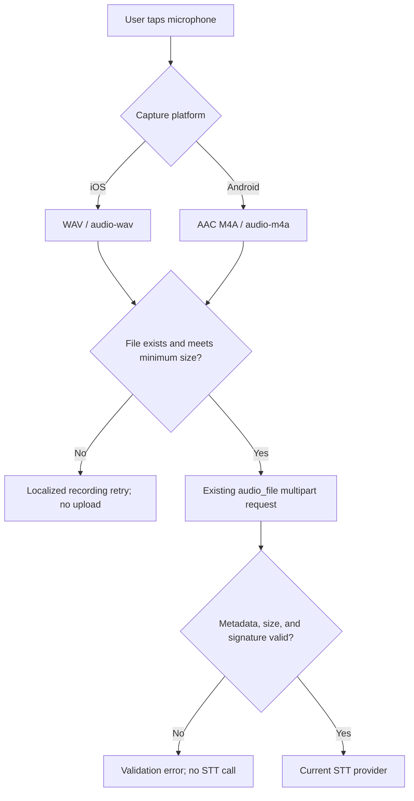

# fix: Stabilize iOS voice recording uploads

## Goal Capsule

| Field | Value |
|---|---|
| Objective | Make spoken voice input on a real iPhone create a transcribable file instead of uploading a header-only M4A payload. |
| Means | Record uncompressed WAV on iOS, preserve Android AAC/M4A recording, reject recordings below 1 KiB before STT, and require an explicit user retry on failure. |
| Authority | The observed iOS upload was a 28-byte M4A while Android successfully uses the same API and OpenRouter model. `record` 7.1.1 supports WAV on iOS. |
| Execution profile | Standard mobile/backend hardening across the shared recorder abstraction, voice validation, tests, documentation, and physical-device QA. |
| Stop conditions | Stop and re-evaluate if an iOS WAV recording still has no PCM payload, or if OpenRouter rejects a valid WAV uploaded from the device. |

---

## Product Contract

### Summary

Curitalk users must be able to speak an answer in Topic Prep or an existing conversation on iPhone. A failed local recording must be presented as a recording retry, never as an OpenRouter transcription failure. Android's working audio path remains unchanged.

### Problem Frame

The shared Flutter recorder currently writes AAC-LC M4A with a 16 kHz mono configuration on every mobile platform. On iPhone it can produce a 28-byte file containing only the MP4/M4A container header. The mobile client accepts every non-empty file, and the backend's M4A signature check accepts the same header-only payload. It is then rejected downstream by OpenRouter with a generic provider `400`.

### Requirements

- R1. iOS voice recordings use a WAV container and `audio/wav`; Android continues using AAC-LC M4A and `audio/m4a`.
- R2. The shared recorder returns a recording failure when the captured file is missing, empty, or below 1 KiB; neither Topic Prep nor conversation turns upload it.
- R3. The backend independently rejects undersized audio uploads before selecting an STT provider, while preserving support for legitimate WAV, M4A, WebM, and other currently supported formats.
- R4. A rejected recording surfaces the existing localized recording-retry experience and does not create a conversation, user message, or audio retry target.
- R5. Valid Android and iOS recordings retain the existing multipart `audio_file` API contract and OpenRouter/OpenAI STT provider interfaces.
- R6. Logs provide format and byte-length diagnostics for local/server validation failures without recording audio bytes, transcripts, or credentials.

### Scope Boundaries

In scope:

- Shared recorder format selection and captured-file validation.
- Backend pre-provider validation for header-only and undersized audio.
- Unit/widget coverage and real-device iOS/Android QA instructions.

Out of scope:

- Switching STT providers or models.
- Changing the conversation API fields, speech-to-text prompts, TTS, or audio playback.
- Background/realtime recording, waveform UI, or Bluetooth route-specific product controls.

### Success Criteria

- A 5-second spoken iPhone recording is sent as a non-trivial WAV payload and reaches STT successfully.
- A header-only or too-small recording is rejected locally and, if submitted by another client, rejected by the backend without an OpenRouter request.
- Android AAC/M4A recordings continue to start conversations and send turns successfully.

---

## Planning Contract

### Key Technical Decisions

- KTD1. **Use WAV only for iOS capture** (session-settled: user-approved — chosen over retaining iOS AAC/M4A because actual speech produced a header-only M4A while Android succeeds). WAV is supported by the existing `record` dependency and the backend already recognizes `audio/wav`. Platform-specific output belongs in the shared recorder, not either screen.
- KTD2. **Treat local and server validation as complementary.** The mobile client gives immediate recovery UX; the server remains the trust boundary for malformed or non-mobile uploads.
- KTD3. **Use a 1 KiB minimum-byte threshold rather than an empty-only check** (session-settled: user-approved — chosen over a format-specific threshold to protect every supported upload format consistently). It accepts the app's minimum 700 ms speech recordings on both formats while rejecting a 28-byte container header. Apply it before provider dispatch and cover the boundary in tests.
- KTD4. **Do not add an arbitrary post-stop delay.** `stop()` is the recorder completion boundary. If WAV still fails after this change, capture the platform error/size diagnostics and investigate the native plugin path instead of masking it with timing retries.
- KTD5. **Do not automatically fall back from iOS WAV to M4A** (session-settled: user-approved — chosen over silent codec retry so a capture failure remains visible and recoverable). Show the localized recording retry state instead.

### High-Level Technical Design

### Assumptions

- The existing `record` 7.1.1 dependency remains in use; no native iOS plugin fork is planned in this change.
- The existing 700 ms UI threshold remains the minimum intentional recording duration.
- The 1 KiB minimum-byte threshold is a corruption guard, not a speech-quality or silence detector.

### Sources & Research

- `mobile/lib/features/conversation/application/conversation_audio_services.dart` owns the reusable `record` wrapper used by both voice entry points.
- `mobile/lib/features/topic_prep/presentation/topic_prep_screen.dart` and `mobile/lib/features/conversation/presentation/conversation_screen.dart` already map `ConversationAudioException` to the recording failure state.
- `backend/domains/voice/service.py` validates metadata, size, and signatures before calling an STT provider.
- `backend/domains/voice/openrouter_provider.py` now records provider error diagnostics; the production failure showed a 28-byte M4A and a generic OpenRouter `400`.
- [record 7.1.1 documentation](https://pub.dev/packages/record) lists WAV and AAC-LC as supported iOS encoders.

---

## Implementation Units

### U1. Add platform-aware recording output and local corruption guard

- **Goal:** Generate WAV on iOS, retain AAC/M4A on Android, and block unusable capture results inside the shared recorder.
- **Requirements:** R1, R2, R4, R6
- **Dependencies:** None
- **Files:** `mobile/lib/features/conversation/application/conversation_audio_services.dart`, `mobile/test/features/conversation/application/conversation_audio_services_test.dart`
- **Approach:**
  1. Centralize the output filename extension, MIME type, and `RecordConfig` selection in the recorder service based on the current platform.
  2. Keep mono 16 kHz capture for speech; use the package's WAV encoder on iOS and preserve the current AAC-LC configuration on Android.
  3. After `stop()` reads the file, validate non-empty data and the 1 KiB minimum size before building `ConversationAudioFile`; map failure to the existing explicit retry path without a codec fallback.
  4. Preserve best-effort temp-file cleanup on every success and failure path, and log only platform, extension, MIME type, and byte length for local capture failures.
- **Patterns to follow:** Keep `RecordConversationAudioRecorder`, `ConversationAudioRecorderBackend`, and `ConversationAudioFileStore` injectable; existing fake backend/file-store tests are the seam for this behavior.
- **Test scenarios:**
  - iOS platform selection produces a `.wav` filename, `audio/wav`, and the WAV recorder configuration.
  - Android platform selection preserves `.m4a`, `audio/m4a`, and AAC-LC configuration.
  - A file exactly at the minimum accepted size yields `ConversationAudioFile` with matching metadata.
  - An empty file and a file one byte below the threshold raise `emptyRecording` and are deleted.
  - A valid recording is deleted after the bytes are read, as before.
  - A recorder stop error still maps to `stopFailed` and does not leak the temp path.
- **Verification:** Recorder unit tests prove platform output selection, the threshold boundary, exception reason, and cleanup behavior without a physical microphone.

### U2. Preserve both voice-entry recovery paths

- **Goal:** Ensure local recorder rejection remains a retryable recording state in Topic Prep and existing conversation screens without attempting a network upload.
- **Requirements:** R2, R4
- **Dependencies:** U1
- **Files:** `mobile/lib/features/conversation/presentation/conversation_screen.dart`, `mobile/lib/features/topic_prep/presentation/topic_prep_screen.dart`, `mobile/test/features/conversation/presentation/conversation_screen_test.dart`, `mobile/test/features/topic_prep/presentation/topic_prep_screen_test.dart`
- **Approach:** Confirm the existing `ConversationAudioExceptionReason.emptyRecording` handling is used for undersized captures as well as empty captures. Adjust screen behavior only when necessary to keep the timer stopped, reset the sending state, and show the localized retry copy without calling the start/send controller.
- **Patterns to follow:** Follow the existing recording state machines and `voiceNotRecognizedMessage`; do not add screen-specific format logic.
- **Test scenarios:**
  - Topic Prep rejects an undersized recorder result, keeps the user on the prepared card, and does not call the free-chat audio start API.
  - Conversation rejects an undersized recorder result, does not call `sendAudioTurn`, and exposes the recording retry state.
  - A valid recorder result still reaches the corresponding controller after the 700 ms duration gate.
  - Typed-message sending remains unaffected by the recording failure state.
- **Verification:** Widget tests demonstrate no multipart request is initiated for a local recording failure in either entry point.

### U3. Add server-side undersized-audio validation

- **Goal:** Keep malformed/header-only audio from reaching OpenRouter or OpenAI when submitted by any client.
- **Requirements:** R3, R5, R6
- **Dependencies:** None
- **Files:** `backend/domains/voice/service.py`, `backend/tests/domains/voice/test_voice_service.py`
- **Approach:**
  1. Add a 1 KiB minimum-byte validation after upload reading and before signature/provider processing.
  2. Return the existing `ValidationException` category with safe metadata such as extension and byte length; do not include audio bytes.
  3. Keep maximum upload and format signature checks intact, including valid M4A support for Android.
  4. Add a stage-specific warning diagnostic for rejected undersized uploads, matching existing STT log conventions.
- **Patterns to follow:** Extend `VoiceService` validation helpers and `FakeUpload`/`FakeVoiceProvider` tests; preserve the provider abstraction and HTTP error mapping.
- **Test scenarios:**
  - A 28-byte M4A header-only payload is rejected before the fake provider receives a transcription call.
  - A payload at the minimum accepted size with a valid WAV signature is sent to the provider successfully.
  - Existing oversized, unsupported MIME type, and invalid-signature rejections retain their current behavior.
  - Android-style valid M4A fixture above the threshold remains accepted.
- **Verification:** Backend voice tests prove the provider is never called for an undersized upload and valid cross-platform fixtures still pass.

### U4. Document release checks and perform device QA

- **Goal:** Make the platform behavior, corruption guard, and manual proof explicit for future releases.
- **Requirements:** R1, R2, R5, R6
- **Dependencies:** U1, U2, U3
- **Files:** `mobile/README.md`, `README.md`, `.agent/_coordination/CHANGELOG.md`
- **Approach:** Document that iOS uploads WAV and Android uploads AAC/M4A through the same API, and add a concise real-device QA checklist. Keep API field documentation unchanged because the multipart field remains `audio_file`.
- **Test scenarios:**
  - Manual iPhone QA: grant microphone permission, record at least five seconds of speech in Topic Prep and an existing conversation, and confirm a non-trivial WAV byte length plus a transcript.
  - Manual Android QA: repeat the flows and confirm M4A upload/transcription still succeeds.
  - Manual negative QA: immediately stop or simulate an undersized capture and confirm localized retry copy appears with no OpenRouter STT error in server logs.
- **Verification:** Documentation and changelog match final behavior; physical-device QA records platform, app build, route, file format, byte length, and outcome without retaining speech content.

---

## Verification Contract

| Scope | Evidence |
|---|---|
| Shared recorder | Dart unit tests cover iOS/Android output metadata, threshold edges, and temp-file cleanup. |
| Entry screens | Widget tests prove local recording failures never call the start/send APIs. |
| Backend boundary | Pytest proves an undersized M4A cannot invoke the provider, while valid WAV/M4A fixtures can. |
| Device behavior | iPhone and Android real-device recordings both yield a transcript through their intended container format. |

## Definition of Done

- iOS capture produces WAV metadata and a valid audio payload during real-device voice input.
- Android's existing AAC/M4A voice flow remains functional.
- Header-only and undersized recordings are rejected before OpenRouter and produce recovery UX rather than provider errors.
- Automated Flutter and backend validation coverage passes, and the device QA outcomes are recorded in the implementation handoff.

## Deferred to Follow-Up Work

- Investigating or replacing the native iOS recorder implementation if WAV capture also produces empty payloads.
- Silence detection, waveform visualization, background recording, and audio-route controls.
