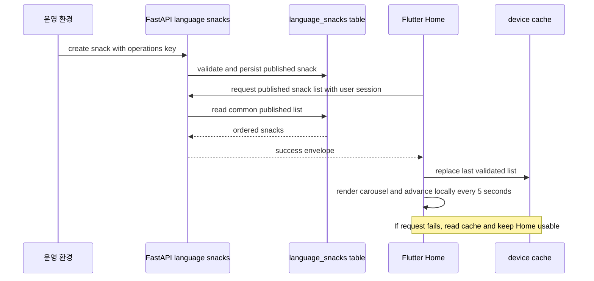

# Language Snack API and Home Carousel - Plan

## Goal Capsule

| Field | Value |
|---|---|
| Objective | 학습자는 Home에서 짧은 언어 지식 카드를 끊김 없이 보고, 운영자는 앱 배포 없이 새 카드를 추가할 수 있다. |
| Means | FastAPI가 공통 언어 스낵을 저장·제공하고, Flutter Home이 영속 캐시와 자동 전환 카드로 소비한다. (KTD1, KTD4) |
| Authority | 2026-09-06 사용자 결정: 콘텐츠는 언어쌍별로 선별하지 않고, CMS는 후속으로 미루며, 운영용 생성 API와 마지막 성공 응답 캐시를 제공한다. |
| Execution profile | 백엔드 계약과 영속 데이터를 먼저 완료한 뒤, 고정된 API 계약을 소비하는 Flutter Home 기능을 구현한다. |
| Stop conditions | 언어쌍별 번역, 사용자별 추천·노출 이력, 카드 편집·삭제·발행 CMS, 분석 이벤트가 필요해지면 이 계획을 확장하지 말고 후속 계획으로 분리한다. |
| Tail ownership | API 계약, 운영 키 설정, Flutter 캐시 실패 경로, 모션 감소 접근성, 문서 동기화까지 완료되어야 한다. |

---

## Product Contract

### Summary

Home의 최근 대화 위에 공통 언어 스낵 캐러셀을 표시한다. 백엔드는 운영자가 생성한 발행 카드를 반환하고, Flutter는 5초 단위 전환 및 수동 탐색을 제공한다. 네트워크 요청이 실패하면 마지막으로 유효하게 받은 카드 목록을 표시한다.

### Problem Frame

현재 Home은 최근 대화 또는 첫 대화 시작 제안만 보여 주므로, 사용자가 앱에 들어왔을 때 대화를 시작하기 전에도 짧은 학습 가치를 얻을 표면이 없다. 카드 콘텐츠를 앱 코드에 고정하면 운영 중 수정과 확장이 배포에 묶이고, 네트워크 오류 시에는 새로운 학습 표면이 사라질 수 있다.

### Key Decisions

- **공통 콘텐츠만 제공한다.** 언어쌍과 관계없이 동일한 발행 목록을 반환하고, 번역은 후속 기능으로 분리한다. (session-settled: user-directed - chosen over language-pair content routing: 언어쌍은 향후 번역에만 반영하기로 결정함) Governs R1, R2, R5.
- **CMS 대신 운영용 생성 API를 제공한다.** 운영자가 서버 전용 비밀값으로 카드를 추가하며, 학습자용 Flutter 앱에는 생성 표면을 만들지 않는다. (session-settled: user-directed - chosen over a CMS in this delivery: CMS를 후속 작업으로 미루기로 결정함) Governs R3, R4.
- **실패 시 마지막 성공 응답을 표시한다.** 캐시는 Home의 보조 데이터 원본이며, 네트워크 성공 응답이 언제나 이를 갱신한다. (session-settled: user-directed - chosen over an empty error state: 네트워크 실패 시 마지막 카드 캐시를 보여주기로 결정함) Governs R6, R7.

### Requirements

- R1. `LanguageSnack`은 카드 한 장을 완전하게 렌더링할 수 있는 식별자, 카테고리, 두 표현의 레이블·단어, 의미, 예문, 생성·발행 시각을 저장한다. 콘텐츠 설명은 v1에서 단일 편집 언어로 관리하며 언어쌍 필드를 두지 않는다.
- R2. 로그인한 학습자가 조회 API를 호출하면 발행된 카드만 안정된 최신 순서로 받는다. 같은 요청은 사용자의 언어쌍과 무관하게 같은 콘텐츠 집합을 반환한다.
- R3. 운영자는 별도 운영 키가 설정된 서버 환경에서만 생성 API를 호출해 즉시 발행되는 카드를 추가할 수 있다. 일반 Flutter 클라이언트는 운영 키를 보유하거나 생성 API를 호출하지 않는다.
- R4. 생성 요청은 필수 카드 필드와 길이·공백·발행 상태를 검증하고, 잘못된 운영 키 또는 잘못된 본문으로는 데이터를 저장하지 않는다.
- R5. API 계약은 프로젝트 공통 성공 envelope를 사용하고, 생성·조회 경로와 운영 키 설정은 API 문서와 환경 변수 문서에 함께 기록한다.
- R6. Flutter는 인증된 Home에서 언어 스낵을 최근 대화보다 먼저 독립적으로 불러온다. 성공한 응답은 파싱과 유효성 검증 후 기기 영속 저장소에 교체 저장한다.
- R7. 스낵 API 요청이 실패하면 마지막 성공 캐시가 있으면 이를 표시하고, 캐시도 없으면 Home의 대화 기능을 가리지 않은 채 스낵 영역만 숨긴다.
- R8. 카드가 둘 이상이면 5초마다 다음 카드로 전환하고, 이전·다음 및 점 탐색을 제공한다. 포커스, 수동 탐색, 앱 비활성화 또는 모션 감소 설정에서는 자동 전환이 멈추거나 시작하지 않는다.
- R9. 언어 스낵은 빈 최근 대화 상태와 최근 대화 목록 상태 모두에서 Home 중앙 콘텐츠로 표시하며, 기존 시작 CTA와 최근 대화 삭제·새로고침 흐름을 바꾸지 않는다.

### Acceptance Examples

- AE1. Given 서로 다른 언어쌍을 쓰는 두 인증 사용자가 있을 때, when 두 사용자가 스낵 목록을 조회하면, then 발행된 동일 카드 집합을 언어쌍 필터링 없이 받는다.
- AE2. Given 운영 키가 유효할 때, when 완전한 카드 본문으로 생성 요청을 보내면, then 즉시 발행된 카드가 응답되고 이후 목록 조회에 포함된다.
- AE3. Given 운영 키가 없거나 틀렸을 때, when 생성 요청을 보내면, then 카드가 생성되지 않으며 학습자 목록에 노출되지 않는다.
- AE4. Given 기기에 마지막 성공 카드가 저장되어 있을 때, when Home의 다음 스낵 조회가 실패하면, then 저장된 카드를 계속 보여 주고 최근 대화 영역은 정상 동작한다.
- AE5. Given 둘 이상의 스낵을 표시할 때, when 사용자가 카드와 상호작용하지 않으면, then 5초 뒤 다음 카드가 보인다. When 사용자가 탐색 제어에 포커스를 두거나 모션 감소 설정을 켜면, then 자동 진행이 발생하지 않는다.

### Scope Boundaries

#### In Scope

- 공통 발행 언어 스낵의 저장, 생성, 목록 조회 API와 운영 키 보호.
- Flutter Home의 API 소비, 마지막 성공 목록 캐시, 캐러셀 UI, 접근성 상태.
- API, 환경 변수, 아키텍처, 모바일 문서의 동기화.

#### Deferred to Follow-Up Work

- 카드 수정·삭제·예약 발행·비발행을 위한 운영 CMS.
- 콘텐츠 번역과 언어쌍 또는 앱 언어에 따른 설명·예문 변형.
- 개인별 난이도, 이미 본 카드 제외, 노출 순서, 반응 분석 이벤트.

#### Outside This Product's Identity

- 일반 학습자에게 콘텐츠 생성 권한 또는 운영 키를 노출하는 것.
- 스낵 네트워크 오류 때문에 Home의 대화 시작 또는 최근 대화 사용을 막는 것.

---

## Planning Contract

### Key Technical Decisions

- KTD1. `language_snacks`를 FastAPI의 독립 도메인으로 만든다.
  SQLAlchemy model, Pydantic schema, repository, service, router를 같은 도메인에 두어 기존 conversation/auth 수직 슬라이스와 같은 구조를 따른다. `backend/main.py`는 새 router만 등록한다.

- KTD2. 목록은 사용자 인증만 확인하고 콘텐츠 선택에는 프로필을 사용하지 않는다.
  Home이 인증 후 표시되는 현재 흐름을 유지하면서, `get_current_user`는 접근 경계로만 사용한다. `native_language`, `target_language`, `feedback_language`는 이 API의 요청·응답·DB 조건에 넣지 않는다. (R1, R2)

- KTD3. 생성 권한은 서버 설정의 운영 키로 분리한다.
  역할 모델이 아직 없으므로 일반 Bearer 사용자에게 쓰기 권한을 주지 않는다. 설정값과 요청 헤더를 비교하는 전용 dependency로 생성 경로를 보호하고, 비밀값은 Flutter 또는 문서 예시에 실제 값으로 넣지 않는다. (R3, R4)

- KTD4. Flutter는 Home feature 안에 스낵 모델·repository·controller·캐시를 둔다.
  최근 대화 상태와 성공·실패 수명 주기가 다르므로 기존 `HomeRepository` 또는 `RecentConversationsController`에 끼워 넣지 않는다. API 응답의 검증 완료 목록만 기존 `flutter_secure_storage` 기반 저장소에 직렬화해 저장한다. (R6, R7)

- KTD5. 캐러셀의 시간 제어는 UI 위젯이 소유한다.
  백엔드는 카드 목록만 제공하고, Flutter 위젯이 5초 간격·수동 탐색·lifecycle·reduced motion을 처리한다. 하나의 카드만 있을 때는 자동 타이머와 탐색 제어를 만들지 않는다. (R8)

- KTD6. 초기 운영 콘텐츠는 migration에 강제 삽입하지 않는다.
  migration은 테이블 구조만 관리하고, 실제 발행 카드는 보호된 생성 API로 운영 환경에서 추가한다. 이렇게 하면 배포 환경마다 데이터가 중복되거나 예제 문구가 제품 콘텐츠로 고정되는 일을 막을 수 있다.

### High-Level Technical Design

### Assumptions

- v1 설명과 의미 텍스트는 현재 목업과 한국어 Home copy에 맞춰 한국어 편집본으로 운영한다. 앱 언어 또는 학습 언어에 따른 번역은 후속 기능이다.
- 운영자는 배포 환경 또는 보호된 운영 도구에서 API를 호출할 수 있고, Flutter 학습자 클라이언트에는 운영 키를 배포하지 않는다.
- 캐시는 마지막 성공 목록 전체를 저장한다. 별도 만료 정책, stale 표식, 선로딩은 후속 운영 요구가 생길 때 결정한다.

### Sequencing

1. API 계약, DB 도메인, 운영 키 설정과 백엔드 테스트를 먼저 완료한다.
2. API 문서와 환경 변수·아키텍처 문서를 동기화하고 운영자가 생성 API를 사용할 수 있게 한다.
3. Flutter 모델, repository, 캐시, controller를 새 계약에 맞춰 구현한다.
4. 캐러셀 위젯을 Home에 배치하고 기존 최근 대화 상태와 함께 검증한다.

---

## System-Wide Impact

- **학습자:** Home에 새 학습 표면이 생기지만, API 실패 시에도 대화 시작과 최근 대화는 계속 사용할 수 있다.
- **운영자:** 앱 릴리스 없이 콘텐츠를 생성할 수 있지만, 초기에는 보호된 API 호출 절차를 사용한다.
- **보안:** 운영 키는 서버 설정과 요청 경계에만 존재하고, 학습자 인증은 읽기 권한 경계로 유지된다.
- **문서:** 새 API와 환경 변수는 `README.md`, `docs/DSL.md`, `.env.example`, `backend/config.py`, `.agent/architecture.md`에 같은 작업 단위로 반영된다.

---

## Risks and Mitigations

| Risk | Mitigation |
|---|---|
| 운영 키가 모바일 코드나 로그에 노출됨 | 생성 API 호출을 Flutter에서 구현하지 않고, 서버 설정의 비밀값과 전용 header dependency로만 검증한다. |
| 잘못된 카드 본문이 Home 레이아웃을 깨뜨림 | 생성 schema에서 빈 문자열과 길이 제한을 거절하고, Flutter domain parser도 필수 필드를 재검증한다. |
| 캐시가 손상되어 오류 화면으로 이어짐 | 캐시 역직렬화 실패는 캐시 미존재로 취급하고 삭제한 뒤 Home의 나머지 영역을 표시한다. |
| 자동 전환이 읽기나 보조기기 사용을 방해함 | focus, lifecycle, reduced motion, 단일 카드 상태에서 타이머를 중지하고 수동 탐색을 제공한다. |
| 후속 번역 요구가 현 구조를 뒤집음 | 콘텐츠 필드를 언어쌍 키로 고정하지 않고, v1의 단일 편집본 정책을 문서화해 번역 테이블 또는 variant 모델을 후속으로 추가할 여지를 남긴다. |

---

## Implementation Units

### U1. Define the language snack contract and persistent backend domain

**Goal:** 공통 발행 스낵의 영속 모델, 검증된 요청·응답 schema, 저장소 및 서비스 경계를 만든다.

**Requirements:** R1, R2, R4, R5.

**Dependencies:** None.

**Files:**
- Create `backend/domains/language_snacks/__init__.py`
- Create `backend/domains/language_snacks/models.py`
- Create `backend/domains/language_snacks/schemas.py`
- Create `backend/domains/language_snacks/repository.py`
- Create `backend/domains/language_snacks/service.py`
- Create `backend/alembic/versions/<timestamp>_create_language_snacks.py`
- Modify `backend/main.py`
- Create `backend/tests/domains/language_snacks/test_language_snack_repository.py`
- Create `backend/tests/alembic/test_create_language_snacks_migration.py`

**Approach:**
1. 모델에는 공통 카드 렌더링 필드, 발행 시각, 생성·수정 시각을 저장하고 발행 목록 조회에 필요한 인덱스와 정렬 기준을 둔다.
2. schema는 생성 본문과 학습자용 응답을 분리하고, 콘텐츠가 공백만 있거나 카드 높이를 예측할 수 없을 정도로 긴 값을 거절한다.
3. repository는 발행 목록과 생성 행의 데이터 접근만 맡기고, service가 발행 여부와 정렬 정책을 적용한다.
4. migration은 upgrade와 downgrade에서 구조만 만들고 콘텐츠 row를 넣지 않는다. `main.py`에는 metadata 등록에 필요한 model import만 추가한다.

**Patterns to follow:** `backend/domains/conversation/models.py`, `backend/domains/conversation/schemas.py`, `backend/domains/conversation/repository.py`, `backend/alembic/versions/20260720_0001_add_language_context.py`.

**Test scenarios:**
- 완전한 카드 모델을 저장하고 다시 읽으면 모든 렌더링 필드와 발행 시각이 보존된다.
- 발행 카드와 비발행 카드가 함께 있을 때 목록 repository는 발행 카드만 정의된 최신 순서로 반환한다.
- 빈 문자열, 공백만 있는 값, schema 제한을 넘는 값은 저장 전에 검증 오류가 된다.
- 동일한 정렬 값이 있을 때도 안정적인 보조 정렬로 목록 순서가 결정된다.
- migration upgrade는 새 테이블과 조회 인덱스를 만들고 downgrade는 해당 구조만 되돌린다.

**Verification:** SQLite test database의 migration과 repository 테스트가 새 테이블 및 발행 필터를 증명한다.

### U2. Expose authenticated list and operations-only creation APIs

**Goal:** 학습자 목록 조회와 운영자 생성의 서로 다른 권한 경계를 FastAPI API로 제공한다.

**Requirements:** R2, R3, R4, R5. Implements the session-settled product decisions governing R2-R4.

**Dependencies:** U1.

**Files:**
- Create `backend/domains/language_snacks/router.py`
- Create `backend/domains/language_snacks/dependencies.py`
- Modify `backend/config.py`
- Modify `backend/main.py`
- Modify `.env.example`
- Create `backend/tests/domains/language_snacks/test_language_snack_router.py`

**Approach:**
1. 목록 endpoint는 기존 `get_current_user` 인증 패턴을 적용하지만 프로필 언어 값으로 쿼리하지 않는다.
2. 생성 endpoint는 별도 운영 키 header dependency를 통과해야 하며, 일반 Bearer token만으로는 호출할 수 없게 한다.
3. 설정은 비밀값 누락 시 생성 경로가 안전하게 실패하도록 하고, 환경 변수 이름과 설명을 `.env.example`에 동기화한다.
4. `main.py`에 새 router를 등록하고, 두 endpoint는 공통 `SuccessResponse` envelope와 새 domain schema를 사용한다. 생성 성공 후 카드가 목록 조회에서 즉시 보이도록 service를 연결한다.

**Execution note:** API contract와 권한 경계부터 테스트로 고정한 뒤 router를 연결한다.

**Patterns to follow:** `backend/domains/auth/dependencies.py`, `backend/domains/auth/router.py`, `backend/domains/conversation/router.py`, `backend/shared/types.py`.

**Test scenarios:**
- 인증 사용자가 목록을 요청하면 발행 카드만 success envelope 안에서 받는다.
- 서로 다른 프로필 언어 설정의 인증 사용자가 목록을 요청해도 같은 카드 집합을 받는다.
- 유효한 운영 키와 유효한 생성 본문은 카드를 저장하고 생성 응답 및 후속 목록에 포함한다.
- 운영 키가 없거나 틀렸으면 생성이 거절되고 DB row 수가 바뀌지 않는다.
- 운영 키 설정 자체가 비어 있으면 생성 요청은 안전하게 거절되고 DB row 수가 바뀌지 않는다.
- 필수 필드가 빠졌거나 유효하지 않으면 생성이 거절되고 부분 row가 남지 않는다.
- 목록 인증이 없거나 무효하면 기존 보호 API와 동일한 인증 오류 경계를 따른다.

**Verification:** router integration tests가 인증 읽기, 운영 전용 쓰기, 언어쌍 비의존, 생성 후 조회를 모두 증명한다.

### U3. Publish the language snack contract and operator setup guidance

**Goal:** 운영자와 Flutter 구현자가 같은 API, 비밀값, 콘텐츠 범위를 기준으로 작업하게 한다.

**Requirements:** R5.

**Dependencies:** U2.

**Files:**
- Create `.agent/_contracts/LANGUAGE_SNACKS.md`
- Modify `README.md`
- Modify `docs/DSL.md`
- Modify `.agent/architecture.md`
- Modify `mobile/README.md`

**Approach:**
1. contract 문서는 목록과 생성의 request/response, 인증 경계, 발행 상태, 공통 콘텐츠 정책을 DRAFT에서 REVIEW를 거쳐 ACTIVE로 승격할 수 있는 형태로 기록한다.
2. `README.md`와 `docs/DSL.md`에는 endpoint, 성공 envelope, 운영 키를 안전하게 주입하는 방법, Flutter가 절대 키를 보유하지 않는 경계를 명시한다.
3. 아키텍처와 모바일 문서는 Home 데이터 흐름과 캐시 실패 동작을 새 도메인 기준으로 보완한다.

**Patterns to follow:** `AGENTS.md` API N-way sync register, `.agent/_contracts/SEARCH_QUALITY.md`, `README.md`, `docs/DSL.md`, `mobile/README.md`.

**Test expectation:** none - 문서와 계약 동기화 작업이며 동작은 U1-U2 및 U4-U6 테스트가 검증한다.

**Verification:** 문서에 정의된 endpoint, 인증 유형, environment variable, 응답 필드가 router와 settings의 실제 계약에 일치한다.

### U4. Add Flutter language snack model, API repository, and persistent cache

**Goal:** Flutter가 공통 스낵 목록을 엄격히 파싱하고 마지막 성공 응답을 기기 저장소에 보관하게 한다.

**Requirements:** R5, R6, R7.

**Dependencies:** U2, U3.

**Files:**
- Create `mobile/lib/features/home/domain/language_snack.dart`
- Create `mobile/lib/features/home/domain/language_snack_repository.dart`
- Create `mobile/lib/features/home/data/api_language_snack_repository.dart`
- Create `mobile/lib/features/home/data/language_snack_cache.dart`
- Modify `mobile/lib/features/home/home.dart`
- Create `mobile/test/features/home/domain/language_snack_test.dart`
- Create `mobile/test/features/home/data/api_language_snack_repository_test.dart`
- Create `mobile/test/features/home/data/language_snack_cache_test.dart`

**Approach:**
1. domain factory는 API envelope에서 내려온 카드의 필수 문자열·시간·발행 상태를 검증하고, 잘못된 항목을 정상 카드로 보정하지 않는다.
2. API repository는 현재 `ApiClient` decoder 패턴으로 목록 endpoint를 해석하고, 생성 API나 운영 키를 참조하지 않는다.
3. cache는 마지막으로 완전히 검증된 목록만 JSON으로 교체 저장하며, 손상된 JSON 또는 항목은 캐시 미존재로 정리한다.
4. repository와 cache 의존성은 test override가 가능하도록 provider로 제공한다.

**Patterns to follow:** `mobile/lib/features/home/domain/conversation_summary.dart`, `mobile/lib/features/home/data/api_home_repository.dart`, `mobile/lib/features/onboarding/data/onboarding_storage.dart`, `mobile/lib/core/storage/token_storage.dart`.

**Test scenarios:**
- 유효한 목록 JSON은 모든 카드 필드를 가진 immutable domain 목록으로 변환된다.
- 필수 문자열, 시간 또는 배열 shape가 잘못된 API payload는 `FormatException`이 된다.
- 성공 목록을 저장한 뒤 읽으면 동일 순서의 카드 목록이 복원된다.
- 손상된 또는 부분 캐시 payload를 읽으면 예외를 Home까지 전파하지 않고 캐시 미존재로 처리한다.
- 목록 API 요청은 인증 interceptor가 붙는 `ApiClient` 경로를 사용하며 운영 키 header를 추가하지 않는다.

**Verification:** domain, API decoder, cache tests가 유효성 경계와 영속 복원을 증명한다.

### U5. Introduce an independent snack loading controller with cache fallback

**Goal:** 스낵 API의 성공·실패 상태가 최근 대화 상태와 독립적으로 유지되고, 실패 시 캐시가 화면 모델이 되게 한다.

**Requirements:** R6, R7, R9.

**Dependencies:** U4.

**Files:**
- Create `mobile/lib/features/home/application/language_snacks_controller.dart`
- Modify `mobile/lib/features/home/presentation/home_screen.dart`
- Create `mobile/test/features/home/application/language_snacks_controller_test.dart`
- Modify `mobile/test/features/home/presentation/home_screen_test.dart`

**Approach:**
1. controller는 인증 세션이 없을 때 네트워크 요청을 하지 않고 빈 상태를 반환한다.
2. 인증 상태에서는 먼저 API 목록을 요청하고, 성공 시 cache를 교체한 뒤 data 상태로 만든다.
3. 요청이 실패하면 cache를 읽어 data 상태로 전환한다. cache가 없을 때만 스낵 영역을 숨기는 비차단 empty 상태로 끝낸다.
4. `HomeScreen`은 스낵 상태와 최근 대화 상태를 별도로 구독해, 한쪽의 loading/error가 다른 쪽을 대체하지 않게 한다. 스낵 영역은 최근 대화 섹션보다 위에 놓는다.

**Patterns to follow:** `mobile/lib/features/home/application/recent_conversations_controller.dart`, `mobile/lib/features/home/presentation/home_screen.dart`, `mobile/lib/features/auth/application/auth_controller.dart`.

**Test scenarios:**
- 인증된 Home이 성공 목록을 받으면 스낵 영역이 최근 대화 레이블보다 앞에 표시되고 cache 저장이 요청된다.
- 스낵 요청이 실패해도 cache가 있으면 cache 카드가 보이고 최근 대화 목록과 대화 시작 CTA가 유지된다.
- 스낵 요청과 cache 읽기 모두 실패하거나 비어 있으면 스낵 영역만 없고 Home의 기존 empty/recent 상태가 정상 표시된다.
- 인증되지 않은 상태에서는 스낵 repository 호출이 발생하지 않는다.
- 최근 대화 새로고침·삭제 상태가 스낵 카드의 마지막 성공 상태를 loading/error로 바꾸지 않는다.

**Verification:** provider override 기반 controller 및 Home widget 테스트가 독립 상태와 fallback 우선순위를 증명한다.

### U6. Build and integrate the accessible 5-second language snack carousel

**Goal:** 여러 스낵을 가독성 있는 파스텔 컬러 블록 카드로 표시하고, 자동 및 수동 탐색을 접근 가능하게 만든다.

**Requirements:** R8, R9.

**Dependencies:** U5.

**Files:**
- Create `mobile/lib/features/home/presentation/widgets/language_snack_carousel.dart`
- Modify `mobile/lib/features/home/presentation/widgets/widgets.dart`
- Modify `mobile/lib/features/home/presentation/home_screen.dart`
- Modify `mobile/lib/core/copy/app_copy.dart`
- Create `mobile/test/features/home/presentation/widgets/language_snack_carousel_test.dart`
- Modify `mobile/test/features/home/presentation/home_screen_test.dart`
- Reference `docs/prototypes/home-language-snack-carousel.html`

**Approach:**
1. `AppColorBlockCard`, `AppSectionLabel`, palette, spacing, typography를 사용해 목업의 편집형 파스텔 블록 문법을 Flutter 위젯으로 옮긴다.
2. 현재 카드 index, 5초 timer, 이전·다음, dot indicator를 stateful leaf widget에 한정한다. 목록이 바뀌거나 위젯이 dispose될 때 timer를 안전하게 정리한다.
3. `WidgetsBindingObserver`와 reduced motion 접근성 설정을 반영해 app inactive, 포커스 탐색, 모션 감소 환경에서 자동 진행을 정지한다. 수동 탐색 뒤에는 사용자가 상호작용을 마친 뒤에만 자동 진행을 재개한다.
4. 한 장일 때는 진행 indicator와 탐색 아이콘을 숨기고, 카드 내용의 semantic label에는 지역·표현·의미를 포함한다.

**Patterns to follow:** `mobile/lib/features/home/presentation/widgets/recent_conversation_card.dart`, `mobile/lib/core/widgets/app_color_block_card.dart`, `mobile/lib/app/theme/tokens/app_palette.dart`, `docs/design/DESIGN_SYSTEM.md`.

**Test scenarios:**
- 두 카드 이상일 때 첫 카드의 두 표현·의미·진행 indicator·이전/다음 semantic control이 보인다.
- 5초 경과 후 다음 카드가 보이고 index가 순환한다.
- 이전·다음 및 dot control은 정확한 카드를 표시하며 자동 timer를 중복 생성하지 않는다.
- 모션 감소 설정, app lifecycle inactive, 키보드/보조기기 focus 상태에서는 자동 전환이 발생하지 않는다.
- 한 장만 전달하면 timer와 pagination controls 없이 하나의 semantic 카드만 표시한다.
- Home의 최근 대화 유무와 관계없이 carousel이 최근 대화보다 위에 있고, 기존 start CTA 및 최근 대화 상호작용을 가리지 않는다.

**Verification:** widget tests에서 가짜 시간과 lifecycle을 사용해 timer 정리, manual navigation, reduced motion, Home 배치를 확인한다.

---

## Verification Contract

- 백엔드는 새 도메인 repository와 router 테스트, 관련 Alembic migration 테스트, 기존 인증 경계 회귀 테스트를 실행한다.
- Flutter는 새 domain/data/application/widget 테스트와 `mobile/test/features/home/presentation/home_screen_test.dart`를 실행한다.
- 변경된 모든 Dart 파일은 formatter를 통과하고, Flutter analyzer는 새 import·provider·lifecycle 경고가 없어야 한다.
- 백엔드와 Flutter 테스트는 목록의 언어쌍 비의존, 운영 키 보호, cache fallback, 5초 캐러셀, single-card accessibility를 각각 직접 검증한다.
- API 문서와 설정 표면은 실제 FastAPI router, Pydantic schema, config, `.env.example`을 기준으로 상호 검토한다.

---

## Definition of Done

- U1-U6의 요구사항과 테스트 시나리오가 충족되고, 새 API가 공통 success envelope와 프로젝트 인증 규칙을 따른다.
- 일반 Flutter 빌드와 네트워크 요청 어디에도 운영 키가 포함되지 않는다.
- API 요청 실패 시 마지막 성공 캐시가 있으면 스낵을 표시하고, cache가 없어도 Home의 기존 기능이 막히지 않는다.
- 캐러셀은 5초 자동 전환과 수동 탐색을 제공하면서 motion 및 lifecycle 접근성 조건을 지킨다.
- `README.md`, `docs/DSL.md`, `.env.example`, `.agent/architecture.md`, `mobile/README.md`, API contract가 구현된 동작과 일치한다.
- 실험용 캐시 키, 임시 API bypass, 목업 전용 코드, 사용하지 않는 타이머가 최종 변경에 남지 않는다.

---

## Sources and Research

- `AGENTS.md` 및 `.agent/rules.md`: 새 FastAPI 도메인 구조, API·환경 변수 문서 동기화, Flutter feature-first 정책.
- `.agent/architecture.md`: 현재 Home의 인증 후 최근 대화 데이터 흐름과 API client 인증 interceptor.
- `backend/domains/conversation/*`, `backend/domains/auth/*`: SQLAlchemy/Pydantic/repository/router/SuccessResponse/인증 dependency 패턴.
- `backend/alembic/versions/20260720_0001_add_language_context.py`: 현재 migration 등록 관례.
- `mobile/lib/features/home/*`, `mobile/lib/features/onboarding/data/onboarding_storage.dart`: Home repository/controller와 `flutter_secure_storage` 저장소 패턴.
- `mobile/test/features/home/presentation/home_screen_test.dart`: Home provider override 및 widget 검증 패턴.
- `docs/design/DESIGN_SYSTEM.md`, `docs/prototypes/home-language-snack-carousel.html`: 카드의 color block, 24px radius, 24px padding, 5초 자동 전환 UX 참고.
