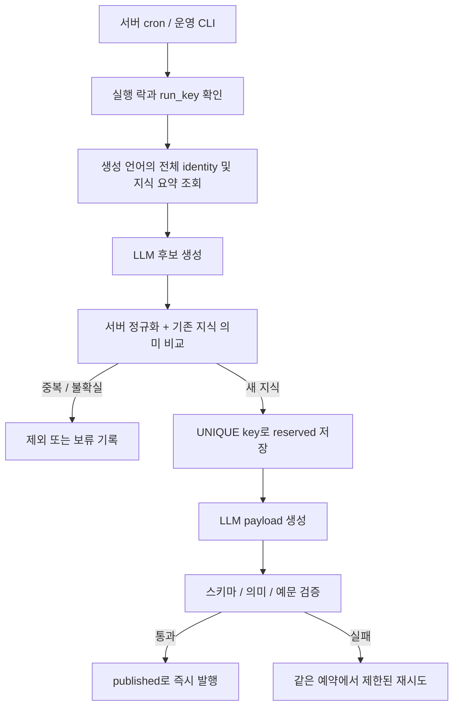
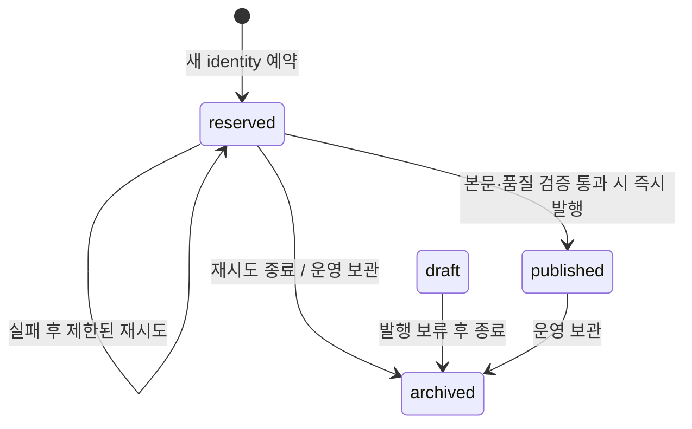

# Language Snack JSONB and Scheduled Generation - Plan

## Goal Capsule

Home에서 학습 언어에 맞는 지역별 표현, 용법 차이, 동음이의어 카드를 제공하고, LLM이 기존 지식 이력을 참고해 새 콘텐츠를 주기적으로 보충하게 해요.
표시 데이터는 간결한 JSONB로 저장하고 중복 판단 정보와 분리해요.
2026-09-12 사용자의 구현 시작 요청에 따라 현재 브랜치에서 실행해요. 미응답 운영값은 권장 기본값(언어별 9개, 반대 지원 언어 설명, 최신 12개, 구버전 빈 목록)으로 적용했어요. 생성 수량은 환경변수·CLI, 조회 수량은 API limit으로 조정 가능하며 설명·구버전 정책은 현재 계약으로 고정해요.
코드·테스트·배포 예시를 구현하고 실제 운영 DB migration과 서버 cron 설치는 배포 절차로 남겨요.

---

## Product Contract

### Problem Frame

현재 `language_snacks`는 좌우 표현과 카드 전체의 의미·예문 하나만 저장하므로 표현별 설명이 필요한 콘텐츠를 담기 어려워요.
주기적 생성에는 표현 순서·예문·문구 변경을 새로운 지식으로 오인하지 않는 중복 검사와 실패 복구가 필요해요.

### Requirements

| ID | 요구사항 |
|---|---|
| R1 | `regional_variant`, `usage_contrast`, `homonym`의 간결한 payload를 제공하고 각 카드의 항목은 정확히 2개예요. |
| R2 | 기존 스낵 데이터는 삭제하고 새 스키마에서 다시 생성해요. 삭제 범위는 스낵 데이터로 한정해요. |
| R3 | 사용자 profile의 target_language에 맞춰 영어 학습자는 영어 콘텐츠, 한국어 학습자는 한국어 콘텐츠만 조회해요. 실시간 번역·개인별 추천은 후속 작업이에요. |
| R4 | 주기적 생성 시 생성 언어에 해당하는 기존 지식의 짧은 전체 목록을 프롬프트에 포함해요. 예문과 전체 payload는 전달하지 않아요. |
| R5 | 수동 생성과 자동 생성 모두 서버의 동일한 중복 검사를 거쳐요. 예약·발행·보관된 지식과 현재 배치 내 후보를 모두 검사해요. |
| R6 | 동일한 정규화 지식은 DB에서 한 번만 등록돼요. 의미상 중복 판단이 불확실하면 발행하지 않아요. |
| R7 | 실패한 생성은 같은 예약 레코드에서 재시도하며, 이미 발행한 카드를 재생성하거나 목표 수량을 초과하지 않아요. |
| R8 | Home은 마지막 성공 캐시와 5초 자동 전환·수동 탐색·접근성 동작을 유지해요. 스낵 실패가 대화 기능을 막지 않아요. |
| R9 | CMS 없이 운영 키로 수동 생성과 보관 처리를 제공해요. 자동 검증을 통과한 콘텐츠는 즉시 발행해요. |
| R10 | 매주 월요일 05:00 Asia/Seoul에 생성해요. 언어 추가에 따른 유형별 수량은 Q1로 확정해요. |

### Settled Decisions

- JSONB와 유형별 최소 payload는 사용자가 승인했어요. 고정 좌우 컬럼을 계속 확장하는 방식은 채택하지 않아요. Governs R1.
- 기존 데이터의 보존·변환 대신 전체 스낵 데이터 삭제 후 재생성을 사용자가 지정했어요. Governs R2.
- 전체 콘텐츠 해시 대신 핵심 지식의 정규화 키와 의미 검사를 사용하고, 기존 지식 요약을 프롬프트에 넣기로 했어요. Governs R4, R5, R6.
- 2026-09-12 사용자 답변으로 기존의 공통 목록 정책을 학습 언어별 목록으로 변경했어요. 영어·한국어는 별개의 지식 콘텐츠이며 사용자별 실시간 생성은 하지 않아요. Governs R3.
- 월요일 오전 5시 정기 생성과 자동 검증 통과 시 즉시 발행을 사용자가 지정했어요. Governs R9, R10.

### Scope Boundaries

백엔드 스키마·API·생성 서비스·서버 cron 실행 경로, Flutter의 새 계약·캐시·카드 표시까지 포함해요.
CMS 화면, 벡터 DB, 사용자별 추천, 번역 저장소, 오디오, 카드별 학습 이력은 후속 범위예요.
의미상 중복이 절대로 발생하지 않는다는 보장은 하지 않아요. 해시는 확정된 identity의 동일성만 보장하고, LLM 의미 판단에는 오차가 남아요.

---

## Planning Contract

### KTD1. Minimal Typed Payloads

`content_type`과 `schema_version`으로 Pydantic의 유형별 모델을 선택해요. `payload`에는 표시 내용만 들어가고 알 수 없는 필드는 거절해요. (session-settled: user-approved — chosen over 고정 필드 확장: 카드 유형 변화에 대응하면서 표시 스키마를 간결하게 유지해요.) Governs R1.

`regional_variant`:

```json
{
  "meaning": "얇고 바삭한 감자 과자",
  "items": [
    { "label": "영국", "expression": "crisps" },
    { "label": "미국", "expression": "chips" }
  ]
}
```

`usage_contrast`:

```json
{
  "items": [
    {
      "expression": "speak",
      "usage": "공식적인 자리에서 발언할 때 자주 써요.",
      "example": "She will speak at the conference."
    },
    {
      "expression": "talk",
      "usage": "서로 이야기를 주고받을 때 자주 써요.",
      "example": "We talked about our weekend plans."
    }
  ]
}
```

`homonym`:

```json
{
  "items": [
    { "expression": "밤", "meaning": "해가 진 뒤부터 날이 밝기 전까지의 시간", "example": "밤이 되니 거리가 조용해졌어요." },
    { "expression": "밤", "meaning": "밤나무의 열매", "example": "간식으로 구운 밤을 먹었어요." }
  ]
}
```

영어·한국어 콘텐츠 모두 이 구조를 사용해요. 동음이의어의 철자·발음 범위는 Q3의 제안을 따라 확정해요.
공통 제한 제안: expression 80자, label 48자, meaning·usage 160자, example 240자이며 공백만 있는 문자열은 거절해요.
예문에 한해 선택 필드 `example_translation` 240자를 허용하되 초기 생성 시 필수화하지 않아요.
제목은 DB에 저장하지 않고 유형별 고정 제목을 앱의 `AppCopy`에서 표시해요.
`homonym`은 같은 철자의 항목을 허용하고, 단순 expression 동일성으로 잘못 거절하지 않아요.
동일 발음 여부, 방언별 발음 차이, 동음이의어와 다의어의 구분은 별도 의미 검증 대상이에요.

### KTD2. Storage and Identity

새 `language_snacks` 테이블의 논리 구조예요. 실제 migration revision은 구현 시점의 Alembic head에 이어 붙이고 기존 revision을 수정하지 않아요.

| 컬럼 | 타입·제약 | 용도 |
|---|---|---|
| `id` | 기존과 같은 UUID 문자열 PK | 카드·예약 공통 식별자 |
| `content_type` | VARCHAR, 허용 값 CHECK | 세 카드 유형 |
| `schema_version` | INTEGER NOT NULL | 최초 1, 표시 payload 버전 |
| `content_language` | VARCHAR(8) NOT NULL | 학습할 표현·예문의 언어. 초기 en 또는 ko |
| `explanation_language` | VARCHAR(8) NOT NULL | meaning·usage·label 등 설명 언어. Q2로 확정 |
| `identity` | JSONB NOT NULL | 표현·언어·의미·관계를 담은 중복 판단 정보 |
| `identity_version` | INTEGER NOT NULL | 정규화 규칙 버전, 최초 1 |
| `knowledge_key` | VARCHAR(64) UNIQUE NOT NULL | 서버에서 계산하는 SHA-256 |
| `knowledge_summary` | TEXT NOT NULL, 앱 길이 제한 | 기존 지식 프롬프트에 넣을 한 줄 요약 |
| `payload` | JSONB nullable | 예약 시 NULL, 본문 생성 후 검증된 객체 |
| `status` | VARCHAR, 허용 값 CHECK | `reserved`, `draft`, `published`, `archived` |
| `origin` | VARCHAR | `manual`, `scheduled` |
| `generation_run_id` | nullable FK | 생성 작업 추적 |
| `generation_metadata` | JSONB | provider·model·prompt_version·검증 결과·시도 횟수·최근 오류 코드 |
| `published_at` | UTC 시각, nullable | 실제 발행 시 설정 |
| `created_at`, `updated_at` | UTC 시각 NOT NULL | 생성·수정 기록 |

`published` 상태에서는 payload와 published_at이 반드시 존재하게 해요. `draft`에도 완성된 payload가 필요해요.
목록용 `(content_language, status, published_at, id)` 인덱스를 두고, 전체 payload 검색을 하지 않는 초기에는 GIN 인덱스를 추가하지 않아요.
PostgreSQL은 JSONB를 사용하고 기존 SQLite 단위 테스트에는 SQLAlchemy JSON 타입 대안을 사용해요. JSONB·락·경쟁 동작은 실제 PostgreSQL 통합 테스트로 검증해요.

identity의 방향성 예시는 다음과 같아요. 의미 식별자는 단어 자체와 분리하고, 표시 레이블 대신 안정적인 지역 코드를 사용해요.

```json
{
  "relation": "regional_equivalent",
  "entries": [
    { "language": "en", "variety": "GB", "expression": "crisps", "sense": "potato_snack" },
    { "language": "en", "variety": "US", "expression": "chips", "sense": "potato_snack" }
  ]
}
```

용법 차이는 각 표현의 의미와 비교하는 용법을 포함하고, 동음이의어는 각 의미 및 판정에 필요한 발음·방언 기준을 포함해요. 사용자 native/target language pair는 identity에 넣지 않아요.
Unicode NFC·공백 정리·필드 순서·순서 무관 entries 정렬을 명시한 정규화 함수를 사용해요. 의미를 바꿀 수 있는 대소문자·문장부호·발음 부호는 무조건 제거하지 않아요.
정규화한 identity를 안정적으로 직렬화하고 해시해요. 제목·예문·번역·카드 content_type·표시 schema_version은 해시에 포함하지 않아요.
identity_version 변경은 기존 키와의 호환 migration을 요구하며, 버전 숫자만 바꿔 기존 지식을 새로 등록하지 않아요.

LLM이 만든 sense 문자열이 다른 기존 의미와 같은지 판단하는 단계가 반드시 있어야 해요. 초기에는 별도 사전 테이블 대신 기존 identity와 요약을 비교해 `duplicate(existing_id)`, `new`, `uncertain`으로 분류해요.
duplicate는 기존 항목으로 연결하고 생성하지 않으며 uncertain은 보류해요. new만 canonical identity를 확정해요. 이 과정은 통계적 판단이지 의미 중복의 수학적 보장이 아니에요.
본문은 예약 identity와 일치해야 하며 생성된 본문이 다른 의미로 바뀌면 발행하지 않아요.

### KTD3. Generation Pipeline

다음은 실행 순서와 책임을 설명하는 설계도예요. 세부 함수 분리는 구현 시 기존 service/repository 패턴에 맞춰요.



Governs R4–R7. 전체 지식 목록에는 id·관계·표현·의미 요약만 넣고, 미완성 예약 및 archived도 포함해요. 예문·사용자 대화·인증정보는 넣지 않아요.
카테고리가 달라도 같은 지식을 검사하며, 같은 배치에서 채택한 후보를 즉시 제외 목록에 추가해요.
히스토리는 지시문과 구분되는 JSON 데이터로 전달하고, 내부 텍스트를 도구 실행 지시로 취급하지 않아요.

초기에는 생성 언어에 해당하는 전체 요약 목록을 사용해요. 언어 간 콘텐츠는 별개이지만 같은 언어 안에서는 모든 유형을 비교해요.
모델 입력 예산을 넘으면 임의로 과거 목록을 잘라내지 않고 `history_budget_exceeded`로 해당 언어의 새 후보 생성을 중단해요.
향후 검색 기반 후보 대조로 전환하는 작업은 별도 범위예요. 전체 이력 비교를 유지한 채 검색 범위 축소의 누락률을 검증해야 해요.

목표 수량의 2배를 후보로 제안받고, 최대 3회 후보 라운드·예약당 본문 생성 최대 2회·LLM 요청당 재시도 최대 1회·배치 최대 10분을 초기 운영값으로 제안해요.
provider의 자체 재시도까지 합산해 상한이 무한히 늘어나지 않게 해요. 호출·토큰 예산을 초과하면 부분 성공으로 끝내고 다음 실행에 부족분을 무제한 누적하지 않아요.
구조 검증 후 별도 LLM 검증 호출에서 표현의 실제 용법, 과도한 일반화, 동음 여부, 예문과 의미의 일치를 확인해요. 별도 호출도 독립적인 사실 증명은 아니므로 발견된 오류는 운영 보관 API로 내릴 수 있어야 해요.

기존 `LLMProviderFactory`, `LLMRequest`, `LLMResponse`를 서비스 계층에서 재사용해요. JSON 파싱·Pydantic 검증은 provider의 structured-output 지원 여부와 관계없이 서버가 수행해요.
스낵용 provider/model override를 선택 환경변수로 제공하고, 미지정 시 현재 LLM 설정을 사용해요. 모델을 코드에 하드코딩하지 않아요.

### KTD4. Scheduling, Concurrency and Recovery

API 이미지로 별도의 일회성 작업 컨테이너를 실행하는 서버 cron 구성을 제안해요. API 웹 프로세스 내부에는 스케줄러를 넣지 않아요.
Compose의 현재 api command는 migration과 uvicorn을 실행하므로 작업용 service/profile은 generation CLI를 명시적으로 실행하고 웹 서버·migration·API healthcheck를 상속하지 않게 해요.
월요일 05:00 Asia/Seoul은 UTC 일요일 20:00이에요. cron 시간대 지원 여부를 확인해 명시적인 시간대 또는 UTC 스케줄을 사용하고, run_key의 슬롯은 한국 시간 월요일을 기준으로 계산해요. 계획 작성 중 실제 cron은 등록하지 않아요.

`language_snack_generation_runs`에는 id, UNIQUE run_key, content_language, status, 목표 유형별 개수, 생성·중복·보류·실패 수, 호출·토큰 사용량, 시작·종료 시각과 오류 코드를 기록해요.
run status는 `running`, `succeeded`, `partial`, `failed`로 구분해요. 프로세스 비정상 종료로 running이 남으면 락을 새로 획득한 재실행에서 기존 run과 예약을 조사해 복구해요.
run_key는 스케줄 슬롯과 생성 언어에서 계산하고 같은 슬롯·언어 재호출은 기존 run을 재사용해요. 수동 실행은 명시적 실행 키를 사용해요. 성공 run 재호출은 추가 생성하지 않아요.
언어별 실행을 분리해 한 언어의 실패가 다른 언어의 생성 성공을 롤백하지 않게 해요. 실행 시간·호출 상한은 언어별 run에 적용하고 전체 스케줄의 총비용도 합산해요.
실패 run 재개 시 해당 run에 연결된 예약을 먼저 재시도하고 이미 생성한 수량을 목표에서 차감해요.

초기에는 PostgreSQL session advisory lock 하나로 신규 지식 등록 작업을 직렬화해요. 생성 배치와 수동 생성 모두 같은 락을 사용하며 조회는 막지 않아요.
락은 전용 연결에 보유하고 LLM 대기 중 DB 트랜잭션을 열어 두지 않아요. try-lock 실패는 작업에서는 skipped, 수동 API에서는 재시도 가능한 503으로 처리해요.
락 연결이 끊기면 기존 작업은 추가 저장을 중단해요. 정상 종료·예외 시 락을 해제하고, 프로세스 종료 시 DB 세션 해제를 이용해요.
transaction pooling 연결로 session lock을 사용하지 않아요. 구현 시 direct 또는 session pooling 연결 가능 여부를 확인하고 불가능하면 lease 설계로 재검토해요.
영속 run_key와 knowledge_key 제약은 프로세스 락과 별개로 유지해요.



archived는 자동 재생성 대상에서 제외해요. 발행 취소 시 이미 내려받은 오프라인 캐시까지 즉시 회수하는 기능은 제공하지 않아요.

### KTD5. API and Mobile Compatibility

새 계약은 `/api/v2/language-snacks/`에서 제공하는 방향을 제안해요. JSON schema_version 1과 API v2는 서로 다른 버전이에요.

| API | 인증 | 계약 |
|---|---|---|
| GET `/api/v2/language-snacks/` | 기존 Bearer | profile.target_language와 일치하는 published만 조회. 기본 12개, 최대 30개, 최신순과 id 보조 정렬 제안 |
| POST `/api/v2/language-snacks/` | 기존 운영 키 | content_type·identity·payload를 받아 동일 중복·검증 서비스를 사용. 201 또는 중복 409 |
| PATCH `/api/v2/language-snacks/{id}/status/` | 기존 운영 키 | 잘못된 콘텐츠의 보관 처리 제공. 사용자 승인 대기 UI는 제공하지 않음 |
| GET `/api/language-snacks/` | 기존 Bearer | 전환 기간에는 기존 success envelope의 빈 배열 반환 |
| POST `/api/language-snacks/` | 기존 운영 키 | 410으로 새 API 전환 안내 |

GET의 data는 id·content_type·schema_version·content_language·explanation_language·payload·published_at·created_at·updated_at을 가진 배열이에요. identity, key, 생성 메타데이터는 모바일에 노출하지 않아요.
학습 언어는 임의의 query 값 대신 인증된 profile에서 결정해요. 해당 언어의 카드가 없거나 미지원 언어이면 빈 목록을 반환하고 다른 언어 카드로 대체하지 않아요.
POST는 content_language·explanation_language도 받고 identity 및 payload의 언어와 일치하는지 검증해요.
키는 서버가 계산하고, 수동 입력이 identity와 payload를 다르게 주장하면 거절해요. 검증 LLM 장애는 503으로 처리하고 미검증 콘텐츠를 발행하지 않아요.
구버전 앱에 임의의 변환 카드를 전달하지 않고 스낵만 숨기는 선택은 아래 Assumptions에 명시해요.

Flutter는 유형별 모델과 widget을 선택하고 외곽 캐러셀·탐색 제어를 재사용해요.
알 수 없는 type/version은 항목 단위로 건너뛰되, 지원하는 타입의 손상된 payload나 envelope 오류는 요청 실패로 처리해 마지막 캐시를 사용해요.
성공한 빈 배열은 캐시도 빈 배열로 갱신해요. 일부 타입을 건너뛰었으면 지원하는 항목만 저장해요.
캐시 키를 `curitalk.language_snacks.v2.{target_language}.{explanation_language}`로 분리하고 새 앱에서는 기존 키를 best-effort 삭제해요. 구버전 앱의 오프라인 캐시는 원격 삭제할 수 없음을 운영 문서에 명시해요.
controller는 인증 여부뿐 아니라 profile의 언어 변경도 구독해요. 언어 변경 즉시 이전 목록을 숨기고 새 언어의 API 또는 같은 언어의 캐시만 사용해요. 늦게 완료된 이전 언어 요청은 현재 상태를 덮어쓰지 못하게 해요.
Home 재진입·앱 복귀 시 적절한 재조회 정책을 두되 5초 슬라이드 타이머는 API를 호출하지 않아요.
언어 변경은 즉시 재조회하며, 같은 언어의 Home 재진입·앱 복귀는 마지막 조회 후 5분 이상 경과했을 때만 갱신하는 기본값을 제안해요. 같은 언어의 갱신 중에는 기존 카드 목록을 유지해요.
320px 화면과 큰 글꼴에서도 두 항목의 설명·예문이 겹치지 않도록 좁은 화면에서는 세로 배치를 사용해요.

### Assumptions

- 언어별 생성은 하나의 템플릿에 content_language·explanation_language를 전달하는 방식이에요. 두 언어를 위한 별도 서비스나 테이블은 만들지 않아요.
- 설명을 모국어로 제공하는 경우 초기 지원 언어쌍 en→ko, ko→en에 대응해 한국어 콘텐츠/영어 설명과 영어 콘텐츠/한국어 설명을 사전 생성해요. 향후 세 번째 설명 언어 지원은 별도 번역 저장소 설계가 필요해요.
- Home 노출은 최신 12개로 제한하고 전체 지식 이력은 DB에 남긴다는 제안이에요. 이번 구현에는 적용하며 배포 시 사용자 영향을 확인해요.
- 구버전 앱은 업데이트 전까지 스낵 영역이 일시적으로 숨겨져도 된다고 가정해요. 기존 데이터 삭제 허용이 앱 호환성 변경의 동의까지 의미하지는 않아요.
- 스낵 모델은 기존 LLM 설정을 기본값으로 사용하고 환경변수로 분리 가능하게 해요. 금액 예산은 모델·Q1에 따라 확정하며 호출·토큰·시간 상한은 반드시 설정해요.

### Migration and Rollout

1. backend 계약·스키마·생성 작업을 먼저 구현하고 테스트해요. 기존 스낵 migration은 변경하지 않아요.
2. 쓰기 작업과 스케줄을 중지한 상태에서 새 migration으로 기존 스낵 행을 삭제하고 고정 컬럼을 교체해요. 다른 도메인의 행은 삭제하지 않아요.
3. backend를 배포해 새 API와 구 API의 호환 응답을 확인해요. DB에 데이터가 없어도 서버 health와 목록 조회는 정상이어야 해요.
4. 유형별 샘플과 1회 수동 실행으로 검증하고, Flutter를 새 API·캐시 버전으로 배포해요.
5. Applied Defaults 및 Assumptions를 배포 환경에서 확인한 후 서버 cron을 활성화해요. 초기 실행 로그와 두 학습 언어의 Home 표시를 확인해요.

삭제한 기존 콘텐츠는 downgrade로 복원되지 않아요. rollback은 스케줄 중지 후 호환 가능한 backend 버전으로 진행하며, 새 스키마에 예전 바이너리만 재배포하지 않아요.
새 migration의 downgrade가 새 스낵 데이터도 잃는다면 그 범위를 명시하고, API·스키마를 함께 되돌리는 절차를 문서화해요.

---

## Implementation Units

### U1. Backend Schema and Contract

Covers R1–R3, KTD1–KTD2, KTD5.
`backend/domains/language_snacks/models.py`, `schemas.py`, 새 Alembic revision과 `.agent/_contracts/LANGUAGE_SNACKS.md`를 변경해요.
문서 계약은 구현 전 DRAFT로 기록하고 실제 새 API·Flutter 검증 후 ACTIVE로 전환해요.
테스트: `backend/tests/domains/language_snacks/test_language_snack_schemas.py`, `backend/tests/alembic/test_language_snacks_v2_migration.py`.
시나리오: 세 payload의 정상·빈 문자열·항목 1/3개·미지원 버전, 기존 스낵만 삭제, 타 도메인 보존, published 제약, PostgreSQL JSONB, fresh DB upgrade와 기존 DB upgrade.

### U2. Backend Dedupe and Operations APIs

Covers R5–R6, R9, KTD2, KTD4–KTD5. Depends on U1.
`backend/domains/language_snacks/identity.py`, `repository.py`, `service.py`, `router.py`, `dependencies.py`에서 정규화·예약·공통 검증과 v2 API를 구현해요.
테스트: `backend/tests/domains/language_snacks/test_language_snack_identity.py`, `test_language_snack_router.py`, `test_language_snack_concurrency.py`.
시나리오: 순서·공백·Unicode 차이는 같은 키, 다른 의미는 다른 지식, 예문·번역 변경은 같은 지식, 의미 alias 중복, archived 중복 차단, 위조 identity 거절, 경쟁 삽입 한 건만 성공, 수동 생성과 배치 락 경쟁, 인증·409·503·410·목록 제한, target_language별 필터와 없는 언어의 빈 목록.

### U3. Backend LLM Generation and Recovery

Covers R4–R7, KTD3–KTD4. Depends on U1–U2.
`backend/domains/language_snacks/generation_service.py`, `generation_schemas.py`, `prompts.py`, `backend/config.py`를 변경하고 기존 LLM provider 경계를 재사용해요.
테스트: `backend/tests/domains/language_snacks/test_language_snack_generation.py`, `test_language_snack_prompts.py`.
시나리오: 전체 이력·보관·예약의 프롬프트 포함, 배치 내 중복, uncertain 보류, 잘못된 JSON·잘못된 의미, 시간·호출·토큰 상한, 초과 히스토리 중단, 같은 run 재시작, 예약 후 종료·발행 직후 종료 복구, 잘못된 existing_id 응답 거절.
자동 테스트에서는 fake provider를 사용하고 실제 LLM 호출은 운영 dry-run smoke에서 분리해요.

### U4. Backend Deployment and Cron Entry

Covers R7, KTD4. Depends on U3.
`backend/scripts/generate_language_snacks.py`, `docker-compose.yml`, `deploy/scripts/generate-language-snacks.sh`, `deploy/cron/language-snacks.cron.example`를 추가·변경해요.
테스트: `backend/tests/scripts/test_generate_language_snacks.py`, PostgreSQL concurrency 통합 테스트.
시나리오: dry-run은 발행·예약을 쓰지 않음, missing config 실패, 동일 슬롯 재실행 no-op, 겹친 실행 skipped, 프로세스 종료 후 복구, DB 락 연결 상실 후 저장 중단, UTC/KST 슬롯 일치, 생성 작업이 uvicorn을 띄우지 않음.
로그는 run_id와 결과 수를 중심으로 남기고 키·토큰·전체 프롬프트는 노출하지 않아요.

### U5. Frontend Models and Cache

Covers R8, KTD5. Depends on U1–U2의 확정 계약.
`mobile/lib/features/home/domain/language_snack.dart`, `data/api_language_snack_repository.dart`, `data/language_snack_cache.dart`, `application/language_snacks_controller.dart`를 변경해요.
테스트: `mobile/test/features/home/domain/language_snack_test.dart`, `data/api_language_snack_repository_test.dart`, `data/language_snack_cache_test.dart`, `application/language_snacks_controller_test.dart`.
시나리오: 세 타입 round-trip, 지원하지 않는 타입의 부분 제외, 지원 타입 손상 시 캐시 복원, 빈 성공 응답의 캐시 제거, 구 캐시 사용 금지, 재진입·복귀 재조회, 5초마다 API를 호출하지 않음, 언어 전환 후 잘못된 언어 캐시 사용 금지, 이전 언어 지연 응답 무시.

### U6. Frontend Cards and Release Documentation

Covers R1, R8, KTD1, KTD5. Depends on U5.
`mobile/lib/features/home/presentation/widgets/language_snack_carousel.dart`, 필요시 유형별 widget, `home_screen.dart`, `mobile/lib/core/copy/app_copy.dart`를 변경해요.
테스트: `mobile/test/features/home/presentation/widgets/language_snack_carousel_test.dart`, `mobile/test/features/home/presentation/home_screen_test.dart`.
시나리오: 세 유형과 같은 철자 동음이의어 표시, 320px·큰 글꼴 overflow 없음, 수동 이동 후 타이머 재시작, reduce-motion·앱 비활성 상태 중지, 한 장일 때 제어 숨김, 최근 대화·CTA 유지.
`README.md`, `docs/DSL.md`, `.env.example`, `backend/config.py`, `.agent/architecture.md`, `mobile/README.md`, `docs/design/DESIGN_SYSTEM.md`와 계약·changelog를 같은 릴리스에서 동기화해요.

backend U1–U4 완료 후 frontend U5–U6를 구현하는 순서를 기본으로 해요.

---

## Verification Contract

| 검증 | 실행 범위 | 완료 기준 |
|---|---|---|
| Backend 단위/API | `uv run pytest tests/domains/language_snacks tests/alembic` | 해당 U의 실패·복구 시나리오 통과 |
| PostgreSQL 통합 | 격리된 테스트 DB, 구현 시 추가하는 integration fixture | JSONB·제약·경쟁·프로세스 재시작 검증. SQLite 통과로 대체하지 않음 |
| Flutter | `flutter test test/features/home`와 `flutter analyze --no-pub` | 파싱·캐시·세 카드·접근성 검증 |
| 배포 smoke | 테스트 환경에서 신규 이미지, migration, 작업 1회 및 동일 run 재실행 | 새 API 노출, 중복 생성 없음, 구 API의 빈 응답 |
| LLM 품질 | 발행 전 유형별 수동 표본 검토 | 용법 과장·잘못된 동음·의미상 중복 발견 시 자동 발행 활성화 보류 |
| 문서 | diff·JSON 예시·필드/API 이름 대조 | 계약·환경변수·운영 절차 일치 |

## Definition of Done

- 세 payload가 실제 DB·API·Flutter에서 같은 계약으로 동작해요.
- 기존 스낵만 삭제되고 새로운 콘텐츠를 생성할 수 있어요.
- 중복 이력과 생성 실패가 테스트로 검증되고 동일 작업 재실행이 새 카드를 추가하지 않아요.
- 운영 정책을 확정하고 수동 smoke 후 cron을 활성화할 수 있는 절차가 있어요.
- 캐시·구버전 앱·발행 취소의 제한이 문서화돼요.
- 실제 의미 중복 판단의 오차와 LLM 품질 한계를 숨기지 않아요.

---

## Applied Defaults

| ID | 결정할 사항 | 제안 / 영향 |
|---|---|---|
| Q1 | 언어별 생성 수량 | 주기는 월요일 05:00 KST로 확정. 영어·한국어 각각 유형별 3개, 언어별 9개/전체 18개를 구현 기본값으로 적용 |
| Q2 | 설명 언어 | 영어 학습에는 한국어 설명, 한국어 학습에는 영어 설명을 적용. 학습 표현·예문은 target_language로 생성 |
| Q3 | 동음이의어 범위 | 같은 철자 또는 다른 철자 모두 포함하는 동일 발음·상이한 의미를 적용. 발음 차이만 있는 동형이의어는 제외. 초기 미국 영어·현대 표준 한국어 기준을 명시 |
| Q4 | Home 목록과 구버전 호환 | 최신 12개 노출, 구버전 앱은 온라인 조회 후 스낵 숨김을 적용. 오프라인 캐시 원격 회수는 지원하지 않음 |

Q1–Q4는 구현 시작 요청 시 권장 기본값으로 안내하고 적용한 항목이며 개별 답변을 받았다는 의미는 아니에요. 운영 DB migration·실제 생성·cron 등록은 실행하지 않았고 [운영 가이드](../OPERATIONS.md) 배포 절차로 남겨요.

## Sources

- 현재 구현: `backend/domains/language_snacks/`, `backend/domains/llm/`, `docker-compose.yml`, `mobile/lib/features/home/`.
- 기존 계약: `.agent/_contracts/LANGUAGE_SNACKS.md`, `README.md`, `docs/DSL.md`.
- 초기 기능 계획: `docs/plans/2026-09-06-2055-feat-language-snack-api-carousel-plan.md`. 이 문서는 그 기능의 JSONB·자동 생성 후속 계획이에요.
- [PostgreSQL JSON Types](https://www.postgresql.org/docs/current/datatype-json.html): JSONB의 저장·검증·인덱스 특성 참고. 실제 배포 DB 버전은 구현 시 확인해요.
- [PostgreSQL Advisory Locks](https://www.postgresql.org/docs/current/explicit-locking.html#ADVISORY-LOCKS): session lock의 수명과 해제 특성 참고. KTD4의 연결 운영 전제에 적용해요.

## Review Notes

### Implementation Verification

- 현재 브랜치 dev/mobile에서 U1–U6 코드와 계약·운영 문서를 구현했어요. 테스트 파일은 별도 scripts/prompts/identity 파일로 나누지 않고 해당 도메인 테스트에 묶었어요.
- 백엔드 전체 144개 통과: 격리 PostgreSQL의 실제 Alembic upgrade/downgrade, 타 테이블 보존, JSONB·UNIQUE·잠금 충돌/연결 손실, 두 언어 세 유형 생성과 멱등 재실행, 예산 중단/예약 재개를 포함해요.
- Flutter 전체 229개 통과, 최종 Home 44개 통과 및 analyze 경고 없음: 언어 변경 중 지연 응답 차단, 언어별 캐시, 320px·큰 글자·12장 카드 표시를 확인했어요.
- 변경 Python 파일 Ruff 검사, shell 문법, Compose 구성, git diff 공백 검사를 수행했어요.
- Code review: skipped (ce-code-review unavailable). 저장소 지침에 따라 독립 에이전트 실행 대신 현재 세션에서 변경 파일을 직접 검토했어요. 이 검토를 독립 리뷰 완료로 주장하지 않아요.
- 운영 DB migration, 실제 LLM 표본의 사실 검증, Docker 이미지 배포, 서버 cron 등록, 실제 기기 시각 검수는 아직 실행하지 않았어요. [운영 가이드](../OPERATIONS.md)의 배포·롤백 절차를 따라 진행해요.

문서 내 일관성과 실행 가능성을 직접 검토했어요. 언어별 조회 요구에 맞춰 기존 공통 목록 정책, 캐시 분리, run_key의 언어 단위 및 테스트를 함께 수정했어요.
구현 기본값은 Applied Defaults에 기록했어요. 상세 계약·환경변수·내부 구조는 각각 docs/DSL.md, docs/ENVIRONMENT.md, .agent/architecture.md에 반영했어요(2026-09-13 문서 이관). 운영 배포 확인이 남아 있어 이 문서는 이행 기록으로 유지해요. 독립 다중 에이전트 리뷰 대신 현재 세션에서 직접 검토했고 실제 LLM 품질·운영 배포 smoke는 아직 수행하지 않았어요.
