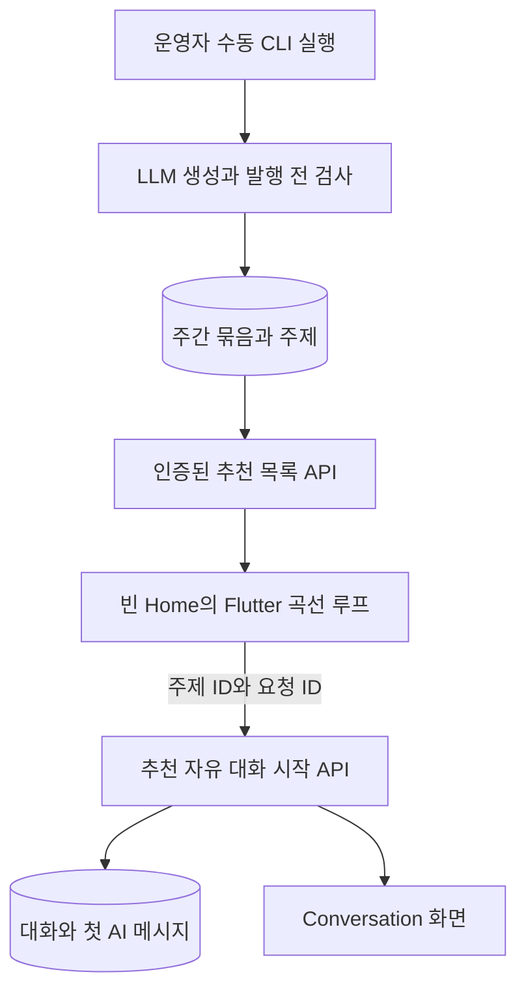

# Weekly Conversation Topics - Plan

## Goal Capsule

- **Objective:** 대화가 없는 학습자가 홈에서 운영자가 주기적으로 발행한 주제를 고르고, 첫 문장을 고민하지 않고 곧바로 자유 대화를 시작할 수 있어요.
- **Means:** 언어쌍별 주간 공통 주제를 서버에서 미리 발행하고, Flutter의 움직이는 주제 선택 영역과 AI 선발화 자유 대화 경로를 연결해요. (KTD1, KTD3, KTD5)
- **Authority:** 이 문서의 제품 요구사항과 2026-10-03 사용자 결정이 우선이에요. 기존 수동 주제 입력 흐름과 대화 접근 계약은 유지해요.
- **Execution profile:** 백엔드 저장·수동 생성 CLI·API, 모바일 상태·모션·내비게이션, 운영 문서를 순서대로 작업해요. 구현자는 단위별 검증 후 통합 동작을 확인해요.
- **Stop condition:** 아래 Definition of Done을 충족하고 초기 발행·주간 수동 갱신 방법이 문서화되면 완료예요. 실제 운영 DB 변경과 첫 발행은 배포 권한이 있는 운영 단계에서 수행해요.

---

## Product Contract

### Summary

홈의 정적이고 누를 수 없는 시작 아이디어를 언어쌍별 AI 생성 주제로 바꿔요. 주제들은 얕은 곡선을 따라 왼쪽에서 오른쪽으로 반복 이동하고, 하나를 누르면 AI가 먼저 질문하는 `FREE_CHAT` 대화가 열려요.

### Problem Frame

현재 아이디어는 네 개의 정적 문구 중 세 개를 표시하며 행동으로 이어지지 않아요. 신규 학습자는 Topic Prep에서 주제를 다시 다루고 첫 답변까지 작성해야 대화가 생겨요. 주간 추천은 첫 대화의 진입 부담을 낮추되, 사용자가 직접 입력한 주제를 검색 맥락과 연결하는 기존 핵심 경험을 대체하지 않아요.

### Requirements

**주간 주제**

- R1. 홈에서 대화 수와 목록 로딩 상태에 관계없이 현재 학습 언어쌍의 발행된 추천 주제를 보여줘요. 대화 목록 로딩·재조회 중에는 빈 상태로 단정하지 않아요.
- R2. 운영자가 수동 CLI를 매주 실행해 지원 언어쌍 `ko→en`, `en→ko` 각각의 공통 주제 묶음을 갱신할 수 있어요. 앱의 표시 문구는 사용자의 모국어, 첫 AI 질문은 학습 언어를 따라요.
- R3. 주간 생성에 실패하거나 검증된 새 묶음이 부족하면 마지막 성공 묶음을 계속 제공해요. 성공 묶음이 한 번도 없을 때는 추천 영역을 숨기고 기존 새 대화 진입을 유지해요.
- R4. 추천 주제는 짧고 구체적인 대화 출발점이어야 해요. 발행 전 형식·길이·중복·부적절한 내용은 검사하지만, 탭 시 웹 검색·사실 확인·Topic Prep 품질 검사는 하지 않아요.

**대화 시작**

- R5. 주제 탭은 첫 사용자 발화 없이 AI가 해당 주제로 먼저 질문하는 `FREE_CHAT`을 생성해요. 제목에는 선택한 주제를 사용하고 최초 사용자 발화 수는 0이에요.
- R6. 새 시작 경로는 현재 사용자 인증, 대화 슬롯 제한, 언어 스냅샷, 짧은 응답, 선택적 TTS 계약을 지켜요. 탭 중복과 응답 유실 후 재시도에서 같은 요청이 대화를 두 개 만들지 않아요.
- R7. 저장된 이전 주차의 발행 주제를 캐시에서 탭해도 시작할 수 있어요. 운영자가 보관 처리한 주제와 잘못된 ID는 거절해요.

**모바일 경험**

- R8. 각 주제는 제목·공통 배경 박스 없이 서로 다른 파스텔색의 독립 카드로 표시해요. Flutter 루프가 왼쪽에서 오른쪽으로 움직이며 `curveAmount=-10`에 가까운 얕은 곡선 인상을 줘요. 손가락으로 좌우로 밀면 카드가 이동하고 놓은 위치에서 자동 흐름을 이어가요.
- R9. 손가락을 대거나 접근성 탐색 중에는 움직임을 멈춰요. 기기의 동작 줄이기 설정에서는 정적인 선택 목록을 보여줘요. 홈 탭이 보이지 않을 때에는 애니메이션을 실행하지 않아요.
- R10. 탭 시 선택한 주제를 담은 시작 확인 팝업을 보여주고 취소하면 요청하지 않아요. 확인 후 대화 생성 동안 로딩·실패 안내를 표시하고 연속 탭을 차단해요. 추천 조회 실패에는 해당 계정·언어쌍의 마지막 성공 캐시를 사용하며, 언어쌍 변경 후 오래된 응답은 표시하지 않아요.
- R11. 수동 주제 입력·Topic Prep·Roleplay 경로와 최근 대화·새 대화 버튼은 기존 동작을 유지해요. 홈의 주간 주제 카드는 최근 대화 카드 위에 배치해요.

### Key Decisions

- **AI 선발화로 바로 시작** (session-settled: user-approved — chosen over 주제를 가짜 사용자 발화로 저장: 첫 사용자 턴을 차감하지 않고 자연스러운 첫 질문을 제공해요.) Governs R5, R6.
- **언어쌍별 주간 공통 묶음** (session-settled: user-approved — chosen over 사용자별 요청 시 생성: 생성 비용과 운영 상태를 공유해요.) Governs R2, R3.
- **cron 기반 생성 작업은 후속 구현** (session-settled: user-directed — chosen over 이번 단계의 예약 실행: 먼저 수동 생성 경로와 앱 경험을 구현해요.) Governs R2.
- **탭 시 검색·사실 확인 생략** (session-settled: user-directed — chosen over Topic Prep 검증 경유: 추천 주제 선택에서 곧바로 대화로 들어가요.) Governs R4, R5, R11.
- **Flutter에서 독립 탭형 곡선 루프 구현** (session-settled: user-approved — chosen over React 컴포넌트 재사용: 모바일의 각 주제를 개별적으로 누를 수 있어야 해요.) Governs R8, R9.
- **나머지 운영·실패 처리 권장안 적용** (session-settled: user-approved — chosen over 매번 새 생성만 표시하고 중복 탭을 허용: 지난 성공 묶음과 재시도 가능한 시작 동작을 유지해요.) Governs R3, R6, R10.

### Acceptance Examples

- AE1. `ko→en` 사용자의 저장된 대화가 0개이고 주간 묶음이 발행되면 한국어 추천 주제가 움직여 보이며, 선택 후 영어 AI 질문 하나가 있는 자유 대화가 열려요. Covers R1, R2, R5, R8.
- AE2. 같은 사용자가 대화를 하나 만들고 홈으로 돌아오면 최근 대화와 추천 주제가 함께 보여요. Covers R1, R11.
- AE3. 새 주간 생성이 실패해도 지난주 발행 목록이 조회되고, 그 주제를 탭하면 대화를 시작할 수 있어요. Covers R3, R7.
- AE4. 주제 탭 후 취소하면 대화가 생성되지 않아요. 확인 후에는 대화가 열릴 때까지 로딩 표시가 보이며, 빠른 중복 탭이나 응답 유실 후 같은 요청 재시도에서도 대화는 하나만 저장돼요. Covers R6, R10.
- AE5. 동작 줄이기 설정이 켜져 있으면 주제들이 움직이지 않고 모두 탐색·선택 가능해요. Covers R9.

### Scope Boundaries

- 이 버전의 추천은 언어쌍별 공통 목록이며 사용자별 취향 추론, 노출 이력에 따른 순위 조정, 주제별 사용량 대시보드는 포함하지 않아요.
- 추천 주제의 빠른 시작은 검색 컨텍스트를 넣지 않아요. 직접 입력하는 최신 뉴스·관심사 흐름에는 기존 Topic Prep을 사용해요.
- React Bits의 글자별 SVG 경로 렌더링과 드래그 방향 전환을 그대로 복제하지 않아요. 개별 탭 대상과 접근성을 유지하는 Flutter 곡선 배치가 목표예요.
- 별도 CMS와 운영자 화면은 만들지 않아요. 문제가 있는 주제의 보관은 최소한의 운영 CLI 또는 서버 전용 경로로 처리해요.

### Deferred to Follow-Up Work

- cron 스케줄, 상시 실행 worker, 별도 작업 컨테이너와 자동 재시도·알림은 이번 구현에서 제외해요. 수동 CLI가 검증된 뒤 같은 생성 서비스에 예약 실행을 연결해요.

---

## Planning Contract

### Key Technical Decisions

- KTD1. **추천 주제는 conversation 도메인에 발행 단위로 저장해요.** 언어쌍·주간 슬롯에 유일한 묶음과 그 주제 행을 두고, 완성된 묶음만 원자적으로 발행해요. 조회는 가장 최근 발행 묶음을 선택하므로 실패한 이번 주 작업이 지난주 목록을 지우지 않아요. 대화 시작 서비스가 다른 도메인을 직접 참조하지 않도록 같은 도메인에 둬요. (session-settled: user-approved — chosen over 조회 시 생성: 공통 목록의 비용과 실패 상태를 서버에서 통제해요.) Covers R2, R3, R7.
- KTD2. **생성은 운영자가 직접 실행하는 서버 전용 CLI가 수행해요.** 월요일 05:00 Asia/Seoul 주간 슬롯과 재실행 키를 사용하지만 예약 실행기는 만들지 않아요. 주제와 학습 언어 첫 질문을 쌍으로 생성하고, 언어쌍당 8쌍을 목표로 최소 6쌍이 검증되어야 발행해요. 명시적 재발행은 활성 주제 ID를 유지하며 내용을 교체해요. 새 설정값은 실제 운영 조정이 필요할 때만 추가해요. Covers R2–R4.
- KTD3. **추천 시작은 기존 대화 도메인의 별도 엔드포인트예요.** `topic_id`를 받아 발행 상태와 저장된 첫 질문을 확인하고 대화와 AI 첫 메시지를 만들어요. 기존 응답의 `message_id`는 자유 대화에서 사용자 메시지를 뜻하므로, 새 응답은 `assistant_message_id`를 명시하고 TTS 필드를 공유해요. 첫 질문 생성은 발행 단계에서 끝내요. (session-settled: user-approved — chosen over 기존 `first_message` 재사용: AI 선발화와 무료 턴 수를 정확히 표현해요.) Covers R5–R7.
- KTD4. **시작 요청 ID를 영속적으로 묶어요.** 앱이 탭마다 요청 ID를 만들고, 서버는 사용자와 요청 ID의 유일성을 저장해 완료 결과를 재조회할 수 있게 해요. 처리 중 동일 요청은 새 대화를 만들지 않고 진행 중 상태로 알려줘요. 생성 실패 시 사용 가능한 슬롯을 남기지 않아요. Covers R6.
- KTD5. **Flutter는 움직이는 개별 위젯을 배치해요.** 각 주제의 텍스트와 탭 영역을 유지하고 얕은 곡선을 적용해 반복 이동시켜요. 터치·접근성 포커스·비활성 탭·기기 동작 줄이기에 따라 정지하거나 정적 목록으로 전환해요. (session-settled: user-approved — chosen over React SVG 컴포넌트 이식: Flutter에서 항목별 상호작용을 보장해요.) Covers R8–R10.
- KTD6. **추천 캐시는 계정·언어쌍에 묶어요.** Riverpod 조회 상태는 언어쌍 전환을 관찰하고, 마지막 성공 묶음만 로컬에 저장해 실패 시 사용해요. 기존 스낵 캐시·복귀 갱신 패턴을 참고하고, 대화 목록 상태와 독립적으로 주제의 주간 버전을 관리해요. Covers R1–R3, R10.

### API Contract Shape

- `GET /api/conversation-topics/weekly/`은 Bearer profile 언어쌍의 `{week_start, topics: [{id, text}]}`를 성공 envelope에 반환해요. 발행 기록이 없으면 `topics`는 빈 목록이고 `week_start`는 `null`이에요. 대화의 `/{id}/` 경로와 충돌하지 않는 별도 경로예요.
- `POST /api/conversations/start/free-chat/suggested/`는 `{topic_id, start_request_id, include_audio_response}`를 받아 `{conversation_id, assistant_message_id, conversation_type, language, response, audio?, audio_error?}`를 성공 envelope에 반환해요. 사용자 입력이 없으므로 `input_mode`·`transcript`는 두지 않아요. `start_request_id`는 탭 시 만든 UUID이며 동일 사용자에게 재사용하면 같은 대화를 가리켜요. 동일 요청 처리 중에는 `START_IN_PROGRESS`를 반환하고 앱은 같은 ID로 재조회·재시도해요.
- 추천 목록은 로그인한 사용자의 언어쌍으로 필터링해요. 시작 경로도 주제의 언어쌍과 현재 profile을 대조해요. 저장된 conversation은 생성 시점의 언어 스냅샷을 유지해요.

### High-Level Technical Design

주간 발행 상태는 `생성 중 → 검증 완료 → 발행` 또는 `실패`예요. 조회는 `발행`만 반환하고 가장 최근 발행 묶음을 택해요. 시작 요청은 `신규 → 처리 중 → 완료`가 기본이며, 실패 시 해당 시도의 부분 대화를 정리한 뒤 같은 요청 ID로 안전하게 재시도할 수 있어야 해요.

### System-Wide Impact

- 새 DB 테이블과 대화 시작 요청 식별 컬럼에는 Alembic migration이 필요해요. 기존 대화·스낵 데이터는 변경하지 않아요.
- 새 API는 기존 성공 envelope와 Bearer 인증을 따르고, 서버가 profile의 언어쌍을 기준으로 목록과 시작 주제의 권한을 판정해요.
- 새 대화 생성에는 기존 슬롯 제한을 적용해요. 첫 AI 메시지는 사용자 턴이 아니며 문법 피드백 작업을 만들지 않아요.
- 주제 생성은 API 서버 요청이나 스낵 생성 작업에 묶이지 않아요. 운영자가 수동 CLI를 실행할 때만 새 묶음을 시도해요.

### Assumptions

- 기존 스낵 작업의 주간 경계인 월요일 05:00 Asia/Seoul을 추천 주제에도 사용해요. 주간 자동 갱신은 이 단계에서 보장되지 않으며 운영자의 수동 실행에 달려 있어요. 발행 목표 8개·최소 6개는 모바일에서 반복 목록이 지나치게 짧아지지 않도록 정한 첫 운영값이에요.
- `검증 불필요`는 추천 탭 시 검색·사실 확인·Topic Prep을 생략한다는 뜻이에요. 발행 전 형식·중복·안전성 검사와 시작 요청의 인증·주제 상태 확인은 유지해요.

### Risks and Mitigations

- **전략과의 관계:** `STRATEGY.md`는 사용자가 직접 선택한 최신 관심사와 검색 맥락을 강조해요. 추천은 첫 대화의 별도 빠른 진입으로 한정하고 기존 수동 경로를 유지해요.
- **LLM 결과:** 짧은 주제·언어·중복·공격적 표현을 자동 검사해요. 이 검사는 뉴스의 사실 여부를 검증하는 단계가 아니에요. 불충분하면 이번 주 묶음을 발행하지 않아요.
- **시작 응답 유실:** 기존 `X-Request-ID`는 지연 진단용이며 중복 생성을 막지 않아요. 추천 시작에 별도 요청 ID 계약을 둬요.
- **움직이는 탭:** 모바일의 좁은 화면, 큰 글자, 스크린리더와 터치가 동시에 성립해야 해요. 정적 대체 화면과 탭 시 정지를 처음부터 포함해요.

### Sources and Research

- `mobile/lib/features/home/presentation/home_screen.dart`, `mobile/lib/features/topic_prep/domain/topic_starter_examples.dart`, `mobile/lib/features/topic_prep/presentation/topic_prep_screen.dart` — 현재 홈·준비 흐름.
- `backend/domains/conversation/service.py`, `backend/domains/conversation/router.py`, `.agent/_contracts/CONVERSATION_ACCESS.md` — 자유 대화와 AI 선발화, 슬롯 계약.
- `backend/scripts/generate_language_snacks.py`, `docs/OPERATIONS.md` — 주간 슬롯과 재실행 키를 가진 CLI 운영 패턴.
- `docs/solutions/design-patterns/server-side-llm-output-invariants.md` — LLM의 성공 주장과 별개로 서버가 발행 조건을 검증하는 패턴.
- [React Bits Curved Loop source](https://github.com/DavidHDev/react-bits/blob/main/src/content/TextAnimations/CurvedLoop/CurvedLoop.jsx) — 단일 SVG 경로와 이동 방향을 참고하되 항목별 탭은 별도 설계.
- [Flutter animation accessibility](https://api.flutter.dev/flutter/widgets/MediaQueryData/disableAnimations.html), [iOS reduce motion](https://api.flutter.dev/flutter/dart-ui/AccessibilityFeatures/reduceMotion.html) — 정적 대체 동작의 플랫폼 근거.

---

## Implementation Units

### U1. 주간 주제 저장 구조와 계약

- **Goal:** 언어쌍별 발행 묶음과 주제 식별자를 안전하게 저장하고 공개 계약을 정해요.
- **Requirements:** R2–R4, R7; KTD1.
- **Dependencies:** 없음.
- **Files:** `.agent/_contracts/WEEKLY_CONVERSATION_TOPICS.md`, `backend/domains/conversation/models.py`, `backend/domains/conversation/schemas.py`, `backend/domains/conversation/topic_repository.py`, `backend/alembic/versions/` (새 주간 주제 revision), `backend/tests/domains/conversation/test_weekly_topics_repository.py`, `backend/tests/alembic/test_weekly_topics_migration.py`, `docs/DSL.md`.
- **Approach:** 계약을 DRAFT로 먼저 작성해 API Contract Shape의 목록·시작 요청/응답과 주간 슬롯을 정의해요. 묶음·주제 테이블에 언어쌍, 슬롯, 발행 상태와 시간을 저장하고 현재 발행 묶음 조회를 구현해요. 기존 migration head에 새 revision을 연결해요.
- **Patterns to follow:** `backend/domains/language_snacks/models.py`, `backend/domains/language_snacks/repository.py`, `docs/DSL.md`.
- **Test scenarios:**
  - `ko→en`과 `en→ko`의 같은 주간 슬롯을 저장하면 각 언어쌍의 목록이 분리돼요.
  - 이번 주 묶음이 실패 상태이면 직전 발행 묶음이 반환돼요.
  - 같은 언어쌍·주간 슬롯의 재실행은 중복 발행 묶음을 만들지 않아요.
  - 보관된 주제는 시작 대상으로 조회되지 않아요.
- **Verification:** 새 migration을 빈 DB에 적용해 제약과 최근 발행 조회가 일치해요.

### U2. 주간 AI 생성용 수동 CLI

- **Goal:** 두 언어쌍의 공통 주제를 정해진 주간 슬롯에 생성하고 온전한 묶음만 발행해요.
- **Requirements:** R2–R4; KTD1, KTD2.
- **Dependencies:** U1.
- **Files:** `backend/domains/conversation/topic_generation_service.py`, `backend/scripts/generate_weekly_topics.py`, `backend/scripts/archive_weekly_topic.py`, `backend/tests/domains/conversation/test_weekly_topics_generation.py`, `backend/tests/scripts/test_generate_weekly_topics.py`.
- **Approach:** 기존 LLM provider·HTTP client와 스낵 CLI의 주간 키·재실행 패턴을 따라요. 생성 결과를 서버에서 구조·길이·언어쌍·중복·안전성 기준으로 검사하고 목표보다 부족하면 기존 발행 묶음을 유지해요. 같은 슬롯 재실행과 병렬 실행은 한 묶음만 발행해요. 문제 주제는 서버 운영 CLI로 보관해 이후 조회·시작에서 제외해요.
- **Test scenarios:**
  - 두 언어쌍 각각 유효 주제 8개를 받으면 같은 주간 슬롯에 발행 묶음 하나씩 생성돼요.
  - 6개 미만 또는 중복·형식 오류가 남은 결과는 발행되지 않고 이전 묶음이 유지돼요.
  - 같은 주간 키를 재실행하거나 두 작업이 겹쳐도 발행 주제가 늘어나지 않아요.
  - LLM 오류 시 CLI가 실패를 보고하고 기존 목록은 변경되지 않아요.
  - 주제를 보관하면 목록에서 빠지고 이전에 받은 해당 ID의 시작 요청도 거절돼요.
- **Verification:** 격리 DB와 가짜 LLM으로 주간 슬롯, 재시도, 실패 유지가 확인돼요. API 서버와 cron 없이 운영자가 CLI를 직접 실행할 수 있어요.

### U3. 추천 목록 API

- **Goal:** 인증된 사용자가 자신의 언어쌍에 맞는 최신 발행 묶음을 조회해요.
- **Requirements:** R1–R3, R7; KTD1.
- **Dependencies:** U1.
- **Files:** `backend/domains/conversation/topic_router.py`, `backend/main.py`, `backend/tests/domains/conversation/test_weekly_topics_router.py`, `docs/DSL.md`.
- **Approach:** `backend/main.py` 편집 전에 HANDOFF claim을 남기고 API Contract Shape의 GET을 등록해요. 언어쌍은 클라이언트 query가 아니라 현재 profile에서 읽어요. 발행 기록이 없으면 빈 목록을 반환해 모바일이 영역을 숨기게 해요.
- **Test scenarios:**
  - `ko→en` 사용자는 한국어 표시 주제만 조회하고 다른 언어쌍의 주제는 받지 않아요.
  - 미발행 이번 주 작업이 있어도 지난 발행 묶음이 반환돼요.
  - 발행 기록이 없으면 성공 envelope의 빈 목록을 받아요.
  - 인증 없는 요청은 거절돼요.
- **Verification:** API 응답과 `docs/DSL.md`의 envelope·필드가 일치해요.

### U4. AI 선발화 자유 대화 시작 API

- **Goal:** 추천 주제 ID 하나로 중복 없이 AI 첫 질문을 가진 자유 대화를 만들어요.
- **Requirements:** R5–R7; KTD3, KTD4.
- **Dependencies:** U1, U3.
- **Files:** `backend/domains/conversation/router.py`, `backend/domains/conversation/schemas.py`, `backend/domains/conversation/service.py`, `backend/domains/conversation/repository.py`, `backend/domains/conversation/models.py`, `backend/alembic/versions/` (새 추천 시작 식별 revision), `backend/tests/domains/conversation/test_suggested_free_chat.py`, `backend/tests/alembic/test_suggested_start_migration.py`, `.agent/_contracts/WEEKLY_CONVERSATION_TOPICS.md`, `docs/DSL.md`.
- **Approach:** API Contract Shape의 POST에서 서버가 주제 ID의 발행·언어쌍 상태와 슬롯을 검사해요. AI 선발화 프롬프트는 기존 Roleplay 시작을 참고하되 `FREE_CHAT` 유형과 주제 제목을 사용해요. 사용자·요청 ID의 영속 유일성을 두고 재시도 결과를 재구성해요. AI 생성 실패 때는 부분 대화와 슬롯 사용을 정리해요.
- **Execution note:** 첫 메시지 역할과 사용자 턴 수를 API 통합 테스트로 먼저 고정해요.
- **Test scenarios:**
  - 발행 주제로 시작하면 사용자 메시지 없이 assistant 메시지 하나가 저장되고 사용자 턴은 0이에요.
  - 대화 제한이 활성화되고 슬롯이 가득 차면 생성 전에 `CONVERSATION_SLOTS_FULL`로 거절돼요.
  - 동일 사용자·요청 ID를 재전송하면 같은 대화 ID를 받고 새 메시지가 생기지 않아요.
  - 다른 요청 ID의 동시 시작은 기존 슬롯 규칙을 따르며 제한을 우회하지 못해요.
  - 오래된 발행 주제는 허용하고 보관된 주제·타 언어쌍 주제는 거절돼요.
  - AI 생성 실패 시 부분 대화가 남지 않고 동일 요청 ID로 다시 시도할 수 있어요.
  - TTS만 실패하면 저장된 대화는 유지하고 `audio_error`가 반환돼요.
- **Verification:** 기존 시작 API 응답은 유지하고 새 응답의 `assistant_message_id`가 실제 저장 메시지와 일치해요. 새 경로에는 첫 사용자 발화와 문법 피드백 작업이 없어요.

### U5. 모바일 추천 주제 조회 상태

- **Goal:** 빈 홈에서 해당 언어쌍의 발행 목록을 받고 실패 시 마지막 목록을 보여줘요.
- **Requirements:** R1–R3, R10; KTD6.
- **Dependencies:** U3.
- **Files:** `mobile/lib/features/home/domain/weekly_topic.dart`, `mobile/lib/features/home/data/api_weekly_topic_repository.dart`, `mobile/lib/features/home/data/weekly_topic_cache.dart`, `mobile/lib/features/home/application/weekly_topics_controller.dart`, `mobile/test/features/home/application/weekly_topics_controller_test.dart`, `mobile/test/features/home/data/api_weekly_topic_repository_test.dart`.
- **Approach:** 홈의 실제 빈 상태에서만 표시하되 언어쌍 전환, 홈 재진입, 앱 복귀 시 주간 슬롯을 확인해 재조회해요. 계정·언어쌍별 마지막 성공 목록을 저장하고 뒤늦게 도착한 이전 언어 응답을 버려요.
- **Test scenarios:**
  - `ko→en` 목록을 조회한 뒤 `en→ko`로 바꾸면 이전 응답이 도착해도 한국어 목록이 나타나지 않아요.
  - 네트워크 실패 시 같은 계정·언어쌍의 캐시를 보여주고 다른 계정 캐시는 사용하지 않아요.
  - 서버 목록과 캐시가 모두 없으면 추천 영역용 데이터는 빈 목록이에요.
  - 주간 슬롯이 바뀐 뒤 홈에 돌아오면 다시 조회하지만 같은 슬롯의 반복 진입은 불필요한 호출을 만들지 않아요.
- **Verification:** 공개 API 형식과 모바일 decoder가 일치하고 빈 상태·캐시 상태가 분리돼요.

### U6. Flutter 곡선 루프와 추천 탭

- **Goal:** 빈 홈에서 주제를 안정적으로 고르고 대화 화면으로 진입해요.
- **Requirements:** R1, R5, R8–R11; KTD5, KTD6.
- **Dependencies:** U4, U5.
- **Files:** `mobile/lib/features/home/presentation/home_screen.dart`, `mobile/lib/features/home/presentation/widgets/weekly_topic_loop.dart`, `mobile/lib/features/conversation/application/start_conversation_controller.dart`, `mobile/lib/features/conversation/data/api_conversation_repository.dart`, `mobile/lib/features/conversation/domain/conversation_models.dart`, `mobile/lib/app/router/app_router.dart`, `mobile/lib/core/copy/app_copy.dart`, `mobile/test/features/home/presentation/home_screen_test.dart`, `mobile/test/features/home/presentation/weekly_topic_loop_test.dart`, `mobile/test/features/conversation/application/start_conversation_controller_test.dart`.
- **Approach:** 별도 위젯에서 각 주제의 hit target과 접근성 이름을 유지하며 반복 이동해요. 터치 중 정지, 정적 대체, 화면 비활성화 정지를 처리해요. 탭마다 요청 ID를 만들고 진행 중에는 다른 탭을 막으며 성공 후 기존 대화 화면 전환·최근 목록 갱신을 사용해요. 실패는 홈에서 설명하고 재시도를 허용해요.
- **Test scenarios:**
  - 발행된 추천이 있으면 대화 수와 관계없이 오른쪽으로 이동하는 개별 주제가 보이며 탭한 ID만 시작 요청으로 전달돼요.
  - 대화 목록 로딩 또는 갱신 중에도 추천 영역은 독립적으로 표시하고, 빈 상태 안내만 목록 완료 후 표시해요.
  - 연속 탭 두 번은 하나의 시작 요청만 전송해요.
  - 슬롯 부족은 접근 안내로, 일반 실패는 재시도 안내로 표시하고 홈을 유지해요.
  - 동작 줄이기, 큰 글자, 스크린리더 탐색에서는 정적이고 독립 선택 가능한 목록을 보여줘요.
  - 홈 탭을 벗어나거나 앱이 백그라운드에 가면 프레임 갱신이 멈춰요.
- **Verification:** iOS·Android 작은 화면과 큰 글자 설정에서 각 주제를 누를 수 있고 수동 주제 입력·Roleplay 경로가 그대로 열려요.

### U7. 운영 계약과 릴리스 준비

- **Goal:** 운영자가 초기 발행과 주간 수동 갱신·실패 복구를 수행할 수 있게 해요.
- **Requirements:** R2–R4, R11.
- **Dependencies:** U2–U6.
- **Files:** `README.md`, `docs/OPERATIONS.md`, `docs/ENVIRONMENT.md` (새 설정을 도입한 경우), `.env.example` (새 설정을 도입한 경우), `backend/config.py` (새 설정을 도입한 경우), `.agent/architecture.md`, `.agent/_contracts/WEEKLY_CONVERSATION_TOPICS.md`.
- **Approach:** 공유 파일 편집 전 `.agent/_coordination/HANDOFF.md`에 claim을 남겨요. 계약을 REVIEW 후 ACTIVE로 승격하고 API·실행·배포 문서를 같은 변경 단위로 동기화해요. 운영 migration, 초기 두 언어쌍 발행, 매주 수동 CLI 실행, 지난 발행 묶음 복구와 문제 주제 보관 순서를 적어요.
- **Test expectation:** 별도 테스트는 없어요. 이 단위는 계약·운영 문서 동기화이며 U2–U6의 동작 검증을 참조해요.
- **Verification:** 실제 운영 변경 전 문서의 CLI 명령·주간 슬롯·실패 시 조회 동작이 코드와 일치해요.

---

## Verification Contract

- 백엔드는 `backend/`에서 `uv run pytest -q`를 실행하고, 새 주간 생성·목록·선발화 시작 테스트를 포함해요. DB 유일성·동시 발행·요청 ID 경합은 격리된 PostgreSQL 통합 환경에서 추가로 확인해요.
- 모바일은 `mobile/`에서 `flutter analyze`와 `flutter test`를 실행해요. 위젯 테스트 외에 iOS·Android 기기에서 탭 대상, 곡선 인상, 동작 줄이기, 앱 복귀를 확인해요.
- 배포 리허설에서 migration 후 수동 첫 발행, 다음 슬롯 수동 갱신, 새 생성 실패 시 지난 묶음 유지, 슬롯 제한 활성·비활성 양쪽을 확인해요. 실제 운영 LLM 호출은 문서화된 배포 단계예요.

---

## Definition of Done

- U1–U7의 동작과 문서가 R1–R11 및 AE1–AE5를 만족해요.
- 새 주제와 시작 API가 `docs/DSL.md`, 새 운영 절차가 `README.md`·`docs/OPERATIONS.md`, 새 설정이 있다면 `.env.example`·`docs/ENVIRONMENT.md`·`backend/config.py`에 동기화돼요.
- 추천 조회·생성 실패가 기존 대화·스낵 흐름을 막지 않고, 첫 AI 질문이 무료 사용자 턴으로 계산되지 않아요.
- 구현 과정에서 버린 시도와 실험 코드를 제거하고, 변경 파일과 필요한 문서만 남겨요.
