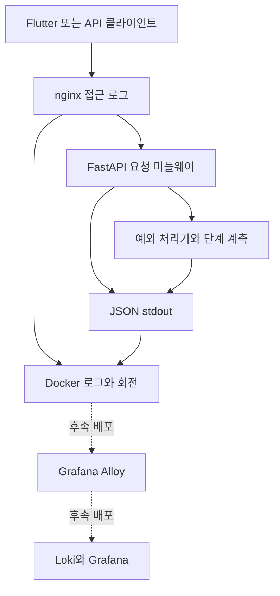

# API Structured Logging - Plan

## Goal Capsule

- **Objective:** 운영자가 API 요청의 지연과 실패를 한 요청 ID로 따라가며 원인을 찾을 수 있어요. 이후 Loki를 연결할 때 애플리케이션 로그 형식을 다시 바꿀 필요가 없어요.
- **Means:** 기존 대화 계측을 전체 API의 구조화된 stdout 로그로 확장하고 Docker가 로컬 보관·회전을 맡아요(KTD1, KTD2, KTD5).
- **Authority:** 사용자와의 로깅 방식 합의, `AGENTS.md`, 기존 API·음성 진단 계약 순서로 적용해요.
- **Stop condition:** R1–R7의 로그·오류·개인정보·운영 검증이 충족되면 완료해요. Loki와 Alloy의 실제 배포는 포함하지 않아요.

---

## Product Contract

### Summary

FastAPI 요청과 주요 처리 단계, 예외를 한 형식의 JSON 로그로 기록해요. API는 stdout에 쓰고 Docker는 크기가 제한된 로컬 로그를 보관해요. nginx는 앞단 요청 시간과 upstream 시간을 남겨 서버 내부 지연과 프록시·전송 지연을 비교할 수 있게 해요.

### Problem Frame

현재 `backend/shared/latency.py`는 일부 대화 POST만 `[latency]` 형식으로 출력하고, 예외는 `backend/main.py`의 처리기와 각 라우터·서비스에 흩어져 있어요. 운영자는 느린 요청이나 오류가 생겼을 때 서버에 접속해 `docker logs`를 직접 살펴봐야 하고, 요청별 로그를 일관되게 묶기 어려워요.

### Key Decisions

- **stdout 기반 수집** (session-settled: user-approved — chosen over application-managed log files: Docker log rotation and a future collector can own storage without a second file lifecycle). Governs R5, R6.
- **Loki 호환 형식 우선** (session-settled: user-approved — chosen over ad hoc text messages: JSON fields and stable correlation IDs make later Grafana searches possible). Governs R1, R3, R6.
- **첫 구현의 측정 범위** (session-settled: user-approved): 모든 API의 전체 처리 시간, 기존 음성 대화 단계, 보호 API의 인증 확인 시간을 기록해요. DB·외부 API 호출별 추가 계측은 측정된 병목에 따라 결정해요. Governs R1, R2.
- **500 오류 진단 범위** (session-settled: user-approved): 예외 종류와 안전한 스택 위치만 기록하고 예외 메시지·지역 변수 값은 기록하지 않아요. Governs R3, R4.

### Requirements

**요청과 단계 계측**

- R1. FastAPI에 도달한 모든 `/api/` 요청은 완료·오류·취소 여부와 서버 처리 시간, 메서드, 경로 템플릿, 요청 식별자를 JSON 한 줄로 기록하고 응답이 시작된 경우 HTTP 상태를 포함해요.
- R2. 기존 음성 대화의 `auth`, `stt`, `llm`, `tts`, `audio_encode`, `server_total` 측정 의미와 `X-Request-ID` 연결을 유지해요. 첫 구현에서는 모든 API의 전체 시간과 보호 API의 인증 확인 시간을 기록하고, 다른 단계는 측정된 병목에 따라 추가해요.

**오류와 정보 보호**

- R3. 기존 `AppException` 계열, `HTTPException`, 요청 검증 오류, 예상하지 못한 예외, 응답 후 백그라운드 작업 실패를 조사 가능한 코드·종류·요청 식별자와 함께 기록해요. 500 오류에는 예외 종류와 스택의 파일·함수·줄 번호를 남겨요.
- R4. 로그에는 인증 토큰, 비밀 키, 검색어, 요청·응답 본문, 대화 원문, 오디오, 원본 URL의 쿼리 문자열, 예외 메시지와 지역 변수 값을 기록하지 않아요.

**운영과 수집**

- R5. API와 nginx 로그는 컨테이너 stdout·stderr에 남고 Docker의 크기 제한·회전 설정으로 디스크 사용량을 제한해요.
- R6. 로그 필드와 수집용 라벨을 구분해 Loki 도입 시 요청 ID와 trace ID로 검색할 수 있어야 해요.
- R7. 기존 JSON 응답과 오류 상태 계약은 유지하고, 요청 ID 헤더 적용 범위를 늘리면 `docs/DSL.md`와 운영 문서를 함께 갱신해요.

### Success Criteria

- 성공·인증 실패·검증 실패·외부 API 실패·예상하지 못한 실패의 표본마다 요청 완료 로그를 정확히 한 건 찾을 수 있어요.
- 한 대화 요청의 앱 trace ID, 서버 요청 완료, 단계 시간, 예외 로그가 연결돼요. 재시도된 HTTP 요청은 서로 다른 서버 요청 ID를 가져요.
- Docker에서 JSON 로그를 읽을 수 있고, nginx의 전체 시간과 upstream 시간이 같은 요청의 API 로그와 대조돼요.
- 민감한 표본 문자열을 사용한 검사에서 요청·예외·기존 도메인 로그 어디에도 그 문자열이 나타나지 않아요.

### Scope Boundaries

- 이번 계획은 Loki·Grafana·Alloy의 서버 설치, 계정·권한 설정, 외부 전송, 장기 보존 정책을 포함하지 않아요. JSON 로그와 수집 계약만 준비해요.
- Flutter의 기존 음성 trace 생성과 재생 시간 측정은 유지해요. 모든 모바일 API 호출에 trace 헤더를 추가하는 일은 별도 작업이에요.
- DB·외부 API 호출별 추가 시간 계측, 분산 추적 시스템, 인증 방식 변경, keepalive 변경, API 성능 최적화 자체는 다루지 않아요. 이번 전체 요청·인증·기존 음성 단계 측정값을 보고 추가 계측 대상을 결정해요.
- 원인을 잃는 오류 응답의 문구 변경은 별도 API 계약 검토 대상으로 남겨요. 이번 작업은 응답 형식을 바꾸지 않고 서버 내부 로그의 분류와 연결을 개선해요.

---

## Planning Contract

### Key Technical Decisions

- KTD1. **표준 `logging`과 JSON stdout을 사용해요.** (session-settled: user-approved — chosen over application-managed log files: Docker already stores container output and Alloy can collect it without app-owned file rotation). 워커별 로거 설정은 한 번만 적용하고 기존 모듈 로거는 민감 정보 점검 뒤 같은 포맷으로 수집해요. Governs R1, R3, R5.
- KTD2. **기존 순수 ASGI 계측 경로를 확장해요.** `backend/shared/latency.py`의 ContextVar와 span을 재사용하면 기존 음성 계약을 보존하면서 전체 API에 적용할 수 있어요. 경과 시간은 단조 시계로 측정하고 최종 ASGI 응답 body 뒤에 완료 로그를 남겨요. 기존 Bearer 인증 경로에 더해 SSE 쿼리 토큰·운영 키·Apple 알림 서명 검증 등 다른 보호 경로도 점검해 인증 확인 구간을 계측해요. 인증 의존성이 시작되기 전에 거부된 요청은 전체 요청 시간과 실패 상태만 남겨요. Governs R1, R2.
- KTD3. **식별자는 재시도와 사용자 동작을 구분해요.** 기존 32자리 소문자 16진수 `X-Request-ID`는 `trace_id`로 유지하고, 각 HTTP 시도마다 별도 `request_id`를 생성해요. nginx의 요청 ID는 내부 `X-Proxy-Request-ID` 헤더로 전달해 `proxy_request_id`에만 기록하고 인증에는 사용하지 않아요. FastAPI가 처리한 응답에는 선택된 trace ID를 돌려주며, ASGI 바깥의 500·프록시 응답에는 헤더가 없을 수 있음을 계약에 명시해요. 경로는 원본 URL 대신 라우트 템플릿을 기록해요. Governs R1, R2, R4, R7.
- KTD4. **요청 완료와 예외 이벤트의 책임을 나눠요.** 요청 미들웨어는 최종 상태·시간을 한 번 기록해요. 처리기는 `AppException`, Starlette/FastAPI HTTP 예외, 요청 검증 예외를 분류하고, 5xx의 원인 예외는 한 곳에서 한 번 기록해요. 500 오류의 스택은 프로젝트 상대 파일 경로·함수·줄 번호로만 직렬화하고 예외 메시지, 지역 변수, 소스 코드 줄은 제외해요. 기존 `logger` 호출과 Uvicorn의 기본 traceback 출력을 점검해 중복·원문 노출을 차단한 뒤 중앙 JSON 출력에 편입해요. 백그라운드 실패는 별도 이벤트로 기록해요. Governs R3, R4, R7.
- KTD5. **Loki 라벨은 안정적인 출처에만 사용해요.** (session-settled: user-approved — chosen over free-form text logs: the stable JSON schema remains searchable when Loki is introduced). `service`와 `environment`는 수집 라벨 후보이고, 요청 ID·trace ID·경로·예외 종류는 JSON 필드로 둬요. 높은 카디널리티의 ID를 인덱스 라벨로 만들지 않아요. Governs R6.
- KTD6. **Docker 회전과 nginx 단계 시간을 함께 설정해요.** API와 nginx 컨테이너에 `json-file` 회전 상한을 두고, nginx 접근 로그에는 `$request_time`, `$upstream_response_time`, nginx 요청 ID, upstream 응답의 trace ID를 포함해요. 시작 상한은 컨테이너당 `20m × 5`로 두되 배포 뒤 실제 로그량으로 보존 시간을 확인해 조절해요. Governs R5, R6.

### Log Field Contract

`ts`는 UTC 시각이고 `duration_ms`는 단조 시계로 잰 밀리초예요. 모든 API 로그는 `schema_version`, `level`, `service`, `environment`, `event`, `trace_id`, `request_id`를 공유해요. 요청 완료 이벤트는 `method`, `route`, `status_code`, `duration_ms`, `response_complete`를, 단계 이벤트는 `stage`, `duration_ms`, `status`를, 예외 이벤트는 안전한 `error_code`, `exception_type`을 추가해요. 500 예외의 `stack_frames`는 프로젝트 상대 `file`, `function`, `line`만 포함해요. 프록시를 거친 요청에는 `proxy_request_id`를 추가해요. 이벤트 이름은 `http.request.completed`, `http.stage.completed`, `http.exception`, `background_task.failed`로 고정해요(KTD3–KTD5).

### High-Level Technical Design

앱의 `trace_id`는 사용자 동작을, 서버의 `request_id`는 개별 HTTP 시도를 식별해요. nginx와 API의 같은 시도는 `proxy_request_id`로 연결해요. 요청 완료 로그는 HTTP 결과를 소유하고 단계·예외 로그는 같은 식별자로 연결돼요. nginx 로그의 전체 시간과 upstream 시간은 FastAPI의 `server_total`과 측정 경계가 달라 서로 더하지 않아요.

### Assumptions

- 로깅 대상은 API 서버의 모든 `/api/` 요청과 `/health`예요. 정적 파일과 웹 페이지는 공통 포맷을 사용할 수 있어도 지연 대시보드의 핵심 집계에서는 제외해요.
- 운영 컨테이너의 Docker 로깅 드라이버가 `json-file`을 사용할 수 있어요. 실제 드라이버와 남은 디스크 공간은 배포 전 확인해요.
- `response_model`·JSON envelope·HTTP 상태를 바꾸지 않은 상태에서 헤더와 내부 로그를 확장할 수 있어요.

### System-Wide Impact

API 워커 2개가 각자 로거를 초기화하므로 중복 핸들러와 중복 요청 로그를 막아야 해요. nginx가 만든 429·502·504 등은 FastAPI 미들웨어를 거치지 않으므로 nginx 접근 로그에서 확인해야 해요. 기존 `print()` 기반 계측과 Uvicorn 접근 로그를 전환할 때 음성 실험 문서·운영 절차·API 진단 헤더 계약도 같은 작업 단위로 갱신해야 해요.

### Risks & Dependencies

- 기존 검색 서비스는 검색어를, STT provider는 실패 응답 본문을 로그로 출력해요. 수집기 연결 전에 모든 API 로그 호출과 Uvicorn 오류 출력을 점검하고 자유 형식 예외 문자열·traceback의 원문은 중앙 로그 필드로 자동 복사하지 않아요.
- 응답이 시작된 뒤 발생한 예외나 취소는 클라이언트 상태와 서버 내부 실패가 다를 수 있어요. 로그에 `response_complete`를 구분해요.
- Docker의 회전 상한은 수집 장애 때 남는 로컬 기록의 최대치예요. Loki 도입 시 보존 기간과 수집 지연을 별도로 설계해야 해요.
- Loki의 라벨은 낮은 카디널리티로 유지해야 해요. [Grafana Loki 라벨 가이드](https://grafana.com/docs/loki/latest/get-started/labels/)를 수집 설정의 기준으로 사용해요.

---

## Implementation Units

### U1. 요청 컨텍스트와 JSON 로그 기반

- **Goal:** 모든 API 요청이 동일한 형식의 시간·식별자 로그를 남겨요.
- **Requirements:** R1, R2, R4, R7; KTD1–KTD3.
- **Dependencies:** 없음.
- **Files:** `backend/shared/latency.py`, `backend/shared/logging_config.py`(신규), `backend/main.py`, `backend/domains/auth/dependencies.py`, `backend/domains/language_snacks/dependencies.py`, `backend/domains/billing/service.py`, `backend/tests/shared/test_latency.py`, `backend/tests/shared/test_logging_config.py`(신규), `backend/tests/domains/billing/test_billing_service.py`, 관련 인증 의존성 테스트.
- **Approach:** 기존 미들웨어의 대상 제한을 풀고 요청별 ContextVar를 유지해요. formatter는 허용된 구조화 필드를 먼저 출력하고 `latency_span`은 같은 로거를 사용해요. Bearer·SSE 쿼리 토큰·운영 키 인증 의존성 및 Apple 알림 서명 확인의 검증 구간에 `auth` 단계를 적용해요. 인증 전에 실패한 요청에는 존재하지 않는 단계 시간을 만들지 않아요. 서버 시작·종료 `print()`도 이 로거로 옮겨요. 기존 자유 형식 도메인 로그의 중앙 수집은 U2의 민감 정보 점검 후 활성화해요.
- **Patterns to follow:** `backend/shared/latency.py`의 ASGI send wrapping과 `backend/tests/shared/test_latency.py`의 동시 요청·취소 사례.
- **Test scenarios:**
  - 서로 다른 GET·POST API 요청이 각각 완료 로그 한 건과 유효한 응답 `X-Request-ID`를 남겨요.
  - Bearer·SSE 쿼리 토큰·운영 키·Apple 알림 서명으로 보호하는 API는 검증이 실행되면 `auth` 단계 로그를 남기고 같은 요청 ID로 연결돼요. 인증 의존성 진입 전 거부된 요청도 전체 시간·상태는 남겨요.
  - 유효한 대화 trace ID는 보존되고 잘못된 헤더는 32자리 ID로 대체돼요.
  - 프록시 요청 ID가 있는 요청은 해당 값을 로그에만 기록하고 직접 요청에는 빈 값을 안전하게 처리해요.
  - 동시 요청 두 건과 같은 trace ID의 재시도 두 건에서 `request_id`가 섞이거나 재사용되지 않아요.
  - 경로에 UUID와 쿼리 문자열이 있어도 로그에는 경로 템플릿만 남아요.
  - ASGI 응답 중 취소가 나면 미완료 상태를 기록하고 취소를 전파해요.
  - 민감한 본문 문자열을 응답해도 로그에는 나타나지 않아요.
- **Verification:** JSON 한 줄 파싱이 가능하고 기존 음성 stage·앱 trace 연결 테스트가 통과해요.

### U2. 예외와 백그라운드 실패의 기록 일원화

- **Goal:** 알려진 오류와 예상하지 못한 오류를 요청 ID로 찾되 중복·민감 정보 노출을 막아요.
- **Requirements:** R3, R4, R7; KTD4.
- **Dependencies:** U1.
- **Files:** `backend/main.py`, `backend/shared/background_tasks.py`, `backend/domains/conversation/router.py`, `backend/domains/conversation/service.py`, `backend/domains/search/router.py`, `backend/domains/search/service.py`, `backend/domains/voice/openrouter_provider.py`, `backend/domains/voice/service.py`, `backend/tests/shared/test_observability_exceptions.py`(신규), `backend/tests/domains/voice/test_multimodal_conversation_router.py`, `backend/tests/domains/voice/test_openrouter_provider.py`, `backend/tests/domains/voice/test_voice_service.py`, `backend/tests/domains/search/test_search_provider.py`.
- **Approach:** 기존 `AppException` 처리와 FastAPI 기본 HTTP·검증 오류를 같은 분류 체계로 기록해요. 라우터가 원인 예외를 HTTP 예외로 바꾸는 경로는 상태·안전한 오류 코드가 남도록 조정하고 중복된 `logger.error`를 정리해요. 검색어, 업로드 파일명, provider 응답 본문, 자유 형식 예외 메시지·traceback을 기록하는 기존 API 로그 호출과 Uvicorn 오류 출력을 점검·수정한 뒤 중앙 formatter에 연결해요. 500 원인은 예외 종류와 메시지·변수·소스 줄이 없는 스택 위치로 기록해요. 응답 밖의 문법 작업 실패는 부모 trace ID가 있으면 연결하되 별도 작업 이벤트로 남겨요.
- **Patterns to follow:** `backend/main.py`의 현재 예외 처리기, `backend/domains/conversation/router.py`의 예외 변환, `backend/shared/background_tasks.py`의 종료 callback.
- **Test scenarios:**
  - `AuthenticationException`, `NotFoundException`, 일반 `AppException`은 기존 응답을 유지하고 종류·상태가 기록돼요.
  - 직접 발생한 `HTTPException`과 `RequestValidationError`도 요청 완료 로그를 남기며 예상 가능한 4xx traceback은 출력하지 않아요.
  - 라우터가 외부 API 오류를 502로 바꿀 때 원인 종류를 찾을 수 있고 오류 이벤트는 중복되지 않아요.
  - 예상하지 못한 예외는 500으로 분류되고 요청 완료 로그와 원인 예외 로그가 같은 요청 ID를 사용해요. `stack_frames`는 파일·함수·줄 번호만 포함하고 응답 헤더가 없어도 서버 로그로 식별할 수 있어요.
  - 응답 후 문법 task가 실패해도 실패 이벤트가 남고 다른 요청의 context가 섞이지 않아요.
  - 검색어·파일명·provider 응답·예외 메시지·지역 변수에 서로 다른 가짜 비밀을 넣어도 앱과 Uvicorn의 전체 stdout·stderr 로그에 원문이 나타나지 않아요.
- **Verification:** 성공·401·404·422·429·502·500 표본이 요청 ID로 검색되고 응답 계약 회귀 테스트가 통과해요.

### U3. Docker·nginx 로그 수집 경계

- **Goal:** 로컬 디스크 사용을 제한하고 프록시 시간과 API 시간을 비교할 수 있어요.
- **Requirements:** R5, R6; KTD5, KTD6.
- **Dependencies:** U1.
- **Files:** `docker-compose.yml`, `deploy/nginx/nginx.conf`, `deploy/nginx/snippets/proxy.conf`, `docs/OPERATIONS.md`.
- **Approach:** API·nginx 서비스에 Docker 로그 회전을 설정하고 쿼리 문자열을 출력할 수 있는 Uvicorn 기본 접근 로그는 끄거나 민감 정보가 없는 구조화 포맷으로 대체해요. nginx는 자체 요청 ID를 내부 헤더로 전달하고 접근 로그에는 원본 `$request` 대신 JSON 메서드·상태·전체 시간·upstream 시간·upstream trace ID를 기록해요. nginx 자체 오류에는 upstream trace ID가 없을 수 있으므로 nginx ID를 함께 남겨요.
- **Execution note:** 설정 중심 작업이므로 Docker Compose 구성 검사와 nginx 설정 검사, 실제 컨테이너 로그 표본을 우선 검증해요.
- **Test expectation:** 별도 단위 테스트는 없어요. 설정 유효성과 운영 표본으로 검증해요.
- **Verification:** 회전 상한이 API·nginx에 적용되고 nginx JSON 로그에서 시간 필드와 상관 ID가 확인돼요. Uvicorn 접근 로그와 nginx 접근 로그에 쿼리 문자열이 남지 않아요.

### U4. 진단 계약과 운영 문서 동기화

- **Goal:** 로그 조회자와 구현자가 필드 의미·측정 경계·보관 한계를 같은 문서에서 확인해요.
- **Requirements:** R2, R6, R7; KTD3, KTD5.
- **Dependencies:** U1–U3.
- **Files:** `docs/OBSERVABILITY.md`(신규), `docs/VOICE_LATENCY.md`, `docs/DSL.md`, `docs/OPERATIONS.md`, `.agent/architecture.md`, `README.md`.
- **Approach:** 필드 스키마, 앱·nginx·서버의 시간 경계, Loki 검색 예시, Docker 회전·수집 장애 확인을 새 문서에 기록해요. 기존 음성 문서의 `print()` 설명과 진단 헤더 범위를 갱신하고 README에는 상세 문서 링크만 추가해요. README 편집 전 `.agent/_coordination/HANDOFF.md`에 claim을 남겨요.
- **Test expectation:** 문서만 변경하므로 동작 테스트는 없어요. 경로·앵커·계약의 일치 여부를 검토해요.
- **Verification:** 본문과 README·DSL·운영·아키텍처 인덱스가 일치하고 기존 문서에 낡은 `[latency]` 출력 지침이 남아 있지 않아요.

---

## Verification Contract

| 대상 | 실행 중 확인 | 합격 조건 |
|---|---|---|
| 계측·예외 회귀 | `backend/`의 관련 pytest와 전체 pytest | 모든 API 전체 시간, 보호 API 인증 단계, 500 안전 스택, U1·U2의 오류·동시성·취소 사례 및 기존 음성 테스트가 통과해요. |
| 설정 유효성 | Docker Compose 구성 검사와 nginx 설정 검사 | 두 서비스가 재시작 가능한 설정이고 로그 회전 옵션이 반영돼요. |
| 운영 표본 | API 성공·실패 각 1건과 nginx 로그를 같은 시간대에 비교 | JSON 파싱, 요청 ID 연결, 세 시간 범위의 구분이 확인돼요. |
| 개인정보 | 가짜 토큰·본문·오디오 표본에 대한 로그 검사 | 표본의 비밀 문자열이 출력되지 않아요. |
| 문서·diff | 링크·앵커 확인과 `git diff --check` | 계약과 운영 설명이 구현과 일치해요. |

운영 배포에서는 로그 수집이 실패하더라도 API 동작이 유지되는지 확인해요. Loki 미배포 단계에서는 Docker 로그까지만 검증하고, Alloy → Loki 전송 검증은 후속 배포의 완료 조건으로 남겨요.

---

## Definition of Done

- R1–R7과 U1–U4의 검증이 끝나고, 기존 응답·음성 계측·예외 회귀가 통과해요.
- 요청 완료·단계·예외·nginx 로그를 한 요청에서 연결하는 실제 표본과 민감 정보 비노출 표본을 확인해요.
- Docker 회전과 운영 문서가 적용됐고, 구현 중 버린 계측·로깅 코드와 중복 출력이 남지 않아요.
